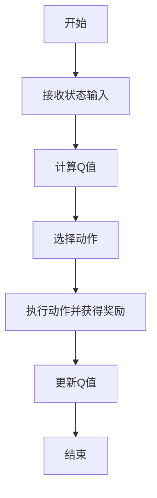
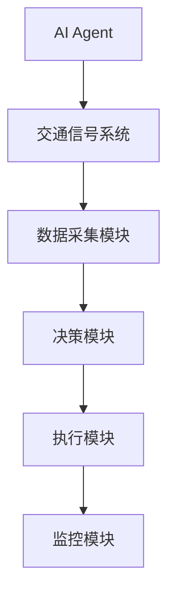

                 


# AI Agent在智能交通信号优化中的实践

> 关键词：AI Agent，智能交通系统，信号优化，强化学习，深度学习，交通流理论

> 摘要：本文探讨了AI Agent在智能交通信号优化中的应用，分析了AI Agent的核心原理及其在交通信号优化中的具体实践。通过理论分析和案例研究，详细讲解了AI Agent在交通信号优化中的算法设计、系统架构、项目实现以及实际应用效果，最后总结了最佳实践和未来发展方向。

---

# 第一部分: AI Agent与智能交通信号优化的背景与基础

## 第1章: AI Agent与智能交通信号优化概述

### 1.1 AI Agent的基本概念

#### 1.1.1 AI Agent的定义与特点
AI Agent（人工智能代理）是一种能够感知环境并采取行动以实现目标的智能实体。它具有以下特点：
- **自主性**：能够在没有外部干预的情况下独立运作。
- **反应性**：能够实时感知环境并做出反应。
- **目标导向**：所有行动都以实现特定目标为导向。
- **学习能力**：通过数据和经验不断优化自身的决策能力。

#### 1.1.2 AI Agent的核心原理
AI Agent的核心原理包括知识表示、推理、计划与决策、学习与自适应。这些原理共同作用，使AI Agent能够理解和解决复杂问题。

#### 1.1.3 AI Agent在交通领域的应用前景
AI Agent在交通领域的应用前景广阔，尤其是在交通信号优化、路径规划和交通预测等领域，能够显著提高交通系统的效率和安全性。

### 1.2 智能交通信号优化的背景

#### 1.2.1 传统交通信号优化的局限性
传统交通信号优化方法主要依赖固定时间表或简单的交通流模型，难以应对交通流量动态变化和复杂的城市交通环境。

#### 1.2.2 智能交通系统的概念与目标
智能交通系统（ITS）通过智能化技术优化交通管理，其目标是提高交通效率、减少拥堵和事故，同时降低能源消耗。

#### 1.2.3 AI Agent在智能交通中的角色
AI Agent在智能交通系统中扮演决策者和优化者的角色，能够实时调整信号配时，优化交通流量。

### 1.3 问题背景与问题描述

#### 1.3.1 交通信号优化的核心问题
交通信号优化的核心问题是如何在复杂的交通环境下，实时调整信号配时，以最小化交通延误，提高道路利用率。

#### 1.3.2 AI Agent在信号优化中的应用场景
AI Agent在信号优化中的应用场景包括实时交通监控、动态信号调整、交通预测和应急响应。

#### 1.3.3 问题解决的边界与外延
信号优化的边界包括交通信号灯的配时调整和信号控制策略的选择，外延则涉及交通流量预测和道路网络优化。

### 1.4 核心概念与联系

#### 1.4.1 AI Agent与交通信号优化的关系
AI Agent通过感知交通流量和状态，优化信号配时，实现交通信号系统的智能控制。

#### 1.4.2 核心概念属性特征对比表
| 概念       | 属性               | 特征               |
|------------|--------------------|--------------------|
| AI Agent   | 自主性             | 高                |
|            | 反应性             | 强                |
|            | 学习能力           | 强                |
| 交通信号优化 | 实时性             | 高                |
|            | 动态性             | 强                |
|            | 高效性             | 高                |

#### 1.4.3 ER实体关系图架构

```mermaid
er
actor(AI Agent, "负责信号优化决策")
actor(交通信号系统, "接收优化指令并执行")
actor(交通参与者, "包括车辆和行人")
```

### 1.5 本章小结
本章介绍了AI Agent的基本概念及其在智能交通系统中的作用，分析了交通信号优化的核心问题和应用场景，为后续章节奠定了基础。

---

## 第2章: AI Agent的核心概念与原理

### 2.1 AI Agent的核心原理

#### 2.1.1 知识表示与推理
知识表示是AI Agent理解环境的基础，常用的表示方法包括逻辑推理和概率推理。

#### 2.1.2 计划与决策
AI Agent通过规划和决策生成最优行动方案，常用算法包括强化学习和遗传算法。

#### 2.1.3 学习与自适应
AI Agent通过机器学习算法不断优化自身的决策模型，实现自适应能力。

### 2.2 AI Agent的算法原理

#### 2.2.1 强化学习算法
强化学习是一种通过试错机制优化决策的算法，常用的强化学习算法包括Q-learning和Deep Q-learning。

#### 2.2.2 深度学习算法
深度学习通过神经网络模型学习输入数据的特征，常用的模型包括卷积神经网络（CNN）和循环神经网络（RNN）。

#### 2.2.3 贪婪算法与启发式搜索
贪婪算法在每一步选择当前最优的行动，而启发式搜索通过评估函数选择最优路径。

### 2.3 算法原理的数学模型与公式

#### 2.3.1 强化学习的数学模型
Q-learning算法的更新公式为：
$$ Q(s, a) = Q(s, a) + \alpha [r + \max Q(s', a') - Q(s, a)] $$

#### 2.3.2 深度学习的数学模型
神经网络的损失函数为：
$$ L = \frac{1}{n}\sum_{i=1}^{n}(y_i - \hat{y}_i)^2 $$

### 2.4 算法流程图（使用 Mermaid）



### 2.5 本章小结
本章详细讲解了AI Agent的核心原理和常用算法，为后续章节的系统设计和项目实现提供了理论基础。

---

## 第3章: 交通信号优化的理论基础

### 3.1 交通信号优化的基本理论

#### 3.1.1 交通流理论
交通流理论研究交通流量、速度和密度之间的关系，为信号优化提供理论依据。

#### 3.1.2 信号配时优化
信号配时优化的目标是通过调整信号灯的绿灯和黄灯时间，减少交通延误和拥堵。

#### 3.1.3 交通需求预测
交通需求预测是信号优化的前提，常用的方法包括时间序列分析和机器学习模型。

### 3.2 交通信号优化的数学模型

#### 3.2.1 交通流量模型
交通流量模型常用的有泊松过程和泊松分布模型。

#### 3.2.2 信号配时优化模型
信号配时优化模型通常采用动态规划或强化学习算法。

### 3.3 交通信号优化的算法实现

#### 3.3.1 强化学习在信号优化中的应用
强化学习通过试错机制优化信号配时，能够适应交通流量的动态变化。

#### 3.3.2 基于深度学习的优化算法
深度学习通过神经网络模型学习交通流量的特征，优化信号配时。

### 3.4 本章小结
本章介绍了交通信号优化的理论基础和数学模型，分析了强化学习和深度学习在信号优化中的应用。

---

## 第4章: AI Agent在交通信号优化中的算法实现

### 4.1 算法实现的背景与目标

#### 4.1.1 算法实现的背景
AI Agent在交通信号优化中的应用需要高效的算法支持，以应对复杂的交通环境。

#### 4.1.2 算法实现的目标
算法实现的目标是通过AI Agent优化信号配时，提高交通系统的效率。

### 4.2 算法实现的核心步骤

#### 4.2.1 数据采集与处理
数据采集包括交通流量数据和信号灯状态数据的采集，数据处理包括数据清洗和特征提取。

#### 4.2.2 算法选择与实现
选择强化学习或深度学习算法，实现AI Agent的决策模型。

#### 4.2.3 系统测试与优化
通过模拟测试和实际测试，优化算法参数，提高算法的性能。

### 4.3 算法实现的代码示例

```python
import numpy as np
import gym

class AI_Agent:
    def __init__(self, env):
        self.env = env
        self.Q = np.zeros((env.observation_space.shape[0], env.action_space.n))
        self.learning_rate = 0.1
        self.discount_factor = 0.9

    def act(self, observation):
        return np.argmax(self.Q[observation])

    def update(self, observation, action, reward, next_observation):
        self.Q[observation, action] += self.learning_rate * (reward + self.discount_factor * np.max(self.Q[next_observation]) - self.Q[observation, action])

# 初始化环境和AI Agent
env = gym.make('CustomTrafficEnv-v0')
agent = AI_Agent(env)

# 训练过程
for episode in range(1000):
    observation = env.reset()
    total_reward = 0
    done = False
    while not done:
        action = agent.act(observation)
        next_observation, reward, done, _ = env.step(action)
        agent.update(observation, action, reward, next_observation)
        total_reward += reward
    print(f"Episode {episode}, Total Reward: {total_reward}")
```

### 4.4 本章小结
本章详细讲解了AI Agent在交通信号优化中的算法实现，通过代码示例和算法流程图，展示了AI Agent如何优化信号配时。

---

## 第5章: 交通信号优化系统的架构设计

### 5.1 系统架构设计的背景与目标

#### 5.1.1 系统架构设计的背景
交通信号优化系统需要高效的架构设计，以支持AI Agent的决策和执行。

#### 5.1.2 系统架构设计的目标
系统架构设计的目标是实现AI Agent与交通信号系统的无缝集成，提高系统的实时性和可靠性。

### 5.2 系统架构设计的核心要素

#### 5.2.1 系统功能模块
系统功能模块包括数据采集模块、决策模块、执行模块和监控模块。

#### 5.2.2 系统接口设计
系统接口设计包括AI Agent与交通信号系统的接口和系统与外部数据源的接口。

#### 5.2.3 系统交互流程
系统交互流程包括数据采集、决策、执行和反馈。

### 5.3 系统架构图（使用 Mermaid）



### 5.4 本章小结
本章详细讲解了交通信号优化系统的架构设计，展示了AI Agent如何与交通信号系统协同工作。

---

## 第6章: 项目实战与案例分析

### 6.1 项目背景与目标

#### 6.1.1 项目背景
本项目旨在通过AI Agent优化交通信号配时，提高城市交通效率。

#### 6.1.2 项目目标
项目目标包括实现AI Agent的信号优化算法，集成交通信号系统，并进行实际应用测试。

### 6.2 项目实现的详细步骤

#### 6.2.1 环境安装与配置
安装必要的软件和库，配置开发环境。

#### 6.2.2 系统核心实现
实现AI Agent的决策模块和交通信号系统的执行模块。

#### 6.2.3 代码实现与解读
通过代码实现AI Agent的算法，解读代码的功能和实现细节。

### 6.3 项目案例分析

#### 6.3.1 案例背景
选择一个典型的城市路口，分析交通流量和信号配时。

#### 6.3.2 实施效果
通过AI Agent优化信号配时，显著提高交通效率。

#### 6.3.3 数据分析与优化
通过数据分析优化AI Agent的参数，进一步提高优化效果。

### 6.4 本章小结
本章通过项目实战和案例分析，展示了AI Agent在交通信号优化中的实际应用效果。

---

## 第7章: 总结与展望

### 7.1 总结
本文详细探讨了AI Agent在智能交通信号优化中的应用，分析了AI Agent的核心原理和算法实现，展示了其在实际应用中的效果。

### 7.2 展望
未来的研究方向包括更复杂的交通场景优化、多智能体协同优化和边缘计算的应用。

### 7.3 最佳实践 tips
- 在实际应用中，建议结合交通流量的实时数据进行优化。
- 注意算法的实时性和计算效率，确保系统能够快速响应。
- 定期更新模型参数，以适应交通环境的变化。

### 7.4 本章小结
本章总结了全文的主要内容，展望了未来的研究方向，并提出了最佳实践建议。

---

## 作者：AI天才研究院/AI Genius Institute & 禅与计算机程序设计艺术 /Zen And The Art of Computer Programming

---

感谢您的阅读！希望本文对您理解AI Agent在智能交通信号优化中的实践有所帮助！

