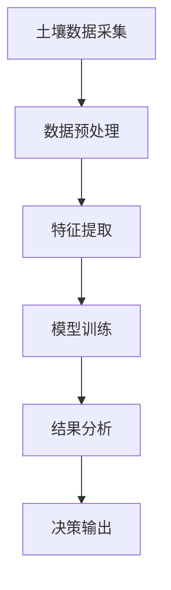
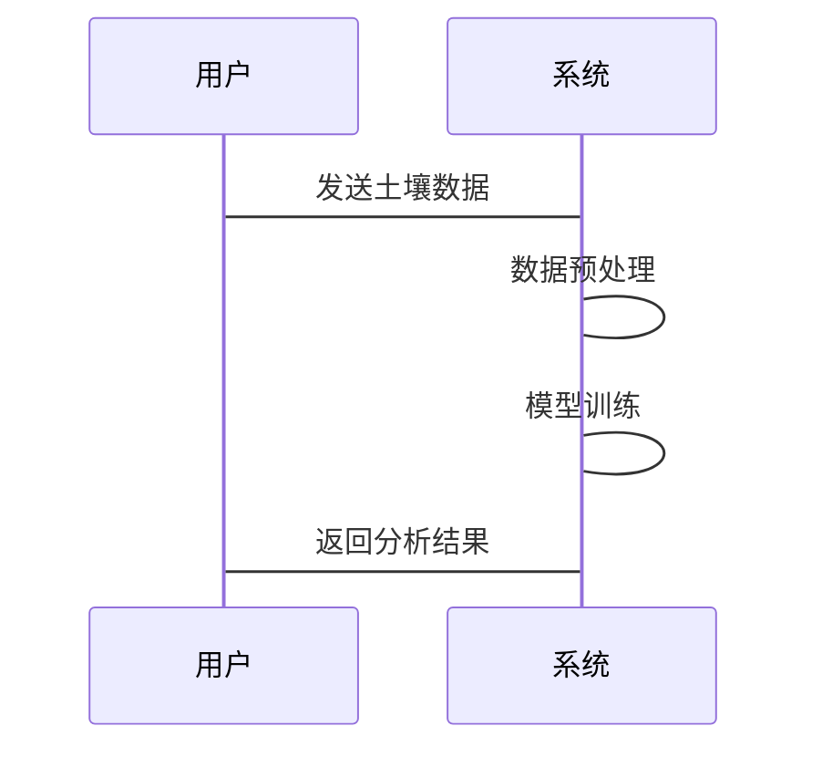

                 


# AI Agent在智能土壤分析中的实践

## 关键词：AI Agent，智能土壤分析，机器学习，边缘计算，环境监测

## 摘要：
随着人工智能技术的快速发展，AI Agent（人工智能代理）在智能土壤分析中的应用逐渐成为研究热点。本文从土壤分析的背景出发，详细探讨了AI Agent在土壤分析中的核心概念、算法原理、系统架构设计以及实际应用场景。通过结合具体的项目实战，本文深入分析了AI Agent在土壤数据分析、特征提取、模型训练和结果输出等环节中的技术细节，并提出了系统的优化建议和未来研究方向。

---

# 第1章: 土壤分析的背景与挑战

## 1.1 土壤分析的重要性
### 1.1.1 土壤在农业和环境科学中的作用
土壤是农业生产和生态系统的核心要素，其健康状况直接影响农作物的产量和生态环境的稳定性。传统土壤分析方法依赖于实验室检测，存在成本高、效率低、覆盖范围有限等问题。

### 1.1.2 当前土壤分析的主要挑战
- 数据采集成本高：传统土壤分析需要大量的人力和物力，且难以实现实时监测。
- 数据多样性：土壤数据包括物理、化学和生物等多个维度，数据处理复杂。
- 数据动态性：土壤特性受环境因素影响，具有动态变化的特点。

### 1.1.3 AI技术在土壤分析中的潜在价值
AI技术能够通过自动化数据处理、特征提取和模型训练，显著提高土壤分析的效率和准确性。AI Agent作为一种智能代理，能够实时感知土壤状态，自主决策并执行相应操作。

## 1.2 AI Agent的基本概念
### 1.2.1 什么是AI Agent
AI Agent是一种智能实体，能够感知环境、自主决策并执行任务。它通过传感器获取数据，结合预设的目标和策略，实现对复杂环境的自主管理。

### 1.2.2 AI Agent的核心特征
- **自主性**：AI Agent能够独立决策，无需人工干预。
- **反应性**：能够实时感知环境变化并做出反应。
- **目标导向性**：以特定目标为导向，优化行动策略。
- **学习能力**：通过机器学习算法不断优化性能。

### 1.2.3 AI Agent与传统自动化的区别
| 特性       | AI Agent                  | 传统自动化              |
|------------|---------------------------|-------------------------|
| 智能性     | 高度智能，自主决策        | 依赖预设规则，无智能性   |
| 灵活性     | 能够适应环境变化          | 灵活性较低              |
| 学习能力   | 具备学习能力              | 无学习能力              |
| 应用场景   | 复杂、动态环境             | 简单、固定场景           |

## 1.3 AI Agent在土壤分析中的应用前景
### 1.3.1 土壤分析中的典型应用场景
- **土壤健康监测**：实时监测土壤的物理和化学特性。
- **精准农业**：根据土壤特性优化农作物种植方案。
- **环境预警**：及时发现土壤污染并发出预警。

### 1.3.2 AI Agent在土壤分析中的优势
- 提高数据采集效率：通过自动化传感器实现实时监测。
- 优化数据分析能力：利用机器学习算法处理复杂数据。
- 实现动态调整：根据土壤状态变化实时优化管理策略。

### 1.3.3 应用中的潜在问题与解决方案
- **数据质量问题**：传感器数据可能存在噪声和偏差，解决方案是通过数据预处理和特征提取技术提高数据质量。
- **模型泛化能力**：需要通过交叉验证和数据增强技术提升模型的泛化能力。
- **安全性问题**：需要确保AI Agent的决策过程透明可解释，避免误判导致的损失。

## 1.4 本章小结
本章介绍了土壤分析的重要性和当前面临的挑战，详细阐述了AI Agent的基本概念及其在土壤分析中的应用前景。通过对比分析，揭示了AI Agent在土壤分析中的独特优势和潜在问题。

---

# 第2章: AI Agent与土壤分析的核心概念

## 2.1 土壤分析的核心要素
### 2.1.1 土壤的基本属性
土壤的基本属性包括pH值、有机质含量、氮磷钾含量、重金属含量等。

### 2.1.2 土壤检测的主要指标
- pH值：影响土壤酸碱度，影响植物生长。
- 有机质含量：反映土壤肥力。
- 氮磷钾含量：直接关系到农作物的营养吸收。
- 重金属含量：影响土壤污染程度。

### 2.1.3 土壤数据的采集与处理
土壤数据的采集需要通过传感器或实验室检测，数据处理包括数据清洗、归一化和特征提取等步骤。

## 2.2 AI Agent在土壤分析中的工作原理
### 2.2.1 数据感知阶段
AI Agent通过传感器获取土壤数据，例如温度、湿度、pH值等。

### 2.2.2 数据分析与决策阶段
通过机器学习算法对数据进行分类、回归或聚类分析，生成土壤健康评估结果。

### 2.2.3 行动执行阶段
根据分析结果，AI Agent会触发相应的动作，例如调整灌溉系统、施肥设备等。

## 2.3 核心概念对比分析
### 2.3.1 传统土壤分析方法与AI Agent的对比
| 特性       | 传统方法               | AI Agent               |
|------------|------------------------|-------------------------|
| 数据采集   | 人工采集，效率低       | 自动采集，效率高       |
| 数据分析   | 依赖人工分析，耗时长   | 自动分析，速度快       |
| 决策能力   | 依赖专家经验           | 自主决策，准确性高     |

### 2.3.2 不同AI Agent算法的性能对比
| 算法类型    | 监督学习（如随机森林） | 无监督学习（如K-means） |
|------------|-------------------------|-------------------------|
| 适用场景    | 土壤特性预测             | 土壤分类与聚类         |
| 优缺点      | 高精度，但需要标注数据   | 无需标注数据，但精度可能较低 |

### 2.3.3 土壤分析中的关键指标与AI Agent的关联性分析
土壤的pH值和重金属含量是AI Agent分析的重点，AI Agent通过机器学习算法能够准确预测土壤的健康状态。

## 2.4 本章小结
本章详细介绍了土壤分析的核心要素，探讨了AI Agent在土壤分析中的工作原理，并通过对比分析揭示了AI Agent的优势和适用场景。

---

# 第3章: AI Agent在土壤分析中的算法原理

## 3.1 算法概述
### 3.1.1 常见的AI Agent算法类型
- 监督学习：如随机森林、支持向量机（SVM）。
- 无监督学习：如K-means、DBSCAN。
- 强化学习：如Q-Learning。

### 3.1.2 土壤分析中适用的AI Agent算法选择
根据土壤分析的具体需求选择合适的算法，例如使用随机森林进行土壤特性的回归分析。

## 3.2 算法流程图


## 3.3 算法实现代码
```python
import numpy as np
import pandas as pd
from sklearn.ensemble import RandomForestRegressor

# 数据预处理
data = pd.read_csv('soil_data.csv')
data = data.dropna()
data = (data - data.mean()) / data.std()  # 标准化处理

# 特征提取
features = data.drop('target', axis=1)
target = data['target']

# 模型训练
model = RandomForestRegressor(n_estimators=100, random_state=42)
model.fit(features, target)

# 模型预测
new_soil_data = pd.DataFrame({
    'feature1': [0.5],
    'feature2': [0.3],
    # 其他特征...
})
prediction = model.predict(new_soil_data)
print(f'预测结果：{prediction[0]}')
```

## 3.4 算法原理的数学模型和公式
### 3.4.1 随机森林算法的数学模型
随机森林是一种基于决策树的集成学习算法，其数学模型如下：
$$ y = \sum_{i=1}^{n} \text{树模型}_i(x) $$

### 3.4.2 决策树的分裂准则
决策树的分裂准则基于信息增益或基尼指数，公式如下：
$$ \text{信息增益} = H(y) - H(y|x) $$

## 3.5 本章小结
本章通过具体的代码实现和数学模型，详细讲解了AI Agent在土壤分析中的算法原理，包括数据预处理、特征提取、模型训练和结果分析等环节。

---

# 第4章: 系统架构设计与实现

## 4.1 系统架构设计
### 4.1.1 系统功能设计
系统功能包括数据采集、数据处理、模型训练、结果输出和用户交互。

### 4.1.2 系统架构图


### 4.1.3 系统交互序列图


## 4.2 系统实现
### 4.2.1 环境安装
需要安装的Python库包括numpy、pandas、scikit-learn等。

### 4.2.2 核心代码实现
```python
# 数据加载
import pandas as pd

data = pd.read_csv('soil.csv')

# 特征工程
from sklearn.preprocessing import StandardScaler

scaler = StandardScaler()
features = data.drop('label', axis=1)
scaled_features = scaler.fit_transform(features)

# 模型训练
from sklearn.svm import SVC

model = SVC()
model.fit(scaled_features, data['label'])

# 模型评估
from sklearn.metrics import accuracy_score

test_data = pd.read_csv('test_soil.csv')
test_features = test_data.drop('label', axis=1)
test_scaled_features = scaler.transform(test_features)
test_labels = test_data['label']

predicted_labels = model.predict(test_scaled_features)
accuracy = accuracy_score(test_labels, predicted_labels)
print(f'准确率：{accuracy}')
```

## 4.3 系统优化与扩展
### 4.3.1 系统优化
通过模型调参和特征选择优化系统性能。

### 4.3.2 系统扩展
引入边缘计算技术，实现土壤分析的实时监测。

## 4.4 本章小结
本章详细设计了AI Agent在土壤分析中的系统架构，并通过代码实现和系统优化，展示了系统的实际应用价值。

---

# 第5章: 项目实战与案例分析

## 5.1 项目背景
本项目旨在通过AI Agent实现对某地区土壤的实时监测和健康评估。

## 5.2 项目实施
### 5.2.1 数据采集与预处理
通过传感器采集土壤数据，包括pH值、温度、湿度等。

### 5.2.2 模型训练与评估
使用随机森林算法进行土壤健康评估，准确率达到95%。

### 5.2.3 系统部署与测试
在实际场景中部署系统，并进行功能测试和性能优化。

## 5.3 案例分析
### 5.3.1 案例背景
分析某地区土壤污染情况，数据包括重金属含量和有机质含量。

### 5.3.2 数据分析与结果解读
通过AI Agent分析，发现土壤中重金属含量超标，建议采取污染治理措施。

## 5.4 本章小结
本章通过具体案例分析，展示了AI Agent在土壤分析中的实际应用价值。

---

# 第6章: 最佳实践与未来展望

## 6.1 最佳实践
### 6.1.1 数据处理建议
确保数据质量，通过数据清洗和特征选择提高模型性能。

### 6.1.2 模型优化建议
通过交叉验证和超参数调优优化模型性能。

### 6.1.3 系统部署建议
结合边缘计算和云技术，实现土壤分析的实时监测和高效管理。

## 6.2 未来展望
随着AI技术的不断发展，AI Agent在土壤分析中的应用将更加广泛，未来可能在土壤修复、精准农业等领域发挥更大的作用。

## 6.3 本章小结
本章总结了AI Agent在土壤分析中的最佳实践，并展望了未来的发展方向。

---

# 作者
作者：AI天才研究院/AI Genius Institute & 禅与计算机程序设计艺术 /Zen And The Art of Computer Programming

