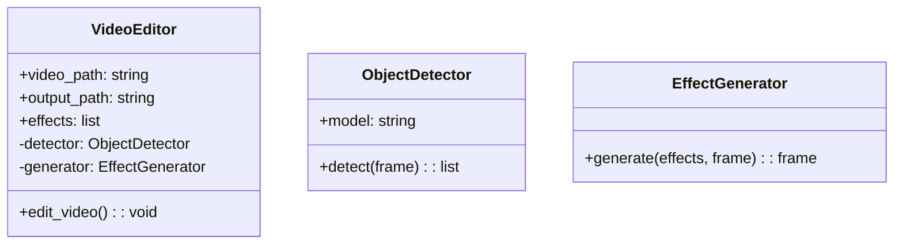
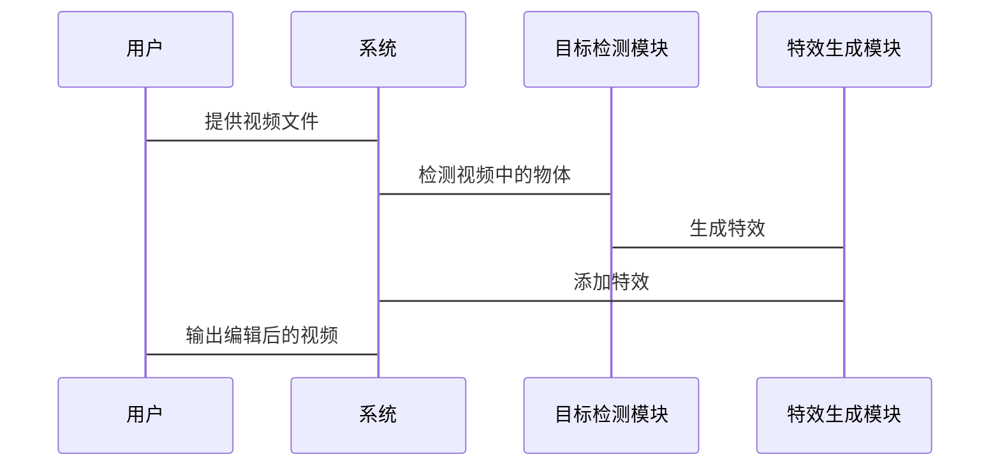

                 


# AI Agent在视频编辑中的应用：自动剪辑与特效添加

## 关键词：
AI Agent, 视频编辑, 自动剪辑, 特效添加, 人工智能, 视频分析

## 摘要：
随着人工智能技术的迅速发展，AI Agent在视频编辑领域的应用越来越广泛。本文将详细探讨AI Agent在视频编辑中的应用，重点分析自动剪辑与特效添加的技术原理和实现方法。通过介绍AI Agent的核心概念、算法原理、系统架构设计以及实际项目案例，本文旨在为读者提供一个全面而深入的视角，了解如何利用AI技术提升视频编辑的效率和质量。

---

# 第一部分: AI Agent与视频编辑的背景介绍

## 第1章: AI Agent与视频编辑的背景介绍

### 1.1 问题背景与描述

#### 1.1.1 传统视频编辑的痛点
传统的视频编辑过程通常需要手动完成剪辑、特效添加、音频调整等一系列操作。这些操作不仅耗时，而且需要专业的技能和经验。对于非专业用户来说，视频编辑工具的学习曲线较高，且效率低下。

#### 1.1.2 AI技术如何解决视频编辑问题
AI Agent（人工智能代理）能够通过自动化技术解决视频编辑中的许多问题。例如，AI Agent可以自动识别视频中的关键帧，进行剪辑；还可以根据场景内容自动添加特效和调整音频。这些自动化操作不仅提高了效率，还降低了对专业技能的要求。

#### 1.1.3 AI Agent在视频编辑中的定位与作用
AI Agent在视频编辑中的定位是作为一个智能化的辅助工具，帮助用户完成从素材整理到最终输出的整个流程。其主要作用包括：自动剪辑、特效添加、音频同步、内容推荐等。

### 1.2 AI Agent的核心概念与要素

#### 1.2.1 AI Agent的定义与特征
AI Agent是一种能够感知环境并采取行动以实现目标的智能体。其主要特征包括：自主性、反应性、目标导向和学习能力。

#### 1.2.2 视频编辑的关键技术与流程
视频编辑的关键技术包括：视频剪辑、特效添加、视频分析与理解。流程通常包括素材整理、剪辑、特效添加、音频调整、输出等步骤。

#### 1.2.3 AI Agent与视频编辑的结合方式
AI Agent可以通过以下方式与视频编辑结合：
1. **自动剪辑**：AI Agent根据视频内容自动识别关键帧，完成剪辑。
2. **特效添加**：AI Agent可以根据视频场景自动添加特效，如背景虚化、动态文字等。
3. **音频同步**：AI Agent可以自动匹配视频画面与音频，实现同步效果。

### 1.3 问题解决与边界

#### 1.3.1 AI Agent在视频编辑中的应用范围
AI Agent主要应用于视频剪辑、特效添加、视频分析等领域。目前，其应用范围主要集中在自动化处理和辅助编辑方面。

#### 1.3.2 应用边界与限制
尽管AI Agent在视频编辑中表现出色，但其应用也存在一定的边界和限制，例如：
- 对复杂场景的处理能力有限。
- 对于高度定制化的特效和剪辑需求，仍需人工干预。

#### 1.3.3 视频编辑中的AI Agent与其他技术的关系
AI Agent在视频编辑中的应用离不开计算机视觉、自然语言处理等技术的支持。例如，计算机视觉技术用于视频内容识别，自然语言处理技术用于生成字幕等。

### 1.4 核心概念对比分析

#### 1.4.1 AI Agent与传统视频编辑工具的对比
| 对比维度 | AI Agent | 传统视频编辑工具 |
|----------|-----------|------------------|
| 自动化程度 | 高 | 低 |
| 学习成本 | 低 | 高 |
| 处理效率 | 高 | 低 |

#### 1.4.2 视频编辑中的关键要素分析
视频编辑的关键要素包括：素材质量、剪辑逻辑、特效效果、音频同步等。

#### 1.4.3 AI Agent在视频编辑中的价值链分析
AI Agent通过提高编辑效率、降低学习成本、增强编辑效果，为视频制作方、广告公司、个人用户等提供了更高的价值。

### 1.5 本章小结
本章主要介绍了AI Agent在视频编辑中的背景、核心概念、技术原理及其应用范围。通过对比分析，明确了AI Agent在视频编辑中的优势和局限性。

---

# 第二部分: AI Agent的核心概念与技术原理

## 第2章: AI Agent的基本原理

### 2.1 AI Agent的核心原理

#### 2.1.1 AI Agent的定义与分类
AI Agent可以根据应用场景分为多种类型，例如：
- **任务型AI Agent**：专注于完成特定任务，如视频剪辑。
- **学习型AI Agent**：通过学习数据不断优化自身性能。

#### 2.1.2 AI Agent的决策机制
AI Agent的决策机制通常包括感知、推理和行动三个步骤：
1. **感知**：通过传感器或数据输入获取信息。
2. **推理**：基于感知信息进行逻辑推理，生成决策。
3. **行动**：根据决策采取相应行动。

#### 2.1.3 AI Agent的学习与自适应能力
AI Agent可以通过机器学习算法（如深度学习、强化学习）不断优化自身性能，提高处理效率和准确性。

### 2.2 视频编辑的关键技术

#### 2.2.1 视频剪辑的基本流程
视频剪辑的基本流程包括：素材整理、时间轴编辑、转场效果添加、字幕生成等。

#### 2.2.2 视频特效的实现原理
视频特效的实现通常依赖于计算机视觉技术，如图像处理、景深估计等。

#### 2.2.3 视频分析与理解技术
视频分析技术包括：目标检测、图像分割、情感分析等。

### 2.3 AI Agent与视频编辑的结合方式

#### 2.3.1 AI Agent在视频剪辑中的应用
AI Agent可以自动识别视频中的关键帧，完成剪辑操作。例如，使用目标检测技术识别视频中的主要人物，自动剪辑出连续的片段。

#### 2.3.2 AI Agent在视频特效中的应用
AI Agent可以根据视频场景自动添加特效，如动态模糊、背景虚化等。

#### 2.3.3 AI Agent在视频分析中的应用
AI Agent可以用于视频内容的理解与分析，例如情感分析、场景识别等。

### 2.4 核心概念对比分析

#### 2.4.1 AI Agent与传统视频编辑工具的对比
- **效率**：AI Agent显著提高了视频编辑的效率。
- **自动化**：AI Agent实现了剪辑和特效添加的自动化。

#### 2.4.2 视频编辑中的关键要素对比
- **素材质量**：高质量的素材是视频编辑的基础。
- **剪辑逻辑**：合理的剪辑逻辑是视频流畅的关键。

#### 2.4.3 AI Agent在视频编辑中的价值链分析
AI Agent通过自动化和智能化，显著降低了视频编辑的成本，提高了效率，为视频制作方带来了更高的价值。

### 2.5 本章小结
本章详细介绍了AI Agent的基本原理及其在视频编辑中的应用方式，重点分析了AI Agent如何通过自动化技术提升视频编辑的效率和质量。

---

# 第三部分: 算法原理讲解

## 第3章: 算法原理与实现

### 3.1 算法原理讲解

#### 3.1.1 目标检测算法
目标检测算法（如YOLO、Faster R-CNN）用于识别视频中的目标物体，帮助AI Agent完成自动剪辑。

#### 3.1.2 图像生成算法
图像生成算法（如GAN、VAE）用于生成视频特效，如动态文字、背景虚化等。

### 3.2 算法实现步骤

#### 3.2.1 视频剪辑的实现步骤
1. **目标检测**：识别视频中的关键帧。
2. **时间轴编辑**：根据检测结果生成剪辑点。
3. **转场效果添加**：在剪辑点添加转场效果。

#### 3.2.2 视频特效的实现步骤
1. **场景分析**：分析视频场景，生成特效建议。
2. **特效生成**：根据建议生成特效。
3. **特效添加**：将特效添加到视频中。

### 3.3 算法代码实现

#### 3.3.1 Python代码实现
```python
import cv2
import numpy as np

def detect_objects(frame):
    # 使用目标检测算法识别视频中的物体
    # 返回检测结果
    pass

def generate特效(effects, frame):
    # 根据特效生成结果
    pass

def video_editing(video_path):
    cap = cv2.VideoCapture(video_path)
    while cap.isOpened():
        ret, frame = cap.read()
        if not ret:
            break
        # 目标检测
        objects = detect_objects(frame)
        # 特效生成
        effects = generate_efeects(objects)
        # 添加特效
        apply_effects(frame, effects)
        # 保存结果
        out.write(frame)
    cap.release()
    out.release()

video_editing("input.mp4")
```

#### 3.3.2 算法流程图
```mermaid
graph TD
A[开始] -> B[读取视频帧]
B -> C[目标检测]
C -> D[生成特效]
D -> E[添加特效]
E -> F[保存结果]
F -> G[结束]
```

### 3.4 算法优化与改进

#### 3.4.1 算法优化
- **优化目标检测算法**：提高检测精度和速度。
- **优化特效生成算法**：增强特效的多样性和美观性。

#### 3.4.2 算法改进
- **引入机器学习模型**：通过训练数据优化算法性能。
- **引入反馈机制**：根据用户反馈不断优化算法。

### 3.5 本章小结
本章详细讲解了AI Agent在视频编辑中的算法原理和实现步骤，通过代码和流程图帮助读者理解算法的实现过程。

---

# 第四部分: 系统分析与架构设计

## 第4章: 系统分析与架构设计

### 4.1 系统分析

#### 4.1.1 问题场景介绍
视频编辑系统需要处理大量视频数据，完成剪辑、特效添加等任务。

#### 4.1.2 项目介绍
本项目旨在开发一个基于AI Agent的视频编辑系统，实现自动剪辑与特效添加功能。

### 4.2 系统架构设计

#### 4.2.1 领域模型设计


#### 4.2.2 系统架构设计
```mermaid
graph TD
A[用户] -> B[视频编辑系统]
B -> C[视频输入]
C -> D[目标检测]
D -> E[特效生成]
E -> F[视频输出]
```

#### 4.2.3 接口设计
- **输入接口**：视频文件路径。
- **输出接口**：编辑后的视频文件。

#### 4.2.4 交互设计


### 4.3 本章小结
本章通过系统分析与架构设计，明确了视频编辑系统的功能模块、交互流程和架构设计。

---

# 第五部分: 项目实战

## 第5章: 项目实战

### 5.1 环境安装

#### 5.1.1 安装Python环境
- 安装Python 3.8及以上版本。
- 安装必要的库：numpy、opencv、tensorflow等。

#### 5.1.2 安装视频编辑工具
- 安装FFmpeg工具，用于视频处理。

### 5.2 核心代码实现

#### 5.2.1 视频剪辑代码
```python
import cv2
import numpy as np

def detect_objects(frame):
    # 使用目标检测模型检测物体
    pass

def apply_effects(frame, effects):
    # 根据特效列表添加特效
    pass

def video_editor(video_path, output_path):
    cap = cv2.VideoCapture(video_path)
    out = cv2.VideoWriter(output_path, cv2.VideoWriter_fourcc(*'mp4v'), 24, (640, 480))
    while cap.isOpened():
        ret, frame = cap.read()
        if not ret:
            break
        # 目标检测
        objects = detect_objects(frame)
        # 生成特效
        effects = generate_effects(objects)
        # 添加特效
        frame_with_effects = apply_effects(frame, effects)
        # 保存结果
        out.write(frame_with_effects)
    cap.release()
    out.release()

video_editor("input.mp4", "output.mp4")
```

#### 5.2.2 特效生成代码
```python
import cv2
import numpy as np

def generate_effects(objects):
    effects = []
    for obj in objects:
        # 根据物体生成特效
        effects.append(generate_effect(obj))
    return effects

def generate_effect(obj):
    # 根据物体生成特效
    pass
```

### 5.3 代码解读与分析

#### 5.3.1 视频剪辑代码解读
- **视频读取**：使用OpenCV读取视频文件。
- **目标检测**：识别视频中的物体。
- **特效生成**：根据检测结果生成特效。
- **特效添加**：将特效添加到视频帧中。
- **结果保存**：将编辑后的视频保存为输出文件。

#### 5.3.2 特效生成代码解读
- **物体检测**：识别视频中的物体。
- **特效生成**：根据物体生成相应的特效，例如动态模糊、背景虚化等。

### 5.4 实际案例分析

#### 5.4.1 案例背景
假设我们有一个视频文件，其中包含一个人在跑步的场景。我们需要自动剪辑出跑步的片段，并添加动态模糊特效。

#### 5.4.2 实现步骤
1. **视频读取**：读取视频文件。
2. **目标检测**：识别视频中的跑步者。
3. **特效生成**：生成动态模糊特效。
4. **特效添加**：将特效添加到跑步者的背景中。
5. **结果保存**：保存编辑后的视频。

### 5.5 项目小结
本章通过实际项目案例，展示了AI Agent在视频编辑中的具体应用。通过代码实现和分析，帮助读者理解如何将理论应用于实践。

---

# 第六部分: 最佳实践与总结

## 第6章: 最佳实践与总结

### 6.1 最佳实践

#### 6.1.1 技术实现建议
- 使用高效的AI算法（如YOLO、GAN）提高处理效率。
- 引入反馈机制，优化算法性能。

#### 6.1.2 开发注意事项
- 确保代码的可扩展性，方便后续优化和功能添加。
- 注意视频文件的格式和编码问题，避免出现错误。

### 6.2 小结
本文详细探讨了AI Agent在视频编辑中的应用，重点分析了自动剪辑与特效添加的技术原理和实现方法。通过系统分析和项目实战，帮助读者理解如何利用AI技术提升视频编辑的效率和质量。

### 6.3 注意事项
- 在实际应用中，需注意视频文件的格式和编码问题。
- 对于复杂场景，可能需要引入更复杂的算法进行处理。

### 6.4 拓展阅读
- 推荐阅读《深度学习》（Deep Learning, Ian Goodfellow等著）。
- 推荐学习目标检测、图像生成等技术，进一步优化AI Agent的性能。

---

# 作者：AI天才研究院 & 禅与计算机程序设计艺术

---

**注：** 以上内容为示例性目录大纲，具体内容需要根据实际需求进行扩展和详细撰写。

