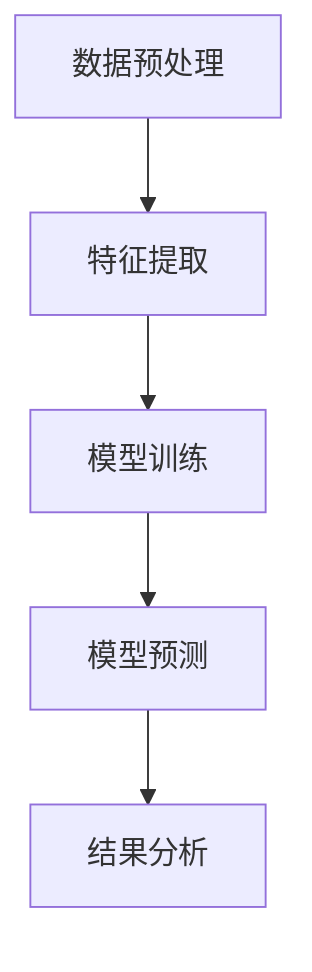
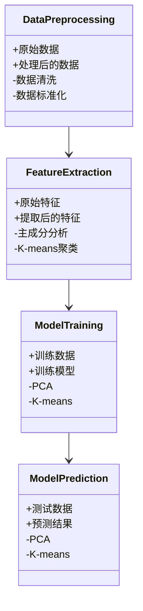
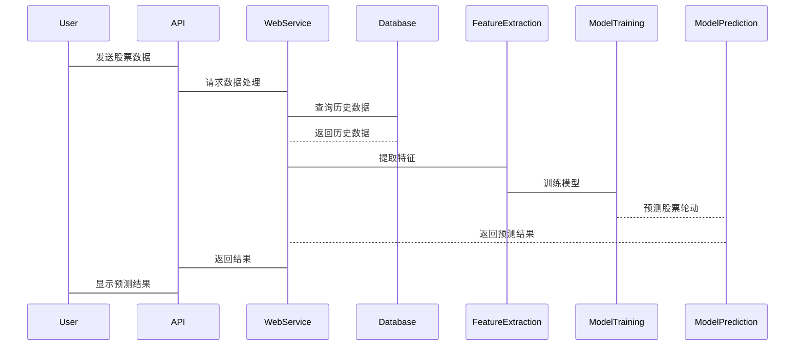

                 


# AI辅助识别价值股轮动机会

> 关键词：AI，价值股，股票轮动，金融分析，机器学习，深度学习，投资策略

> 摘要：本文将详细探讨如何利用人工智能技术辅助识别价值股的轮动机会。从价值股的基本概念到AI在金融分析中的应用，再到具体的算法原理、系统架构和项目实战，本文将全面解析如何通过AI技术捕捉股票市场的价值轮动机会，帮助投资者制定科学的投资策略。

---

# 第1章: 价值股轮动的基本概念

## 1.1 价值股轮动的定义与背景

### 1.1.1 价值股的基本概念

价值股是指那些市场价格低于其内在价值的股票。这些股票通常具有较低的市盈率、市净率等估值指标，且公司基本面良好，具有稳定的盈利能力。价值股的核心在于“低估”，即市场价格未充分反映其内在价值。

价值股的投资策略强调长期持有的理念，投资者通过识别被市场低估的股票，等待其价值回归，从而获得超额收益。

### 1.1.2 股票轮动的定义

股票轮动是指在不同的市场环境下，资金从一种资产或股票转移到另一种资产或股票的过程。轮动的核心在于根据市场变化调整投资组合，以捕捉不同阶段的收益机会。股票轮动策略通常基于技术分析、基本面分析或市场情绪等因素。

### 1.1.3 价值股轮动的背景与意义

随着金融市场日益复杂化和数据化，传统的基本面分析和市场情绪分析逐渐被数据驱动的量化分析所取代。价值股轮动的背景在于，通过量化分析和机器学习技术，投资者能够更精准地识别市场低估的股票，并在适当的时机进行轮动操作，从而提高投资收益。

价值股轮动的意义在于，它结合了传统价值投资的理念和现代人工智能技术，为投资者提供了更高效的投资工具和策略。

---

## 1.2 AI在金融分析中的应用

### 1.2.1 AI技术在金融领域的应用现状

人工智能技术在金融领域的应用日益广泛，包括股票价格预测、风险评估、投资组合优化、市场情绪分析等多个方面。AI技术通过处理海量数据，挖掘隐藏的规律，为投资者提供决策支持。

### 1.2.2 AI在股票分析中的优势

AI在股票分析中的优势主要体现在以下几个方面：

1. **数据处理能力**：AI能够处理和分析海量数据，包括历史价格、财务数据、市场情绪等，为投资者提供全面的分析支持。
2. **模式识别能力**：通过机器学习算法，AI能够识别数据中的复杂模式，发现传统方法难以捕捉的投资机会。
3. **实时性**：AI系统能够实时监控市场变化，及时调整投资策略。

### 1.2.3 价值股轮动中的AI辅助机会

在价值股轮动中，AI技术可以帮助投资者识别市场低估的股票，并预测其轮动时机。通过分析历史数据和市场趋势，AI系统可以辅助投资者制定科学的投资策略，提高投资收益。

---

## 1.3 本书的目标与结构

### 1.3.1 本书的研究目标

本书旨在探讨如何利用人工智能技术辅助识别价值股的轮动机会，通过理论分析和实践案例，帮助投资者理解AI在金融分析中的应用。

### 1.3.2 本书的主要内容

- 第1章：介绍价值股轮动的基本概念和AI在金融分析中的应用。
- 第2章：详细讲解价值股轮动的核心概念和原理。
- 第3章：分析数据处理与特征提取的方法。
- 第4章：探讨基于AI的股票轮动算法原理。
- 第5章：介绍系统架构与设计。
- 第6章：提供项目实战案例。
- 第7章：总结最佳实践和注意事项。

### 1.3.3 本书的读者对象

本书适合对金融投资和人工智能技术感兴趣的读者，包括投资者、金融从业者、数据科学家和相关领域的研究人员。

### 1.3.4 本书的应用场景

本书内容适用于股票投资分析、量化交易策略制定、投资组合优化等领域，为投资者提供科学的决策支持。

---

# 第2章: 价值股轮动的核心概念与原理

## 2.1 价值股轮动的核心概念

### 2.1.1 价值股的特征

价值股的核心特征包括：

- **低市盈率（P/E）**：市盈率低于行业平均水平，表明股票价格相对较低。
- **低市净率（P/B）**：市净率低于行业平均水平，表明股票价格相对于账面价值较低。
- **稳定的盈利能力**：公司净利润稳定增长，具有较高的ROE（净资产收益率）。
- **高股息率**：公司股息支付率高，具有较高的分红能力。

### 2.1.2 股票轮动的驱动因素

股票轮动的驱动因素包括：

- **市场周期**：经济周期和市场周期影响股票轮动，不同周期下投资者偏好不同类型的股票。
- **行业轮动**：不同行业的股票在不同经济环境下表现不同，投资者需要根据行业趋势进行轮动。
- **市场情绪**：市场情绪波动影响股票价格，投资者需要根据市场情绪调整投资策略。

### 2.1.3 价值股轮动的周期性

价值股轮动具有周期性，通常与经济周期和市场周期密切相关。在经济衰退期，价值股表现较好；在经济繁荣期，成长股表现较好。投资者需要根据市场周期调整价值股轮动策略。

---

## 2.2 AI辅助价值股轮动的原理

### 2.2.1 数据驱动的分析方法

AI通过处理海量数据，识别数据中的复杂模式，为投资者提供数据驱动的分析支持。数据驱动的分析方法包括：

- **历史数据分析**：通过分析历史价格和财务数据，识别价值股的特征。
- **市场情绪分析**：通过社交媒体和新闻数据，分析市场情绪，判断股票的低估或高估状态。

### 2.2.2 模型驱动的预测方法

模型驱动的预测方法包括：

- **机器学习模型**：通过训练数据，预测股票价格和市场趋势。
- **深度学习模型**：通过神经网络，捕捉数据中的非线性关系，提高预测精度。

### 2.2.3 组合优化的策略

AI可以通过组合优化技术，帮助投资者制定最优的投资组合。组合优化的目标是在风险可控的前提下，最大化投资收益。

---

## 2.3 价值股轮动的核心要素

### 2.3.1 市场数据

市场数据包括股票价格、成交量、市场指数等，是分析价值股轮动的基础。

### 2.3.2 财务指标

财务指标包括市盈率、市净率、ROE等，是衡量股票价值的重要指标。

### 2.3.3 技术指标

技术指标包括移动平均线、相对强弱指数（RSI）、MACD等，是技术分析的重要工具。

### 2.3.4 市场情绪

市场情绪包括投资者情绪、市场参与度等，是影响股票价格的重要因素。

---

# 第3章: AI辅助价值股轮动的数据处理与特征提取

## 3.1 数据预处理

### 3.1.1 数据清洗

数据清洗是数据预处理的重要步骤，包括去除缺失值、处理异常值等。

### 3.1.2 数据标准化

数据标准化是为了消除不同特征之间的量纲差异，常用的标准化方法包括最小-最大标准化和Z-score标准化。

### 3.1.3 数据增强

数据增强是通过增加数据的多样性和鲁棒性，提高模型的泛化能力。

---

## 3.2 特征提取

### 3.2.1 基于统计的特征提取

基于统计的特征提取方法包括计算均值、方差、偏度等统计指标。

### 3.2.2 基于机器学习的特征提取

基于机器学习的特征提取方法包括主成分分析（PCA）和线性判别分析（LDA）等。

### 3.2.3 基于深度学习的特征提取

基于深度学习的特征提取方法包括卷积神经网络（CNN）和长短期记忆网络（LSTM）等。

---

## 3.3 数据特征对比分析

### 3.3.1 不同特征的重要性对比

通过特征重要性分析，可以确定哪些特征对价值股轮动的影响更大。

### 3.3.2 特征之间的相关性分析

相关性分析可以帮助投资者理解不同特征之间的关系，避免特征冗余。

### 3.3.3 特征与目标变量的关联性分析

通过回归分析等方法，可以确定特征与目标变量（如股票价格）之间的关联性。

---

# 第4章: 基于AI的股票轮动算法原理

## 4.1 常见的股票轮动算法

### 4.1.1 基于PCA的特征降维算法

PCA是一种常用的降维技术，通过去除数据中的冗余信息，提高模型的效率和精度。

### 4.1.2 基于K-means的聚类算法

K-means是一种常用的聚类算法，可以将股票分为不同的类别，识别具有相似特征的股票。

### 4.1.3 基于ARIMA的时间序列预测算法

ARIMA是一种常用的时间序列预测模型，可以预测股票价格的未来走势。

---

## 4.2 算法流程图



---

## 4.3 算法实现代码

```python
import pandas as pd
import numpy as np
from sklearn.decomposition import PCA
from sklearn.cluster import KMeans
from statsmodels.tsa.arima_model import ARIMA

# 数据预处理
data = pd.read_csv('stock_data.csv')
data = data.dropna()

# 特征提取
features = data[['PE', 'PB', 'ROE', 'dividend_yield']]
features_standardized = (features - features.mean()) / features.std()

# 基于PCA的特征降维
pca = PCA(n_components=2)
principal_components = pca.fit_transform(features_standardized)

# 基于K-means的聚类
kmeans = KMeans(n_clusters=3, random_state=0)
clusters = kmeans.fit_predict(principal_components)

# 基于ARIMA的时间序列预测
model = ARIMA(features['price'], order=(1, 1, 1))
model_fit = model.fit()
forecast = model_fit.forecast(steps=5)
```

---

## 4.4 算法的数学模型和公式

### 4.4.1 PCA算法

PCA的目标是最小化数据的重建误差，数学公式如下：

$$
\text{目标函数} = \sum_{i=1}^{n} (x_i - x'_i)^2
$$

其中，\( x_i \) 是原始数据，\( x'_i \) 是降维后的数据。

### 4.4.2 K-means算法

K-means的目标是最小化簇内距离平方和，数学公式如下：

$$
\text{目标函数} = \sum_{i=1}^{n} \sum_{j=1}^{k} (x_{ij} - c_j)^2
$$

其中，\( x_{ij} \) 是第i个样本的第j个特征，\( c_j \) 是第j个簇的中心。

### 4.4.3 ARIMA算法

ARIMA模型的数学公式如下：

$$
\phi(\theta) = 1 + \theta_1 z + \theta_2 z^2 + \dots + \theta_p z^p
$$

$$
\Phi(\phi) = 1 + \phi_1 z + \phi_2 z^2 + \dots + \phi_p z^p
$$

其中，\( z \) 是单位延迟算子，\( \theta_i \) 和 \( \phi_i \) 是模型的参数。

---

# 第5章: 系统分析与架构设计

## 5.1 系统功能设计

### 5.1.1 领域模型



### 5.1.2 系统架构

```mermaid
rectangle Database {
    数据库
}
rectangle WebService {
    网络服务
}
rectangle API {
    API接口
}
rectangle Frontend {
    前端界面
}
Database --> WebService
WebService --> API
API --> Frontend
```

---

## 5.2 系统接口设计

### 5.2.1 数据接口

- 数据输入接口：接收原始数据，如股票价格、财务指标等。
- 数据输出接口：输出处理后的数据，如降维后的特征、聚类结果等。

### 5.2.2 模型接口

- 模型训练接口：接收训练数据，输出训练好的模型。
- 模型预测接口：接收测试数据，输出预测结果。

---

## 5.3 系统交互流程



---

# 第6章: 项目实战

## 6.1 环境安装

- 安装Python环境：Python 3.8+
- 安装相关库：pandas、numpy、scikit-learn、statsmodels

## 6.2 核心代码实现

```python
import pandas as pd
import numpy as np
from sklearn.decomposition import PCA
from sklearn.cluster import KMeans
from statsmodels.tsa.arima_model import ARIMA

# 数据预处理
data = pd.read_csv('stock_data.csv')
data = data.dropna()

# 特征提取
features = data[['PE', 'PB', 'ROE', 'dividend_yield']]
features_standardized = (features - features.mean()) / features.std()

# 基于PCA的特征降维
pca = PCA(n_components=2)
principal_components = pca.fit_transform(features_standardized)

# 基于K-means的聚类
kmeans = KMeans(n_clusters=3, random_state=0)
clusters = kmeans.fit_predict(principal_components)

# 基于ARIMA的时间序列预测
model = ARIMA(features['price'], order=(1, 1, 1))
model_fit = model.fit()
forecast = model_fit.forecast(steps=5)
```

---

## 6.3 案例分析

以某只股票为例，详细分析其价值股轮动的机会。通过数据可视化和模型预测，展示如何利用AI技术识别价值股的轮动机会。

---

## 6.4 结果解读

详细解读模型预测结果，分析其准确性和可靠性，提出改进建议。

---

# 第7章: 最佳实践

## 7.1 小结

总结本书的主要内容和研究成果，强调AI在价值股轮动中的重要性。

## 7.2 注意事项

- 数据质量：确保数据的准确性和完整性。
- 模型选择：根据实际情况选择合适的模型和算法。
- 风险控制：合理控制投资风险，避免过度依赖模型。

## 7.3 拓展阅读

推荐相关的书籍和论文，供读者进一步学习和研究。

---

# 作者

作者：AI天才研究院/AI Genius Institute & 禅与计算机程序设计艺术 /Zen And The Art of Computer Programming

