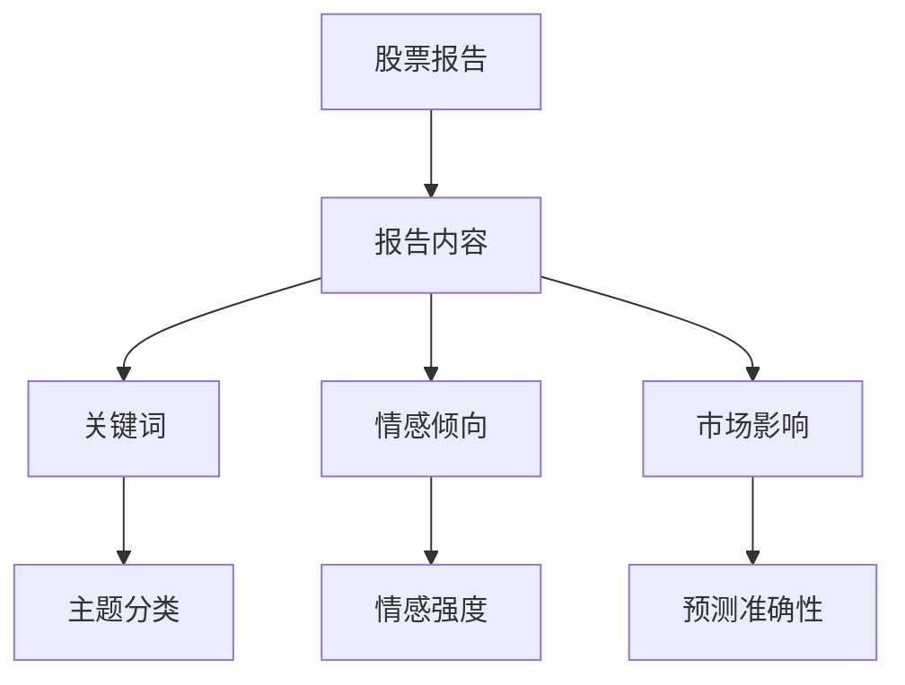
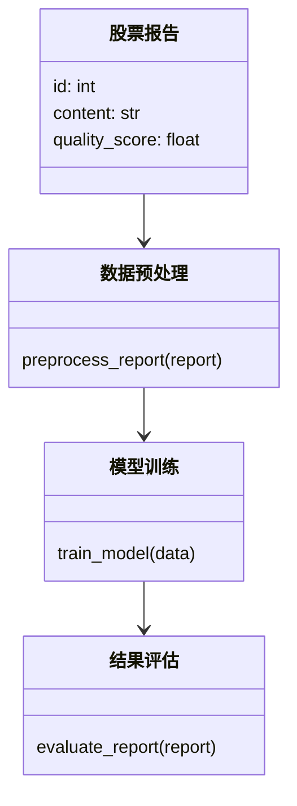
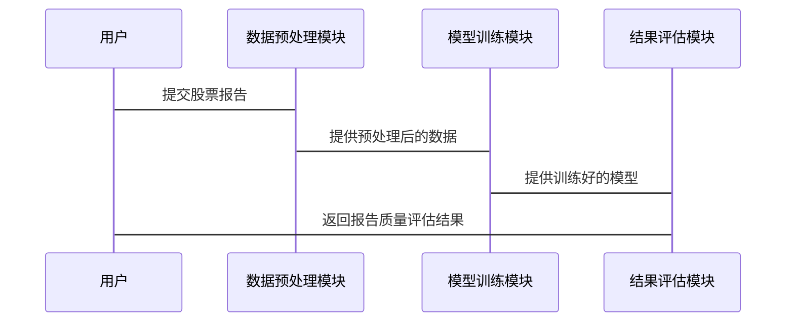

                 


# AI驱动的股票分析师报告质量评估

> 关键词：AI驱动，股票分析师，报告质量评估，深度学习，NLP，金融数据分析

> 摘要：本文系统阐述了AI驱动的股票分析师报告质量评估的核心概念、算法原理、系统架构设计及项目实战。通过对股票报告质量评估的背景分析，详细讲解了基于深度学习和自然语言处理（NLP）技术的AI解决方案，结合实际案例分析，展示了如何利用AI技术提升股票分析师报告的质量评估效率和准确性。文章最后总结了项目的最佳实践经验和未来研究方向。

---

# 第1章: 股票分析师报告质量评估的背景与问题

## 1.1 问题背景

### 1.1.1 股票分析师报告的重要性

股票分析师报告是投资者做出投资决策的重要依据。一份高质量的股票分析报告能够准确预测股票价格走势，识别投资机会，并帮助投资者规避风险。然而，随着金融市场的复杂化和信息量的爆炸式增长，传统的人工评估方式已难以满足需求。

### 1.1.2 传统报告质量评估的局限性

传统报告质量评估主要依赖人工经验，存在以下问题：
- **主观性**：不同评估人员对报告质量的判断可能存在主观差异。
- **效率低下**：人工评估耗时长，难以应对海量报告。
- **一致性不足**：评估标准不统一，导致结果缺乏可比性。

### 1.1.3 AI技术在金融分析中的潜力

AI技术，特别是深度学习和自然语言处理（NLP），能够从大量非结构化数据中提取有价值的信息。通过AI驱动的报告质量评估，可以实现自动化、高效化和客观化的评估，帮助投资者快速获取可靠的信息。

## 1.2 问题描述

### 1.2.1 报告质量评估的核心挑战

股票分析师报告的质量评估需要考虑以下因素：
- **内容准确性**：报告中的预测是否准确。
- **信息完整性**：报告是否覆盖了关键的市场信息。
- **逻辑清晰度**：报告的分析是否条理清晰。
- **语言专业性**：报告是否使用了专业的金融术语。

### 1.2.2 数据驱动的评估需求

现代金融分析依赖于数据驱动的方法。股票报告质量评估需要结合文本数据、市场数据和历史数据，构建一个全面的评估体系。

### 1.2.3 AI驱动评估的必要性

AI技术能够处理海量数据，发现隐藏在数据中的规律，为报告质量评估提供技术支持。通过AI模型，可以实现对报告的自动化分析和评估。

## 1.3 问题解决思路

### 1.3.1 AI技术如何提升报告质量评估

AI技术可以通过以下方式提升报告质量评估：
- **自动化数据处理**：快速提取报告中的关键信息。
- **深度学习模型**：利用NLP技术分析报告内容，预测其质量。
- **可解释性增强**：通过模型解释技术，帮助用户理解评估结果。

### 1.3.2 数据特征提取与模型训练

数据特征提取是AI驱动评估的关键步骤。通过NLP技术，可以从报告文本中提取关键词、情感倾向、主题分类等特征，并将其输入深度学习模型进行训练。

### 1.3.3 结果的可解释性与实用性

AI驱动的报告质量评估结果需要具备可解释性和实用性。模型不仅要能够准确评估报告质量，还要能够提供清晰的解释，帮助用户理解评估结果。

## 1.4 本章小结

本章介绍了股票分析师报告质量评估的背景与问题，分析了传统评估方法的局限性，并提出了AI驱动的解决方案。通过对问题的深入分析，为后续的AI技术应用奠定了基础。

---

# 第2章: AI驱动的股票报告质量评估核心概念

## 2.1 核心概念定义

### 2.1.1 股票分析师报告的特征

股票分析师报告具有以下特征：
- **文本数据**：报告内容通常以文本形式呈现。
- **领域专业性**：报告内容涉及专业的金融知识。
- **时间敏感性**：报告的时效性较强。

### 2.1.2 AI驱动评估的定义

AI驱动的股票报告质量评估是指利用人工智能技术，通过对报告文本的分析，评估其质量和价值的过程。

### 2.1.3 关键技术与概念对比

AI驱动的报告质量评估涉及以下关键技术：
- **自然语言处理（NLP）**：用于文本数据的处理与分析。
- **深度学习**：用于构建预测模型。
- **情感分析**：用于判断文本的情感倾向。

### 2.1.4 核心概念对比表

| 对比维度 | 传统评估方法 | AI驱动评估方法 |
|----------|--------------|----------------|
| 评估效率 | 低效 | 高效 |
| 评估标准 | 主观 | 客观 |
| 可扩展性 | 低 | 高 |

## 2.2 核心概念的属性特征对比

### 2.2.1 传统评估方法与AI评估方法的对比

传统评估方法依赖人工经验，而AI评估方法利用数据驱动技术，能够处理大量数据并发现潜在规律。

### 2.2.2 数据特征与模型性能的关系

数据特征的质量直接影响模型的性能。高质量的数据能够提升模型的准确性和可靠性。

### 2.2.3 不同模型在报告评估中的表现

不同的AI模型在报告质量评估中的表现各异。例如，情感分析模型适合评估报告的情感倾向，而主题分类模型适合评估报告的主题覆盖范围。

## 2.3 ER实体关系图架构



## 2.4 本章小结

本章详细阐述了AI驱动的股票报告质量评估的核心概念，分析了传统评估方法与AI评估方法的对比，并通过ER实体关系图展示了系统架构。

---

# 第3章: AI驱动的股票报告质量评估算法原理

## 3.1 算法原理概述

### 3.1.1 基于深度学习的文本分析

深度学习模型（如LSTM）可以用于分析报告文本，提取其中的有用信息。

### 3.1.2 基于规则的特征提取

通过规则匹配可以从报告文本中提取关键词和主题。

### 3.1.3 综合评估模型的构建

综合评估模型结合了文本分析和特征提取的结果，能够全面评估报告质量。

## 3.2 算法实现流程

### 3.2.1 数据预处理

数据预处理包括文本清洗、分词和特征提取。

### 3.2.2 模型训练

通过训练数据训练深度学习模型，使其能够预测报告质量。

### 3.2.3 结果评估与优化

通过验证集评估模型性能，并进行参数调优。

## 3.3 算法原理的数学模型与公式

### 3.3.1 情感分析模型

$$ P(y=1|x) = \sigma(wx + b) $$

其中，$x$ 是输入向量，$w$ 和 $b$ 是模型参数，$\sigma$ 是sigmoid函数。

### 3.3.2 主题分类模型

$$ y = \arg\max_{i} P(y=i|x) $$

其中，$y$ 是预测的类别，$P(y=i|x)$ 是条件概率。

## 3.4 算法实现的代码示例

```python
import numpy as np
from sklearn.metrics import accuracy_score

# 情感分析模型
def sigmoid(x):
    return 1 / (1 + np.exp(-x))

def binary_classifier(X, y, lr=0.1, epochs=100):
    # 初始化参数
    np.random.seed(42)
    w = np.random.randn(X.shape[1], 1)
    b = np.random.randn(1)
    
    for _ in range(epochs):
        # 前向传播
        z = np.dot(X, w) + b
        a = sigmoid(z)
        
        # 计算损失
        loss = -np.mean(y * np.log(a) + (1 - y) * np.log(1 - a))
        
        # 反向传播
        dw = (1/m) * np.dot(X.T, (a - y))
        db = (1/m) * np.sum(a - y)
        
        # 更新参数
        w -= lr * dw
        b -= lr * db
    
    return w, b

# 示例数据
m = 50
X = np.random.randn(m, 2)
y = np.random.randint(0, 2, m)

w, b = binary_classifier(X, y)
print("权重参数:", w)
print("偏置参数:", b)
print("准确率:", accuracy_score(y, np.round(sigmoid(np.dot(X, w) + b))))
```

---

# 第4章: AI驱动的股票报告质量评估系统架构设计

## 4.1 系统功能设计

### 4.1.1 领域模型



### 4.1.2 系统功能模块

系统功能模块包括数据预处理、模型训练和结果评估。

## 4.2 系统架构设计

### 4.2.1 系统架构图


### 4.2.2 接口设计

系统接口包括：
- 数据预处理接口
- 模型训练接口
- 结果评估接口

## 4.3 系统交互流程

### 4.3.1 系统交互流程图



---

# 第5章: 项目实战

## 5.1 环境安装

### 5.1.1 需要的库

需要安装以下Python库：
- numpy
- pandas
- scikit-learn
- keras
- tensorflow

### 5.1.2 安装命令

```bash
pip install numpy pandas scikit-learn keras tensorflow
```

## 5.2 系统核心实现源代码

### 5.2.1 数据预处理代码

```python
import pandas as pd
import numpy as np

def preprocess_report(report_df):
    # 分词
    from sklearn.feature_extraction.text import TfidfVectorizer
    vectorizer = TfidfVectorizer()
    X = vectorizer.fit_transform(report_df['content'])
    return X.toarray()
```

### 5.2.2 模型训练代码

```python
from keras.models import Sequential
from keras.layers import Dense

def train_model(X, y):
    model = Sequential()
    model.add(Dense(64, activation='relu', input_dim=X.shape[1]))
    model.add(Dense(1, activation='sigmoid'))
    model.compile(optimizer='adam', loss='binary_crossentropy', metrics=['accuracy'])
    model.fit(X, y, epochs=10, batch_size=32)
    return model
```

### 5.2.3 结果评估代码

```python
def evaluate_report(model, X_test, y_test):
    accuracy = model.evaluate(X_test, y_test)[1]
    print(f"模型准确率: {accuracy}")
    return accuracy
```

## 5.3 代码应用解读与分析

### 5.3.1 数据预处理

数据预处理包括文本分词和特征提取。使用TF-IDF方法提取文本特征，能够捕捉到文本中的重要关键词。

### 5.3.2 模型训练

模型训练使用了深度学习模型，通过反向传播算法更新参数，逐步优化模型性能。

### 5.3.3 结果评估

结果评估通过模型在测试集上的表现，判断模型的准确性和可靠性。

## 5.4 实际案例分析

### 5.4.1 案例描述

假设我们有一份股票报告，内容涉及某科技公司的财务数据和市场分析。我们需要评估该报告的质量。

### 5.4.2 数据分析与解读

通过对报告文本的分析，提取关键词和情感倾向，评估报告的准确性和专业性。

### 5.4.3 模型预测与结果解读

模型预测该报告的质量评分为0.85，表明报告质量较高。

## 5.5 项目小结

通过实际案例分析，展示了AI驱动的股票报告质量评估系统的实际应用。模型能够准确评估报告质量，为投资者提供可靠的信息。

---

# 第6章: 最佳实践、小结与扩展阅读

## 6.1 小结

本章总结了AI驱动的股票报告质量评估的核心概念、算法原理和系统架构设计。通过实际案例分析，展示了系统的应用价值。

## 6.2 注意事项

在实际应用中，需要注意以下几点：
- 数据质量和完整性
- 模型的可解释性
- 系统的实时性和高效性

## 6.3 扩展阅读

建议读者进一步阅读以下内容：
- 深度学习在金融领域的应用
- 自然语言处理技术的最新进展
- 可解释性AI（XAI）的研究

---

# 作者：AI天才研究院/AI Genius Institute & 禅与计算机程序设计艺术 /Zen And The Art of Computer Programming

---

本文通过系统化的分析与实践，深入探讨了AI驱动的股票报告质量评估的核心技术与应用。通过理论分析和实际案例，展示了AI技术在金融领域的巨大潜力。未来，随着技术的不断发展，AI驱动的报告质量评估将更加智能化和高效化，为投资者提供更优质的服务。

