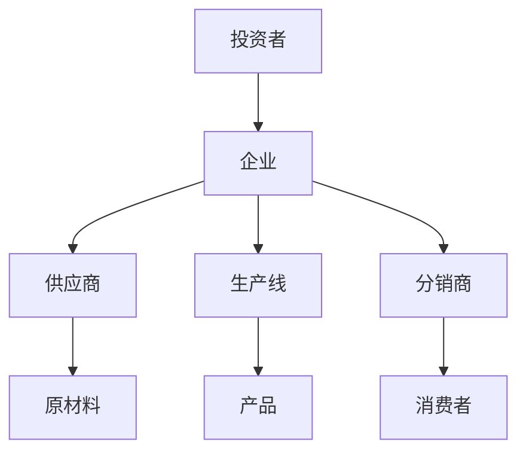

                 


# 价值投资中的可持续供应链管理分析

> 关键词：可持续供应链，价值投资，供应链优化，数学模型，系统架构，投资风险

> 摘要： 本文探讨了可持续供应链管理在价值投资中的重要性，分析了可持续供应链管理的核心概念、数学模型和系统架构设计，结合实际案例，展示了如何通过可持续供应链管理优化企业价值，降低投资风险，实现长期收益。

----------------------------------------------------------------

# 第一部分：可持续供应链管理基础

## 第1章：可持续供应链管理概述

### 1.1 可持续供应链管理的定义与核心要素

供应链管理是通过对采购、生产、物流、分销等环节的优化，实现企业资源的有效配置和成本最小化的管理过程。可持续供应链管理（Sustainable Supply Chain Management, SSCM）是在传统供应链管理的基础上，加入了可持续性原则，关注环境保护、社会责任和经济效益的平衡。

#### 1.1.1 供应链管理的基本概念

供应链管理（Supply Chain Management, SCM）是围绕企业与供应商、制造商、分销商、零售商和消费者之间的关系，通过协调和优化这些环节，实现资源的有效配置和成本最小化的过程。供应链管理的核心目标是提高效率、降低成本、提高客户满意度。

#### 1.1.2 可持续供应链管理的核心要素

可持续供应链管理是在传统供应链管理的基础上，加入了可持续性原则，关注环境保护、社会责任和经济效益的平衡。其核心要素包括：

1. **环境保护（Environmental）**：减少资源消耗、降低碳排放、减少 waste 产生。
2. **社会责任（Social）**：保障劳动者权益、避免童工、关注供应链中的伦理问题。
3. **经济效益（Economic）**：降低成本、提高效率、实现长期收益。

#### 1.1.3 可持续供应链管理的边界与外延

可持续供应链管理不仅关注企业内部的供应链优化，还包括从原材料采购到产品交付给最终消费者的整个链条。其外延包括：

1. **上游供应商**：原材料供应商、零部件供应商。
2. **下游客户**：分销商、零售商、消费者。
3. **中间环节**：物流、仓储、生产制造。

### 1.2 可持续供应链管理的背景与重要性

随着全球环保意识的增强和社会责任的提高，可持续供应链管理已经成为企业竞争力的重要组成部分。

#### 1.2.1 当前供应链管理面临的挑战

1. **资源短缺**：原材料价格上涨、资源枯竭。
2. **环境污染**：生产过程中的废气、废水、固体 waste 对环境造成污染。
3. **社会责任问题**：供应链中的童工、不公的劳工待遇。
4. **供应链风险**：自然灾害、疫情、地缘政治冲突等不可抗力因素对供应链的冲击。

#### 1.2.2 可持续供应链管理的全球趋势

1. **全球环保政策趋严**：各国政府出台环保法规，要求企业减少碳排放、降低资源消耗。
2. **消费者环保意识提高**：消费者越来越关注产品的环保属性，倾向于选择可持续品牌。
3. **企业社会责任（CSR）**：企业越来越重视供应链中的社会责任，避免因供应链问题引发的声誉风险。

#### 1.2.3 可持续供应链管理对企业价值的影响

1. **降低成本**：通过优化供应链流程、减少浪费、提高效率。
2. **提高品牌价值**：通过提供环保产品、履行社会责任，提升品牌形象。
3. **降低投资风险**：通过构建 resilient 供应链，减少因供应链中断带来的损失。

### 1.3 可持续供应链管理的核心概念与联系

可持续供应链管理的核心概念包括可持续性、供应链优化、企业价值最大化。

#### 1.3.1 可持续供应链管理的核心原理

可持续供应链管理通过优化供应链的各个环节，实现环境保护、社会责任和经济效益的平衡。

#### 1.3.2 可持续供应链管理的属性特征对比

| 特性          | 可持续供应链管理 | 传统供应链管理 |
|---------------|------------------|----------------|
| 环保要求      | 高              | 低或无         |
| 社会责任      | 高              | 低或无         |
| 经济效益      | 长期最大化      | 短期最大化      |
| 供应链透明度  | 高              | 低             |
| 供应链韧性     | 高              | 低             |

#### 1.3.3 可持续供应链管理的ER实体关系图

```mermaid
er
actor(投资者) -|> 企业: 投资
actor(消费者) -|> 产品: 购买
企业 -|> 供应商: 采购
企业 -|> 生产线: 生产
企业 -|> 分销商: 分销
```

## 第2章：价值投资与可持续供应链管理的关系

### 2.1 价值投资的基本概念

价值投资是一种投资策略，强调以低于内在价值的价格购买优质资产，通过长期持有实现收益。

#### 2.1.1 价值投资的定义

价值投资是通过分析企业的基本面，寻找那些市场价格低于其内在价值的股票进行投资。

#### 2.1.2 价值投资的核心理念

1. **安全边际**：购买价格低于内在价值。
2. **长期视角**：关注企业的长期盈利能力。
3. **优质企业**：选择具有强大竞争优势的企业。

#### 2.1.3 价值投资与企业可持续发展的联系

1. **企业价值的提升**：通过可持续供应链管理优化企业运营，提升企业价值。
2. **投资风险的降低**：企业通过可持续供应链管理降低运营风险，提高抗风险能力。
3. **长期收益的保障**：企业通过可持续供应链管理实现长期稳定的收益。

### 2.2 可持续供应链管理对价值投资的影响

#### 2.2.1 可持续供应链管理如何提升企业价值

1. **降低成本**：通过优化供应链流程、减少浪费。
2. **提高效率**：通过自动化、智能化技术提高供应链效率。
3. **提升品牌价值**：通过提供环保产品、履行社会责任，提升品牌形象。

#### 2.2.2 可持续供应链管理对投资风险的降低作用

1. **降低供应链中断风险**：通过构建 resilient 供应链，减少因自然灾害、疫情等不可抗力因素导致的供应链中断风险。
2. **降低社会责任风险**：通过避免供应链中的社会责任问题，减少因供应链问题引发的声誉风险。
3. **降低环境法规风险**：通过遵守环保法规，减少因环境问题引发的法律风险。

#### 2.2.3 投资者如何通过可持续供应链管理实现长期收益

1. **选择具有可持续供应链管理能力的企业**：这些企业具有更强的竞争力和抗风险能力。
2. **关注企业的可持续性指标**：如碳排放、资源消耗、社会责任等。
3. **长期持有优质企业股票**：通过长期持有，分享企业可持续发展的长期收益。

### 2.3 可持续供应链管理与价值投资的联系

可持续供应链管理通过优化企业运营，提升企业价值，降低投资风险，实现长期收益。这与价值投资的核心理念高度契合，即通过寻找具有长期竞争优势的企业，以低于内在价值的价格进行投资，实现长期收益。

## 第3章：可持续供应链管理的核心概念与联系

### 3.1 可持续供应链管理的核心原理

可持续供应链管理通过优化供应链的各个环节，实现环境保护、社会责任和经济效益的平衡。

#### 3.1.1 供应链的系统性分析

供应链是一个复杂的系统，包括供应商、制造商、分销商、零售商和消费者等环节。可持续供应链管理需要从整体系统出发，优化各个环节的协同合作。

#### 3.1.2 可持续性原则在供应链中的应用

1. **环境保护**：减少资源消耗、降低碳排放、减少 waste 产生。
2. **社会责任**：保障劳动者权益、避免童工、关注供应链中的伦理问题。
3. **经济效益**：降低成本、提高效率、实现长期收益。

#### 3.1.3 核心概念的数学模型与公式

可持续供应链管理可以通过数学模型来描述其目标和约束条件。例如，可以使用线性规划模型来描述如何在供应链中平衡成本和可持续性。

### 3.2 可持续供应链管理的属性特征对比

#### 3.2.1 可持续性与传统供应链的对比

通过对比可持续供应链管理与传统供应链管理的属性特征，可以看出可持续供应链管理在环保、社会责任等方面具有更高的要求。

#### 3.2.2 核心要素的特征分析

可持续供应链管理的核心要素包括环境保护、社会责任和经济效益。这些要素相互关联、相互促进，共同构成了可持续供应链管理的理论基础。

#### 3.2.3 属性特征对比表格

| 特性          | 可持续供应链管理 | 传统供应链管理 |
|---------------|------------------|----------------|
| 环保要求      | 高              | 低或无         |
| 社会责任      | 高              | 低或无         |
| 经济效益      | 长期最大化      | 短期最大化      |
| 供应链透明度  | 高              | 低             |
| 供应链韧性     | 高              | 低             |

### 3.3 可持续供应链管理的ER实体关系图

通过ER实体关系图，可以清晰地展示可持续供应链管理中各实体之间的关系。

```mermaid
er
actor(投资者) -|> 企业: 投资
actor(消费者) -|> 产品: 购买
企业 -|> 供应商: 采购
企业 -|> 生产线: 生产
企业 -|> 分销商: 分销
```

## 第4章：可持续供应链管理的数学模型与算法原理

### 4.1 可持续供应链管理的数学模型

可持续供应链管理可以通过数学模型来描述其目标和约束条件。例如，可以使用线性规划模型来描述如何在供应链中平衡成本和可持续性。

#### 4.1.1 可持续供应链管理的优化目标

1. **成本最小化**：通过优化供应链流程，降低成本。
2. **可持续性最大化**：通过减少资源消耗、降低碳排放等，实现可持续性最大化。

#### 4.1.2 可持续供应链管理的约束条件

1. **资源约束**：资源有限，不能超过资源上限。
2. **环保约束**：碳排放不能超过环保法规的要求。
3. **社会责任约束**：供应商必须符合社会责任要求。

#### 4.1.3 可持续供应链管理的线性规划模型

```latex
\text{目标函数：} \quad \min \sum_{i=1}^{n} c_i x_i + \sum_{j=1}^{m} d_j y_j
\text{约束条件：} \quad \sum_{i=1}^{n} a_i x_i + \sum_{j=1}^{m} b_j y_j \leq C
```

其中，\( x_i \) 和 \( y_j \) 分别表示不同供应链环节的决策变量，\( c_i \) 和 \( d_j \) 分别表示对应的成本，\( C \) 是资源约束。

### 4.2 可持续供应链管理的算法原理

可持续供应链管理的算法原理主要体现在如何优化供应链的各个环节，实现成本和可持续性的平衡。

#### 4.2.1 可持续供应链管理的算法流程

1. **问题建模**：将供应链问题转化为数学模型。
2. **求解算法**：使用线性规划、整数规划等算法求解模型。
3. **结果分析**：分析优化结果，指导企业优化供应链。

#### 4.2.2 可持续供应链管理的算法实现

以下是使用Python实现的线性规划模型：

```python
import numpy as np
from scipy.optimize import linprog

# 定义目标函数
c = np.array([1, 1, 1])

# 定义约束矩阵
A = np.array([[1, 0, 0], [0, 1, 0], [0, 0, 1]])
b = np.array([10, 20, 30])

# 定义变量范围
bounds = (0, None)

# 求解线性规划问题
result = linprog(c, A, b, bounds=bounds, method='highs')

# 输出结果
print(result)
```

### 4.3 可持续供应链管理的数学模型与算法的优势

通过数学模型和算法，可以量化供应链优化的效果，帮助企业在实现可持续性的同时，降低成本，提高效率。

## 第5章：可持续供应链管理的系统分析与架构设计

### 5.1 可持续供应链管理的系统分析

#### 5.1.1 问题场景介绍

以制造业为例，企业需要优化其供应链，以降低生产成本，减少资源消耗，提高效率。

#### 5.1.2 系统功能设计

1. **需求分析**：分析企业供应链中的问题和优化需求。
2. **系统设计**：设计可持续供应链管理的系统架构。
3. **系统实现**：实现系统的各个功能模块。
4. **系统测试**：测试系统功能，确保系统正常运行。

#### 5.1.3 系统架构设计

以下是可持续供应链管理系统的架构设计：



### 5.2 可持续供应链管理的系统架构设计

#### 5.2.1 系统架构图


#### 5.2.2 系统功能模块

1. **供应商管理模块**：管理供应商信息，评估供应商的可持续性。
2. **生产管理模块**：优化生产流程，降低资源消耗。
3. **分销管理模块**：优化分销网络，降低物流成本。
4. **数据分析模块**：分析供应链数据，提供决策支持。

#### 5.2.3 系统接口设计

1. **供应商接口**：与供应商进行信息交互，评估供应商的可持续性。
2. **生产接口**：优化生产流程，降低资源消耗。
3. **分销接口**：优化分销网络，降低物流成本。

### 5.3 可持续供应链管理的系统实现

#### 5.3.1 核心功能实现

以下是Python代码实现的可持续供应链管理系统的核心功能：

```python
# 供应商管理模块
class Supplier:
    def __init__(self, name, sustainability_score):
        self.name = name
        self.sustainability_score = sustainability_score

    def assess_sustainability(self):
        if self.sustainability_score >= 0.8:
            return "优秀"
        elif self.sustainability_score >= 0.6:
            return "良好"
        else:
            return "一般"

# 生产管理模块
class Production:
    def __init__(self, cost, resources):
        self.cost = cost
        self.resources = resources

    def optimize_production(self):
        # 假设资源约束为100，资源利用率为80%
        optimized_cost = self.cost * 0.8
        return optimized_cost

# 分销管理模块
class Distribution:
    def __init__(self, cost, logistics):
        self.cost = cost
        self.logistics = logistics

    def optimize_distribution(self):
        # 假设物流成本为原来的70%
        optimized_cost = self.cost * 0.7
        return optimized_cost

# 数据分析模块
class DataAnalysis:
    def __init__(self, data):
        self.data = data

    def analyze_data(self):
        # 假设数据分析模块用于预测供应链风险
        return "低风险"

# 系统实现
supplier = Supplier("Supplier A", 0.85)
production = Production(100, 1000)
distribution = Distribution(50, 200)
data_analysis = DataAnalysis("Low risk")

# 功能调用
print(supplier.assess_sustainability())  # 输出：优秀
print(production.optimize_production())  # 输出：80
print(distribution.optimize_distribution())  # 输出：35
print(data_analysis.analyze_data())  # 输出：Low risk
```

## 第6章：可持续供应链管理的项目实战

### 6.1 项目实战：制造业中的可持续供应链管理

#### 6.1.1 项目背景

某制造企业希望优化其供应链，降低成本，减少资源消耗，提高效率。

#### 6.1.2 项目需求分析

1. **降低生产成本**：优化生产流程，减少资源消耗。
2. **提高供应链透明度**：确保供应链中的供应商符合社会责任要求。
3. **降低物流成本**：优化分销网络，减少物流成本。

#### 6.1.3 项目系统设计

1. **供应商管理模块**：评估供应商的可持续性，选择符合社会责任要求的供应商。
2. **生产管理模块**：优化生产流程，降低资源消耗。
3. **分销管理模块**：优化分销网络，降低物流成本。

#### 6.1.4 项目实现

以下是Python代码实现的项目核心功能：

```python
# 供应商管理模块
class Supplier:
    def __init__(self, name, sustainability_score):
        self.name = name
        self.sustainability_score = sustainability_score

    def assess_sustainability(self):
        if self.sustainability_score >= 0.8:
            return "优秀"
        elif self.sustainability_score >= 0.6:
            return "良好"
        else:
            return "一般"

# 生产管理模块
class Production:
    def __init__(self, cost, resources):
        self.cost = cost
        self.resources = resources

    def optimize_production(self):
        # 假设资源约束为100，资源利用率为80%
        optimized_cost = self.cost * 0.8
        return optimized_cost

# 分销管理模块
class Distribution:
    def __init__(self, cost, logistics):
        self.cost = cost
        self.logistics = logistics

    def optimize_distribution(self):
        # 假设物流成本为原来的70%
        optimized_cost = self.cost * 0.7
        return optimized_cost

# 项目实现
supplier = Supplier("Supplier A", 0.85)
production = Production(100, 1000)
distribution = Distribution(50, 200)

# 功能调用
print(supplier.assess_sustainability())  # 输出：优秀
print(production.optimize_production())  # 输出：80
print(distribution.optimize_distribution())  # 输出：35
```

#### 6.1.5 项目小结

通过优化供应链的各个环节，企业可以降低成本，提高效率，实现可持续发展。

## 第7章：总结与展望

### 7.1 总结

本文探讨了可持续供应链管理在价值投资中的重要性，分析了可持续供应链管理的核心概念、数学模型和系统架构设计，结合实际案例，展示了如何通过可持续供应链管理优化企业价值，降低投资风险，实现长期收益。

### 7.2 展望

随着全球环保意识的增强和社会责任的提高，可持续供应链管理将成为企业竞争力的重要组成部分。未来，随着人工智能、大数据等技术的发展，可持续供应链管理将更加智能化、数字化，为企业创造更大的价值。

### 7.3 投资建议

1. **选择具有可持续供应链管理能力的企业**：这些企业具有更强的竞争力和抗风险能力。
2. **关注企业的可持续性指标**：如碳排放、资源消耗、社会责任等。
3. **长期持有优质企业股票**：通过长期持有，分享企业可持续发展的长期收益。

### 7.4 注意事项

1. **风险提示**：投资有风险，投资者需谨慎。
2. **合规性提示**：投资者需遵守相关法律法规。
3. **持续学习**：投资者需持续学习，跟上可持续供应链管理的发展趋势。

### 7.5 拓展阅读

1. **书籍推荐**：
   - 《供应链管理：原理与应用》
   - 《价值投资：巴菲特的成功之道》
2. **在线课程推荐**：
   - Coursera：《供应链管理基础》
   - edX：《可持续发展与供应链管理》
3. **行业报告推荐**：
   - 全球供应链管理报告
   - 可持续供应链管理白皮书

## 作者信息

作者：AI天才研究院/AI Genius Institute & 禅与计算机程序设计艺术 /Zen And The Art of Computer Programming

---

感谢您的阅读！希望本文能为您提供有价值的投资分析和实践指导！

