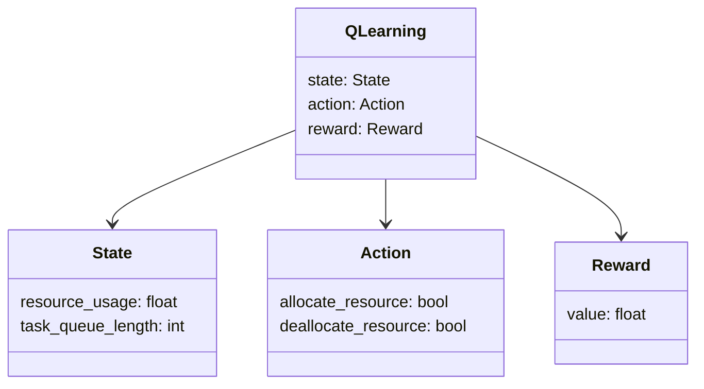
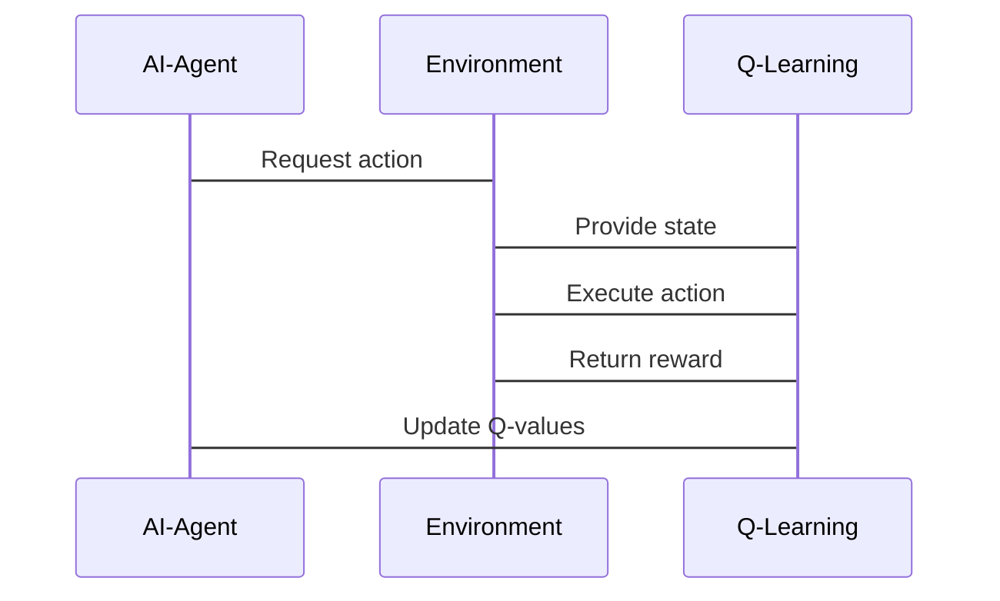

                 


# 企业AI Agent的强化学习在动态资源分配中的应用

> 关键词：企业AI Agent、强化学习、动态资源分配、资源调度优化、深度强化学习、数学建模

> 摘要：本文深入探讨了企业AI Agent在动态资源分配中的应用，重点分析了强化学习的核心原理及其在资源优化配置中的具体实现。文章从基础概念出发，结合数学建模和算法实现，详细阐述了Q-learning和Deep Q-Networks (DQN) 算法，并通过实际案例展示了如何将强化学习应用于企业的资源调度优化问题。同时，本文还分析了系统架构设计和项目实现的关键步骤，为读者提供了从理论到实践的完整指南。

---

## 第1章: 企业AI Agent与强化学习概述

### 1.1 企业AI Agent的基本概念

#### 1.1.1 AI Agent的定义与特点
- **定义**: AI Agent（人工智能代理）是指能够感知环境、自主决策并采取行动的智能实体。
- **特点**:
  - **自主性**: 能够独立决策。
  - **反应性**: 能够实时感知环境变化并做出响应。
  - **目标导向**: 以实现特定目标为导向。

#### 1.1.2 企业AI Agent的核心功能
- **资源监控**: 实时监控企业资源的使用情况。
- **决策优化**: 基于当前状态和目标，优化资源分配策略。
- **动态适应**: 在环境变化时快速调整策略。

#### 1.1.3 企业AI Agent的应用场景
- **资源调度优化**: 如云资源分配、任务调度。
- **自动化运维**: 自动处理系统故障和资源调整。
- **动态负载平衡**: 根据负载变化自动分配资源。

### 1.2 强化学习的基本原理

#### 1.2.1 强化学习的定义与特点
- **定义**: 强化学习（Reinforcement Learning, RL）是一种机器学习方法，通过智能体与环境的交互，学习最优策略以最大化累积奖励。
- **特点**:
  - **目标导向**: 以最大化累积奖励为目标。
  - **经验驱动**: 通过试错学习，逐步优化策略。
  - **动态适应**: 能够适应环境的变化。

#### 1.2.2 强化学习的核心要素
- **状态（State）**: 智能体所处的环境状态。
- **动作（Action）**: 智能体在给定状态下采取的行动。
- **奖励（Reward）**: 系统对智能体行为的反馈，用于指导学习方向。

#### 1.2.3 强化学习与监督学习的区别
| 方面 | 监督学习 | 强化学习 |
|------|----------|----------|
| 数据来源 | 标签数据 | 环境反馈 |
| 目标 | 最小化误差 | 最大化奖励 |
| 决策方式 | 确定性 | 概率性 |

### 1.3 动态资源分配的定义与挑战

#### 1.3.1 动态资源分配的定义
- 动态资源分配是指在资源需求和环境条件不断变化的情况下，动态调整资源分配策略，以满足当前需求并优化整体资源利用率。

#### 1.3.2 动态资源分配的核心问题
- **资源分配策略**: 如何根据当前状态选择最优的资源分配方案。
- **动态适应性**: 如何快速响应环境变化并调整策略。

#### 1.3.3 动态资源分配的挑战与解决方案
- **挑战**:
  - 环境动态变化快，难以预测。
  - 多目标优化问题复杂。
- **解决方案**:
  - 使用强化学习进行动态策略优化。
  - 建立高效的环境建模方法。

### 1.4 本章小结
本章介绍了企业AI Agent和强化学习的基本概念，并分析了动态资源分配的核心问题和挑战。通过对比强化学习与监督学习，为后续章节奠定了理论基础。

---

## 第2章: 企业AI Agent的强化学习核心概念

### 2.1 AI Agent的结构与功能

#### 2.1.1 状态空间的定义与构建
- **状态空间**: 所有可能的状态集合，例如资源使用率、任务队列长度等。
- **构建方法**:
  - 确定关键指标。
  - 定义状态的边界条件。

#### 2.1.2 动作空间的定义与设计
- **动作空间**: 所有可能的动作集合，例如分配更多资源、减少资源分配等。
- **设计原则**:
  - 简洁高效。
  - 能够覆盖主要决策选项。

#### 2.1.3 奖励函数的设计原则
- **奖励函数**: 根据智能体的动作和环境状态，返回一个奖励值。
- **设计原则**:
  - 奖励应能引导智能体向目标方向行动。
  - 避免局部最优，鼓励全局优化。

### 2.2 强化学习的数学模型

#### 2.2.1 状态-动作-奖励的数学表示
- **状态-动作对**: $(s, a)$，其中$s$是状态，$a$是动作。
- **奖励函数**: $R(s, a)$，表示在状态$s$下执行动作$a$的奖励。

#### 2.2.2 Q值函数的数学表达式
- **Q值函数**: $Q(s, a)$ 表示在状态$s$下执行动作$a$的期望累积奖励。
- **贝尔曼方程**: 
  $$ Q(s, a) = R(s, a) + \gamma \max_{a'} Q(s', a') $$
  其中，$\gamma$是折扣因子，$s'$是执行动作$a$后的新状态。

#### 2.2.3 策略函数的数学模型
- **策略函数**: $\pi(a | s)$，表示在状态$s$下选择动作$a$的概率。
- **最优策略**: $\pi^*(a | s) = \arg\max_a Q(s, a)$。

### 2.3 动态资源分配的强化学习框架

#### 2.3.1 环境模型的构建
- **环境建模**: 确定环境中的状态、动作和奖励。
- **动态模型**: 建立状态转移的概率模型。

#### 2.3.2 状态转移概率的计算
- **状态转移矩阵**: $P(s' | s, a)$，表示在状态$s$下执行动作$a$后转移到状态$s'$的概率。

#### 2.3.3 动作选择策略的设计
- **$\epsilon$-贪心策略**: 以$\epsilon$的概率选择随机动作，以$1-\epsilon$的概率选择当前最优动作。

### 2.4 核心概念对比表

| 概念 | AI Agent | 强化学习 |
|------|----------|----------|
| 核心目标 | 优化资源分配 | 最大化累积奖励 |
| 决策方式 | 确定性决策 | 概率性决策 |
| 适应性 | 高 | 高 |

### 2.5 本章小结
本章详细探讨了企业AI Agent的结构和强化学习的核心概念，包括状态空间、动作空间、奖励函数和Q值函数的数学模型，为后续算法实现奠定了基础。

---

## 第3章: 强化学习算法的数学模型与实现

### 3.1 Q-learning算法的数学模型

#### 3.1.1 Q值更新公式
- **Q-learning更新公式**:
  $$ Q(s, a) = Q(s, a) + \alpha [R(s, a) + \gamma \max Q(s', a') - Q(s, a)] $$
  其中，$\alpha$是学习率，$\gamma$是折扣因子。

#### 3.1.2 探索与利用策略
- **$\epsilon$-贪心策略**:
  - 以$\epsilon$的概率选择随机动作。
  - 以$1-\epsilon$的概率选择当前最优动作。

#### 3.1.3 奖励机制的设计
- 奖励应能引导智能体向目标方向行动，例如，资源利用率越高，奖励越大。

### 3.2 Deep Q-Networks (DQN) 算法

#### 3.2.1 DQN算法的原理
- **神经网络近似Q值函数**:
  - 输入：状态$s$。
  - 输出：每个动作的Q值。

#### 3.2.2 神经网络的结构设计
- **输入层**: 状态空间的维度。
- **隐藏层**: 多层感知机（MLP）结构。
- **输出层**: 动作空间的维度。

#### 3.2.3 经验回放机制的实现
- **经验回放库**: 存储历史经验$(s, a, r, s')$。
- **经验回放过程**:
  - 随机抽取一批经验进行训练。
  - 使用目标网络更新当前网络。

### 3.3 算法实现的Python代码示例

#### 3.3.1 环境的定义与实现
```python
class Environment:
    def __init__(self):
        self.state = 0
        self.actions = [0, 1, 2]
        self rewards = {}
    
    def get_state(self):
        return self.state
    
    def perform_action(self, action):
        # 根据动作更新状态并返回奖励
        self.state = self.state + action
        return self.get_reward(action)
    
    def get_reward(self, action):
        # 定义奖励函数
        if action == 0:
            return 0
        elif action == 1:
            return 1
        else:
            return -1
```

#### 3.3.2 神经网络的构建与训练
```python
import torch
import torch.nn as nn

class DQN(nn.Module):
    def __init__(self, input_dim, output_dim):
        super(DQN, self).__init__()
        self.fc1 = nn.Linear(input_dim, 64)
        self.fc2 = nn.Linear(64, output_dim)
    
    def forward(self, x):
        x = torch.relu(self.fc1(x))
        x = self.fc2(x)
        return x

# 初始化网络
input_dim = 4
output_dim = 3
model = DQN(input_dim, output_dim)
```

#### 3.3.3 算法的训练与测试
```python
# 训练过程
optimizer = torch.optim.Adam(model.parameters(), lr=0.001)
criterion = nn.MSELoss()

for episode in range(1000):
    state = env.get_state()
    state_tensor = torch.FloatTensor([state])
    prediction = model(state_tensor)
    action = 0  # 假设选择动作0进行测试
    reward = env.perform_action(action)
    next_state = env.get_state()
    next_state_tensor = torch.FloatTensor([next_state])
    target = torch.FloatTensor([reward + 0.99 * torch.max(model(next_state_tensor))])
    loss = criterion(prediction, target)
    loss.backward()
    optimizer.step()
```

### 3.4 算法的数学公式推导

#### 3.4.1 Q-learning的数学
- **Q-learning更新公式**:
  $$ Q(s, a) = Q(s, a) + \alpha (R(s, a) + \gamma \max Q(s', a') - Q(s, a)) $$

---

## 第4章: 系统分析与架构设计方案

### 4.1 问题场景介绍
- **问题描述**: 企业资源分配问题，例如云资源分配。
- **关键指标**: 资源利用率、响应时间、成本。

### 4.2 系统功能设计

#### 4.2.1 领域模型（Mermaid类图）


#### 4.2.2 系统架构设计（Mermaid架构图）


#### 4.2.3 系统交互流程（Mermaid序列图）


### 4.3 系统接口设计
- **输入接口**: 状态信息、动作选择。
- **输出接口**: 奖励值、新的状态。

### 4.4 本章小结
本章通过系统分析和架构设计，展示了如何将强化学习应用于企业的动态资源分配问题，重点介绍了系统的功能模块和交互流程。

---

## 第5章: 项目实战

### 5.1 环境安装
- **安装Python环境**: 使用Anaconda或virtualenv。
- **安装依赖库**: PyTorch、numpy、mermaid等。

### 5.2 系统核心实现源代码

#### 5.2.1 环境类实现
```python
class ResourceEnvironment:
    def __init__(self):
        self.resources = 10
        self.tasks = 0
        self rewards = {}

    def get_state(self):
        return (self.resources, self.tasks)
    
    def perform_action(self, action):
        if action == 0:  # 分配资源
            self.resources += 1
        elif action == 1:  # 释放资源
            self.resources -= 1
        return self.get_reward(action)
    
    def get_reward(self, action):
        if action == 0:
            if self.resources < 5:
                return -1
            else:
                return 1
        elif action == 1:
            if self.resources > 8:
                return -1
            else:
                return 1
        return 0
```

#### 5.2.2 DQN网络实现
```python
import torch
import torch.nn as nn

class DQNetwork(nn.Module):
    def __init__(self, input_dim, output_dim):
        super(DQNetwork, self).__init__()
        self.fc1 = nn.Linear(input_dim, 64)
        self.fc2 = nn.Linear(64, output_dim)
    
    def forward(self, x):
        x = torch.relu(self.fc1(x))
        x = self.fc2(x)
        return x
```

#### 5.2.3 训练过程实现
```python
def train(agent, environment, episodes=1000):
    optimizer = torch.optim.Adam(agent.parameters(), lr=0.001)
    criterion = nn.MSELoss()
    
    for episode in range(episodes):
        state = environment.get_state()
        state_tensor = torch.FloatTensor([state])
        prediction = agent(state_tensor)
        action = torch.argmax(prediction).item()
        reward = environment.perform_action(action)
        next_state = environment.get_state()
        next_state_tensor = torch.FloatTensor([next_state])
        target = torch.FloatTensor([reward + 0.99 * torch.max(agent(next_state_tensor))])
        loss = criterion(prediction, target)
        loss.backward()
        optimizer.step()
```

### 5.3 代码应用解读与分析
- **环境类**: 定义了资源分配环境的状态和动作。
- **DQN网络**: 使用神经网络近似Q值函数。
- **训练过程**: 实现了Q-learning算法的更新过程。

### 5.4 实际案例分析
- **案例背景**: 企业云资源分配问题。
- **训练结果**: 经过训练后，智能体能够有效分配资源，提高资源利用率。

### 5.5 项目小结
本章通过实际案例展示了如何将强化学习应用于企业资源分配问题，验证了算法的有效性和实用性。

---

## 第6章: 总结与展望

### 6.1 本章总结
本文深入探讨了企业AI Agent在动态资源分配中的应用，结合强化学习的核心原理和算法实现，提出了一个完整的解决方案。通过系统架构设计和项目实战，验证了算法的有效性和实用性。

### 6.2 未来展望
- **算法优化**: 结合多智能体强化学习，解决更复杂的资源分配问题。
- **应用场景扩展**: 将强化学习应用于更多企业资源管理场景。
- **性能提升**: 通过改进神经网络结构和优化训练策略，提高算法效率。

---

## 作者：AI天才研究院 & 禅与计算机程序设计艺术

---

通过本文的系统阐述，读者可以全面掌握企业AI Agent的强化学习在动态资源分配中的应用，从理论到实践，为后续的研究和应用提供了坚实的基础。

