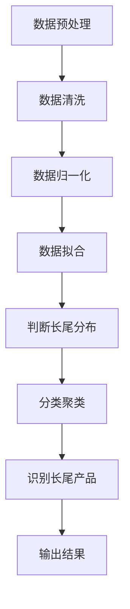

                 


# 如何识别企业的长尾效应优势

## 关键词：长尾效应, 企业优势, 数据分析, 商业模式, 竞争优势

## 摘要：  
长尾效应是一种在商业和数据分析中广泛存在的现象，指的是在某个领域中，虽然某个产品或服务的市场占有率较低，但由于其数量庞大，整体上能够为企业带来显著的收益。本文将从长尾效应的背景、核心概念、算法原理、系统设计、项目实战等方面，详细分析如何识别和利用企业的长尾效应优势，以提升企业的竞争力和市场份额。

---

## 第一部分: 长尾效应概述

### 第1章: 长尾效应的背景与定义

#### 1.1 长尾效应的起源与背景
- **1.1.1 长尾效应的起源**  
  长尾效应最早由美国经济学家Richard G. Tedlow提出，后来在互联网时代被广泛应用于电子商务和在线内容分发领域。长尾效应的核心思想是，虽然某个产品的市场占有率较低，但通过海量的数据和精准的定位，这些小众产品或服务的总收益可以与主流产品的收益相媲美甚至超越。

- **1.1.2 长尾效应在商业中的应用**  
  长尾效应在电子商务、媒体分发、软件开发等领域得到了广泛应用。例如，Netflix通过提供海量的长尾内容（如独立电影、小众电视剧）吸引了大量用户，形成了强大的竞争优势。

- **1.1.3 长尾效应的定义与特征**  
  长尾效应是指在某个市场中，虽然某个产品的市场占有率较低，但由于其数量庞大，整体上能够为企业带来显著的收益。其主要特征包括：  
  1. 小众化：每个产品的市场占有率低。  
  2. 海量化：产品或服务的数量庞大。  
  3. 差异化：每个产品或服务具有独特的市场定位。  

#### 1.2 长尾效应的核心概念
- **1.2.1 长尾效应的数学模型**  
  长尾效应可以用概率分布模型来描述，例如幂律分布（Pareto distribution）或对数正态分布（log-normal distribution）。  
  - 幂律分布公式：  
    $$ P(x) = C x^{-k} $$  
    其中，$C$ 是归一化常数，$k$ 是幂律指数。  
  - 对数正态分布公式：  
    $$ P(x) = \frac{1}{\sqrt{2\pi\sigma^2}x}e^{-\frac{(\ln x - \mu)^2}{2\sigma^2}} $$  
    其中，$\mu$ 是对数均值，$\sigma$ 是对数标准差。

- **1.2.2 长尾效应与企业竞争优势的关系**  
  长尾效应可以帮助企业通过精准定位小众市场，降低市场竞争压力，同时通过规模效应实现成本优势。例如，亚马逊通过提供海量的长尾商品，成功地从传统零售巨头中脱颖而出。

- **1.2.3 长尾效应的识别方法**  
  1. 数据分析法：通过数据分析工具（如Python的pandas库）对市场数据进行分析，识别出长尾产品的特征。  
  2. 市场调研法：通过市场调研了解小众市场的需求和偏好。  
  3. 竞争对手分析法：分析竞争对手的市场策略，识别出长尾产品的潜在机会。

#### 1.3 长尾效应的识别方法
- **1.3.1 数据分析法**  
  数据分析法是识别长尾效应的核心方法之一。通过收集和分析市场数据，可以识别出那些虽然市场占有率低，但具有高增长潜力的产品或服务。

- **1.3.2 市场调研法**  
  市场调研法通过问卷调查、访谈等方式，了解小众市场的用户需求和偏好，从而识别出长尾产品的潜在机会。

- **1.3.3 竞争对手分析法**  
  通过分析竞争对手的市场策略，识别出竞争对手忽视的小众市场，从而找到长尾产品的潜在机会。

---

## 第二部分: 长尾效应的核心概念与联系

### 第2章: 长尾效应的核心原理

#### 2.1 长尾效应的数学模型
- **2.1.1 长尾分布的数学表达**  
  长尾分布可以用幂律分布或对数正态分布来描述。通过分析市场数据的分布特征，可以识别出长尾效应的存在。

- **2.1.2 长尾效应的概率密度函数**  
  长尾分布的概率密度函数可以通过概率分布模型来描述。例如，幂律分布的概率密度函数为：  
  $$ P(x) = C x^{-k} $$  
  其中，$C$ 是归一化常数，$k$ 是幂律指数。

- **2.1.3 长尾效应的累积分布函数**  
  累积分布函数描述了概率密度函数的累积概率。例如，幂律分布的累积分布函数为：  
  $$ F(x) = 1 - (x/C)^{-k+1} $$  

#### 2.2 长尾效应与企业竞争优势的关系
- **2.2.1 长尾效应对企业利润的影响**  
  长尾效应可以帮助企业通过精准定位小众市场，降低市场竞争压力，从而提高利润率。

- **2.2.2 长尾效应与企业市场定位的关系**  
  长尾效应可以帮助企业通过差异化竞争策略，吸引小众市场的用户，从而在整体市场中占据更大的份额。

- **2.2.3 长尾效应与企业创新策略的结合**  
  长尾效应可以帮助企业通过创新的产品和服务，满足小众市场的需求，从而在市场竞争中占据优势。

#### 2.3 长尾效应的ER实体关系图
```mermaid
erDiagram
    customer[客户] {
        <属性>
        id : integer
        name : string
        purchase_history : string
    }
    product[产品] {
        <属性>
        id : int
        name : string
        category : string
        sales_volume : integer
    }
    market[市场] {
        <属性>
        id : integer
        name : string
        competitors : string
    }
    competition[竞争] {
        <属性>
        id : integer
        competitor_name : string
        market_share : float
    }
    preference[偏好] {
        <属性>
        id : integer
        customer_id : integer
        product_id : integer
        preference_score : float
    }
    sales[销售] {
        <属性>
        id : integer
        product_id : integer
        sales_volume : integer
        revenue : float
    }
    analysis[分析] {
        <属性>
        id : integer
        product_id : integer
        market_position : string
        growth_potential : float
    }
```

---

## 第三部分: 长尾效应的算法原理

### 第3章: 长尾效应的算法原理

#### 3.1 长尾效应的识别算法
- **3.1.1 数据预处理**  
  通过清洗和归一化处理，确保数据的准确性和一致性。例如，使用Python的pandas库对数据进行清洗和归一化处理。

- **3.1.2 长尾分布的识别**  
  通过概率分布模型（如幂律分布）来识别长尾分布的存在。例如，使用Python的scipy库对数据进行拟合，判断数据是否符合长尾分布。

- **3.1.3 长尾效应的识别与分类**  
  通过聚类分析（如K-means算法）对产品或服务进行分类，识别出长尾产品或服务。例如，使用Python的scikit-learn库进行聚类分析。

#### 3.2 长尾效应的算法流程图


#### 3.3 长尾效应的Python实现
- **3.3.1 数据预处理**  
  ```python
  import pandas as pd
  data = pd.read_csv('market_data.csv')
  data_cleaned = data.dropna()
  data_normalized = (data_cleaned - data_cleaned.mean()) / data_cleaned.std()
  ```

- **3.3.2 长尾分布的识别**  
  ```python
  from scipy.stats import pareto
  import numpy as np

  params = pareto.fit(data_normalized)
  x = np.linspace(data_normalized.min(), data_normalized.max(), 100)
  pdf = pareto.pdf(x, *params)
  ```

- **3.3.3 长尾效应的分类与聚类**  
  ```python
  from sklearn.cluster import KMeans

  kmeans = KMeans(n_clusters=3, random_state=0)
  kmeans.fit(data_normalized)
  labels = kmeans.labels_
  ```

---

## 第四部分: 长尾效应的系统分析与架构设计

### 第4章: 长尾效应的系统分析与架构设计

#### 4.1 系统功能设计
- **4.1.1 系统功能模块**  
  1. 数据采集模块：负责采集市场数据。  
  2. 数据处理模块：负责清洗和归一化处理数据。  
  3. 分析模块：负责识别长尾分布和分类聚类。  
  4. 可视化模块：负责展示分析结果。  

- **4.1.2 系统功能流程图**  
  ```mermaid
  graph TD
    A[数据采集] --> B[数据清洗]
    B --> C[数据归一化]
    C --> D[数据分析]
    D --> E[分类聚类]
    E --> F[结果可视化]
  ```

#### 4.2 系统架构设计
- **4.2.1 系统架构图**  
  ```mermaid
  rectangle 数据采集 {
      属性：市场数据
  }
  rectangle 数据处理 {
      属性：清洗、归一化
  }
  rectangle 数据分析 {
      属性：识别长尾分布、分类聚类
  }
  rectangle 结果可视化 {
      属性：展示分析结果
  }
  数据采集 --> 数据处理
  数据处理 --> 数据分析
  数据分析 --> 结果可视化
  ```

- **4.2.2 系统接口设计**  
  1. 数据采集接口：负责从数据库或API中采集市场数据。  
  2. 数据处理接口：负责清洗和归一化处理数据。  
  3. 数据分析接口：负责识别长尾分布和分类聚类。  
  4. 结果可视化接口：负责展示分析结果。  

- **4.2.3 系统交互流程图**  
  ```mermaid
  sequenceDiagram
    User -> 数据采集模块: 请求数据采集
    数据采集模块 --> 数据处理模块: 传输数据
    数据处理模块 --> 数据分析模块: 传输处理后的数据
    数据分析模块 --> 结果可视化模块: 传输分析结果
    结果可视化模块 -> User: 展示分析结果
  ```

---

## 第五部分: 长尾效应的项目实战

### 第5章: 长尾效应的项目实战

#### 5.1 环境安装
- **5.1.1 安装Python**  
  下载并安装Python 3.9及以上版本。

- **5.1.2 安装依赖库**  
  ```bash
  pip install pandas scikit-learn scipy matplotlib
  ```

#### 5.2 系统核心实现
- **5.2.1 数据采集**  
  ```python
  import pandas as pd
  data = pd.read_csv('market_data.csv')
  ```

- **5.2.2 数据处理**  
  ```python
  data_cleaned = data.dropna()
  data_normalized = (data_cleaned - data_cleaned.mean()) / data_cleaned.std()
  ```

- **5.2.3 数据分析与分类聚类**  
  ```python
  from sklearn.cluster import KMeans

  kmeans = KMeans(n_clusters=3, random_state=0)
  kmeans.fit(data_normalized)
  labels = kmeans.labels_
  ```

- **5.2.4 结果可视化**  
  ```python
  import matplotlib.pyplot as plt

  plt.scatter(data_normalized[:, 0], data_normalized[:, 1], c=labels)
  plt.xlabel('特征1')
  plt.ylabel('特征2')
  plt.show()
  ```

#### 5.3 案例分析与代码解读
- **5.3.1 案例分析**  
  以某个电子商务平台为例，通过数据分析和分类聚类，识别出长尾产品或服务。

- **5.3.2 代码解读**  
  - 数据采集：从数据库或API中采集市场数据。  
  - 数据处理：对数据进行清洗和归一化处理。  
  - 数据分析：使用K-means算法对数据进行分类聚类，识别出长尾产品或服务。  
  - 结果可视化：通过散点图展示分析结果。

#### 5.4 项目小结
通过本项目，读者可以掌握长尾效应的识别方法，并能够在实际项目中应用这些方法，提升企业的竞争力和市场份额。

---

## 第六部分: 长尾效应的最佳实践

### 第6章: 长尾效应的最佳实践

#### 6.1 最佳实践
- **6.1.1 数据分析的准确性**  
  确保数据的准确性和完整性，避免因数据问题导致分析结果偏差。

- **6.1.2 算法的适用性**  
  根据实际需求选择合适的算法，避免盲目使用复杂的算法。

- **6.1.3 结果的可视化**  
  通过直观的可视化工具，帮助用户更好地理解和应用分析结果。

#### 6.2 小结
通过本文的分析和实践，读者可以全面理解长尾效应的识别方法，并能够在实际项目中应用这些方法，提升企业的竞争力和市场份额。

#### 6.3 注意事项
- 避免过度依赖长尾效应，忽略主流市场的潜力。  
- 在实际应用中，结合企业的实际情况，灵活调整分析策略。  
- 定期更新和优化分析模型，确保分析结果的准确性。

#### 6.4 拓展阅读
- 《长尾理论》（The Long Tail）——Chris Anderson  
- 《数据分析实战》——Wes McKinney  
- 《机器学习实战》——Aurélien Géron

---

## 作者：AI天才研究院/AI Genius Institute & 禅与计算机程序设计艺术/Zen And The Art of Computer Programming

---

通过本文的系统分析和实际案例，读者可以全面理解长尾效应的识别方法，并能够在实际项目中应用这些方法，提升企业的竞争力和市场份额。希望本文能够为读者在识别和利用企业的长尾效应优势方面提供有价值的参考和指导。

