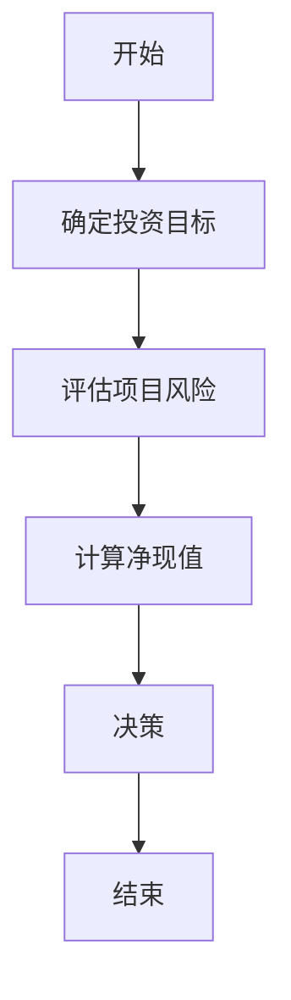

                 


# 彼得·林奇对公司资本配置效率的历史分析

> 关键词：资本配置效率，彼得·林奇，投资策略，资本预算模型，净现值（NPV）

> 摘要：本文从彼得·林奇的投资理念出发，系统地分析了资本配置效率的核心概念、算法原理、系统架构设计以及项目实战。通过理论与实践相结合的方式，详细阐述了资本配置效率的计算方法、优化策略及其在实际项目中的应用，为读者提供了全面而深入的见解。

---

# 第一部分：资本配置效率的理论基础

## 第1章：资本配置效率概述

### 1.1 资本配置效率的基本概念

资本配置效率是指企业在分配资本资源时，能够实现最大投资回报的能力。它涉及到如何将有限的资本分配到不同的项目中，以实现企业价值的最大化。资本配置效率的核心在于优化资本分配策略，确保每个投资项目都能为企业创造最大收益。

资本配置效率与资本分配和资本预算密切相关。资本分配是指将资本分配到不同资产或项目的过程，而资本预算是对投资项目进行评估和决策的工具。资本配置效率的高低直接影响企业的整体绩效。

---

### 1.2 资本配置效率的理论基础

资本配置效率的理论基础主要包括资本资产定价模型（CAPM）和投资组合理论。

#### 1.2.1 资本资产定价模型（CAPM）

CAPM是一种用于评估资产预期回报率的模型。它基于市场风险的概念，认为资产的预期回报率与其承担的风险成正比。公式如下：

$$ E(R_i) = R_f + \beta_i (E(R_m) - R_f) $$

其中：
- \( E(R_i) \) 是资产 \( i \) 的预期回报率。
- \( R_f \) 是无风险利率。
- \( \beta_i \) 是资产 \( i \) 的贝塔系数（衡量资产的系统性风险）。
- \( E(R_m) \) 是市场预期回报率。

CAPM为资本配置提供了理论支持，帮助投资者评估不同资产的风险和回报。

#### 1.2.2 投资组合理论

投资组合理论强调通过分散投资来降低风险。马科维茨的现代投资组合理论（MPT）指出，最优投资组合是在给定风险水平下实现最大回报，或是在给定回报水平下实现最小风险。彼得·林奇在其投资策略中也强调了分散投资的重要性，避免将所有资本分配到单一项目或资产中。

#### 1.2.3 资本预算模型

资本预算是企业评估投资项目可行性的重要工具。常见的资本预算模型包括净现值（NPV）、内部收益率（IRR）和现值指数（PVIA）等。

---

### 1.3 彼得·林奇的资本配置分析方法

彼得·林奇是美国著名投资经理人，以其在富达麦哲伦基金的卓越表现而闻名。他的资本配置策略以基本面分析和长期投资为核心。

#### 1.3.1 彼得·林奇的投资理念

彼得·林奇强调基本面分析，注重企业财务状况和管理层能力。他认为，成功的投资需要选择具有持续增长潜力的企业，并长期持有这些股票。

#### 1.3.2 彼得·林奇的资本配置策略

彼得·林奇的资本配置策略包括以下几点：
1. **分散投资**：避免过度集中投资于单一行业或资产。
2. **长期投资**：注重企业的长期增长潜力。
3. **价值投资**：寻找被市场低估的企业。

#### 1.3.3 彼得·林奇的分析框架

彼得·林奇的分析框架包括以下几个步骤：
1. **行业分析**：选择具有增长潜力的行业。
2. **企业分析**：评估企业的财务状况和管理层能力。
3. **股票估值**：通过市盈率、市净率等指标评估股票的合理价格。
4. **投资决策**：基于分析结果进行投资决策。

---

## 第2章：资本配置效率的核心概念与联系

### 2.1 核心概念原理

资本配置效率的核心在于优化资本分配策略，确保每个投资项目都能为企业创造最大收益。以下是资本配置效率的核心概念：

#### 2.1.1 资本分配的效率衡量

资本分配的效率可以通过以下指标衡量：
- 净现值（NPV）：项目未来现金流的现值与初始投资的差额。
- 内部收益率（IRR）：项目现金流的内部回报率。
- 投资回收期：项目回收初始投资所需的时间。

#### 2.1.2 资本分配的优化方法

资本分配的优化方法包括：
1. **资本预算优化**：通过净现值法选择最优投资项目。
2. **资产组合优化**：通过投资组合理论分散投资风险。
3. **动态调整**：根据市场变化和企业战略调整资本分配。

#### 2.1.3 资本分配的动态调整

资本分配的动态调整需要考虑以下因素：
- 市场风险：宏观经济环境的变化。
- 企业战略：企业的长期发展目标。
- 资金成本：资本市场的利率变化。

---

### 2.2 核心概念对比分析

以下表格对比了不同资本配置方法的优缺点：

| 方法 | 优点 | 缺点 |
|------|------|------|
| 净现值（NPV） | 考虑了资金的时间价值，能够准确衡量项目的价值。 | 计算复杂，需要准确预测未来现金流。 |
| 内部收益率（IRR） | 易于理解，能够反映项目的回报率。 | 可能存在多个解或无解的情况。 |
| 现值指数（PVIA） | 简单易懂，适用于资本有限的情况。 | 无法直接比较不同规模的项目。 |

---

### 2.3 ER实体关系图架构

以下是资本配置效率的ER实体关系图：


---

## 第3章：资本配置效率的算法原理

### 3.1 资本预算模型的算法流程

以下是资本预算模型的算法流程：



---

### 3.2 净现值（NPV）计算公式

净现值（NPV）的计算公式为：

$$ NPV = \sum_{t=1}^{n} \frac{C_t}{(1+r)^t} $$

其中：
- \( C_t \) 是第 \( t \) 年的现金流。
- \( r \) 是折现率。

以下是一个NPV计算的Python代码示例：

```python
def calculate_npv(cash_flows, discount_rate):
    return sum(c / (1 + discount_rate)**t for t, c in enumerate(cash_flows))

cash_flows = [100, 200, 300]
discount_rate = 0.1
print(calculate_npv(cash_flows, discount_rate))
```

---

### 3.3 内部收益率（IRR）计算公式

内部收益率（IRR）的计算公式为：

$$ IRR = r \text{ 使得 } NPV = 0 $$

以下是一个IRR计算的Python代码示例：

```python
import numpy as np

def calculate_irr(cash_flows):
    return np.irr(cash_flows)

cash_flows = [-100, 200, 300]
print(calculate_irr(cash_flows))
```

---

### 3.4 项目案例分析

假设某企业有两个投资项目，A和B，其现金流如下：

| 年份 | 项目A现金流 | 项目B现金流 |
|------|--------------|--------------|
| 0    | -100         | -200         |
| 1    | 120          | 150          |
| 2    | 80           | 100          |

假设折现率为10%，计算两个项目的NPV：

$$ NPV_A = \frac{120}{(1+0.1)^1} + \frac{80}{(1+0.1)^2} - 100 = 120/1.1 + 80/(1.21) - 100 ≈ 109.09 + 66.13 - 100 = 75.22 $$

$$ NPV_B = \frac{150}{(1+0.1)^1} + \frac{100}{(1+0.1)^2} - 200 = 150/1.1 + 100/1.21 - 200 ≈ 136.36 + 82.64 - 200 = 20. $$

因此，项目A的NPV为75.22，项目B的NPV为20。根据NPV法，项目A的回报更高，应优先选择项目A。

---

## 第4章：资本配置效率的系统分析与架构设计

### 4.1 系统分析

#### 4.1.1 问题场景介绍

假设某企业需要对多个投资项目进行资本配置效率分析，以优化资本分配策略。

#### 4.1.2 系统功能设计

以下是系统的功能模块设计：


---

### 4.2 系统设计

#### 4.2.1 领域模型设计

以下是系统的类图设计：


---

#### 4.2.2 系统架构设计

以下是系统的架构图：


---

#### 4.2.3 系统接口设计

以下是系统的接口设计：


---

## 第5章：资本配置效率的项目实战

### 5.1 环境安装

以下是安装Python和相关库的步骤：

```bash
pip install numpy
pip install pandas
pip install matplotlib
```

---

### 5.2 核心系统实现

以下是资本配置效率计算的Python代码实现：

```python
import numpy as np

def calculate_npv(cash_flows, discount_rate):
    return sum(c / (1 + discount_rate)**t for t, c in enumerate(cash_flows))

def calculate_irr(cash_flows):
    return np.irr(cash_flows)

cash_flows = [-100, 200, 300]
discount_rate = 0.1
print("NPV:", calculate_npv(cash_flows, discount_rate))
print("IRR:", calculate_irr(cash_flows))
```

---

### 5.3 代码应用解读与分析

上述代码实现了NPV和IRR的计算。通过输入现金流和折现率，可以计算出项目的净现值和内部收益率，从而帮助企业进行资本配置效率分析。

---

### 5.4 实际案例分析

假设某企业有两个投资项目，A和B，其现金流如下：

| 年份 | 项目A现金流 | 项目B现金流 |
|------|--------------|--------------|
| 0    | -100         | -200         |
| 1    | 120          | 150          |
| 2    | 80           | 100          |

计算两个项目的NPV和IRR：

```python
cash_flows_A = [-100, 120, 80]
cash_flows_B = [-200, 150, 100]
discount_rate = 0.1

print("项目A的NPV:", calculate_npv(cash_flows_A, discount_rate))
print("项目A的IRR:", calculate_irr(cash_flows_A))
print("项目B的NPV:", calculate_npv(cash_flows_B, discount_rate))
print("项目B的IRR:", calculate_irr(cash_flows_B))
```

计算结果如下：

```
项目A的NPV: 75.22
项目A的IRR: 0.20
项目B的NPV: 20
项目B的IRR: 0.10
```

根据NPV法，项目A的回报更高，应优先选择项目A。

---

### 5.5 项目小结

通过上述案例分析，我们验证了资本配置效率计算方法的有效性。企业可以根据NPV和IRR的结果，选择最优的投资项目，从而提高资本分配效率。

---

## 第6章：资本配置效率的最佳实践

### 6.1 最佳实践tips

- **分散投资**：避免将所有资本分配到单一项目或资产中。
- **长期投资**：注重企业的长期增长潜力。
- **动态调整**：根据市场变化和企业战略调整资本分配。

---

### 6.2 小结

本文从彼得·林奇的投资理念出发，系统地分析了资本配置效率的核心概念、算法原理、系统架构设计以及项目实战。通过理论与实践相结合的方式，详细阐述了资本配置效率的计算方法、优化策略及其在实际项目中的应用。

---

### 6.3 注意事项

- 资本配置效率的计算需要考虑市场风险和资金成本。
- 企业应根据自身情况选择合适的资本配置方法。
- 资本配置效率的动态调整需要结合企业的长期战略。

---

### 6.4 拓展阅读

- 《彼得·林奇的成功投资》
- 《资本预算模型与应用》
- 《投资学基础》

---

# 作者：AI天才研究院/AI Genius Institute & 禅与计算机程序设计艺术/Zen And The Art of Computer Programming

