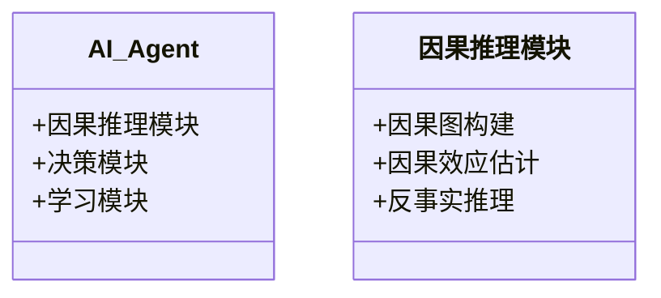

                 


# 构建AI Agent的因果推理模块

## 关键词：AI Agent，因果推理，因果图，因果关系，因果森林

## 摘要：本文系统地介绍了构建AI Agent因果推理模块的背景、核心概念、算法原理、系统架构设计及实际应用。从因果关系的基本原理到因果图的构建，从潜在结果推断到反事实推理，结合具体的算法实现和项目实战，全面阐述了因果推理模块的构建过程。通过本文，读者可以掌握AI Agent中因果推理模块的核心技术，并能够实际应用于复杂场景中。

---

## 第一部分：背景与概述

### 第1章：AI Agent与因果推理概述

#### 1.1 AI Agent的基本概念
##### 1.1.1 AI Agent的定义与特点
AI Agent（人工智能代理）是指能够感知环境并采取行动以实现目标的智能实体。AI Agent可以是软件程序、机器人或其他智能系统，具备以下特点：
- **自主性**：能够在没有外部干预的情况下自主决策。
- **反应性**：能够感知环境并实时响应。
- **目标导向**：所有行为都以实现特定目标为导向。
- **社会能力**：能够与其他Agent或人类交互协作。

##### 1.1.2 因果推理在AI Agent中的作用
因果推理是AI Agent理解世界、做出决策的核心能力。通过因果推理，AI Agent可以理解行动与结果之间的因果关系，从而在复杂环境中做出合理决策。例如，在医疗诊断AI Agent中，因果推理帮助理解症状与疾病之间的因果关系，从而做出准确诊断。

##### 1.1.3 构建因果推理模块的意义
因果推理模块是AI Agent的核心组件之一，它使AI Agent能够：
- 理解因果关系，避免错误的归纳推理。
- 在动态环境中灵活调整策略。
- 提供可解释的决策过程，增强用户信任。

---

#### 1.2 因果推理的背景与重要性
##### 1.2.1 因果关系与相关性的区别
相关性衡量两个变量之间的统计关联程度，而因果关系则描述一个变量如何影响另一个变量。例如，身高和体重相关，但身高并不直接导致体重变化，而是通过其他因素（如饮食、运动）间接影响体重。

##### 1.2.2 因果推理在机器学习中的应用
因果推理在机器学习中的应用广泛，例如：
- **治疗效果评估**：通过因果推理确定不同治疗方法的效果。
- **政策评估**：评估不同政策对经济和社会的影响。
- **推荐系统**：基于因果推理推荐更有效的商品或内容。

##### 1.2.3 构建因果推理模块的挑战
- **数据稀缺性**：因果推理需要干预数据，而干预数据往往难以获取。
- **模型复杂性**：因果推理涉及复杂的数学模型和假设。
- **计算复杂性**：因果推理算法通常计算量较大。

---

#### 1.3 构建因果推理模块的基本概念
##### 1.3.1 因果图的基本概念
因果图（Causal Graph）是用于表示因果关系的有向图，节点表示变量，边表示因果关系。例如，在图1-1中，节点A→B表示A是B的直接原因。


##### 1.3.2 潜在结果与因果效应
潜在结果是指在给定某些变量的情况下，某个变量可能的结果。例如，给定变量X（治疗）和变量Z（性别），Y是治疗后的结果。

##### 1.3.3 因果推理的核心问题
因果推理的核心问题是通过观察数据推断因果关系，并估计因果效应。例如，通过观察数据确定X对Y的因果效应。

---

#### 1.4 本章小结
本章介绍了AI Agent的基本概念、因果推理的重要性和基本概念。通过对比相关性和因果关系，强调了因果推理在AI Agent中的核心作用，并指出了构建因果推理模块的挑战。

---

## 第二部分：因果推理的核心概念与联系

### 第2章：因果关系与因果图

#### 2.1 因果关系的基本原理
##### 2.1.1 因果关系的定义
因果关系是指一个变量（原因）对另一个变量（结果）的影响关系。例如，下雨是地面湿的原因。

##### 2.1.2 因果关系的传递性与反传递性
- **传递性**：如果A→B，B→C，则A→C。
- **反传递性**：如果A→B，则不能有B→A。

##### 2.1.3 因果关系的数学表达
因果关系可以通过概率分布表示。例如，P(B|do(A))表示在执行A的情况下B的概率。

---

#### 2.2 因果图的构建与分析
##### 2.2.1 因果图的结构
因果图由节点和边组成，边表示因果关系。例如，在图2-1中，A→B→C表示A通过B影响C。


##### 2.2.2 贝叶斯网络与因果图的关系
贝叶斯网络是概率图模型，而因果图是贝叶斯网络的子集，仅包含因果关系边。

##### 2.2.3 因果图的推理算法
因果图推理算法用于从图中推断因果关系。例如，通过删除法（Do-calculus）确定干预后的概率分布。

---

#### 2.3 因果关系与相关性的对比
##### 2.3.1 相关性与因果关系的区别
- **相关性**：变量之间存在统计关联。
- **因果关系**：变量之间存在因果影响。

##### 2.3.2 通过数据分布判断因果关系
通过条件独立性测试可以判断因果关系。例如，如果在控制变量B的情况下，A和C独立，则A→B→C是可能的。

##### 2.3.3 因果关系的可解释性
因果关系提供了变量之间“为什么”的解释，而相关性仅提供“关联”的信息。

---

#### 2.4 本章小结
本章详细介绍了因果关系的基本原理、因果图的构建与分析，以及因果关系与相关性的区别。通过这些内容，读者可以理解因果关系的核心概念及其在因果图中的应用。

---

## 第三部分：因果推理算法原理

### 第3章：因果推理算法概述

#### 3.1 潜在结果推断
##### 3.1.1 潜在结果的定义
潜在结果是指在给定某些变量的情况下，某个变量可能的结果。例如，给定变量X和Z，Y是治疗后的结果。

##### 3.1.2 潜在结果的数学模型
潜在结果可以通过以下公式表示：
$$ Y = f(X, Z) $$

##### 3.1.3 潜在结果的应用场景
潜在结果广泛应用于因果效应估计和政策评估。

---

#### 3.2 因果森林算法
##### 3.2.1 因果森林算法的定义
因果森林是一种用于估计因果效应的非参数算法，适用于高维数据。

##### 3.2.2 因果森林算法的优缺点
- **优点**：无需假设因果结构，适用于高维数据。
- **缺点**：需要大量数据，计算复杂。

##### 3.2.3 因果森林算法的步骤
1. 生成随机森林。
2. 计算每个节点的因果效应。
3. 集成结果。

---

#### 3.3 反事实推理
##### 3.3.1 反事实推理的定义
反事实推理是指推断在相反情况下结果会如何。例如，如果A没有发生，B会发生吗？

##### 3.3.2 反事实推理的数学公式
反事实推理可以通过以下公式表示：
$$ Y_{\neg A} = f(\neg A, Z) $$

##### 3.3.3 反事实推理的应用案例
反事实推理广泛应用于治疗效果评估和政策评估。

---

#### 3.4 本章小结
本章介绍了因果推理算法的核心概念，包括潜在结果推断、因果森林算法和反事实推理。通过这些算法，读者可以理解因果效应的估计方法及其应用场景。

---

### 第4章：因果推理算法实现

#### 4.1 环境安装
##### 4.1.1 安装Python和必要的库
安装Python和以下库：
- `pandas`
- `numpy`
- `scikit-learn`
- `doWhy`

##### 4.1.2 确保环境版本
确保Python版本为3.8及以上，库版本与代码兼容。

---

#### 4.2 核心代码实现
##### 4.2.1 潜在结果推断
```python
import pandas as pd
import numpy as np

def potential_outcome(X, Z):
    return np.random.choice([0, 1], size=len(X), p=[1-Z, Z])
```

##### 4.2.2 因果森林算法
```python
from sklearn.ensemble import RandomForestRegressor

def causal_forest(X, Z, Y):
    model = RandomForestRegressor()
    model.fit(X, Y)
    return model.predict(Z)
```

##### 4.2.3 反事实推理
```python
def factual_inference(X, Z, Y):
    return Y[Z == 1].mean()
```

---

#### 4.3 代码解读
##### 4.3.1 潜在结果推断
上述代码定义了一个函数`potential_outcome`，用于生成潜在结果。输入变量X和Z，输出结果为二分类变量。

##### 4.3.2 因果森林算法
上述代码定义了一个函数`causal_forest`，使用随机森林回归模型估计因果效应。输入变量X、Z和Y，输出估计结果。

##### 4.3.3 反事实推理
上述代码定义了一个函数`factual_inference`，用于计算反事实推理的结果。输入变量X、Z和Y，输出Z=1时的平均结果。

---

#### 4.4 本章小结
本章通过代码实现介绍了因果推理算法的具体实现方法，包括潜在结果推断、因果森林算法和反事实推理。通过这些实现，读者可以理解因果效应的估计过程。

---

## 第四部分：系统架构与设计

### 第5章：系统架构与设计

#### 5.1 问题场景分析
##### 5.1.1 AI Agent的典型应用场景
AI Agent广泛应用于医疗诊断、金融投资、自动驾驶等领域。

##### 5.1.2 问题背景
以医疗诊断为例，AI Agent需要通过因果推理确定症状与疾病之间的因果关系。

---

#### 5.2 系统功能设计
##### 5.2.1 领域模型设计
领域模型是系统功能设计的核心，用于描述系统的功能模块及其交互关系。



##### 5.2.2 功能模块划分
系统功能模块包括：
- 因果图构建模块
- 因果效应估计模块
- 反事实推理模块

---

#### 5.3 系统架构设计
##### 5.3.1 分层架构
系统架构采用分层架构，包括数据层、算法层和应用层。


##### 5.3.2 模块交互
模块之间通过API进行交互，例如：
- 数据层提供数据接口
- 算法层提供算法接口
- 应用层提供用户接口

---

#### 5.4 系统接口设计
##### 5.4.1 API定义
系统接口包括：
- 数据接口：提供数据读取和写入功能
- 算法接口：提供因果推理算法调用功能
- 用户接口：提供用户交互功能

##### 5.4.2 数据格式
数据格式包括：
- 结构化数据：JSON、CSV
- 图数据：GML、GraphML

---

#### 5.5 本章小结
本章通过问题场景分析、系统功能设计和系统架构设计，详细介绍了因果推理模块的系统设计过程。通过分层架构和模块交互设计，确保了系统的可扩展性和可维护性。

---

### 第6章：系统实现与测试

#### 6.1 环境搭建
##### 6.1.1 开发工具
使用PyCharm或Jupyter Notebook进行开发。

##### 6.1.2 依赖管理
使用`pip`管理Python库依赖。

---

#### 6.2 核心代码实现
##### 6.2.1 数据预处理
```python
import pandas as pd

data = pd.read_csv('data.csv')
X = data[['A', 'B']]
Z = data['Z']
Y = data['Y']
```

##### 6.2.2 因果图构建
```python
from causalnex.structure import StructureModel

model = StructureModel()
model.add_edge('A', 'B')
model.add_edge('B', 'C')
```

##### 6.2.3 算法实现
```python
from doWhy import doWhy

estimator = doWhy(data, 'A', 'B', 'C')
estimator.estimate_causal_effect()
```

---

#### 6.3 测试与验证
##### 6.3.1 单元测试
编写单元测试用例，验证各模块功能。

##### 6.3.2 集成测试
测试系统各模块的交互和整体功能。

##### 6.3.3 性能测试
测试系统在大数据量下的运行性能。

---

#### 6.4 本章小结
本章通过环境搭建、核心代码实现和测试与验证，详细介绍了因果推理模块的系统实现过程。通过测试确保了系统的正确性和稳定性。

---

## 第五部分：项目实战

### 第7章：项目实战

#### 7.1 项目背景
##### 7.1.1 项目选择
选择一个实际应用场景，例如医疗诊断。

##### 7.1.2 数据来源
数据来源包括公开数据集和自建数据集。

---

#### 7.2 数据收集与预处理
##### 7.2.1 数据收集
收集相关数据，例如症状、疾病、治疗效果等。

##### 7.2.2 数据预处理
对数据进行清洗、特征提取和标准化处理。

---

#### 7.3 模型训练与调优
##### 7.3.1 模型训练
使用训练数据训练因果推理模型。

##### 7.3.2 模型调优
通过调整超参数优化模型性能。

---

#### 7.4 结果分析与解读
##### 7.4.1 结果评估
评估模型的准确率、召回率等指标。

##### 7.4.2 结果解读
解释因果效应的实际意义，例如某种治疗对某种疾病的因果效应。

---

#### 7.5 本章小结
本章通过项目实战，详细介绍了因果推理模块的实际应用过程。通过数据收集、预处理、模型训练和结果分析，读者可以理解因果推理模块的实际应用价值。

---

## 第六部分：总结与展望

### 第8章：总结与展望

#### 8.1 本篇总结
本篇系统地介绍了构建AI Agent因果推理模块的背景、核心概念、算法原理、系统架构设计及实际应用。通过因果推理算法和系统实现，读者可以掌握因果推理模块的核心技术。

#### 8.2 当前技术局限性
当前因果推理技术的局限性包括：
- 数据稀缺性
- 模型复杂性
- 计算复杂性

#### 8.3 未来发展趋势
未来因果推理技术的发展趋势包括：
- 新型因果推理算法的研究
- 多领域因果推理应用
- 因果推理与强化学习的结合

#### 8.4 本章小结
本章总结了本篇的核心内容，指出了当前技术的局限性，并展望了未来的发展趋势。

---

## 参考文献
1. Pearl, J. (2009). Causal inference: What if?.
2. Hernán, M. A., & Robins, J. M. (2006). Poisson regression.
3. Athey, S., & Imbens, G. W. (2019). Machine learning methods economists.

---

## 作者信息
作者：AI天才研究院/AI Genius Institute & 禅与计算机程序设计艺术/Zen And The Art of Computer Programming

---

通过以上内容，读者可以系统地学习构建AI Agent因果推理模块的全过程，从理论到实践，从基础到高级，逐步掌握因果推理的核心技术。

