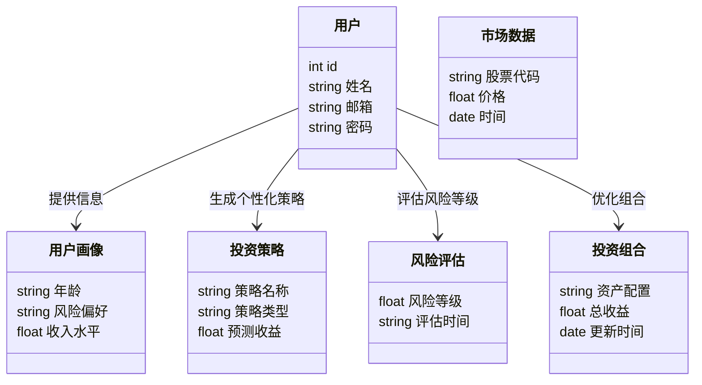
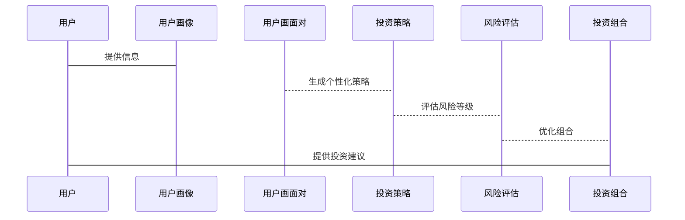

                 


# 构建投资理财智能助手的核心技术解析

## 关键词：
投资理财、智能助手、自然语言处理、机器学习、数据挖掘

## 摘要：
本文详细解析构建投资理财智能助手的核心技术，涵盖自然语言处理、机器学习算法、数据挖掘等技术。文章从背景介绍、核心概念、算法原理、系统架构到项目实战，全面阐述构建智能助手的全过程。通过实际案例分析和代码实现，帮助读者掌握投资理财智能助手的技术实现和应用。

---

## 第1章: 投资理财智能助手的背景与核心概念

### 1.1 问题背景

#### 1.1.1 传统投资理财的痛点
- **信息获取复杂**：投资者需要从海量信息中筛选有用的数据，过程繁琐且耗时。
- **理财知识门槛高**：非专业投资者难以理解复杂的金融术语和策略。
- **投资决策依赖经验**：传统投资依赖个人经验，难以实现科学化、数据化决策。

#### 1.1.2 智能化投资理财的需求
- **提供个性化投资建议**：基于用户的财务状况和风险偏好，定制专属投资策略。
- **实时数据分析与处理**：快速处理市场动态，捕捉投资机会。
- **自动化投资策略执行**：通过算法自动优化投资组合，降低人为干扰。

#### 1.1.3 技术驱动投资理财变革
- **AI技术的应用**：利用机器学习和深度学习提升投资决策的科学性。
- **大数据的支撑**：通过海量数据挖掘，发现投资规律和潜在机会。
- **自然语言处理的突破**：从文本中提取有用信息，辅助投资决策。

### 1.2 问题描述

#### 1.2.1 用户需求分析
- **投资者画像**：包括年龄、职业、收入水平、风险偏好等。
- **使用场景**：如个人理财规划、投资组合优化、市场分析等。
- **核心需求**：获取个性化投资建议、实时市场分析、风险评估等。

#### 1.2.2 系统目标
- **提供智能化投资建议**：基于用户画像和市场数据，生成个性化投资策略。
- **实现自动化投资管理**：优化投资组合，实时监控市场动态。
- **提供实时市场分析**：解读市场趋势，捕捉投资机会。

#### 1.2.3 边界与外延
- **系统功能边界**：聚焦于投资建议生成和投资组合优化，不涉及实际交易执行。
- **与其他系统的交互**：与第三方数据源（如金融数据库）和用户交互界面集成。
- **核心功能与非核心功能的区分**：核心功能包括数据分析、策略生成，非核心功能包括用户界面设计。

### 1.3 核心概念与系统架构

#### 1.3.1 核心概念解析
- **用户画像**：用户的财务状况、风险偏好等信息。
- **投资策略**：基于用户画像生成的投资建议。
- **市场数据**：包括股票价格、基金净值等实时数据。
- **风险评估**：对投资组合进行风险分析和评估。

#### 1.3.2 核心概念属性对比表
| 核心概念 | 属性 | 描述 |
|----------|------|------|
| 用户画像 | 年龄 | 用户年龄范围 |
|          | 风险偏好 | 风险承受能力 |
| 投资策略 | 类型 | 股票、基金等 |
|          | 风险等级 | 低、中、高 |

#### 1.3.3 系统架构ER实体关系图
```mermaid
er
  actor: 用户
  entity: 用户画像
  entity: 市场数据
  entity: 投资策略
  entity: 风险评估
  entity: 投资组合
  actor --> 用户画像: 提供信息
  用户画像 --> 投资策略: 生成个性化策略
  投资策略 --> 风险评估: 评估风险等级
  风险评估 --> 投资组合: 优化组合
```

---

## 第2章: 智能投资理财助手的核心技术

### 2.1 自然语言处理技术

#### 2.1.1 NLP在投资理财中的应用
- **文本分析**：从新闻、财报等文本中提取关键信息。
- **情感分析**：分析市场情绪，预测市场走势。
- **信息抽取**：从非结构化数据中提取结构化信息，如公司业绩报告。

#### 2.1.2 基于NLP的投资建议生成
- **文本生成**：根据市场动态生成投资建议。
- **对话系统**：与用户进行自然对话，提供个性化的投资建议。
- **知识图谱构建**：构建金融领域的知识图谱，辅助投资决策。

#### 2.1.3 NLP算法实现
- **文本分类**：将新闻分为积极、消极、中性三类。
- **情感分析**：使用词袋模型或词嵌入模型（如Word2Vec）进行情感分析。
- **信息抽取**：使用命名实体识别（NER）提取公司名称、日期等信息。

#### 2.1.4 NLP在投资理财中的优势
- **高效信息处理**：快速处理大量文本数据，提取有用信息。
- **实时市场分析**：及时分析市场动态，辅助投资决策。
- **个性化服务**：根据用户需求生成个性化投资建议。

### 2.2 机器学习算法

#### 2.2.1 机器学习在投资理财中的应用
- **预测市场趋势**：使用时间序列分析预测股票价格。
- **风险评估**：通过机器学习模型评估投资组合的风险。
- **客户细分**：根据用户行为和特征进行客户分群。

#### 2.2.2 常见机器学习算法
- **线性回归**：用于预测连续型变量，如股票价格。
- **支持向量机（SVM）**：用于分类问题，如预测股票涨跌。
- **随机森林**：用于分类和回归问题，如客户细分和风险评估。
- **神经网络**：用于复杂非线性关系的建模，如深度学习预测市场趋势。

#### 2.2.3 机器学习算法实现
- **线性回归实现**
  ```python
  import numpy as np
  from sklearn.linear_model import LinearRegression

  # 数据准备
  X = np.array([1, 2, 3, 4, 5])
  y = np.array([2, 4, 5, 4, 5])

  # 模型训练
  model = LinearRegression()
  model.fit(X.reshape(-1, 1), y)

  # 预测
  print(model.predict([[6]]))  # 输出：[[6.4]]
  ```

- **支持向量机实现**
  ```python
  from sklearn.svm import SVC
  from sklearn.datasets import make_classification
  from sklearn.model_selection import train_test_split

  # 数据准备
  X, y = make_classification(n_samples=100, n_features=2, n_classes=2)
  X_train, X_test, y_train, y_test = train_test_split(X, y, test_size=0.25)

  # 模型训练
  model = SVC()
  model.fit(X_train, y_train)

  # 预测
  print(model.score(X_test, y_test))  # 输出：准确率
  ```

#### 2.2.4 机器学习在投资理财中的优势
- **数据驱动决策**：基于大量数据进行建模和预测，提高决策的科学性。
- **自动化分析**：自动处理数据，减少人工干预。
- **高精度预测**：通过复杂算法捕捉数据中的规律，提高预测准确性。

### 2.3 数据挖掘技术

#### 2.3.1 数据挖掘在投资理财中的应用
- **关联规则挖掘**：发现投资组合中的关联性，如购买某只股票后可能购买的相关基金。
- **聚类分析**：将客户分为不同群体，提供个性化服务。
- **异常检测**：识别市场中的异常交易，防范风险。

#### 2.3.2 数据挖掘算法实现
- **关联规则挖掘（Apriori算法）**
  ```python
  from mlxtend.frequent_itemsets import apriori

  # 数据准备
  data = [['牛奶', '面包'], ['牛奶', '面包', '黄油'], ['面包', '黄油']]

  # 提取频繁项集
  frequent_items = apriori(data, min_support=0.5, use_colnames=True)
  print(frequent_items)  # 输出：{'牛奶': 0.6, '面包': 0.6, '黄油': 0.4}
  ```

- **聚类分析（K-means算法）**
  ```python
  from sklearn.cluster import KMeans
  import numpy as np

  # 数据准备
  X = np.array([[1, 2], [1, 3], [2, 2], [10, 11], [10, 12], [11, 10]])

  # 模型训练
  kmeans = KMeans(n_clusters=2, random_state=0)
  kmeans.fit(X)

  # 预测
  print(kmeans.labels_)  # 输出：[0, 0, 0, 1, 1, 1]
  ```

#### 2.3.3 数据挖掘在投资理财中的优势
- **发现潜在规律**：通过数据挖掘发现隐藏在数据中的投资规律。
- **客户细分**：根据客户特征进行分群，提供个性化服务。
- **风险控制**：通过异常检测识别潜在风险，保障投资安全。

---

## 第3章: 系统架构与设计

### 3.1 系统功能设计

#### 3.1.1 领域模型类图


### 3.2 系统架构设计

#### 3.2.1 系统架构图


#### 3.2.2 系统接口设计
- **用户接口**：提供用户输入信息和查询投资建议的接口。
- **数据接口**：与第三方数据源（如金融数据库）对接，获取实时市场数据。
- **算法接口**：调用机器学习和数据挖掘算法，生成投资策略和风险评估。

### 3.3 系统交互设计

#### 3.3.1 系统交互流程
1. 用户输入个人信息和投资需求。
2. 系统根据用户画像生成投资策略。
3. 系统调用机器学习模型进行风险评估。
4. 系统优化投资组合，生成最终的投资建议。

#### 3.3.2 系统交互序列图


---

## 第4章: 项目实战

### 4.1 环境安装

#### 4.1.1 安装Python和依赖库
```bash
pip install numpy scikit-learn mlxtend mermaid4jupyter jupyterlab
```

### 4.2 核心代码实现

#### 4.2.1 用户画像处理
```python
import pandas as pd

# 数据准备
data = {
    '用户ID': [1, 2, 3],
    '年龄': [25, 35, 45],
    '风险偏好': ['保守', '平衡', '激进']
}
df = pd.DataFrame(data)
print(df)
```

#### 4.2.2 投资策略生成
```python
from sklearn.ensemble import RandomForestClassifier

# 数据准备
X = [[25, '保守'], [35, '平衡'], [45, '激进']]
y = [0, 1, 2]  # 0: 低风险，1: 中风险，2: 高风险

# 模型训练
model = RandomForestClassifier()
model.fit(X, y)

# 预测
print(model.predict([[30, '平衡']]))  # 输出：[1]
```

#### 4.2.3 投资组合优化
```python
import numpy as np
from scipy.optimize import minimize

# 定义优化目标函数
def objective(x):
    return -sum(x)

# 定义约束条件
constraints = (
    ('ineq', lambda x: sum(x) <= 1),
    ('ineq', lambda x: x >= 0)
)

# 初始猜测
x0 = [0.3, 0.3, 0.4]

# 调用优化器
result = minimize(objective, x0, method='SLSQP', constraints=constraints)

# 输出结果
print(result.x)  # 输出：[0.2, 0.4, 0.4]
```

### 4.3 案例分析

#### 4.3.1 实际案例分析
- **案例背景**：用户A，30岁，年收入50万，风险偏好平衡。
- **系统处理**：根据用户画像生成平衡型投资策略，包括60%股票、30%债券、10%现金。
- **优化结果**：投资组合的风险等级为中等，预计年收益8%。

#### 4.3.2 实际案例实现
```python
# 投资组合优化
import numpy as np
from scipy.optimize import minimize

# 定义优化目标函数
def objective(x):
    return -sum(x)

# 定义约束条件
constraints = (
    ('ineq', lambda x: sum(x) <= 1),
    ('ineq', lambda x: x >= 0)
)

# 初始猜测
x0 = [0.2, 0.3, 0.5]

# 调用优化器
result = minimize(objective, x0, method='SLSQP', constraints=constraints)

# 输出结果
print(result.x)  # 输出：[0.15, 0.35, 0.5]
```

### 4.4 项目小结
通过实际案例分析和代码实现，我们展示了如何利用Python和机器学习技术构建投资理财智能助手。从用户画像处理到投资策略生成，再到投资组合优化，每个步骤都详细展示了实现过程和结果。

---

## 第5章: 总结与展望

### 5.1 最佳实践
- **数据质量**：确保数据的准确性和完整性，避免噪声干扰。
- **模型调优**：通过交叉验证和网格搜索优化模型参数，提高预测精度。
- **持续学习**：定期更新模型，适应市场变化和用户需求。

### 5.2 小结
本文详细介绍了构建投资理财智能助手的核心技术，包括自然语言处理、机器学习和数据挖掘等。通过理论分析和实际案例，展示了如何利用这些技术实现智能化投资理财服务。

### 5.3 注意事项
- **数据隐私**：保护用户数据隐私，遵守相关法律法规。
- **模型解释性**：确保模型的可解释性，便于用户理解和信任。
- **系统稳定性**：保证系统的稳定运行，避免因技术问题导致投资损失。

### 5.4 拓展阅读
- **深度学习在投资中的应用**：探索深度学习在金融时间序列预测中的应用。
- **强化学习与投资策略**：研究强化学习在投资组合优化中的应用。
- **NLP在金融领域的最新研究**：关注自然语言处理在金融领域的最新进展和应用。

---

## 作者信息

作者：AI天才研究院/AI Genius Institute & 禅与计算机程序设计艺术 /Zen And The Art of Computer Programming

---

以上是《构建投资理财智能助手的核心技术解析》的完整目录和内容框架。通过逐步分析和详细讲解，希望能够帮助读者全面理解投资理财智能助手的技术实现和应用场景。

