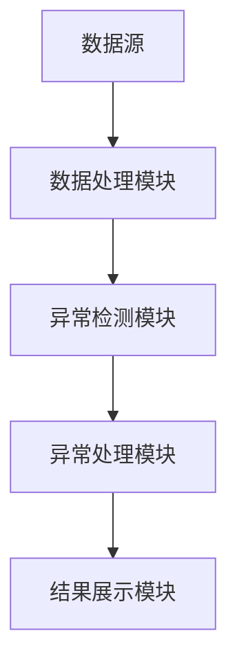
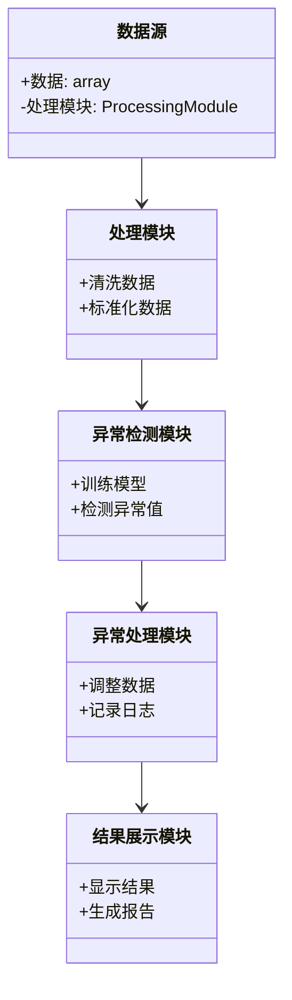
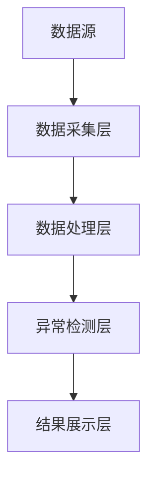

                 


# 金融数据异常值检测与处理平台

> 关键词：金融数据、异常值检测、机器学习、深度学习、数据处理、系统架构

> 摘要：  
本文系统地探讨了金融数据异常值检测与处理平台的设计与实现。从异常值的定义、分类及其在金融数据中的特殊性出发，分析了多种异常值检测方法，包括统计方法、机器学习方法和深度学习方法，并对这些方法进行了对比与优化。通过构建领域模型和系统架构图，详细阐述了平台的设计思路，并结合实际案例，展示了如何通过Python代码实现异常值检测与处理。最后，本文总结了异常值检测的最佳实践和注意事项，为金融数据处理领域提供了理论支持和实践指导。

---

# 第1章: 异常值检测的背景与意义

## 1.1 异常值的定义与分类

### 1.1.1 异常值的定义
异常值是指在数据集中与大多数数据点明显不同的观测值。在金融数据中，异常值可能表示市场操纵、欺诈行为或系统性风险，因此及时发现和处理异常值对金融决策至关重要。

### 1.1.2 异常值的分类
异常值可以分为以下几类：
- **点异常**：单个数据点偏离正常范围。
- **集体异常**：多个数据点共同偏离正常范围。
- **上下文异常**：在特定上下文中被视为异常，但在其他上下文可能不是异常。

### 1.1.3 异常值检测的必要性
在金融领域，异常值可能导致以下问题：
- **误导分析结果**：异常值会影响统计分析的准确性。
- **增加风险**：异常值可能隐藏欺诈行为或市场风险。
- **影响决策**：异常值可能导致错误的交易或投资决策。

---

## 1.2 金融数据的特点与异常值的特殊性

### 1.2.1 金融数据的特征
金融数据具有以下特点：
- **高维度性**：包括价格、成交量、市场指数等多种指标。
- **时间序列性**：数据通常与时间相关。
- **波动性**：市场波动可能导致数据分布发生变化。

### 1.2.2 异常值在金融数据中的表现形式
在金融数据中，异常值可能表现为：
- **价格突然波动**：如股价的异常上涨或下跌。
- **成交量突增**：短时间内成交量急剧增加。
- **市场指数异常**：如指数突然偏离正常范围。

### 1.2.3 异常值对金融决策的影响
异常值可能对金融决策产生重大影响：
- **风险管理**：异常值可能预示市场风险。
- **投资策略**：异常值可能影响投资策略的有效性。
- **交易行为分析**：异常值可能揭示市场操纵行为。

---

## 1.3 异常值检测的目标与流程

### 1.3.1 异常值检测的目标
- **识别异常值**：准确检测数据中的异常值。
- **解释异常原因**：分析异常值背后的原因。
- **处理异常值**：根据具体情况调整数据或采取措施。

### 1.3.2 异常值检测的流程
1. **数据预处理**：清洗数据，处理缺失值和重复值。
2. **选择检测方法**：根据数据特点选择合适的检测方法。
3. **模型训练与评估**：训练模型并评估其性能。
4. **异常值处理**：根据检测结果调整数据或采取行动。

---

## 1.4 本章小结
本章介绍了异常值的定义、分类及其在金融数据中的特殊性。通过分析金融数据的特点和异常值的影响，明确了异常值检测的目标和流程，为后续内容奠定了基础。

---

# 第2章: 异常值检测的核心概念与联系

## 2.1 异常值检测的原理与方法

### 2.1.1 统计方法
统计方法基于数据的分布特性，常用的统计方法包括：
- **Z-score方法**：通过标准差衡量数据点与均值的距离。
- **箱线图方法**：通过四分位数判断数据点是否为异常值。

### 2.1.2 机器学习方法
机器学习方法通过训练模型来识别异常值，常用的算法包括：
- **Isolation Forest**：通过构建隔离树将数据点隔离。
- **One-Class SVM**：通过支持向量机学习正常数据的分布。

### 2.1.3 深度学习方法
深度学习方法通过构建神经网络模型，常用的算法包括：
- **Autoencoder**：通过重构数据来识别异常值。
- **VAE**：通过变分自编码器学习数据的潜在分布。
- **GAN**：通过生成对抗网络区分正常数据和异常数据。

---

## 2.2 异常值检测方法的对比分析

### 2.2.1 统计方法与机器学习方法的对比
| 方法类型 | 统计方法 | 机器学习方法 |
|----------|----------|--------------|
| 适用场景 | 数据分布已知 | 数据分布未知 |
| 计算复杂度 | 低 | 高 |
| 灵活性 | 低 | 高 |

### 2.2.2 基于距离的方法与基于密度的方法的对比
| 方法类型 | 基于距离 | 基于密度 |
|----------|----------|------------|
| 核心思想 | 数据点与最近邻的距离 | 数据点的密度分布 |
| 适用场景 | 球形分布数据 | 高维数据 |

### 2.2.3 基于模型的方法与基于无监督学习方法的对比
| 方法类型 | 基于模型 | 基于无监督学习 |
|----------|----------|---------------|
| 核心思想 | 数据分布建模 | 群集分析 |
| 适用场景 | 正常数据分布明确 | 正常数据分布不明确 |

---

## 2.3 异常值检测的ER实体关系图



---

## 2.4 本章小结
本章分析了异常值检测的核心概念，对比了不同方法的优缺点，并通过ER实体关系图展示了系统的整体架构。这些内容为后续的算法实现和系统设计提供了理论支持。

---

# 第3章: 异常值检测算法原理

## 3.1 统计方法

### 3.1.1 Z-score方法
Z-score方法通过计算数据点与均值的距离来判断是否为异常值：
$$ Z = \frac{x - \mu}{\sigma} $$
其中，$\mu$ 是均值，$\sigma$ 是标准差。通常，$|Z| > 3$ 的数据点被视为异常值。

### 3.1.2 箱线图方法
箱线图通过四分位数构建，计算步骤如下：
1. 计算数据的最小值（Min）、第一四分位数（Q1）、第二四分位数（Q2）、第三四分位数（Q3）和最大值（Max）。
2. 异常值的判断标准为：
   - $x < Q1 - 1.5 \times IQR$
   - $x > Q3 + 1.5 \times IQR$
   其中，$IQR = Q3 - Q1$ 是四分位距。

---

## 3.2 机器学习方法

### 3.2.1 Isolation Forest算法
Isolation Forest通过构建隔离树将数据点隔离，判断其是否为异常值。算法流程如下：


### 3.2.2 One-Class SVM算法
One-Class SVM通过在高维空间中构建超球，将正常数据与异常数据分离。数学模型如下：
$$ y = \text{sign}(\langle w, x \rangle + b) $$
其中，$w$ 是权重向量，$b$ 是偏置项。

---

## 3.3 深度学习方法

### 3.3.1 Autoencoder算法
Autoencoder通过重构数据来识别异常值。模型结构如下：
$$ x_{\text{input}} \rightarrow x_{\text{encoded}} \rightarrow x_{\text{decoded}} $$
异常值的判断标准为：
$$ \text{重建误差} = \|x_{\text{input}} - x_{\text{decoded}}\| $$

### 3.3.2 VAE算法
VAE通过学习数据的潜在分布，重构数据来识别异常值。数学模型如下：
$$ \mathcal{L} = \mathbb{E}_{x}[ \log p(x|z)] - \text{KL}(q(z|x) || p(z)) $$
其中，$\mathcal{L}$ 是损失函数，$\text{KL}$ 是KL散度。

---

## 3.4 算法实现与比较

### 3.4.1 统计方法的实现
```python
import numpy as np

def z_score_outlier_detection(data):
    mu = np.mean(data)
    sigma = np.std(data)
    z_scores = (data - mu) / sigma
    outliers = np.where(np.abs(z_scores) > 3)
    return outliers
```

### 3.4.2 机器学习方法的实现
```python
from sklearn.ensemble import IsolationForest

def isolation_forest_detection(data):
    model = IsolationForest(contamination=0.01)
    model.fit(data)
    outliers = model.predict(data) == -1
    return outliers
```

### 3.4.3 深度学习方法的实现
```python
from tensorflow.keras import layers

def autoencoder_detection(data, input_dim):
    input_layer = layers.Input(shape=(input_dim,))
    encoded_layer = layers.Dense(32, activation='relu')(input_layer)
    decoded_layer = layers.Dense(input_dim, activation='sigmoid')(encoded_layer)
    autoencoder = models.Model(inputs=input_layer, outputs=decoded_layer)
    autoencoder.compile(optimizer='adam', loss='binary_crossentropy')
    autoencoder.fit(data, data, epochs=100, batch_size=32)
    reconstructed_data = autoencoder.predict(data)
    reconstruction_error = np.mean(np.square(data - reconstructed_data), axis=1)
    outliers = np.where(reconstruction_error > np.percentile(reconstruction_error, 95))
    return outliers
```

---

## 3.5 本章小结
本章详细讲解了异常值检测的主要算法，包括统计方法、机器学习方法和深度学习方法，并通过代码示例展示了它们的实现过程。这些算法为后续的系统设计提供了理论支持。

---

# 第4章: 系统分析与架构设计

## 4.1 项目背景与目标
本项目旨在构建一个金融数据异常值检测与处理平台，目标是通过自动化检测和处理异常值，提高金融数据的质量和可靠性。

---

## 4.2 系统功能设计

### 4.2.1 领域模型类图


---

## 4.3 系统架构设计

### 4.3.1 分层架构


---

## 4.4 系统接口设计
系统接口设计包括数据输入接口、模型训练接口和结果展示接口。以下是接口设计示例：
```python
class DataInterface:
    def load_data(self):
        # 加载数据
        pass

    def preprocess_data(self):
        # 数据预处理
        pass

class ModelInterface:
    def train_model(self):
        # 训练模型
        pass

    def detect_outliers(self):
        # 检测异常值
        pass

class DisplayInterface:
    def show_results(self):
        # 显示结果
        pass
```

---

## 4.5 本章小结
本章通过领域模型类图和系统架构图，展示了金融数据异常值检测与处理平台的系统设计。这些设计为后续的项目实现提供了清晰的指导。

---

# 第5章: 项目实战

## 5.1 环境安装与配置
### 5.1.1 安装Python与依赖库
```bash
pip install numpy pandas scikit-learn tensorflow matplotlib
```

---

## 5.2 核心代码实现

### 5.2.1 数据预处理
```python
import pandas as pd

def preprocess_data(data_path):
    data = pd.read_csv(data_path)
    data.dropna(inplace=True)
    data['date'] = pd.to_datetime(data['date'])
    return data
```

### 5.2.2 异常检测
```python
from sklearn.ensemble import IsolationForest

def detect_outliers(data):
    model = IsolationForest(contamination=0.01, random_state=42)
    model.fit(data)
    outliers = model.predict(data) == -1
    return outliers
```

### 5.2.3 可视化
```python
import matplotlib.pyplot as plt

def visualize_results(data, outliers):
    plt.figure(figsize=(10, 6))
    plt.plot(data['value'], label='正常值')
    plt.scatter(data[outliers]['index'], data[outliers]['value'], color='red', label='异常值')
    plt.title('异常值检测结果')
    plt.legend()
    plt.show()
```

---

## 5.3 代码解读与实际案例分析
### 5.3.1 数据加载与预处理
```python
data = preprocess_data('financial_data.csv')
```

### 5.3.2 异常检测
```python
outliers = detect_outliers(data)
```

### 5.3.3 结果可视化
```python
visualize_results(data, outliers)
```

---

## 5.4 项目小结
本章通过实际案例展示了如何使用Python代码实现金融数据异常值检测与处理平台。代码涵盖了数据预处理、异常检测和结果可视化三个部分，为读者提供了实践指导。

---

# 第6章: 最佳实践与注意事项

## 6.1 最佳实践
### 6.1.1 数据预处理
- 数据清洗是异常值检测的前提。
- 数据标准化有助于提高模型的准确性。

### 6.1.2 模型调参
- 根据数据特点选择合适的算法。
- 调整模型参数以提高检测精度。

### 6.1.3 结果验证
- 使用真实数据验证模型的准确性。
- 分析异常值背后的原因。

---

## 6.2 注意事项
- 异常值检测的结果需要结合业务背景进行解释。
- 处理异常值时要谨慎，避免误删或误改。
- 定期更新模型，适应数据分布的变化。

---

## 6.3 本章小结
本章总结了金融数据异常值检测与处理平台的最佳实践和注意事项，为读者提供了宝贵的实践经验。

---

# 作者：AI天才研究院/AI Genius Institute & 禅与计算机程序设计艺术 /Zen And The Art of Computer Programming

---

以上是《金融数据异常值检测与处理平台》的完整目录和部分正文内容。通过系统化的分析和实践，本文为金融数据处理领域提供了理论支持和实践指导。

