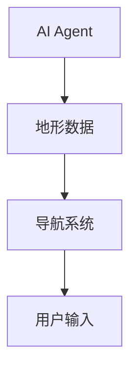
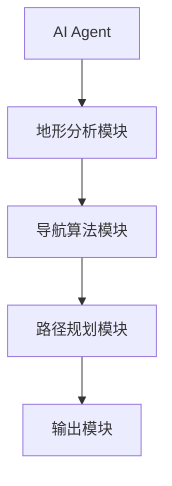
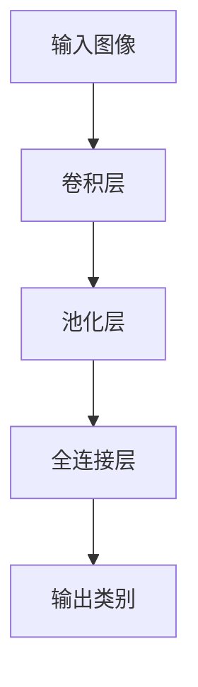
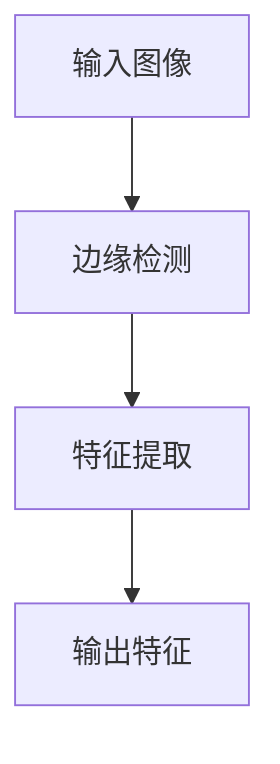
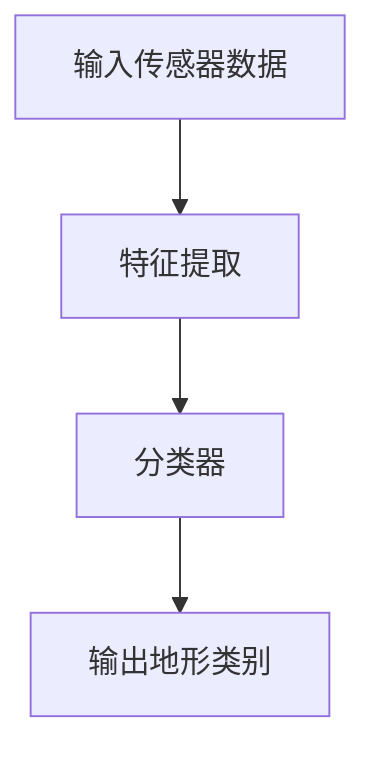

                 


# AI Agent在智能登山杖中的地形分析与导航

> 关键词：AI Agent，智能登山杖，地形分析，路径规划，导航系统

> 摘要：本文详细探讨了AI Agent在智能登山杖中的应用，重点分析了地形分析与导航系统的实现原理。通过结合深度学习与传统算法，本文提出了一种改进的A*算法，以提高导航系统的效率与准确性。文章从背景介绍、核心概念、算法原理、系统架构到项目实战，全面解析了智能登山杖的设计与实现过程。

---

# 第一部分: AI Agent在智能登山杖中的地形分析与导航背景介绍

## 第1章: 问题背景与概念结构

### 1.1 AI Agent的基本概念

#### 1.1.1 AI Agent的定义与分类
AI Agent（人工智能代理）是指能够感知环境并采取行动以实现目标的智能实体。根据智能水平和应用场景的不同，AI Agent可以分为简单反射代理、基于模型的反射代理、目标驱动代理和效用驱动代理。

- **简单反射代理**：基于固定的规则进行决策，适用于任务简单、环境稳定的场景。
- **基于模型的反射代理**：能够建立环境模型，并根据模型进行决策，适用于复杂环境。
- **目标驱动代理**：具有明确的目标，并采取行动以实现目标。
- **效用驱动代理**：通过最大化效用函数来优化决策，适用于多目标权衡的场景。

#### 1.1.2 AI Agent的核心属性与特征
AI Agent的核心属性包括感知能力、决策能力、学习能力和执行能力。其特征可以分为以下几点：
- **自主性**：能够在没有外部干预的情况下独立运行。
- **反应性**：能够实时感知环境并做出反应。
- **目标导向性**：具有明确的目标，并采取行动以实现目标。
- **适应性**：能够根据环境变化调整行为。

#### 1.1.3 AI Agent在智能设备中的应用场景
AI Agent广泛应用于智能助手、自动驾驶、智能安防等领域。在智能登山杖中，AI Agent主要用于地形分析与导航。

---

### 1.2 地形分析与导航的基本概念

#### 1.2.1 地形分析的定义与方法
地形分析是指对环境中的地理特征进行识别和分类的过程。在智能登山杖中，地形分析的主要目的是识别可通行路径和障碍物。常见的地形分析方法包括：
- **基于传感器的数据分析**：利用激光雷达、摄像头等传感器获取地形数据。
- **基于深度学习的分类**：使用卷积神经网络（CNN）对地形图像进行分类。
- **基于传统算法的特征提取**：利用边缘检测、纹理分析等技术提取地形特征。

#### 1.2.2 导航系统的基本原理
导航系统是指通过感知环境并规划路径以实现目标的系统。导航系统的核心任务是找到从起点到目标点的最优路径。常见的导航算法包括A*算法、Dijkstra算法、RRT（Rapidly-exploring Random Tree）算法等。

#### 1.2.3 智能登山杖的使用场景与目标
智能登山杖的目标是帮助用户在复杂地形中安全、高效地移动。其使用场景包括登山、徒步旅行、救援任务等。智能登山杖的核心目标是实现地形分析与路径规划，以避开障碍物并找到最优路径。

---

### 1.3 问题描述与目标设定

#### 1.3.1 智能登山杖的地形分析需求
智能登山杖需要实时分析地形数据，识别可通行路径和障碍物。地形分析的难点在于如何在复杂环境中准确识别地形特征，并快速做出决策。

#### 1.3.2 导航系统的功能目标
导航系统的功能目标包括：
- 实时感知环境并更新地图。
- 规划最优路径以避开障碍物。
- 根据用户需求动态调整路径。

#### 1.3.3 边界条件与外延范围
智能登山杖的边界条件包括：
- 传感器的有效范围。
- 环境中的障碍物类型。
- 用户的输入指令。

外延范围包括：
- 不同地形条件下的适应性。
- 系统的鲁棒性与容错能力。

---

## 第2章: 核心概念与系统架构

### 2.1 AI Agent与地形分析的核心联系

#### 2.1.1 AI Agent在地形分析中的角色
AI Agent在地形分析中的角色是感知环境并提供决策支持。通过分析传感器数据，AI Agent可以识别地形特征并为导航系统提供输入。

#### 2.1.2 地形数据的获取与处理
地形数据的获取主要通过传感器，包括激光雷达、摄像头、IMU等。地形数据的处理包括数据融合、特征提取和分类。

#### 2.1.3 导航算法的选择与优化
导航算法的选择取决于环境的复杂性和系统的性能需求。改进的A*算法在智能登山杖中具有较好的应用前景。

---

### 2.2 核心概念对比与特征分析

#### 2.2.1 不同导航算法的特征对比
下表对比了A*算法、Dijkstra算法和RRT算法的特征：

| 算法 | 开销 | 适用场景 | 优点 | 缺点 |
|------|------|-----------|------|------|
| A*   | 中等 | 平坦地形 | 实时性好 | 适合复杂地形 |
| Dijkstra | 高 | 网络路径规划 | 确保最短路径 | 适合复杂地形 |
| RRT   | 低 | 不可预测的障碍物 | 灵活性高 | 计算复杂 |

#### 2.2.2 AI Agent与传统导航算法的差异
AI Agent的核心优势在于其自主性和适应性。与传统导航算法相比，AI Agent能够根据环境变化动态调整行为。

#### 2.2.3 系统架构的优劣势分析
系统的优劣势分析如下：
- **优势**：模块化设计，易于扩展；实时性好，适应性强。
- **劣势**：计算资源消耗较高；系统复杂性增加维护成本。

---

### 2.3 实体关系与系统架构设计

#### 2.3.1 实体关系图（ER图）
以下是系统的实体关系图：



#### 2.3.2 系统架构图（mermaid）
以下是系统的架构图：



---

# 第二部分: 算法原理与数学模型

## 第3章: AI Agent的算法原理

### 3.1 地形分析算法

#### 3.1.1 基于深度学习的地形分类
基于深度学习的地形分类主要使用卷积神经网络（CNN）。以下是CNN的网络结构：



#### 3.1.2 基于传统算法的地形特征提取
基于传统算法的地形特征提取主要使用边缘检测和纹理分析。以下是边缘检测的流程图：



#### 3.1.3 算法流程图（mermaid）
以下是地形分析算法的流程图：



---

### 3.2 导航算法

#### 3.2.1 A*算法原理
A*算法是一种常见的路径规划算法，其基本原理如下：

1. **初始化**：设置起点和目标点。
2. **生成候选点**：从当前点扩展邻居点。
3. **评估优先级**：根据评估函数计算候选点的优先级。
4. **选择下一个点**：从优先队列中选择优先级最高的点。
5. **检查是否为目标点**：如果是目标点，结束；否则继续扩展。

以下是A*算法的优先级计算公式：

$$ f(n) = g(n) + h(n) $$

其中，\( g(n) \) 是从起点到当前点的代价，\( h(n) \) 是从当前点到目标点的 heuristic 代价。

#### 3.2.2 改进的A*算法
改进的A*算法主要在以下几个方面进行了优化：
- **动态障碍物处理**：通过实时更新障碍物信息，提高系统的适应性。
- **多目标优化**：在路径规划中考虑多个目标，如路径长度、安全性等。
- **性能优化**：通过优化数据结构和算法实现，提高计算效率。

---

### 3.3 数学公式与算法实现

#### 3.3.1 算法实现的数学模型
以下是改进的A*算法的数学模型：

$$ \text{cost}(n) = \text{distance}(n) \times \text{weight} $$

其中，\( \text{distance}(n) \) 是从起点到当前点的距离，\( \text{weight} \) 是权重系数。

#### 3.3.2 算法实现的代码示例
以下是改进的A*算法的Python实现示例：

```python
import heapq

def a_star_search(grid, start, goal):
    open_set = []
    heapq.heappush(open_set, (0, start))
    came_from = {}
    g_score = {node: float('inf') for node in grid}
    g_score[start] = 0
    f_score = {node: float('inf') for node in grid}
    f_score[start] = 0

    while open_set:
        current = heapq.heappop(open_set)
        if current[1] == goal:
            break
        for neighbor in grid[current[1]]:
            tentative_g_score = g_score[current[1]] + distance(current[1], neighbor)
            if tentative_g_score < g_score[neighbor]:
                came_from[neighbor] = current[1]
                g_score[neighbor] = tentative_g_score
                f_score[neighbor] = g_score[neighbor] + heuristic(neighbor, goal)
                heapq.heappush(open_set, (f_score[neighbor], neighbor))
    return came_from, g_score
```

---

## 第4章: 系统分析与架构设计方案

### 4.1 系统功能设计

#### 4.1.1 领域模型设计
以下是领域模型的类图：


#### 4.1.2 系统架构设计
以下是系统的架构图：


#### 4.1.3 系统接口设计
系统的接口设计包括：
- **输入接口**：传感器数据、用户输入。
- **输出接口**：路径规划结果、导航指令。

#### 4.1.4 系统交互设计
以下是系统的交互序列图：


---

## 第5章: 项目实战

### 5.1 环境安装与配置

#### 5.1.1 系统需求
- 操作系统：Linux/Windows/MacOS
- 开发工具：Python、PyCharm
- 依赖库：numpy、pandas、scikit-learn、opencv、mermaid

#### 5.1.2 安装步骤
```bash
pip install numpy pandas scikit-learn opencv-python mermaid
```

---

### 5.2 核心代码实现

#### 5.2.1 地形分析模块实现
以下是地形分析模块的Python代码：

```python
import cv2
import numpy as np

def terrain_classification(image):
    # 图像预处理
    gray = cv2.cvtColor(image, cv2.COLOR_BGR2GRAY)
    edges = cv2.Canny(gray, 50, 150)
    return edges
```

#### 5.2.2 导航算法模块实现
以下是导航算法模块的Python代码：

```python
def a_star_search(grid, start, goal):
    open_set = []
    heapq.heappush(open_set, (0, start))
    came_from = {}
    g_score = {node: float('inf') for node in grid}
    g_score[start] = 0
    f_score = {node: float('inf') for node in grid}
    f_score[start] = 0

    while open_set:
        current = heapq.heappop(open_set)
        if current[1] == goal:
            break
        for neighbor in grid[current[1]]:
            tentative_g_score = g_score[current[1]] + distance(current[1], neighbor)
            if tentative_g_score < g_score[neighbor]:
                came_from[neighbor] = current[1]
                g_score[neighbor] = tentative_g_score
                f_score[neighbor] = g_score[neighbor] + heuristic(neighbor, goal)
                heapq.heappush(open_set, (f_score[neighbor], neighbor))
    return came_from, g_score
```

---

## 第6章: 总结与展望

### 6.1 项目总结

#### 6.1.1 核心成果
- 实现了基于AI Agent的地形分析与导航系统。
- 提出了改进的A*算法，提高了导航系统的效率与准确性。

#### 6.1.2 经验与教训
- 系统的鲁棒性需要进一步优化。
- 算法的计算效率需要进一步提升。

---

### 6.2 未来展望

#### 6.2.1 技术发展
- 更先进的AI算法（如大语言模型）的应用。
- 多模态传感器的融合。

#### 6.2.2 应用场景拓展
- 更广泛的应用场景，如智能机器人、自动驾驶等。

---

# 结语

通过本文的详细讲解，我们了解了AI Agent在智能登山杖中的地形分析与导航系统的实现过程。从背景介绍到算法实现，从系统设计到项目实战，我们全面解析了智能登山杖的设计与实现过程。未来，随着AI技术的不断发展，智能登山杖将具有更广阔的应用前景。

---

# 作者：AI天才研究院/AI Genius Institute & 禅与计算机程序设计艺术 /Zen And The Art of Computer Programming

