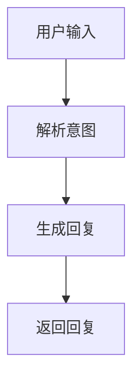
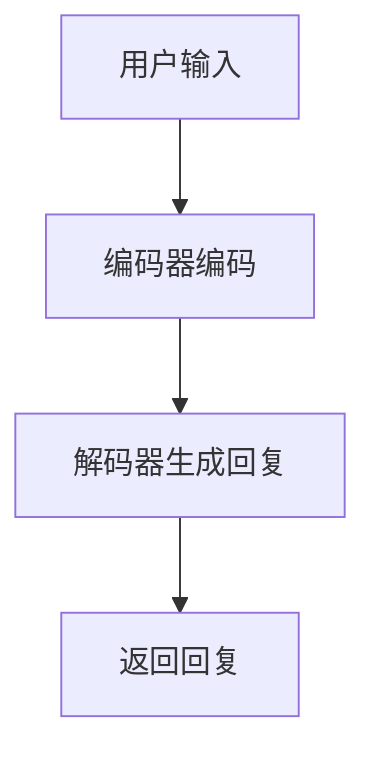
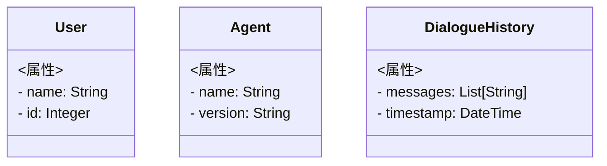

                 


# AI Agent的对话管理策略与实现

## 关键词：AI Agent、对话管理、对话策略、自然语言处理、深度学习、系统架构、项目实战

## 摘要：  
本文系统地探讨了AI Agent的对话管理策略与实现，从基础概念到高级算法，再到系统架构和项目实战，全面解析对话管理的核心原理和应用场景。通过详细讲解对话管理的算法、系统设计和实际案例，帮助读者深入理解并掌握AI Agent对话管理的技术要点和实现方法。

---

# 第一部分: AI Agent对话管理基础

## 第1章: AI Agent与对话管理概述

### 1.1 AI Agent的基本概念  
AI Agent（人工智能代理）是指能够感知环境、自主决策并执行任务的智能实体。它广泛应用于智能助手、自动驾驶、智能客服等领域。对话管理作为AI Agent的核心功能，负责理解和生成自然语言对话，实现与用户的有效交互。  

#### 1.1.1 AI Agent的定义与分类  
- **定义**：AI Agent是一种能够执行特定任务的智能系统，具备感知、决策和执行能力。  
- **分类**：基于智能水平，AI Agent可分为基于规则的弱人工智能和具备学习能力的强人工智能。  

#### 1.1.2 对话管理的定义与作用  
- **定义**：对话管理是指AI Agent通过理解和生成对话内容，引导对话流程，实现特定目标的过程。  
- **作用**：对话管理是人机交互的核心，负责解析用户意图、生成回复、管理对话上下文。  

#### 1.1.3 AI Agent在对话系统中的角色  
- AI Agent通过对话管理模块实现与用户的交互，充当用户的“智能助手”。  
- 对话管理模块负责解析用户需求、调用后端服务、协调多轮对话流程。  

### 1.2 对话管理的背景与技术背景  
对话管理技术起源于自然语言处理（NLP）领域，经历了从基于规则到基于深度学习的转变。  

#### 1.2.1 自然语言处理的发展历程  
- 早期基于规则的NLP系统依赖人工编写语法规则，处理能力有限。  
- 近年来，深度学习技术的引入极大提升了对话系统的自然性和智能性。  

#### 1.2.2 从规则驱动到数据驱动的转变  
- 规则驱动：依赖人工制定对话规则，适用于特定场景。  
- 数据驱动：通过训练数据学习对话模式，具备更强的泛化能力。  

#### 1.2.3 对话系统的演变与现状  
- 早期对话系统：基于关键词匹配，功能简单。  
- 当前主流系统：结合NLP、机器学习和对话策略优化，实现更智能的对话管理。  

### 1.3 对话管理的应用场景与价值  
对话管理技术在多个领域展现出广泛的应用潜力。  

#### 1.3.1 智能客服、虚拟助手等典型应用  
- 智能客服：通过对话管理实现自动问答、客户支持。  
- 虚拟助手：如Siri、Alexa，通过对话管理提供日常服务。  

#### 1.3.2 对话管理在企业级系统中的价值  
- 提升用户体验：通过智能化对话管理优化用户交互流程。  
- 降低运营成本：自动化处理常见问题，减少人工干预。  

#### 1.3.3 对话管理的未来趋势与挑战  
- 未来趋势：从单一任务对话向多轮复杂对话发展。  
- 挑战：对话理解的准确性、对话策略的灵活性、多语言支持等。  

---

## 第2章: 对话管理的核心概念与联系  

### 2.1 对话管理的原理与模型  
对话管理的实现依赖于多种模型和算法，包括状态转移模型和策略优化方法。  

#### 2.1.1 状态转移模型  
- 状态表示：对话状态通常用用户意图、对话上下文等信息表示。  
- 状态转移：根据当前状态和用户输入，生成下一步状态。  

#### 2.1.2 对话策略与优化方法  
- 策略定义：对话策略决定了系统在不同状态下的响应方式。  
- 策略优化：通过强化学习等方法优化对话策略，提升用户体验。  

#### 2.1.3 对话历史与上下文管理  
- 对话历史记录：保存对话过程中的用户输入和系统回复。  
- 上下文管理：基于对话历史生成合适的回复，保持对话连贯性。  

### 2.2 对话管理的核心概念对比  
通过对比表格和ER实体关系图，帮助读者更好地理解对话管理的核心概念。  

#### 2.2.1 对比表格: 对话管理与传统对话系统的区别  

| 对比维度         | 传统对话系统                     | 现代对话系统                     |
|------------------|----------------------------------|----------------------------------|
| 实现方式         | 基于规则                        | 基于深度学习                    |
| 对话理解能力     | 有限                            | 更强                            |
| 灵活性           | 较低                            | 较高                            |

#### 2.2.2 对比表格: 不同对话策略的优缺点  

| 对话策略         | 优点                            | 缺点                            |
|------------------|----------------------------------|----------------------------------|
| 基于规则         | 实现简单，易于控制              | 灵活性差，难以处理复杂场景      |
| 基于深度学习     | 处理能力强，灵活性高            | 实现复杂，需要大量训练数据      |

#### 2.2.3 对话管理的ER实体关系图  
Mermaid实体关系图：  
```mermaid
er
actor: 用户
agent: AI Agent
dialogue_history: 对话历史
intent: 用户意图
```

### 2.3 对话管理的ER实体关系图  
通过Mermaid图展示对话管理的实体关系：  
```mermaid
er
actor: 用户
agent: AI Agent
dialogue_history: 对话历史
intent: 用户意图
```

---

## 第3章: 对话管理的算法原理  

### 3.1 对话管理的算法概述  
对话管理的算法主要包括基于规则的方法和基于深度学习的方法。  

#### 3.1.1 基于规则的对话管理  
- 算法特点：简单易懂，适用于规则明确的场景。  
- 优缺点：实现简单，但灵活性差，难以应对复杂场景。  

#### 3.1.2 基于深度学习的对话管理  
- 算法特点：通过训练数据学习对话模式，具备更强的泛化能力。  
- 优缺点：实现复杂，需要大量训练数据。  

#### 3.1.3 混合型对话管理策略  
- 综合利用规则和深度学习的优势，实现更灵活的对话管理。  

### 3.2 对话管理的算法流程图  
通过Mermaid流程图展示基于规则和深度学习的对话管理流程：  

基于规则的对话管理流程：  


基于深度学习的对话管理流程：  


### 3.3 对话管理的数学模型与公式  
对话管理的数学模型通常涉及概率论和优化算法。  

#### 3.3.1 对话状态表示的数学模型  
对话状态可以用向量表示：  
$$ S = (s_1, s_2, \ldots, s_n) $$  
其中，$s_i$ 表示第i个状态特征。  

#### 3.3.2 对话策略的优化公式  
通过强化学习优化对话策略，目标函数为：  
$$ J = \sum_{t} r_t \cdot \pi(a_t | s_t) $$  
其中，$r_t$ 是奖励值，$\pi(a_t | s_t)$ 是策略函数。  

#### 3.3.3 对话历史的表示方法  
对话历史可以用序列模型表示：  
$$ H = (h_1, h_2, \ldots, h_T) $$  
其中，$h_t$ 表示第t个时间步的隐藏状态。  

---

## 第4章: 对话系统的系统分析与架构设计  

### 4.1 对话系统的整体架构  
对话系统通常包括前端和后端两个部分。  

#### 4.1.1 系统功能模块划分  
- 前端：负责用户交互和对话解析。  
- 后端：负责对话生成和系统执行。  

#### 4.1.2 系统架构的分层设计  
- 表示层：用户界面和交互逻辑。  
- 业务逻辑层：对话管理和任务执行。  
- 数据访问层：与后端服务交互。  

#### 4.1.3 系统接口的定义与交互  
- 接口定义：通过API实现前后端交互。  
- 交互流程：用户输入 -> 解析意图 -> 生成回复 -> 返回用户。  

### 4.2 对话系统的领域模型  
领域模型是对话系统的核心，通常用类图表示。  

#### 4.2.1 Mermaid类图: 对话系统的领域模型  


#### 4.2.2 领域模型的实现细节  
- 用户类：表示用户信息，包括名称和ID。  
- Agent类：表示AI Agent的基本属性。  
- DialogueHistory类：表示对话历史，包括消息列表和时间戳。  

#### 4.2.3 领域模型的扩展与优化  
- 添加更多属性，如用户意图、对话状态等。  

### 4.3 对话系统的系统架构设计  
系统架构设计通常包括整体架构图和交互流程图。  

#### 4.3.1 Mermaid架构图: 对话系统的系统架构  


#### 4.3.2 Mermaid交互流程图: 对话系统交互流程  
```mermaid
sequence
frontend ->> dialogue_manager: 用户输入
dialogue_manager ->> nlp_engine: 解析意图
nlp_engine ->> backend_service: 调用服务
backend_service ->> dialogue_manager: 返回结果
dialogue_manager ->> frontend: 发送回复
```

---

## 第5章: 对话系统的项目实战  

### 5.1 项目环境安装  
实现对话管理需要安装以下工具：  
- Python 3.8+  
- TensorFlow 2.0+  
- NLTK  
- transformers  

#### 5.1.1 环境配置示例  
```bash
pip install python>=3.8
pip install tensorflow>=2.0
pip install nltk
pip install transformers
```

### 5.2 系统核心实现源代码  

#### 5.2.1 对话管理模块代码  
```python
class DialogueManager:
    def __init__(self):
        self.dialogue_history = []
        self.current_state = None

    def process_input(self, user_input):
        # 解析用户输入，生成回复
        response = self.generate_response(user_input)
        self.dialogue_history.append(user_input)
        self.dialogue_history.append(response)
        return response

    def generate_response(self, input_text):
        # 简单的基于规则的回复生成
        if "hello" in input_text.lower():
            return "Hello! How can I help you?"
        else:
            return "I'm sorry, I don't understand. Could you please rephrase?"
```

#### 5.2.2 对话历史管理代码  
```python
class DialogueHistory:
    def __init__(self):
        self.messages = []

    def add_message(self, message):
        self.messages.append(message)

    def get_history(self):
        return self.messages
```

### 5.3 代码应用解读与分析  
- `DialogueManager`类：负责处理用户输入，生成回复，并管理对话历史。  
- `DialogueHistory`类：用于存储和检索对话历史。  

### 5.4 案例分析与详细讲解  
- **案例**：实现一个简单的对话系统，支持问候和常见问题回答。  
- **实现步骤**：  
  1. 安装依赖库。  
  2. 编写对话管理模块代码。  
  3. 测试对话系统功能。  

### 5.5 项目总结  
通过本项目，读者可以掌握对话管理的基本实现方法，理解对话系统的整体架构，并能够动手实现一个简单的对话管理模块。  

---

## 第六部分: 最佳实践、小结与展望  

### 6.1 最佳实践与注意事项  
- **数据质量**：对话系统的性能依赖于训练数据的质量。  
- **模型优化**：定期优化对话策略，提升用户体验。  
- **多语言支持**：实现多语言对话管理，扩大应用范围。  

### 6.2 小结  
本文从基础概念到算法实现，再到系统架构和项目实战，全面探讨了AI Agent的对话管理策略与实现。通过理论与实践相结合，帮助读者掌握对话管理的核心技术。  

### 6.3 展望与未来发展方向  
- **多轮对话优化**：提升对话系统的连贯性和自然性。  
- **情感理解和生成**：实现更智能的情感对话管理。  
- **跨领域应用**：将对话管理技术应用于更多领域，如教育、医疗等。  

---

## 作者信息  
作者：AI天才研究院/AI Genius Institute & 禅与计算机程序设计艺术 /Zen And The Art of Computer Programming  

---

# 结语  
通过本文的学习，读者可以深入理解AI Agent的对话管理策略与实现，并能够将其应用到实际项目中。希望本文对读者在对话系统的设计与开发中提供有价值的参考和指导。

