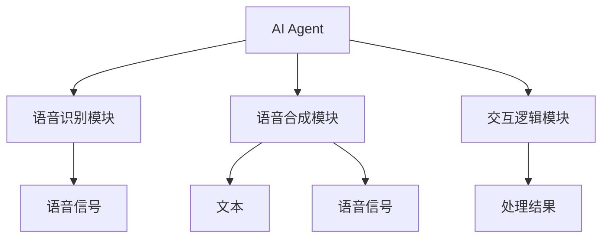

                 


# AI Agent的语音识别与合成技术

---

## 关键词
AI Agent, 语音识别, 语音合成, 深度学习, 语音交互系统

---

## 摘要
本文深入探讨AI Agent在语音识别与合成技术中的应用，从背景、核心原理到实际应用进行全面分析。通过详细讲解语音识别与合成的技术原理、系统架构设计以及项目实战，帮助读者全面掌握AI Agent的语音交互技术。

---

# 第1章: 语音识别与合成技术的背景与应用

## 1.1 语音识别与合成技术的背景

### 1.1.1 语音技术的发展历程
语音技术经历了从早期的声学分析到现代的深度学习技术的演变，逐步实现了从人工特征提取到自动特征学习的跨越。

### 1.1.2 AI Agent在语音技术中的作用
AI Agent通过语音识别和合成技术，能够实现与用户的自然语言交互，提升用户体验。

### 1.1.3 语音识别与合成的定义与特点
- **语音识别**：将语音信号转换为文本或命令的过程。
- **语音合成**：将文本转换为语音的过程。
- **特点**：高准确性、实时性、个性化。

## 1.2 语音识别与合成技术的核心概念

### 1.2.1 语音识别的基本原理
语音识别通过声学特征提取、声学模型和语言模型的结合，实现语音信号到文本的转换。

### 1.2.2 语音合成的基本原理
语音合成通过文本预处理、声学特征提取和语音生成模型，将文本转换为语音。

### 1.2.3 AI Agent与语音技术的结合
AI Agent通过语音识别和合成技术，能够实现智能交互、语音命令处理等功能。

## 1.3 语音识别与合成技术的应用场景

### 1.3.1 智能音箱与语音助手
- 例如，亚马逊的Alexa和苹果的Siri，通过语音识别技术实现语音交互。

### 1.3.2 电话客服系统
- 利用语音识别技术实现自动语音应答系统（IVR）。

### 1.3.3 智能车载系统
- 通过语音识别技术实现车内语音交互，提升驾驶体验。

## 1.4 语音识别与合成技术的挑战与未来趋势

### 1.4.1 技术挑战
- **准确性**：在复杂环境下的识别准确性。
- **实时性**：大规模数据处理的实时性。
- **个性化**：个性化语音合成的实现。

### 1.4.2 未来发展趋势
- **深度学习**：进一步提升模型的准确性和鲁棒性。
- **多模态交互**：结合视觉、触觉等多模态信息，提升交互体验。
- **边缘计算**：将语音处理技术应用于边缘设备，提升响应速度。

## 1.5 本章小结
本章介绍了语音识别与合成技术的背景、核心概念、应用场景以及面临的挑战和未来发展趋势，为后续章节的深入分析奠定了基础。

---

# 第2章: 语音识别技术的核心原理与实现

## 2.1 语音信号处理基础

### 2.1.1 语音信号的特征提取
语音信号的特征提取是语音识别技术的关键步骤，主要包括时域特征、频域特征和声学特征。

#### 2.1.1.1 时域特征
- **幅度特征**：语音信号的幅度随时间的变化。
- **时域统计特征**：如均值、方差等。

#### 2.1.1.2 频域特征
- **频谱特征**：如基频、频带等。
- **Mel频率倒谱系数（MFCC）**：一种常用的语音特征提取方法。

#### 2.1.1.3 声学特征
- **声调特征**：如音调、音高。
- **音量特征**：如响度。
- **语速特征**：如说话速度。

### 2.1.2 声学模型与语言模型

#### 2.1.2.1 声学模型
声学模型用于描述语音信号的概率分布，常用的声学模型包括高斯混合模型（GMM）和深度神经网络（DNN）。

#### 2.1.2.2 语言模型
语言模型用于描述文本序列的概率分布，常用的语言模型包括n-gram模型和基于深度学习的模型。

#### 2.1.2.3 声学模型与语言模型的结合
通过声学模型和语言模型的结合，可以实现更准确的语音识别。

### 2.1.3 语音识别算法的实现

#### 2.1.3.1 基于统计的语音识别算法
- **GMM-HMM模型**：基于高斯混合模型和隐马尔可夫模型的语音识别算法。
- 代码示例：
  ```python
  import numpy as np
  from sklearn.mixture import GaussianMixture

  # 示例：训练GMM模型
  X = np.random.rand(100, 10)  # 100个样本，每个样本10维特征
  gmm = GaussianMixture(n_components=3)
  gmm.fit(X)
  ```

#### 2.1.3.2 基于深度学习的语音识别算法
- **深度神经网络（DNN）**：用于特征提取和分类。
- 代码示例：
  ```python
  import torch
  import torch.nn as nn

  # 示例：定义一个简单的DNN模型
  class SimpleDNN(nn.Module):
      def __init__(self, input_size, hidden_size, output_size):
          super(SimpleDNN, self).__init__()
          self.fc1 = nn.Linear(input_size, hidden_size)
          self.fc2 = nn.Linear(hidden_size, output_size)
          self.relu = nn.ReLU()
          self.softmax = nn.Softmax(dim=1)

      def forward(self, x):
          x = self.fc1(x)
          x = self.relu(x)
          x = self.fc2(x)
          x = self.softmax(x)
          return x
  ```

#### 2.1.3.3 常见语音识别算法的对比分析
| 算法类型       | 优点                          | 缺点                          |
|----------------|-------------------------------|-------------------------------|
| 基于统计的算法 | 实现简单，适合小数据集         | 依赖于特征工程，鲁棒性较差     |
| 基于深度学习的算法 | 鲁棒性高，适合大数据集         | 实现复杂，计算资源消耗较大     |

### 2.1.4 语音识别系统的优化与调优

#### 2.1.4.1 数据增强技术
- **噪声添加**：通过添加噪声提升模型的鲁棒性。
- **速度变换**：通过改变语音播放速度，增加数据多样性。

#### 2.1.4.2 模型优化技术
- **模型剪枝**：通过去除冗余参数，降低模型复杂度。
- **模型量化**：通过降低模型参数的精度，减少模型体积。

#### 2.1.4.3 系统性能的评估与优化
- **准确率**：识别正确的比例。
- **召回率**：识别出的正确结果的比例。
- **F1分数**：准确率和召回率的调和平均数。

## 2.2 本章小结
本章详细讲解了语音识别技术的核心原理，包括语音信号的特征提取、声学模型与语言模型的构建，以及基于统计和深度学习的语音识别算法的实现。同时，还讨论了语音识别系统的优化与调优方法。

---

# 第3章: 语音合成技术的核心原理与实现

## 3.1 语音合成的基本原理

### 3.1.1 文本到语音（TTS）技术
文本到语音（TTS）技术通过将文本转换为语音，实现语音合成。

### 3.1.2 语音合成的分类
- **基于规则的语音合成**：通过预定义的规则生成语音。
- **基于统计的语音合成**：通过统计模型生成语音。
- **基于深度学习的语音合成**：通过深度学习模型生成语音。

### 3.1.3 语音合成的核心要素
- **文本预处理**：包括文本的分词、停用词处理等。
- **声学特征提取**：包括音调、音量、语速等特征的提取。
- **语音生成模型**：通过模型生成语音信号。

### 3.1.4 语音合成的实现步骤
1. **文本预处理**：对输入文本进行清洗和格式化。
2. **声学特征提取**：提取文本的声学特征。
3. **语音生成**：通过模型生成语音信号。

### 3.1.5 语音合成的挑战与解决方案
- **挑战**：生成的语音可能缺乏自然度和多样性。
- **解决方案**：通过改进模型结构和引入多模态信息，提升语音生成的自然度和多样性。

## 3.2 语音合成的特征提取

### 3.2.1 音调特征
音调特征用于描述语音的音调变化，主要包括基频和频移。

### 3.2.2 音量特征
音量特征用于描述语音的响度，通常通过能量或幅度来衡量。

### 3.2.3 语速特征
语速特征用于描述语音的说话速度，通常通过时长或帧率来衡量。

## 3.3 语音合成模型的构建

### 3.3.1 基于统计的语音合成模型
- **GMM-HMM模型**：通过高斯混合模型和隐马尔可夫模型实现语音合成。
- 代码示例：
  ```python
  import numpy as np
  from sklearn.mixture import GaussianMixture

  # 示例：训练GMM模型
  X = np.random.rand(100, 10)  # 100个样本，每个样本10维特征
  gmm = GaussianMixture(n_components=3)
  gmm.fit(X)
  ```

### 3.3.2 基于深度学习的语音合成模型
- **神经网络模型**：如LSTM和Transformer，用于特征提取和语音生成。
- 代码示例：
  ```python
  import torch
  import torch.nn as nn

  # 示例：定义一个简单的LSTM模型
  class SimpleLSTM(nn.Module):
      def __init__(self, input_size, hidden_size, output_size):
          super(SimpleLSTM, self).__init__()
          self.lstm = nn.LSTM(input_size, hidden_size)
          self.fc = nn.Linear(hidden_size, output_size)
          self.relu = nn.ReLU()

      def forward(self, x):
          out, _ = self.lstm(x)
          out = self.fc(out)
          out = self.relu(out)
          return out
  ```

### 3.3.3 常见语音合成模型的对比分析
| 模型类型       | 优点                          | 缺点                          |
|----------------|-------------------------------|-------------------------------|
| 基于规则的模型 | 实现简单，适合特定场景         | 自然度低，缺乏多样性           |
| 基于统计的模型 | 鲁棒性高，适合小数据集         | 依赖于特征工程，灵活性较差     |
| 基于深度学习的模型 | 自然度高，适合大数据集         | 实现复杂，计算资源消耗较大     |

## 3.4 语音合成系统的优化与调优

### 3.4.1 数据增强技术
- **噪声添加**：通过添加噪声提升模型的鲁棒性。
- **音调变换**：通过改变音调，增加数据多样性。

### 3.4.2 模型优化技术
- **模型剪枝**：通过去除冗余参数，降低模型复杂度。
- **模型量化**：通过降低模型参数的精度，减少模型体积。

### 3.4.3 系统性能的评估与优化
- **音质评估**：通过主观听测和客观指标评估语音质量。
- **自然度评估**：通过对比生成语音与真实语音的相似度，评估模型的自然度。

## 3.5 本章小结
本章详细讲解了语音合成技术的核心原理，包括文本预处理、声学特征提取、语音生成模型的构建，以及基于统计和深度学习的语音合成算法的实现。同时，还讨论了语音合成系统的优化与调优方法。

---

# 第4章: AI Agent的语音交互系统设计

## 4.1 AI Agent的语音交互系统架构

### 4.1.1 系统功能模块划分
AI Agent的语音交互系统主要包括语音识别模块、语音合成模块和交互逻辑模块。

### 4.1.2 数据流的处理流程
1. **语音输入**：通过麦克风采集用户的语音信号。
2. **语音识别**：将语音信号转换为文本。
3. **交互逻辑处理**：根据文本内容进行语义理解和逻辑推理。
4. **语音合成**：将处理结果转换为语音信号。
5. **语音输出**：通过扬声器播放生成的语音信号。

### 4.1.3 系统架构的优缺点分析
- **优点**：模块化设计，易于扩展和维护。
- **缺点**：模块之间的耦合度较高，可能影响系统的灵活性。

### 4.1.4 实体关系图


## 4.2 语音识别模块的设计与实现

### 4.2.1 模块功能设计
- **功能描述**：将语音信号转换为文本。
- **输入接口**：语音信号输入接口。
- **输出接口**：文本输出接口。

### 4.2.2 模块实现流程
1. **语音信号预处理**：包括噪声去除、端点检测等。
2. **特征提取**：提取语音信号的时域、频域和声学特征。
3. **模型推理**：通过预训练的语音识别模型进行推理，得到识别结果。
4. **结果输出**：将识别结果输出到交互逻辑模块。

### 4.2.3 模块接口设计
- **输入接口**：提供语音信号输入接口，支持多种音频格式。
- **输出接口**：提供文本输出接口，支持多种字符编码格式。

## 4.3 语音合成模块的设计与实现

### 4.3.1 模块功能设计
- **功能描述**：将文本转换为语音。
- **输入接口**：文本输入接口。
- **输出接口**：语音信号输出接口。

### 4.3.2 模块实现流程
1. **文本预处理**：包括分词、停用词处理等。
2. **特征提取**：提取文本的声学特征，如音调、音量、语速等。
3. **模型推理**：通过预训练的语音合成模型生成语音信号。
4. **结果输出**：将生成的语音信号输出到语音输出模块。

### 4.3.3 模块接口设计
- **输入接口**：提供文本输入接口，支持多种字符编码格式。
- **输出接口**：提供语音信号输出接口，支持多种音频格式。

## 4.4 系统优化与调优

### 4.4.1 系统性能优化
- **模型优化**：通过模型剪枝和量化技术，降低模型复杂度。
- **算法优化**：通过改进算法结构，提升系统性能。

### 4.4.2 系统稳定性优化
- **冗余设计**：通过冗余设计，提升系统的容错性和可靠性。
- **异常处理**：通过异常处理机制，降低系统崩溃的风险。

### 4.4.3 系统安全性优化
- **数据加密**：通过数据加密技术，保护用户隐私。
- **访问控制**：通过访问控制机制，防止未经授权的访问。

## 4.5 本章小结
本章详细讲解了AI Agent的语音交互系统设计，包括系统架构设计、功能模块设计、接口设计以及系统优化与调优方法。

---

# 第5章: 项目实战与案例分析

## 5.1 语音识别与合成技术的项目实战

### 5.1.1 项目背景与需求分析
- **项目背景**：随着智能设备的普及，语音交互技术的需求日益增加。
- **项目需求**：开发一个基于AI Agent的语音交互系统，实现语音识别与合成功能。

### 5.1.2 项目目标
- **实现语音识别功能**：通过语音识别技术实现语音命令的识别。
- **实现语音合成功能**：通过语音合成技术实现语音反馈的生成。

### 5.1.3 系统功能设计

#### 5.1.3.1 功能模块划分
- **语音识别模块**：负责语音信号的采集、特征提取和识别。
- **语音合成模块**：负责文本的处理、特征提取和语音生成。
- **交互逻辑模块**：负责语义理解和逻辑推理。

#### 5.1.3.2 功能流程设计
1. **语音输入**：用户通过麦克风输入语音信号。
2. **语音识别**：通过语音识别模块将语音信号转换为文本。
3. **语义理解**：通过交互逻辑模块理解文本内容。
4. **逻辑推理**：根据语义理解结果进行逻辑推理，生成处理结果。
5. **语音合成**：通过语音合成模块将处理结果转换为语音信号。
6. **语音输出**：通过扬声器输出生成的语音信号。

### 5.1.4 项目实现

#### 5.1.4.1 环境安装
- **Python环境**：安装Python 3.8及以上版本。
- **依赖库安装**：安装PyTorch、Keras、scikit-learn等深度学习库。

#### 5.1.4.2 核心代码实现

##### 语音识别模块实现
```python
import torch
import torch.nn as nn
import torch.optim as optim

# 示例：定义一个简单的语音识别模型
class SimpleRecognizer(nn.Module):
    def __init__(self, input_size, hidden_size, output_size):
        super(SimpleRecognizer, self).__init__()
        self.fc1 = nn.Linear(input_size, hidden_size)
        self.fc2 = nn.Linear(hidden_size, output_size)
        self.relu = nn.ReLU()
        self.softmax = nn.Softmax(dim=1)

    def forward(self, x):
        x = self.fc1(x)
        x = self.relu(x)
        x = self.fc2(x)
        x = self.softmax(x)
        return x

# 示例：训练语音识别模型
def trainRecognizer(model, criterion, optimizer, train_loader, epochs=10):
    for epoch in range(epochs):
        for inputs, labels in train_loader:
            outputs = model(inputs)
            loss = criterion(outputs, labels)
            optimizer.zero_grad()
            loss.backward()
            optimizer.step()
    return model
```

##### 语音合成模块实现
```python
import torch
import torch.nn as nn
import torch.optim as optim

# 示例：定义一个简单的语音合成模型
class SimpleSynthesizer(nn.Module):
    def __init__(self, input_size, hidden_size, output_size):
        super(SimpleSynthesizer, self).__init__()
        self.lstm = nn.LSTM(input_size, hidden_size)
        self.fc = nn.Linear(hidden_size, output_size)
        self.relu = nn.ReLU()

    def forward(self, x):
        out, _ = self.lstm(x)
        out = self.fc(out)
        out = self.relu(out)
        return out

# 示例：训练语音合成模型
def trainSynthesizer(model, criterion, optimizer, train_loader, epochs=10):
    for epoch in range(epochs):
        for inputs, targets in train_loader:
            outputs = model(inputs)
            loss = criterion(outputs, targets)
            optimizer.zero_grad()
            loss.backward()
            optimizer.step()
    return model
```

### 5.1.5 项目实现过程中的问题与解决方案

#### 问题1：语音识别的准确率低
- **原因分析**：训练数据不足，或者模型结构不合理。
- **解决方案**：增加训练数据，或者优化模型结构，引入深度学习技术。

#### 问题2：语音合成的自然度不高
- **原因分析**：模型训练不足，或者特征提取不够精细。
- **解决方案**：增加训练数据，或者优化特征提取方法，引入多模态信息。

### 5.1.6 项目实现中的注意事项
- **数据预处理**：确保数据的干净和一致性。
- **模型调优**：通过交叉验证和网格搜索，优化模型参数。
- **性能评估**：通过准确率、召回率和F1分数等指标，评估模型的性能。

### 5.1.7 项目小结
本节通过一个实际项目，展示了语音识别与合成技术的应用。通过详细讲解项目实现过程中的关键步骤和注意事项，帮助读者更好地理解和掌握相关技术。

---

# 第6章: 总结与展望

## 6.1 总结
本文系统地介绍了AI Agent在语音识别与合成技术中的应用，从背景、核心原理到实际应用进行了全面分析。通过详细讲解语音识别与合成的技术原理、系统架构设计以及项目实战，帮助读者全面掌握AI Agent的语音交互技术。

## 6.2 未来展望
随着深度学习技术的不断发展，语音识别与合成技术将更加智能化和个性化。未来的研究方向包括：
- **多模态交互**：结合视觉、触觉等多模态信息，提升交互体验。
- **边缘计算**：将语音处理技术应用于边缘设备，提升响应速度。
- **个性化语音合成**：通过用户自定义的语音合成，提升用户体验。

---

# 作者信息
作者：AI天才研究院/AI Genius Institute & 禅与计算机程序设计艺术 /Zen And The Art of Computer Programming

