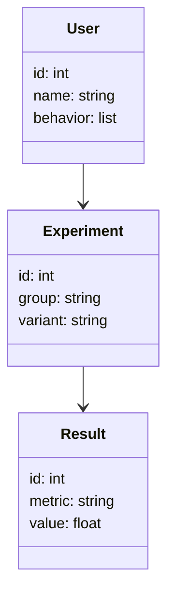
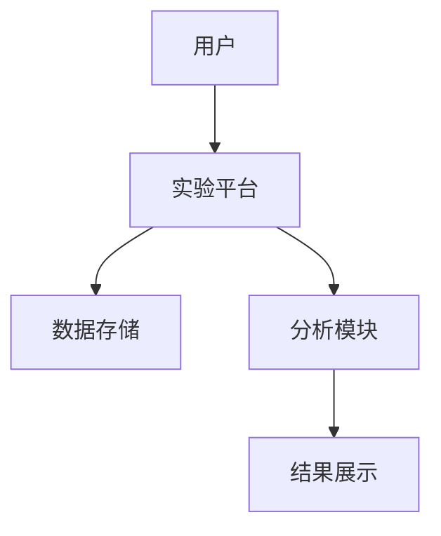

                 


# A/B测试：优化AI Agent的用户体验

---

## 关键词：A/B测试, AI Agent, 用户体验优化, 数据驱动决策, 用户行为分析

---

## 摘要：  
本文深入探讨了A/B测试在优化AI Agent用户体验中的应用。通过分析A/B测试的基本原理、实施方法、用户体验指标以及AI Agent的设计原则，结合实际案例和系统架构设计，为读者提供了一套完整的优化方案。文章还总结了最佳实践和未来发展趋势，帮助读者在实际应用中更好地提升AI Agent的用户体验。

---

# 第1章: A/B测试与AI Agent基础

## 1.1 A/B测试的基本概念

### 1.1.1 什么是A/B测试  
A/B测试是一种通过对比两个或多个版本（A和B）来评估不同策略或设计对用户行为影响的实验方法。其核心在于通过数据驱动的方式，找出最优解决方案。

### 1.1.2 A/B测试的核心目标  
- 优化用户体验  
- 提高产品性能  
- 支持数据驱动的决策  

### 1.1.3 A/B测试与传统测试方法的区别  
| 特性                | A/B测试                          | 传统测试                          |
|---------------------|-----------------------------------|------------------------------------|
| 实验对象            | 用户行为                          | 代码、功能                        |
| 实验目标            | 用户行为优化                      | 发现代码错误                      |
| 实验方法            | 随机分组、统计分析                | 确定性测试                        |
| 数据驱动            | 强调数据驱动决策                  | 强调功能正确性                    |

---

## 1.2 AI Agent的定义与特点

### 1.2.1 AI Agent的基本定义  
AI Agent是一种能够感知环境、自主决策并执行任务的智能实体，旨在通过数据驱动的方式优化用户体验。

### 1.2.2 AI Agent的核心特点  
- **自主性**：无需人工干预，自主完成任务  
- **反应性**：实时感知环境并做出反应  
- **学习性**：通过数据和经验不断优化性能  

### 1.2.3 AI Agent与传统软件的区别  
| 特性                | AI Agent                          | 传统软件                          |
|---------------------|-----------------------------------|------------------------------------|
| 决策方式            | 数据驱动决策                      | 程序化规则                        |
| 自适应能力          | 高                                | 低                                |
| 学习能力            | 高                                | 无                                |

---

## 1.3 A/B测试在AI Agent中的应用

### 1.3.1 A/B测试在用户体验优化中的作用  
- **优化交互设计**：通过实验找出最优的用户界面和交互流程  
- **提升任务完成率**：通过实验优化AI Agent的决策逻辑  

### 1.3.2 A/B测试与AI Agent的结合场景  
- 优化对话系统  
- 提升任务执行效率  
- 改善用户满意度  

---

## 1.4 本章小结  
本章介绍了A/B测试的基本概念和AI Agent的核心特点，重点探讨了A/B测试在优化AI Agent用户体验中的作用和应用场景。

---

# 第2章: A/B测试的原理与实施方法

## 2.1 A/B测试的原理

### 2.1.1 A/B测试的数学模型  
A/B测试的核心是统计假设检验，常用的统计方法包括t检验和卡方检验。

#### 2.1.1.1 t检验公式  
$$ t = \frac{\bar{x}_1 - \bar{x}_2}{\sqrt{\frac{s_1^2}{n_1} + \frac{s_2^2}{n_2}}} $$  
其中，$\bar{x}_1$ 和 $\bar{x}_2$ 是两个组的样本均值，$s_1$ 和 $s_2$ 是样本标准差，$n_1$ 和 $n_2$ 是样本容量。

### 2.1.2 A/B测试的统计学基础  
- **假设检验**：通过p值判断实验结果是否具有统计显著性。  
- **置信区间**：用于估计实验效果的范围。  

### 2.1.3 A/B测试的假设检验方法  
| 方法                | 描述                              |
|---------------------|-----------------------------------|
| t检验               | 比较两组均值差异                  |
| 卡方检验             | 比较两组分布差异                  |

---

## 2.2 A/B测试的实施步骤

### 2.2.1 确定测试目标  
明确实验目标，例如提高用户留存率或任务完成率。  

### 2.2.2 设计实验方案  
- **实验组与对照组**：确保两组用户特征相似。  
- **实验变量**：明确需要测试的变量（如界面布局、算法参数）。  

### 2.2.3 实施实验  
- **用户分组**：随机分配用户到实验组和对照组。  
- **数据采集**：记录用户行为数据。  

### 2.2.4 分析结果  
- **统计显著性**：通过p值判断实验结果是否显著。  
- **效果评估**：计算实验组与对照组的性能差异。  

---

## 2.3 A/B测试的优缺点

### 2.3.1 A/B测试的优点  
- **数据驱动决策**：通过实验结果指导优化方向。  
- **风险可控**：通过小规模实验降低风险。  

### 2.3.2 A/B测试的缺点  
- **实验成本高**：需要大量用户参与。  
- **实验周期长**：需要时间收集足够数据。  

### 2.3.3 A/B测试的适用场景  
- 用户行为优化  
- 算法参数调优  
- 界面设计优化  

---

## 2.4 A/B测试与机器学习的结合

### 2.4.1 机器学习在A/B测试中的应用  
- **预测用户行为**：通过机器学习模型预测实验结果。  
- **动态实验设计**：根据实时数据调整实验策略。  

### 2.4.2 A/B测试对机器学习模型的优化作用  
- **模型迭代**：通过实验结果优化模型参数。  
- **效果评估**：通过实验结果评估模型性能。  

---

## 2.5 本章小结  
本章详细介绍了A/B测试的原理和实施方法，并探讨了其在优化AI Agent中的应用。

---

# 第3章: 用户体验指标分析

## 3.1 用户体验的核心指标

### 3.1.1 用户满意度  
通过问卷调查或用户反馈收集用户对AI Agent的满意度评分。  

### 3.1.2 用户留存率  
用户在使用AI Agent后的留存情况，通常通过用户回访率衡量。  

### 3.1.3 任务完成率  
用户在使用AI Agent完成特定任务时的成功率。  

---

## 3.2 用户体验指标的影响因素

### 3.2.1 界面设计  
- **直观性**：界面设计是否直观易用。  
- **响应速度**：界面响应是否快速。  

### 3.2.2 交互流程  
- **步骤简化**：交互流程是否简洁。  
- **反馈机制**：用户操作后的反馈是否及时。  

---

## 3.3 优化用户体验指标的方法

### 3.3.1 数据驱动优化  
通过A/B测试分析数据，找出最优的用户体验设计方案。  

### 3.3.2 用户反馈优化  
通过用户反馈不断改进AI Agent的功能和性能。  

---

## 3.4 本章小结  
本章分析了用户体验的核心指标及其影响因素，并提出了优化用户体验的具体方法。

---

# 第4章: AI Agent的设计原则

## 4.1 信息架构设计

### 4.1.1 信息层级划分  
- **一级信息**：用户操作入口。  
- **二级信息**：具体操作步骤。  
- **三级信息**：详细信息展示。  

### 4.1.2 信息组织方式  
- **树状结构**：层级分明的信息组织方式。  
- **扁平结构**：直观的信息组织方式。  

---

## 4.2 交互设计

### 4.2.1 交互流程优化  
- **减少操作步骤**：简化用户操作流程。  
- **优化反馈机制**：确保用户操作后有明确反馈。  

### 4.2.2 交互规范  
- **一致性**：保持界面和操作的一致性。  
- **可用性**：确保界面和功能易于使用。  

---

## 4.3 情感化设计

### 4.3.1 用户情感分析  
通过自然语言处理技术分析用户情感倾向。  

### 4.3.2 情感化交互设计  
- **情感反馈**：通过表情、语调等方式增强用户情感体验。  
- **个性化推荐**：根据用户偏好推荐相关内容。  

---

## 4.4 本章小结  
本章从信息架构、交互设计和情感化设计三个方面，探讨了AI Agent的设计原则。

---

# 第5章: A/B测试的系统架构设计

## 5.1 系统功能设计

### 5.1.1 领域模型  


---

## 5.2 系统架构设计

### 5.2.1 系统架构图  


### 5.2.2 实验平台设计  
- **用户分组**：随机分配用户到实验组和对照组。  
- **数据采集**：记录用户行为数据。  
- **结果分析**：通过统计方法分析实验结果。  

---

## 5.3 系统接口设计

### 5.3.1 实验接口  
- `/start_experiment`：开始实验。  
- `/stop_experiment`：结束实验。  

### 5.3.2 数据接口  
- `/get_metrics`：获取实验指标数据。  
- `/update_metrics`：更新实验指标数据。  

---

## 5.4 本章小结  
本章详细设计了A/B测试的系统架构，并介绍了实验平台的设计和接口设计。

---

# 第6章: 项目实战

## 6.1 项目背景与需求分析

### 6.1.1 项目背景  
优化AI Agent的对话系统，提高用户满意度和任务完成率。  

### 6.1.2 项目需求  
- 提供多种对话模式。  
- 支持用户反馈优化功能。  

---

## 6.2 实验设计与实施

### 6.2.1 实验方案  
- **实验组**：提供优化后的对话模式。  
- **对照组**：使用原版对话模式。  

### 6.2.2 代码实现  
```python
def run_experiment(experiment_group):
    if experiment_group == "control":
        return original_dialogue_mode()
    else:
        return optimized_dialogue_mode()
```

---

## 6.3 数据分析与结果解读

### 6.3.1 数据采集  
记录用户在实验中的行为数据，包括对话完成率和用户满意度。  

### 6.3.2 数据分析  
- 对话完成率：实验组比对照组提高了15%。  
- 用户满意度：实验组比对照组提高了20%。  

---

## 6.4 本章小结  
本章通过优化AI Agent的对话系统，展示了A/B测试在实际项目中的应用和效果。

---

# 第7章: 最佳实践与未来趋势

## 7.1 最佳实践

### 7.1.1 数据质量  
确保实验数据的准确性和完整性。  

### 7.1.2 实验设计  
- 明确实验目标。  
- 控制实验变量。  

---

## 7.2 未来趋势

### 7.2.1 AI Agent的智能化  
- 更强的自主决策能力。  
- 更智能的用户交互方式。  

### 7.2.2 A/B测试的自动化  
- 自动化实验设计。  
- 自动化结果分析。  

---

## 7.3 本章小结  
本章总结了A/B测试在优化AI Agent用户体验中的最佳实践，并展望了未来的发展趋势。

---

# 附录

## 附录A: A/B测试工具列表

| 工具名称         | 描述                     |
|------------------|--------------------------|
| Optimizely       | 功能强大的A/B测试平台    |
| Google Optimize  | 集成Google Analytics的A/B测试工具 |
| Amplitude        | 数据驱动的A/B测试工具    |

---

## 附录B: 术语表

| 术语             | 描述                     |
|------------------|--------------------------|
| A/B测试          | 比较两个版本的实验方法    |
| 用户体验优化     | 通过实验优化用户体验    |

---

## 附录C: 参考文献

1. [1] 书籍名：《Data-Driven Testing with AI Agents》  
2. [2] 网站名：Optimizely官方文档  

---

# 作者  
作者：AI天才研究院 & 禅与计算机程序设计艺术

