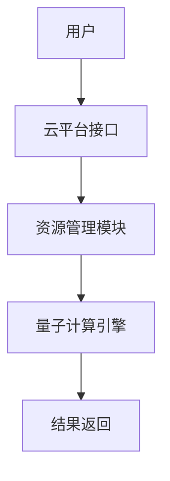
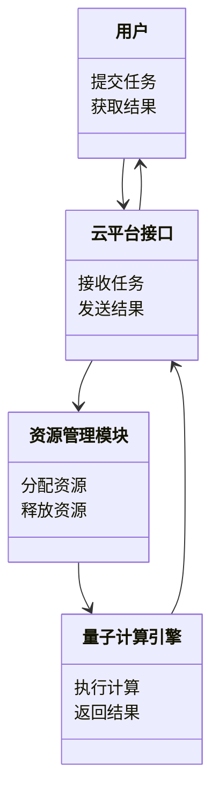
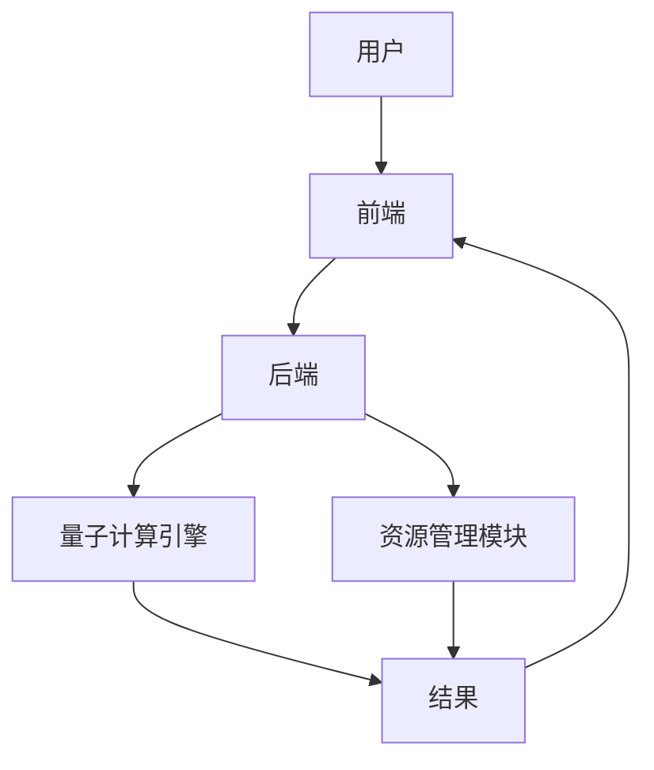
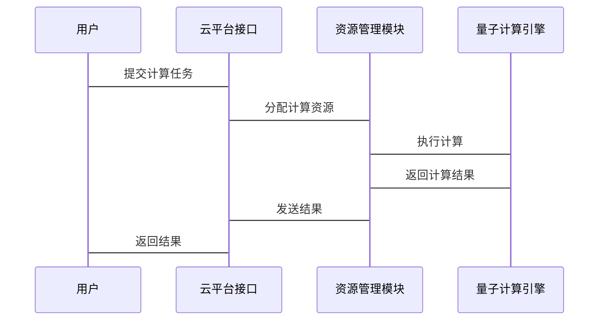

                 


# 价值投资中的量子计算机云服务市场分析

> 关键词：量子计算机、云服务、价值投资、市场分析、技术驱动

> 摘要：量子计算机作为一项革命性技术，正在改变多个行业的计算能力。随着量子计算机云服务的兴起，投资者需要了解这一市场的潜力和风险。本文将从量子计算机的基本原理、云服务的商业模式、价值投资的策略以及市场的系统分析等多个角度，深入探讨量子计算机云服务市场的投资机会和挑战。

---

# 第1章: 量子计算机与云服务的概述

## 1.1 量子计算机的基本概念

### 1.1.1 量子计算机的定义与基本原理

量子计算机是一种利用量子力学原理进行计算的设备。与经典计算机不同，量子计算机使用量子位（qubit）而非二进制位（bit）来进行计算。量子位可以同时处于多个状态（量子叠加），并通过量子纠缠实现信息的高效传递和处理。

量子计算机的核心原理基于以下几个关键概念：

- **量子叠加**：量子位可以同时处于0和1的状态，直到被测量为止。
- **量子纠缠**：两个或多个量子位之间可以形成一种特殊的关系，使得其中一个量子位的状态会直接影响另一个量子位的状态。
- **量子测量**：测量会破坏量子叠加状态，将量子位的状态确定下来。

量子计算机的计算能力在某些特定问题上远超经典计算机，例如因式分解、优化问题和模拟量子系统。

### 1.1.2 量子计算机与经典计算机的区别

| 属性                | 经典计算机       | 量子计算机       |
|---------------------|------------------|------------------|
| 基础单位           | 二进制位（bit）   | 量子位（qubit）   |
| 并行计算能力         | 串行             | 并行             |
| 处理复杂问题的能力   | 慢               | 快               |

### 1.1.3 量子计算机的潜在应用场景

量子计算机在以下领域的应用潜力巨大：

1. **密码学**：量子计算机可以快速破解现有的加密算法（如RSA）。
2. **优化问题**：例如物流路径优化、金融投资组合优化。
3. **药物研发**：通过模拟分子结构加速药物开发。
4. **材料科学**：研究新材料的物理特性。

---

## 1.2 云服务的基本概念

### 1.2.1 云服务的定义与分类

云服务是一种通过互联网提供计算资源（如计算能力、存储空间、数据库）的模式。云服务可以分为以下几类：

1. **基础设施即服务（IaaS）**：提供虚拟化计算资源，例如亚马逊的AWS。
2. **平台即服务（PaaS）**：提供开发和部署环境，例如Google Cloud。
3. **软件即服务（SaaS）**：提供软件应用，例如Salesforce。

### 1.2.2 云服务的商业模式

云服务的商业模式主要包括：

1. **按需付费**：用户根据使用量支付费用。
2. **订阅模式**：用户按月或按年支付固定费用。
3. **定制化服务**：针对特定需求提供定制化解决方案。

### 1.2.3 云服务的关键技术与挑战

云服务的关键技术包括：

1. **虚拟化技术**：实现资源的高效利用。
2. **容器技术**：例如Docker，用于快速部署和扩展服务。
3. **边缘计算**：将计算能力延伸到数据源附近，减少延迟。

云服务的挑战包括：

1. **数据安全**：如何保护用户数据不被泄露。
2. **性能瓶颈**：如何应对高并发请求。
3. **成本控制**：如何优化资源使用以降低成本。

---

## 1.3 量子计算机与云服务的结合

### 1.3.1 量子计算机云服务的定义

量子计算机云服务是一种通过云平台提供量子计算资源的服务模式。用户可以通过互联网访问量子计算机的计算能力，无需拥有物理设备。

### 1.3.2 量子计算机云服务的优势

1. **降低门槛**：用户无需购买昂贵的量子计算机设备。
2. **按需使用**：用户可以根据需求灵活调整计算资源。
3. **快速迭代**：通过云服务快速测试和优化量子算法。

### 1.3.3 量子计算机云服务的市场潜力

随着量子计算机技术的成熟和成本的下降，量子计算机云服务的市场需求将快速增长。特别是在金融、物流和医疗等领域，量子计算机云服务有望成为主流解决方案。

---

## 1.4 本章小结

本章介绍了量子计算机的基本原理、云服务的商业模式以及两者结合的潜力。量子计算机云服务作为一种新兴的技术驱动型服务，具有巨大的市场潜力，但也面临技术和市场化的挑战。

---

# 第2章: 量子计算机云服务的市场分析基础

## 2.1 价值投资的基本概念

### 2.1.1 价值投资的定义与核心理念

价值投资是一种投资策略，强调以低于内在价值的价格购买优质资产。核心理念包括：

1. **长期视角**：关注企业的长期价值，而非短期波动。
2. **基本面分析**：通过分析企业的财务状况、行业地位和竞争优势来评估其价值。
3. **安全边际**：以低于内在价值的价格买入，以降低风险。

### 2.1.2 价值投资与市场分析的关系

市场分析是价值投资的重要组成部分。通过分析市场趋势、行业竞争格局和企业财务状况，投资者可以更好地识别具有长期增长潜力的企业。

### 2.1.3 价值投资在科技领域的应用

科技领域是价值投资的重要战场。由于技术进步的不可预测性，投资者需要更加谨慎地评估技术的可行性和商业化潜力。

---

## 2.2 量子计算机云服务市场的现状

### 2.2.1 全球量子计算机云服务市场的规模与增长

量子计算机云服务市场目前仍处于起步阶段，但增长潜力巨大。根据市场研究机构的预测，到2030年，量子计算机云服务市场规模可能达到数百亿美元。

### 2.2.2 主要量子计算机云服务提供商分析

目前，主要的量子计算机云服务提供商包括：

1. **IBM**：提供 IBM Q 云服务。
2. **Google**：提供 Quantum Computing Service。
3. **Rigetti**：专注于量子计算的初创公司。

### 2.2.3 市场竞争格局与发展趋势

当前市场格局呈现“寡头垄断”趋势，但随着技术的进步和成本的下降，越来越多的新兴企业开始进入这一领域。

---

## 2.3 量子计算机云服务市场的关键驱动因素

### 2.3.1 技术进步对市场的影响

技术进步是量子计算机云服务市场发展的核心驱动力。量子算法的优化和硬件的升级将直接影响市场的规模和潜力。

### 2.3.2 市场需求的变化与驱动因素

市场需求的变化主要由以下几个因素驱动：

1. **行业需求**：金融、物流和医疗等行业对量子计算的需求不断增长。
2. **政策支持**：政府对量子计算技术的支持将推动市场发展。
3. **企业认知度**：企业对量子计算的认知度提高将促进市场普及。

---

## 2.4 本章小结

本章分析了量子计算机云服务市场的现状、主要参与者和关键驱动因素。技术进步和市场需求是推动市场发展的主要动力，而政策支持和企业认知度的提高也将进一步扩大市场。

---

# 第3章: 价值投资策略在量子计算机云服务市场的应用

## 3.1 价值投资的核心策略

### 3.1.1 基本面分析的核心要素

基本面分析是价值投资的核心方法，主要包括以下几个要素：

1. **财务状况**：企业的收入、利润和现金流。
2. **行业地位**：企业在行业中的竞争地位。
3. **竞争优势**：企业的核心竞争力，例如技术壁垒、品牌影响力等。

### 3.1.2 市场情绪与投资者心理

市场情绪和投资者心理对价值投资有重要影响。投资者需要避免被短期市场波动所左右，而是专注于企业的长期价值。

### 3.1.3 长期投资与短期波动的平衡

价值投资者需要在长期投资和短期波动之间找到平衡点。短期波动是市场的一部分，但长期价值才是决定投资回报的关键。

---

## 3.2 量子计算机云服务市场的投资机会

### 3.2.1 技术领先企业的投资价值

技术领先的企业通常具有更高的投资价值。例如，IBM和Google在量子计算机领域的技术积累和市场占有率是其投资价值的重要指标。

### 3.2.2 市场领导者与新兴企业的对比

市场领导者通常具有更强的市场影响力和品牌优势，而新兴企业可能更具灵活性和创新能力。投资者需要根据企业的具体情况综合评估。

### 3.2.3 行业整合与并购机会

行业整合和并购是量子计算机云服务市场发展的重要趋势。投资者需要关注行业整合的潜在机会，同时警惕整合带来的风险。

---

## 3.3 价值投资中的风险管理

### 3.3.1 市场风险的识别与评估

市场风险是价值投资中不可忽视的风险。投资者需要通过基本面分析和市场趋势分析来识别和评估市场风险。

### 3.3.2 投资组合的优化与分散

通过优化投资组合和分散投资，投资者可以降低市场风险。例如，将资金分散投资于不同的行业和企业。

### 3.3.3 退出策略与风险控制

退出策略是价值投资的重要组成部分。投资者需要制定合理的退出策略，以应对市场波动和企业变化。

---

## 3.4 本章小结

本章探讨了价值投资策略在量子计算机云服务市场的应用，强调了基本面分析、市场风险管理和投资组合优化的重要性。投资者需要结合企业的长期价值和市场趋势，制定合理的投资策略。

---

# 第4章: 量子计算机云服务市场的系统分析与架构设计

## 4.1 量子计算机云服务的系统架构

### 4.1.1 系统功能模块划分

量子计算机云服务的系统架构通常包括以下几个模块：

1. **量子计算引擎**：负责量子计算的核心逻辑。
2. **云平台接口**：与用户交互的界面。
3. **资源管理模块**：负责计算资源的分配和管理。

### 4.1.2 系统架构设计

以下是一个量子计算机云服务系统的架构图：



### 4.1.3 系统接口设计

系统接口设计需要考虑以下几个方面：

1. **用户接口**：提供友好的用户界面，方便用户提交计算任务。
2. **API接口**：提供程序matic接口，方便开发者调用量子计算服务。
3. **安全接口**：确保数据传输的安全性和用户隐私。

---

## 4.2 系统功能设计

### 4.2.1 项目介绍

量子计算机云服务系统旨在为用户提供高效、安全的量子计算服务。用户可以通过云平台提交计算任务，并获得快速的计算结果。

### 4.2.2 系统功能模块设计

以下是一个量子计算机云服务系统的功能模块图：



---

## 4.3 系统架构设计

### 4.3.1 系统架构图

以下是一个量子计算机云服务系统的架构图：



### 4.3.2 系统接口设计

系统接口设计需要考虑以下几个方面：

1. **用户接口**：提供用户友好的操作界面。
2. **API接口**：提供程序matic接口，方便开发者调用。
3. **安全接口**：确保数据传输的安全性。

---

## 4.4 系统交互设计

### 4.4.1 系统交互流程

以下是一个量子计算机云服务系统的交互流程图：



---

## 4.5 本章小结

本章从系统架构和功能设计的角度，详细分析了量子计算机云服务系统的实现过程。通过系统架构图和交互流程图，展示了量子计算机云服务的核心逻辑和实现步骤。

---

# 第5章: 量子计算机云服务市场的项目实战

## 5.1 项目背景

随着量子计算机技术的快速发展，量子计算机云服务市场需求日益增长。本项目旨在通过实际案例，展示量子计算机云服务的实现和应用。

---

## 5.2 项目需求分析

### 5.2.1 项目目标

本项目的目标是开发一个基于云平台的量子计算机服务系统，提供高效的量子计算能力。

### 5.2.2 项目范围

项目范围包括：

1. 系统设计与实现
2. 云平台接口开发
3. 资源管理模块实现
4. 量子计算引擎开发

---

## 5.3 项目实现

### 5.3.1 环境安装

为了实现量子计算机云服务系统，需要安装以下工具和库：

1. **Python**：编程语言
2. **Qiskit**：量子计算开发库
3. **Flask**：Web框架
4. **MongoDB**：数据库

### 5.3.2 核心代码实现

以下是一个量子计算引擎的核心代码示例：

```python
from qiskit import QuantumCircuit, execute, Aer
from qiskit.visualization import plot_histogram

# 创建量子电路
qc = QuantumCircuit(2, 2)
qc.h(0)
qc.cx(0, 1)
qc.measure([0,1], [0,1])

# 执行计算
backend = Aer.get_backend('qasm_simulator')
job = execute(qc, backend)
result = job.result()

# 可视化结果
plot_histogram(result.get_counts(qc))
```

### 5.3.3 代码应用解读

上述代码展示了如何使用Qiskit库实现一个简单的量子计算任务。通过创建量子电路、执行计算和可视化结果，展示了量子计算机的基本功能。

---

## 5.4 实际案例分析

### 5.4.1 案例背景

某企业在优化物流路径时，使用量子计算机云服务进行计算，大幅提高了效率。

### 5.4.2 案例分析

通过量子计算机云服务，企业能够快速找到最优物流路径，降低运输成本和时间。

---

## 5.5 项目小结

本章通过实际案例展示了量子计算机云服务系统的实现和应用。通过项目实战，读者可以更好地理解量子计算机云服务的核心技术和应用价值。

---

# 第6章: 量子计算机云服务市场的总结与展望

## 6.1 本章总结

本章总结了量子计算机云服务市场的核心内容，包括量子计算机的基本原理、云服务的商业模式、价值投资的策略以及系统的实现与应用。

---

## 6.2 未来展望

随着量子计算机技术的不断进步和市场的逐步成熟，量子计算机云服务市场将进入快速发展阶段。未来，量子计算机云服务将在更多领域得到应用，成为科技投资的重要方向。

---

# 作者：AI天才研究院 & 禅与计算机程序设计艺术

