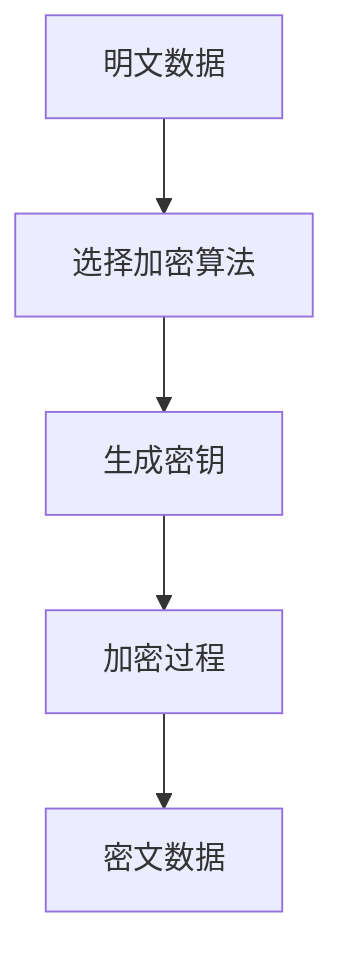

                 


# 企业AI Agent的多维安全防护：数据加密与访问控制

> 关键词：企业AI Agent，数据加密，访问控制，安全防护，多维防护

> 摘要：随着企业AI Agent技术的广泛应用，数据安全问题变得日益重要。本文从数据加密与访问控制两个核心方面入手，系统性地探讨了企业AI Agent的多维安全防护策略。文章首先介绍了企业AI Agent的基本概念与安全防护的重要性，接着深入分析了数据加密的核心原理与实现技术，详细阐述了访问控制机制的设计与应用，最后通过实际案例展示了如何在企业环境中构建一个多维安全防护体系，确保企业AI Agent系统的数据安全与合规性。

---

# 第一部分: 企业AI Agent的多维安全防护概述

## 第1章: 企业AI Agent与安全防护概述

### 1.1 企业AI Agent的定义与特点

#### 1.1.1 企业AI Agent的基本概念
企业AI Agent（Artificial Intelligence Agent）是一种能够感知环境、自主决策并执行任务的智能体。它结合了人工智能、大数据分析和自动化技术，广泛应用于企业智能化运营、流程自动化、客户服务等领域。

#### 1.1.2 AI Agent的核心功能与优势
AI Agent的核心功能包括：
1. **感知环境**：通过传感器、API接口等方式获取实时数据。
2. **自主决策**：基于数据进行分析和推理，制定最优决策。
3. **执行任务**：通过与企业系统的交互，执行具体的业务操作。
4. **学习优化**：通过机器学习算法不断优化自身的决策能力。

其优势在于能够显著提高企业运营效率、降低人工成本，并提供24/7的全天候服务。

#### 1.1.3 企业AI Agent的应用场景
企业AI Agent的应用场景涵盖多个领域：
- **客户关系管理**：智能客服、个性化推荐。
- **供应链管理**：自动化订单处理、库存优化。
- **金融服务**：智能投顾、风险监控。
- **智能制造**：生产过程优化、设备维护预测。

### 1.2 数据加密与访问控制的重要性

#### 1.2.1 数据加密在AI Agent中的作用
AI Agent在运行过程中处理大量敏感数据，包括客户信息、业务数据等。数据加密是保护这些信息不被未经授权访问的关键技术。

- **数据加密分类**：
  - **对称加密**：速度快，适用于大量数据加密，如AES算法。
  - **非对称加密**：安全性高，适用于数据签名和身份验证，如RSA算法。

#### 1.2.2 访问控制在企业安全中的地位
访问控制是防止未经授权的用户访问系统资源的重要机制。在企业AI Agent中，访问控制确保只有合法用户能够执行特定操作。

- **访问控制模型**：
  - **基于角色的访问控制（RBAC）**：根据用户角色分配权限。
  - **基于属性的访问控制（ABAC）**：根据用户属性和环境条件动态调整权限。

#### 1.2.3 多维安全防护的必要性
企业AI Agent的安全防护需要从多个维度入手，包括网络层、数据层、应用层等。多维防护能够有效应对复杂的安全威胁，确保系统的整体安全性。

### 1.3 企业AI Agent安全防护的挑战与解决方案

#### 1.3.1 数据泄露的风险
AI Agent处理的数据种类繁多，容易成为攻击目标。数据泄露可能导致企业面临法律风险和经济损失。

#### 1.3.2 权限滥用的问题
未经授权的用户可能通过访问控制漏洞滥用系统权限，造成数据泄露或系统损坏。

#### 1.3.3 多维防护的策略与技术
- **数据加密**：在数据存储和传输过程中使用加密技术，确保数据机密性。
- **访问控制**：通过严格的权限管理，限制用户的访问范围。
- **多因素认证**：结合多种身份验证方式，提高系统的安全性。

### 1.4 本章小结
本章介绍了企业AI Agent的基本概念、功能特点及应用场景，并重点阐述了数据加密与访问控制在安全防护中的重要性。通过分析数据泄露和权限滥用的潜在风险，提出了多维安全防护的策略与技术。

---

## 第2章: 数据加密的核心原理

### 2.1 数据加密的基本概念

#### 2.1.1 加密算法的分类
加密算法主要分为两类：
- **对称加密**：加密和解密使用相同的密钥，如AES算法。
- **非对称加密**：加密和解密使用不同的密钥，如RSA算法。

#### 2.1.2 对称加密与非对称加密的对比
| 对比维度 | 对称加密 | 非对称加密 |
|----------|----------|------------|
| 密钥管理 | 仅需一个密钥 | 需要一对公钥和私钥 |
| 加密速度 | 高 | 较低 |
| 适用场景 | 大数据量加密 | 数字签名、身份验证 |

### 2.2 常见加密算法详解

#### 2.2.1 AES加密算法的原理
AES（高级加密标准）是一种广泛使用的对称加密算法，其加密过程如下：

1. **明文准备**：将明文划分为固定长度的块。
2. **初始轮密钥加**：将密钥与明文块进行异或操作。
3. **多轮加密**：每轮包括四个基本操作：字节代换、行移位、列混淆和轮密钥加。
4. **生成密文**：经过多轮加密后，生成密文块。

#### 2.2.2 RSA加密算法的数学基础
RSA算法基于大整数分解的困难性，其数学模型如下：
- **密钥生成**：
  - 选择两个大质数 \( p \) 和 \( q \)。
  - 计算 \( n = p \times q \)。
  - 计算公钥 \( e \) 和私钥 \( d \)，满足 \( (e \times d) \equiv 1 \mod (\phi(n)) \)，其中 \( \phi(n) = (p-1)(q-1) \)。
- **加密过程**：
  - 明文 \( M \) 转换为整数后，加密为 \( C = M^e \mod n \)。
- **解密过程**：
  - 密文 \( C \) 解密为 \( M = C^d \mod n \)。

#### 2.2.3 椭圆曲线加密的应用
椭圆曲线加密（ECC）是一种基于椭圆曲线数学的公钥加密技术，其优点在于密钥长度短、安全性高。

### 2.3 数据加密的数学模型与公式

#### 2.3.1 AES加密的数学模型
$$ AES加密过程：明文 \rightarrow 状态 \rightarrow 加密 \rightarrow 密文 $$

#### 2.3.2 RSA公钥加密的数学公式
$$ RSA加密：C = M^e \mod N $$

### 2.4 数据加密的实现步骤

#### 2.4.1 数据加密的流程图


### 2.5 本章小结
本章详细讲解了数据加密的核心原理，包括对称加密和非对称加密的分类、AES和RSA算法的数学模型与实现步骤。通过对比分析，明确了不同加密算法的应用场景与优缺点。

---

## 第3章: 访问控制的核心原理

### 3.1 访问控制的基本概念

#### 3.1.1 访问控制模型
访问控制模型是通过规则和策略来限制用户对资源访问的机制。常见的访问控制模型包括：
- **基于角色的访问控制（RBAC）**：根据用户角色分配权限。
- **基于属性的访问控制（ABAC）**：根据用户属性和环境条件动态调整权限。

#### 3.1.2 访问控制的实现步骤
1. **身份认证**：验证用户身份。
2. **权限检查**：根据用户角色或属性，判断是否允许访问。
3. **访问日志**：记录用户操作，便于审计和追踪。

### 3.2 基于角色的访问控制（RBAC）模型

#### 3.2.1 RBAC模型的定义
RBAC模型通过角色和权限的分配，实现对资源的访问控制。其核心要素包括：
- **用户（User）**：系统的实际操作者。
- **角色（Role）**：用户被赋予的一组权限集合。
- **权限（Permission）**：用户或角色被允许执行的操作。

#### 3.2.2 RBAC模型的实现流程
1. **用户注册**：创建用户并分配角色。
2. **权限分配**：根据角色分配相应的权限。
3. **访问控制**：在用户访问资源时，检查其权限是否允许。

### 3.3 基于属性的访问控制（ABAC）模型

#### 3.3.1 ABAC模型的定义
ABAC模型根据用户属性（如时间、地点、设备等）和环境条件动态调整用户的访问权限。

#### 3.3.2 ABAC模型的优势
- **灵活性**：能够根据环境条件动态调整权限。
- **细粒度**：可以实现基于具体场景的访问控制。

### 3.4 访问控制的数学模型与公式

#### 3.4.1 RBAC模型的数学表示
$$ permission(u, r) = \exists role \in roles(u) \land permission(role, r) $$

其中：
- \( u \)：用户
- \( r \)：资源
- \( roles(u) \)：用户拥有的角色集合

#### 3.4.2 ABAC模型的数学表示
$$ allow(u, r) = condition(context, u, r) $$

其中：
- \( context \)：环境条件
- \( u \)：用户
- \( r \)：资源

### 3.5 本章小结
本章重点介绍了访问控制的核心原理，包括RBAC和ABAC两种模型的定义、实现流程和数学表示。通过对比分析，明确了不同访问控制模型的应用场景与优缺点。

---

## 第4章: 数据加密与访问控制的结合应用

### 4.1 数据加密与访问控制的协同作用

#### 4.1.1 数据加密保障数据机密性
数据加密确保数据在存储和传输过程中的机密性，防止未经授权的访问。

#### 4.1.2 访问控制保障数据完整性
通过严格的访问控制，确保只有合法用户能够修改数据，防止数据篡改。

### 4.2 数据加密与访问控制的结合方案

#### 4.2.1 数据存储安全
- **加密存储**：将敏感数据加密后存储。
- **访问控制**：通过权限管理，限制对加密数据的访问。

#### 4.2.2 数据传输安全
- **加密传输**：使用SSL/TLS等协议加密数据传输。
- **访问控制**：通过身份认证和权限管理，确保数据仅被合法用户接收。

### 4.3 数据加密与访问控制的实现步骤

#### 4.3.1 数据存储安全实现
1. **数据加密**：使用AES算法对敏感数据进行加密。
2. **访问控制**：通过RBAC模型限制对加密数据的访问权限。

#### 4.3.2 数据传输安全实现
1. **加密传输**：使用SSL/TLS协议加密数据传输。
2. **身份认证**：通过多因素认证确保用户身份合法。
3. **权限管理**：通过访问控制列表（ACL）限制数据接收范围。

### 4.4 本章小结
本章探讨了数据加密与访问控制的结合应用，强调了两者协同的重要性。通过具体的实现步骤，展示了如何在企业AI Agent中构建多维安全防护体系。

---

## 第5章: 企业AI Agent的多维安全防护实现

### 5.1 多维安全防护的总体架构

#### 5.1.1 安全防护的多维性
多维安全防护包括网络层、数据层、应用层等多个维度的安全措施。

#### 5.1.2 多维防护的实现架构
- **网络层**：防火墙、入侵检测系统。
- **数据层**：数据加密、访问控制。
- **应用层**：身份认证、权限管理。

### 5.2 企业AI Agent的安全防护策略

#### 5.2.1 数据加密策略
- **数据分类**：根据数据敏感程度选择合适的加密算法。
- **密钥管理**：建立完善的密钥管理制度，确保密钥的安全性。

#### 5.2.2 访问控制策略
- **最小权限原则**：用户仅拥有完成任务所需的最小权限。
- **动态权限管理**：根据用户角色和环境条件动态调整权限。

### 5.3 企业AI Agent的安全防护措施

#### 5.3.1 数据加密措施
- **数据加密**：对敏感数据进行加密存储和传输。
- **加密算法选择**：根据需求选择合适的加密算法，如AES、RSA等。

#### 5.3.2 访问控制措施
- **身份认证**：通过多因素认证确保用户身份合法。
- **权限管理**：通过RBAC或ABAC模型动态调整用户权限。

### 5.4 本章小结
本章提出了企业AI Agent的多维安全防护实现方案，从总体架构到具体措施，详细阐述了如何构建一个多维的安全防护体系。

---

## 第6章: 项目实战与总结

### 6.1 项目实战

#### 6.1.1 环境安装
- **操作系统**：Linux或Windows。
- **开发工具**：PyCharm、VS Code。
- **依赖库安装**：使用pip安装加密库（如cryptography）和访问控制库（如django-rbac）。

#### 6.1.2 核心代码实现
##### 数据加密实现
```python
from cryptography.fernet import Fernet

# 生成密钥
key = Fernet.generate_key()
cipher = Fernet(key)

# 加密数据
plaintext = "Sensitive data"
encrypted_data = cipher.encrypt(plaintext.encode())
```

##### 访问控制实现
```python
# 基于角色的访问控制实现
class RoleBasedAccessControl:
    def __init__(self):
        self.roles = {}
        self.permissions = {}

    def assign_role(self, user, role):
        self.roles[user] = role

    def grant_permission(self, role, permission):
        if role not in self.permissions:
            self.permissions[role] = set()
        self.permissions[role].add(permission)

    def has_permission(self, user, permission):
        role = self.roles.get(user, None)
        if not role:
            return False
        return permission in self.permissions.get(role, set())
```

#### 6.1.3 案例分析与详细解读
通过一个简单的案例，展示了如何在企业AI Agent中实现数据加密与访问控制。例如，在客户关系管理系统中，使用AES加密保护客户数据，并通过RBAC模型限制只有客服人员才能访问客户信息。

### 6.2 总结

#### 6.2.1 本章总结
本文从数据加密与访问控制两个核心方面，系统性地探讨了企业AI Agent的多维安全防护策略。通过理论分析与实际案例的结合，展示了如何在企业环境中构建一个多维安全防护体系。

#### 6.2.2 注意事项
- **密钥管理**：密钥是加密的核心，必须妥善保管。
- **权限管理**：遵循最小权限原则，避免权限滥用。
- **日志审计**：定期审计访问日志，及时发现异常行为。

#### 6.2.3 拓展阅读
- 《网络安全技术及应用》
- 《现代密码学原理》
- 《访问控制模型与实现》

### 6.3 本章小结
本章通过实际案例展示了数据加密与访问控制的实现过程，并总结了项目中的关键点。通过注意事项和拓展阅读，为读者提供了进一步学习和实践的方向。

---

## 作者：AI天才研究院/AI Genius Institute & 禅与计算机程序设计艺术 /Zen And The Art of Computer Programming

---

以上是《企业AI Agent的多维安全防护：数据加密与访问控制》的技术博客文章的完整内容。

