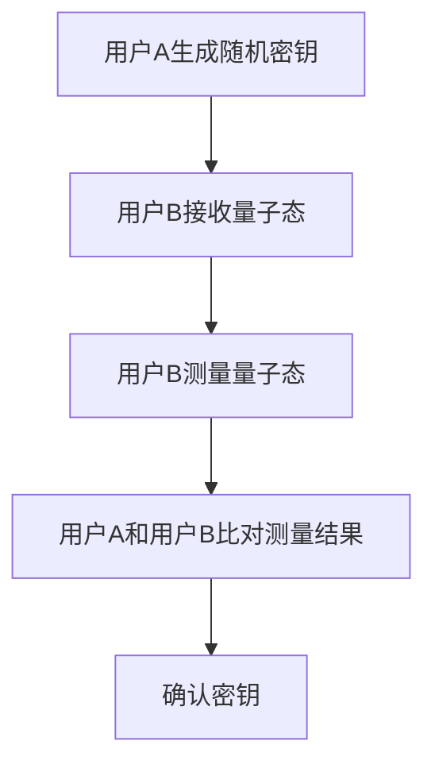
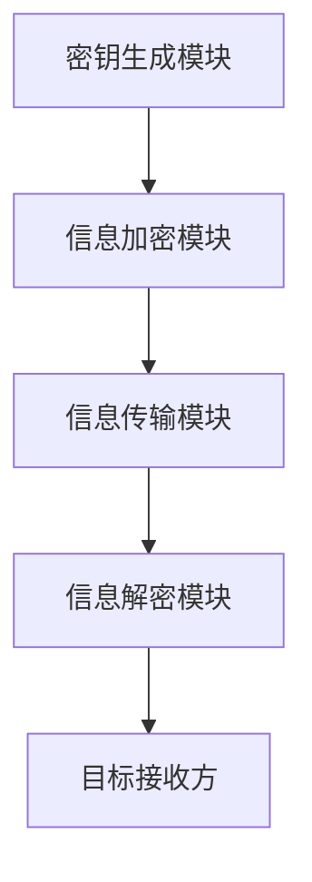

                 


# 巴菲特的股东沟通艺术：量子加密在企业治理中的创新应用

> 关键词：巴菲特，股东沟通，量子加密，企业治理，信息安全性

> 摘要：本文深入探讨了巴菲特的股东沟通艺术，并结合量子加密技术，分析其在企业治理中的创新应用。通过详细的技术分析和实际案例，展示了量子加密如何提升企业治理的信息安全性，为企业治理提供了新的思路。

---

## 第一部分: 股东沟通艺术与量子加密的结合

### 第1章: 巴菲特的股东沟通艺术概述

#### 1.1 巴菲特的股东沟通艺术

**1.1.1 巴菲特的投资理念与沟通策略**

沃伦·巴菲特（Warren Buffett）被誉为“股神”，他的投资理念和股东沟通艺术在商业界备受推崇。巴菲特的沟通策略强调透明性、真诚和长期信任的建立。他通过定期发布股东信、参加股东大会和接受采访等方式，向投资者传达公司战略、财务状况和未来规划。这种沟通方式不仅增强了股东对公司管理层的信任，还提升了公司的市场价值。

**1.1.2 股东沟通在企业治理中的重要性**

在现代企业治理中，股东沟通不仅是企业与股东之间的信息传递，更是企业形象、信任建立和价值实现的关键环节。有效的股东沟通能够帮助企业在复杂多变的市场环境中获得股东支持，提升企业的抗风险能力。此外，良好的股东沟通还能促进企业内部决策的透明化，增强员工的凝聚力和责任感。

**1.1.3 巴菲特的沟通艺术对企业治理的启示**

巴菲特的股东沟通艺术的核心在于真诚和透明。他通过简洁明了的语言、具体的数字和案例，向股东传递公司的经营状况和未来规划。这种沟通方式不仅增强了股东的信任，还为企业治理提供了重要的启示：企业应当重视与股东的沟通，通过透明的信息披露和及时的反馈，构建良好的企业与股东关系。

---

#### 1.2 量子加密的基本概念

**1.2.1 量子加密的定义与特点**

量子加密是一种基于量子力学原理的加密技术，其核心在于利用量子态的叠加性和纠缠性，实现信息的无条件安全性传输。与传统加密技术依赖数学算法不同，量子加密的安全性来源于物理原理，具有不可破解的特性。

**1.2.2 量子加密的核心原理**

量子加密的核心原理是基于量子态的叠加性和纠缠性。在量子加密中，信息以量子态的形式传输，任何对量子态的测量都会破坏其状态。因此，任何未经授权的窃听都会被立即发现，从而保证了信息传输的安全性。

**1.2.3 量子加密与传统加密技术的对比**

传统的加密技术依赖于数学算法的复杂性，通过不断寻找算法的弱点来实现破解。而量子加密则基于物理原理，具有不可破解的特性。此外，量子加密在传输速度和安全性方面也具有显著优势，能够满足现代企业对信息安全性日益增长的需求。

---

#### 1.3 量子加密在企业治理中的应用前景

**1.3.1 企业治理中的信息安全性需求**

随着全球化和信息化的发展，企业治理中的信息安全性需求日益增长。企业的敏感信息，如财务数据、战略规划和内部决策等，往往成为黑客攻击的目标。如何确保这些信息的安全传输和存储，成为企业治理中的重要挑战。

**1.3.2 量子加密技术在企业治理中的潜在应用**

量子加密技术在企业治理中的潜在应用主要体现在以下几个方面：
1. **股东信息的安全传输**：通过量子加密技术，企业可以确保股东信息的安全传输，防止信息被未经授权的第三方窃取。
2. **董事会决策的安全性**：量子加密可以为董事会的决策过程提供安全保障，确保决策信息不被泄露或篡改。
3. **企业内部沟通的安全性**：量子加密可以应用于企业内部的沟通渠道，确保员工之间的信息传输安全。

**1.3.3 量子加密技术的挑战与机遇**

尽管量子加密技术在企业治理中具有广阔的前景，但其应用也面临一些挑战。例如，量子加密技术的实现成本较高，需要专门的量子通信设备和网络基础设施。此外，量子加密技术的普及还需要时间，企业需要投入大量的资源进行技术研究和应用开发。

然而，随着量子计算技术的快速发展，量子加密技术的应用前景将更加广阔。未来，量子加密技术将为企业治理提供更高的安全性保障，推动企业治理进入一个新的安全时代。

---

### 1.4 本章小结

本章主要介绍了巴菲特的股东沟通艺术及其在企业治理中的重要性，同时详细讲解了量子加密的基本概念和核心原理。通过对比传统加密技术和量子加密技术，我们发现量子加密技术在企业治理中的应用前景广阔，能够为企业的信息安全性提供更高的保障。

---

## 第二部分: 量子加密的数学模型与算法原理

### 第2章: 量子加密的数学模型与算法原理

#### 2.1 量子加密的数学基础

**2.1.1 量子力学与信息论的结合**

量子加密技术的核心在于量子力学与信息论的结合。量子力学研究的是微观粒子的行为规律，而信息论研究的是信息的传输和处理。两者的结合为量子加密技术提供了理论基础。

**2.1.2 量子加密的数学模型**

量子加密的数学模型主要基于量子态的叠加性和纠缠性。在量子态的叠加性中，信息可以同时处于多个状态；在纠缠性中，信息可以分布在多个粒子之间。这些特性为量子加密提供了安全性保障。

**2.1.3 量子态的叠加与纠缠原理**

量子态的叠加性是指，一个量子系统可以同时处于多个状态的叠加。例如，一个量子比特（qubit）可以同时处于0和1的状态。量子态的纠缠性是指，两个或多个量子系统之间可以形成纠缠状态，其中一个系统的状态会直接影响另一个系统。

---

#### 2.2 量子加密算法的原理

**2.2.1 量子加密算法的分类**

量子加密算法主要分为两类：基于量子密钥分发（QKD）的算法和基于量子叠加的算法。QKD算法通过量子密钥的分发实现信息的安全传输，而基于量子叠加的算法则利用量子态的叠加性实现信息的加密和解密。

**2.2.2 常见的量子加密算法解析**

目前，常用的量子加密算法包括BB84协议和EPR协议。BB84协议是一种基于QKD的算法，通过量子态的测量实现密钥的分发。EPR协议则基于量子纠缠的原理，通过纠缠态的传输实现信息的加密和解密。

**2.2.3 量子加密算法的数学公式**

以下是BB84协议的数学公式：

$$
| \psi \rangle = \frac{1}{\sqrt{2}} (|0\rangle + |1\rangle)
$$

该公式表示一个量子态的叠加状态，其中$|0\rangle$和$|1\rangle$分别表示量子比特的基态。

---

#### 2.3 量子加密算法的流程图

以下是BB84协议的流程图：



---

### 2.4 本章小结

本章主要介绍了量子加密的数学模型和算法原理，详细讲解了量子态的叠加性和纠缠性，以及常见的量子加密算法如BB84协议。通过数学公式和流程图的展示，我们能够更好地理解量子加密技术的实现过程。

---

## 第三部分: 量子加密在企业治理中的系统架构设计

### 第3章: 量子加密在企业治理中的系统架构设计

#### 3.1 企业治理系统的功能需求

**3.1.1 股东信息管理**

企业治理系统需要对股东信息进行管理，包括股东的姓名、持股数量、联系方式等。这些信息需要通过量子加密技术进行加密存储和传输，确保信息的安全性。

**3.1.2 企业决策过程中的信息加密需求**

在企业决策过程中，董事会和高层管理人员需要共享敏感信息。这些信息需要通过量子加密技术进行加密，确保信息不被未经授权的第三方窃取。

**3.1.3 股东沟通渠道的安全性要求**

企业与股东之间的沟通渠道需要确保信息的传输安全性。通过量子加密技术，企业可以实现与股东之间的安全通信，防止信息被窃听或篡改。

---

#### 3.2 量子加密系统的架构设计

**3.2.1 系统模块划分**

量子加密系统主要包括以下几个模块：
1. **密钥生成模块**：负责生成量子密钥。
2. **信息加密模块**：负责对信息进行加密处理。
3. **信息解密模块**：负责对加密的信息进行解密。
4. **信息传输模块**：负责加密信息的传输。

**3.2.2 系统功能模块的交互流程**

以下是系统功能模块的交互流程：



**3.2.3 系统架构的mermaid图展示**

以下是系统的架构图：


---

#### 3.3 量子加密系统的核心实现

**3.3.1 股东身份认证模块**

股东身份认证模块通过量子加密技术实现股东的身份认证。股东需要提供量子密钥，系统通过验证密钥的合法性实现身份认证。

**3.3.2 信息加密与解密模块**

信息加密与解密模块负责对企业的敏感信息进行加密和解密。通过量子加密技术，确保信息在传输和存储过程中的安全性。

**3.3.3 信息传输与存储模块**

信息传输与存储模块负责信息的传输和存储。通过量子加密技术，确保信息在传输和存储过程中的安全性。

---

### 3.4 本章小结

本章主要介绍了量子加密在企业治理中的系统架构设计，详细讲解了系统的功能需求、模块划分和交互流程。通过mermaid图的展示，我们能够更好地理解量子加密系统的实现过程。

---

## 第四部分: 量子加密系统的项目实战

### 第4章: 量子加密系统的项目实战

#### 4.1 项目背景与目标

**4.1.1 项目背景介绍**

随着企业信息化的快速发展，企业治理中的信息安全性需求日益增长。传统的加密技术难以满足企业对信息安全性日益增长的需求。因此，我们需要探索一种更加安全的加密技术——量子加密技术。

**4.1.2 项目目标设定**

本项目的目标是利用量子加密技术，构建一个安全的企业治理系统，实现股东信息的安全传输和存储，确保企业决策过程中的信息安全性。

**4.1.3 项目范围界定**

本项目主要针对企业治理中的信息安全性需求，重点研究量子加密技术在股东信息管理、董事会决策和股东沟通中的应用。

---

#### 4.2 项目环境与工具安装

**4.2.1 开发环境搭建**

本项目需要搭建一个量子加密开发环境，包括量子计算机和量子通信设备。开发环境的选择需要考虑硬件和软件的兼容性。

**4.2.2 量子加密算法库的安装与配置**

需要安装量子加密算法库，如QKD协议库和量子叠加算法库。安装过程中需要注意库的版本和依赖关系。

**4.2.3 开发工具的使用说明**

开发工具包括量子计算机模拟器、量子通信设备和相关开发库。需要详细说明开发工具的使用方法，包括如何配置环境变量、如何调用量子加密算法库等。

---

#### 4.3 项目核心实现

**4.3.1 环境安装**

以下是项目环境安装的步骤：

1. 安装量子计算机模拟器：在终端中运行命令：
   ```
   pip install qiskit
   ```

2. 安装量子通信设备驱动：在终端中运行命令：
   ```
   pip install qkd-driver
   ```

---

**4.3.2 核心代码实现**

以下是量子加密算法的核心代码实现：

```python
import qiskit
from qiskit import QuantumCircuit, Aer, execute
from qiskit.circuit import QuantumRegister, ClassicalRegister

def quantum_encrypt(qubit, key):
    # 量子加密算法实现
    qc = QuantumCircuit(qubit, key)
    qc.h(qubit[0])
    qc.cx(qubit[0], key[0])
    return qc

def quantum_decrypt(qubit, key):
    # 量子解密算法实现
    qc = QuantumCircuit(qubit, key)
    qc.cx(qubit[0], key[0])
    qc.h(qubit[0])
    return qc
```

---

**4.3.3 项目实战案例分析**

以下是一个简单的量子加密案例：

假设企业需要传输一个秘密信息“1234”。通过量子加密算法，我们可以将这个信息加密后传输，确保信息的安全性。

加密过程：
1. 生成量子密钥：$|0\rangle$和$|1\rangle$。
2. 将信息“1234”转换为二进制表示：$1001$。
3. 对二进制表示进行量子叠加操作：
   $$
   | \psi \rangle = \frac{1}{\sqrt{2}} (|0\rangle + |1\rangle)
   $$
4. 传输加密信息。

解密过程：
1. 接收方通过量子密钥解密信息。
2. 对加密信息进行量子叠加操作的逆过程：
   $$
   | \psi \rangle = \frac{1}{\sqrt{2}} (|0\rangle + |1\rangle)
   $$
3. 得到原始信息“1234”。

---

### 4.4 本章小结

本章主要介绍了量子加密系统的项目实战，详细讲解了项目的背景与目标、环境搭建、核心代码实现和案例分析。通过实际操作，我们能够更好地理解量子加密技术的应用过程。

---

## 第五部分: 总结与展望

### 第5章: 总结与展望

#### 5.1 总结

本文深入探讨了巴菲特的股东沟通艺术，并结合量子加密技术，分析了其在企业治理中的创新应用。通过详细的技术分析和实际案例，我们展示了量子加密如何提升企业治理的信息安全性，为企业治理提供了新的思路。

#### 5.2 展望

随着量子计算技术的快速发展，量子加密技术的应用前景将更加广阔。未来，量子加密技术将为企业治理提供更高的安全性保障，推动企业治理进入一个新的安全时代。同时，我们也需要进一步研究和开发更加先进的量子加密算法，以应对日益复杂的网络安全威胁。

---

## 作者信息

作者：AI天才研究院/AI Genius Institute & 禅与计算机程序设计艺术 /Zen And The Art of Computer Programming

