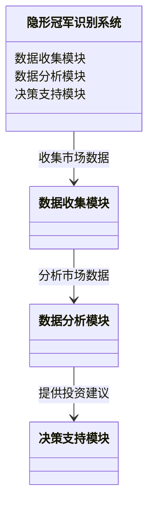
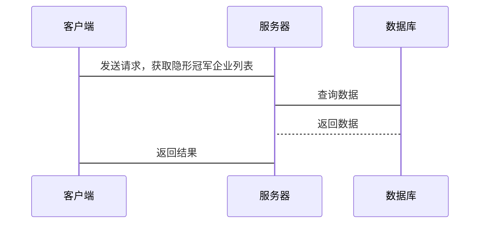
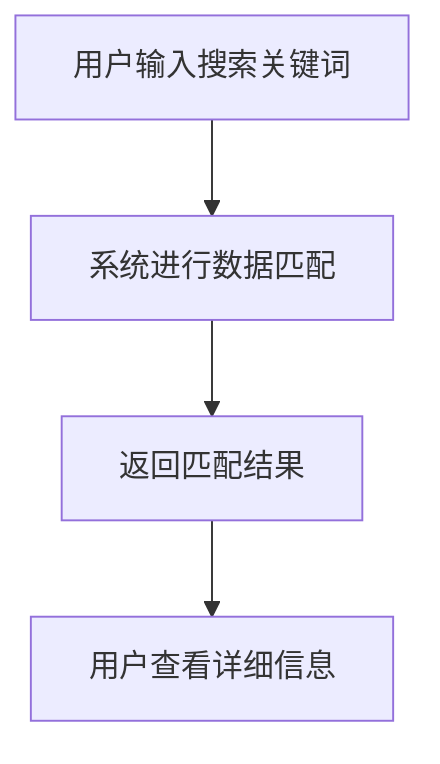

                 


# 彼得林奇的"隐形冠军"在新兴市场中的发掘技巧

## 关键词：隐形冠军，新兴市场，投资策略，风险管理，彼得·林奇

## 摘要：  
本文详细探讨了彼得·林奇提出的“隐形冠军”概念在新兴市场中的应用技巧。通过分析隐形冠军的定义、特征以及新兴市场的独特性，本文提出了发掘隐形冠军的具体方法，包括财务指标分析、市场地位评估、行业趋势分析和竞争优势评估。同时，本文还结合实际案例，详细阐述了投资策略、风险管理以及如何在新兴市场中制定有效的退出策略。通过本文的分析，读者可以更好地理解如何在新兴市场中识别和投资隐形冠军企业。

---

# 第一部分：彼得·林奇“隐形冠军”概念与背景

## 第1章：隐形冠军的定义与特征

### 1.1 隐形冠军的定义

#### 1.1.1 什么是隐形冠军
隐形冠军是指那些在特定市场或行业中占据领先地位，但因为专注于某个细分市场或采取低调的市场策略而未被广泛认知的企业。这些企业通常在某个领域内具有强大的竞争力，但缺乏广泛的知名度。

#### 1.1.2 隐形冠军的核心特征
隐形冠军通常具有以下核心特征：
- **专注性**：专注于某个细分市场，不追求全面扩张。
- **差异化**：在产品或服务上具有独特的竞争优势。
- **长期性**：通过长期的专注和积累，逐步成为该领域的领导者。
- **隐蔽性**：不追求大规模宣传，注重内功修炼。

#### 1.1.3 隐形冠军与传统冠军的对比
| 对比维度 | 隐形冠军 | 传统冠军 |
|----------|----------|----------|
| 市场定位 | 细分市场 | 广泛市场 | 
| 竞争优势 | 差异化 | 规模化 | 
| 市场策略 | 专注 | 多元化 | 

### 1.2 隐形冠军的市场定位

#### 1.2.1 隐形冠军的市场专注性
隐形冠军通常专注于某个特定市场或领域，这种专注性使得它们能够在特定市场中占据领先地位。例如，某些隐形冠军可能专注于某个行业的某个环节，如供应链管理或技术创新。

#### 1.2.2 隐形冠军的差异化竞争优势
隐形冠军通常通过差异化竞争策略来获取市场份额。例如，某些企业可能专注于产品的某个特定功能或服务的某个特定环节，从而在竞争中脱颖而出。

#### 1.2.3 隐形冠军的长期可持续性
隐形冠军的成功往往建立在长期的专注和积累之上。通过持续的技术创新和市场深耕，隐形冠军能够在竞争激烈的市场中保持长期的竞争力。

---

## 第2章：新兴市场的特点与投资机会

### 2.1 新兴市场的定义与分类

#### 2.1.1 新兴市场的定义
新兴市场是指那些经济增长迅速、市场潜力巨大但尚未完全成熟的国家或地区。这些市场通常具有较高的增长率和较大的市场空间，但同时也伴随着较高的风险。

#### 2.1.2 新兴市场的分类与分布
新兴市场可以分为以下几类：
- **亚洲新兴市场**：如中国、印度、韩国等。
- **欧洲新兴市场**：如波兰、捷克、匈牙利等。
- **拉丁美洲新兴市场**：如巴西、墨西哥、阿根廷等。

#### 2.1.3 新兴市场的增长潜力
新兴市场通常具有较高的经济增长潜力。例如，中国的经济增长率在过去几十年中一直保持在较高水平，为隐形冠军的崛起提供了良好的环境。

### 2.2 新兴市场的投资挑战

#### 2.2.1 新兴市场的风险因素
新兴市场往往伴随着较高的风险，包括政策风险、市场风险、汇率风险等。例如，某些新兴市场可能因为政治不稳定或政策变化而导致投资失败。

#### 2.2.2 新兴市场的政策不确定性
新兴市场的政策环境通常不够稳定，这可能对投资者造成较大的不确定性。例如，某些国家可能会出台一些限制外资的政策，从而影响投资者的利益。

#### 2.2.3 新兴市场的竞争环境
新兴市场的竞争环境通常较为激烈。由于市场潜力大，吸引了大量的企业进入，导致竞争加剧。在这种情况下，隐形冠军的成功更加依赖于差异化竞争优势和长期专注。

---

# 第二部分：隐形冠军在新兴市场的发掘方法

## 第3章：隐形冠军的识别标准

### 3.1 隐形冠军的财务指标分析

#### 3.1.1 营业收入与利润增长
隐形冠军通常具有稳定的营业收入和利润增长。例如，某些企业在特定市场中通过技术创新和成本控制实现了持续的利润增长。

#### 3.1.2 净利润率与ROE分析
净利润率和ROE（净资产收益率）是衡量企业盈利能力的重要指标。隐形冠军通常具有较高的净利润率和ROE，这表明企业具有较强的盈利能力。

#### 3.1.3 财务健康性评估
财务健康性评估包括对企业资产负债表、利润表和现金流量表的分析。隐形冠军通常具有健康的财务状况，能够支持企业的持续发展。

### 3.2 隐形冠军的市场地位评估

#### 3.2.1 市场占有率分析
市场占有率是衡量企业市场地位的重要指标。隐形冠军通常在特定市场中占据较高的市场份额，从而能够在竞争中占据优势。

#### 3.2.2 产品差异化程度
产品差异化程度是隐形冠军的核心竞争优势之一。通过提供独特的产品或服务，隐形冠军能够在竞争中脱颖而出。

#### 3.2.3 企业的品牌影响力
品牌影响力是衡量企业市场地位的重要因素。隐形冠军通常通过长期的专注和优质的服务，逐步建立起强大的品牌影响力。

## 第4章：隐形冠军的行业分析方法

### 4.1 行业趋势分析

#### 4.1.1 行业周期性分析
行业周期性分析包括对行业生命周期的分析，例如行业处于成长期还是成熟期。隐形冠军通常选择在成长期的行业进行投资，以获取更高的增长潜力。

#### 4.1.2 行业增长潜力评估
行业增长潜力评估包括对行业未来增长率的预测。隐形冠军通常选择那些具有较高增长潜力的行业进行投资。

#### 4.1.3 行业竞争格局分析
行业竞争格局分析包括对行业内主要竞争对手的分析。隐形冠军通常选择那些竞争格局较为稳定、竞争对手较少的行业进行投资。

### 4.2 企业的竞争优势分析

#### 4.2.1 技术创新优势
技术创新是隐形冠军的核心竞争优势之一。通过不断的技术创新，隐形冠军能够在竞争中保持领先地位。

#### 4.2.2 成本竞争优势
成本竞争优势是指企业在生产或运营过程中具有较低的成本。隐形冠军通常通过成本控制和技术创新实现成本优势。

#### 4.2.3 供应链管理优势
供应链管理优势是指企业在供应链管理方面具有较强的控制能力。隐形冠军通常通过优化供应链管理实现更高的效率和更低的成本。

---

## 第5章：隐形冠军的投资策略

### 5.1 投资前的准备工作

#### 5.1.1 市场调研与数据收集
在投资隐形冠军之前，需要进行充分的市场调研和数据收集。这包括对目标市场、行业和企业的全面了解。

#### 5.1.2 行业专家访谈
通过与行业专家的访谈，可以获取更多的行业信息和投资建议。这有助于投资者更好地把握市场动态和行业趋势。

#### 5.1.3 投资计划的制定
在进行实际投资之前，需要制定详细的投资计划，包括投资目标、投资策略、风险评估和退出策略等。

### 5.2 投资组合的构建

#### 5.2.1 投资组合的分散化原则
为了降低投资风险，投资者应该采用分散化投资策略，将资金分配到不同的行业和市场中。

#### 5.2.2 隐形冠军在组合中的权重分配
隐形冠军在投资组合中的权重分配需要根据其潜力和风险进行合理安排。通常，隐形冠军可以作为投资组合中的重要组成部分。

#### 5.2.3 行业与地域的均衡配置
为了实现投资组合的均衡配置，投资者应该将资金分配到不同的行业和地域，以降低区域风险和行业风险。

---

## 第6章：风险管理与退出策略

### 6.1 风险管理的必要性

#### 6.1.1 风险来源分析
风险管理是投资隐形冠军的重要环节。投资者需要识别和评估可能的风险来源，包括市场风险、政策风险和财务风险等。

#### 6.1.2 风险评估与量化
通过量化风险，投资者可以更好地理解投资的风险水平，并制定相应的风险管理策略。

#### 6.1.3 风险控制措施
为了降低投资风险，投资者可以采取多种风险控制措施，例如分散化投资、设置止损点和定期评估投资组合等。

### 6.2 退出策略的制定

#### 6.2.1 退出时机的选择
退出时机的选择是投资成功的关键。投资者需要根据市场动态和企业状况，选择适当的退出时机。

#### 6.2.2 退出方式的多样性
退出方式包括公开出售、私下转让和企业并购等。投资者需要根据实际情况选择合适的退出方式。

#### 6.2.3 退出后的资金再投资策略
在退出后，投资者需要制定资金再投资策略，以实现资金的持续增值。

---

# 第三部分：案例分析与实战技巧

## 第7章：隐形冠军的典型案例分析

### 7.1 成功案例分析

#### 7.1.1 某新兴市场隐形冠军的崛起之路
以某新兴市场的隐形冠军为例，分析其崛起之路。例如，某企业通过技术创新和市场深耕，逐步成为行业内的领导者。

#### 7.1.2 公司发展过程中的关键决策
分析公司在发展过程中做出的关键决策，例如市场选择、技术创新和资本运作等。

#### 7.1.3 投资者收益与经验总结
总结投资者在投资隐形冠军过程中获得的收益和经验，例如高增长、高回报和高风险等。

### 7.2 失败案例分析

#### 7.2.1 隐形冠军失败的常见原因
分析隐形冠军失败的常见原因，例如市场变化、竞争加剧和管理不善等。

#### 7.2.2 投资者在选择隐形冠军时的误区
总结投资者在选择隐形冠军时的常见误区，例如过于关注短期收益、忽视风险和缺乏深入研究等。

#### 7.2.3 从失败案例中吸取的教训
从失败案例中吸取教训，总结投资隐形冠军的成功经验，例如注重风险管理、选择具有持续竞争优势的企业等。

## 第8章：隐形冠军投资的实战技巧

### 8.1 投资心态的调整

#### 8.1.1 长期投资与耐心资本的重要性
长期投资是投资隐形冠军的重要策略。投资者需要具备耐心，等待企业的成长和市场的成熟。

#### 8.1.2 避免情绪化投资的策略
为了避免情绪化投资，投资者需要制定明确的投资策略和纪律，避免受市场波动的影响。

#### 8.1.3 投资纪律的坚持
投资纪律是投资成功的关键。投资者需要坚持纪律，避免随意更改投资计划和策略。

### 8.2 行业动态的跟踪

#### 8.2.1 定期更新行业分析报告
为了把握行业动态，投资者需要定期更新行业分析报告，了解市场的最新变化。

#### 8.2.2 关注政策变化
政策变化对新兴市场的影响较大。投资者需要密切关注政策变化，及时调整投资策略。

#### 8.2.3 保持与行业专家的联系
通过与行业专家的联系，投资者可以获取更多的行业信息和投资建议，从而做出更明智的投资决策。

---

# 第四部分：系统分析与架构设计方案

## 第9章：系统分析与架构设计方案

### 9.1 问题场景介绍
在新兴市场中，投资者需要开发一个系统来识别和评估隐形冠军企业。该系统需要具备数据收集、分析和决策支持功能。

### 9.2 项目介绍
项目目标是开发一个智能化的隐形冠军识别系统，帮助投资者快速识别具有潜力的隐形冠军企业。

### 9.3 系统功能设计（领域模型）



### 9.4 系统架构设计（系统架构图）


### 9.5 系统接口设计（API设计）



### 9.6 系统交互设计（用户流程图）



---

## 第10章：项目实战

### 10.1 环境安装

#### 10.1.1 安装Python和相关库
```bash
pip install pandas numpy matplotlib
```

#### 10.1.2 安装Jupyter Notebook
```bash
pip install jupyter
```

### 10.2 系统核心实现源代码

#### 10.2.1 数据收集模块
```python
import pandas as pd
import requests

def collect_data(url):
    response = requests.get(url)
    data = response.json()
    df = pd.DataFrame(data)
    return df
```

#### 10.2.2 数据分析模块
```python
def analyze_data(df):
    # 计算财务指标
    df['净利润率'] = df['净利润'] / df['营业收入']
    df['ROE'] = df['净利润'] / df['净资产']
    return df
```

#### 10.2.3 决策支持模块
```python
def generate_recommendations(df):
    # 根据财务指标筛选隐形冠军
    df = df[df['净利润率'] > df['净利润率'].mean()]
    df = df[df['ROE'] > df['ROE'].mean()]
    return df
```

### 10.3 代码应用解读与分析

#### 10.3.1 数据收集模块
上述代码通过`requests`库从指定URL获取数据，并使用`pandas`库将数据转换为DataFrame格式。这一步骤是隐形冠军识别系统的基础，确保后续分析有可靠的数据来源。

#### 10.3.2 数据分析模块
在数据分析模块中，代码计算了企业的净利润率和ROE，并将结果存储在DataFrame中。这些指标是衡量企业盈利能力的重要指标，也是识别隐形冠军的关键因素。

#### 10.3.3 决策支持模块
决策支持模块通过筛选净利润率和ROE高于行业平均水平的企业，生成隐形冠军的投资建议。这一步骤帮助投资者快速识别具有潜力的企业，降低投资风险。

### 10.4 实际案例分析和详细讲解剖析

#### 10.4.1 某新兴市场的隐形冠军分析
以某新兴市场的隐形冠军为例，分析其财务指标和市场地位。通过代码实现，可以快速筛选出具有潜力的企业，为投资者提供决策支持。

### 10.5 项目小结

#### 10.5.1 项目总结
通过本项目的实施，投资者可以利用隐形冠军识别系统快速识别具有潜力的企业，降低投资风险，提高投资收益。

#### 10.5.2 项目拓展
未来，可以通过进一步优化系统功能，例如增加更多的数据源和分析模型，提高系统的准确性和实用性。

---

# 第五部分：总结与展望

## 第11章：总结与展望

### 11.1 总结
本文详细探讨了彼得·林奇提出的“隐形冠军”概念在新兴市场中的应用技巧。通过分析隐形冠军的定义、特征以及新兴市场的独特性，本文提出了发掘隐形冠军的具体方法，包括财务指标分析、市场地位评估、行业趋势分析和竞争优势评估。同时，本文还结合实际案例，详细阐述了投资策略、风险管理以及如何在新兴市场中制定有效的退出策略。

### 11.2 展望
未来，随着新兴市场的不断发展和隐形冠军概念的逐步普及，投资者可以更加依赖智能化的系统和工具来识别和评估隐形冠军企业。通过技术创新和数据驱动的方法，隐形冠军的投资策略将更加精准和高效。

---

# 作者：AI天才研究院/AI Genius Institute & 禅与计算机程序设计艺术 /Zen And The Art of Computer Programming

