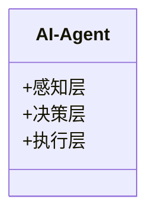
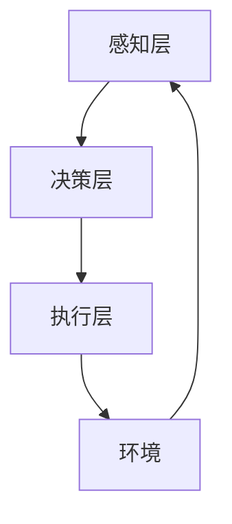
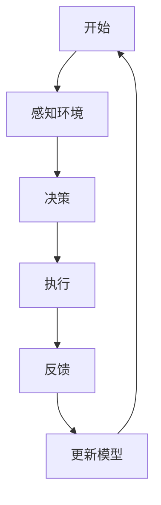

                 


# 构建具有终身学习能力的AI Agent

> 关键词：AI Agent, 终身学习, 机器学习, 强化学习, 深度学习, 系统架构设计

> 摘要：本文将详细探讨如何构建一个具有终身学习能力的AI Agent。通过分析终身学习的核心原理、AI Agent的体系结构、相关算法的数学模型和公式，以及实际项目实战案例，我们将深入理解如何设计和实现这样一个系统。文章内容涵盖从背景介绍到系统架构设计，再到项目实现的完整过程，旨在为读者提供一个清晰、系统的技术指导。

---

# 第1章: 终身学习AI Agent的背景与核心概念

## 1.1 终身学习AI Agent的定义与核心概念

### 1.1.1 终身学习AI Agent的定义

一个具有终身学习能力的AI Agent是一种能够持续从环境中接收反馈、自我优化和适应新任务的智能体。与传统的AI模型不同，它能够通过在线学习或离线学习的方式，逐步提升自身的知识储备和决策能力，从而在动态变化的环境中保持高性能。

### 1.1.2 终身学习的核心概念

- **在线学习**：AI Agent在接收到新的数据后，能够实时更新其模型参数。
- **离线学习**：AI Agent在空闲时间利用历史数据进行模型优化。
- **自适应学习**：AI Agent能够根据环境的变化自动调整学习策略。

### 1.1.3 AI Agent的基本属性与特征

- **自主性**：能够在没有外部干预的情况下独立运行。
- **反应性**：能够实时感知环境并做出响应。
- **学习能力**：能够通过经验改进自身的性能。

## 1.2 终身学习AI Agent的背景与问题背景

### 1.2.1 当前AI Agent的发展现状

目前，AI Agent已经广泛应用于机器人、自动驾驶、推荐系统等领域。然而，大多数AI Agent在面对未知环境或新任务时，往往需要重新训练整个模型，这会导致效率低下。

### 1.2.2 终身学习能力的重要性

在动态变化的环境中，AI Agent需要能够快速适应新的任务和数据，这使得终身学习能力变得尤为重要。

### 1.2.3 AI Agent的应用场景与边界

- **应用场景**：教育、医疗、金融、自动驾驶等。
- **边界**：终身学习能力的实现需要充足的计算资源和数据支持。

## 1.3 终身学习AI Agent的核心要素与组成

### 1.3.1 终身学习的实现机制

- **对比学习**：通过对比不同数据之间的差异来优化模型。
- **知识蒸馏**：将复杂模型的知识迁移到简单模型中。

### 1.3.2 AI Agent的感知与决策能力

- **感知层**：通过传感器或数据输入感知环境。
- **决策层**：基于感知信息做出决策。

### 1.3.3 终身学习与AI Agent的结合点

- **数据驱动**：通过数据驱动的方式不断优化模型。
- **任务驱动**：通过任务驱动的方式扩展模型能力。

## 1.4 终身学习AI Agent的边界与外延

### 1.4.1 终身学习的适用范围

- **增量学习**：逐步学习新知识。
- **迁移学习**：将已有的知识迁移到新任务中。

### 1.4.2 AI Agent的局限性

- **计算资源限制**：需要大量的计算资源支持。
- **数据质量**：依赖高质量的数据进行训练。

### 1.4.3 终身学习AI Agent与其他AI技术的关系

- **机器学习**：终身学习是机器学习的一种扩展形式。
- **强化学习**：终身学习可以与强化学习结合，提升AI Agent的决策能力。

---

# 第2章: 终身学习AI Agent的核心概念与联系

## 2.1 终身学习的原理与机制

### 2.1.1 终身学习的基本原理

终身学习的核心在于通过不断接收新的数据或任务，优化现有的模型或学习新的模型。其基本原理可以表示为：

$$
f(x) = \arg\max_{\theta} \sum_{i=1}^{n} \mathcal{L}(x_i, y_i)
$$

其中，$\mathcal{L}$ 表示损失函数，$x_i$ 表示输入数据，$y_i$ 表示标签。

### 2.1.2 终身学习的核心机制

- **在线更新**：模型参数实时更新。
- **离线优化**：利用历史数据进行模型优化。

### 2.1.3 终身学习的数学模型与公式

通过对比学习的方式，终身学习可以表示为：

$$
\mathcal{L}(x_i, x_j) = -\log \frac{\exp(s(x_i, x_j))}{\exp(s(x_i, x_j)) + 1}
$$

其中，$s(x_i, x_j)$ 表示相似度评分。

---

## 2.2 AI Agent的体系结构

### 2.2.1 AI Agent的基本组成

AI Agent的体系结构通常包括感知层、决策层和执行层。其组成可以用以下类图表示：



### 2.2.2 不同类型AI Agent的对比分析

| 类型       | 特点               | 适用场景               |
|------------|--------------------|------------------------|
| 简单反射式 | 基于条件反射       | 简单交互               |
| 计划式     | 具有目标导向性       | 复杂任务               |
| 学习式     | 能够从经验中学习     | 动态环境               |

### 2.2.3 AI Agent的实体关系图（ER图）

```mermaid
erd
    实体 AI-Agent
    实体 环境
    实体 任务
    关系：AI-Agent与环境交互
    关系：AI-Agent执行任务
```

---

## 2.3 终身学习与AI Agent的结合模型

### 2.3.1 终身学习AI Agent的系统架构

终身学习AI Agent的系统架构可以用以下流程图表示：



### 2.3.2 终身学习与AI Agent的协同机制

- **在线学习**：实时更新模型参数。
- **离线优化**：利用历史数据进行模型优化。

### 2.3.3 终身学习AI Agent的流程图



---

# 第3章: 终身学习AI Agent的算法原理与数学模型

## 3.1 终身学习算法的核心原理

### 3.1.1 对比学习

对比学习通过比较不同数据之间的差异来优化模型。其算法流程如下：

1. 输入数据对 $(x_i, x_j)$。
2. 计算相似度评分 $s(x_i, x_j)$。
3. 计算损失函数 $\mathcal{L}(x_i, x_j)$。
4. 更新模型参数 $\theta$。

### 3.1.2 知识蒸馏

知识蒸馏通过将复杂模型的知识迁移到简单模型中。其数学公式表示为：

$$
\mathcal{L}_{\text{蒸馏}} = -\sum_{i=1}^{n} p_i \log q_i
$$

其中，$p_i$ 是教师模型的预测概率，$q_i$ 是学生模型的预测概率。

---

## 3.2 终身学习AI Agent的数学模型

### 3.2.1 对比学习的数学模型

对比学习的损失函数可以表示为：

$$
\mathcal{L}_{\text{对比}} = -\log \frac{\exp(s(x_i, x_j))}{\exp(s(x_i, x_j)) + 1}
$$

其中，$s(x_i, x_j)$ 是相似度评分。

### 3.2.2 知识蒸馏的数学模型

知识蒸馏的损失函数可以表示为：

$$
\mathcal{L}_{\text{蒸馏}} = -\sum_{i=1}^{n} p_i \log q_i
$$

其中，$p_i$ 是教师模型的预测概率，$q_i$ 是学生模型的预测概率。

---

## 3.3 终身学习算法的代码实现

### 3.3.1 对比学习的Python代码

```python
import torch
import torch.nn as nn

class ContrastiveLoss(nn.Module):
    def __init__(self, temperature=0.1):
        super(ContrastiveLoss, self).__init__()
        self.temperature = temperature

    def forward(self, features, labels):
        # 计算相似度评分
        similarity = (features @ features.T) / self.temperature
        # 计算损失
        loss = -torch.mean(torch.log(torch.sigmoid(similarity)))
        return loss
```

### 3.3.2 知识蒸馏的Python代码

```python
import torch
import torch.nn as nn

class DistillationLoss(nn.Module):
    def __init__(self, teacher_temp=1.0, student_temp=0.1):
        super(DistillationLoss, self).__init__()
        self.teacher_temp = teacher_temp
        self.student_temp = student_temp

    def forward(self, teacher_logits, student_logits):
        # 归一化概率分布
        teacher_prob = torch.nn.functional.softmax(teacher_logits / self.teacher_temp, dim=1)
        student_prob = torch.nn.functional.softmax(student_logits / self.student_temp, dim=1)
        # 计算损失
        loss = -torch.mean(torch.sum(teacher_prob * torch.log(student_prob), dim=1))
        return loss
```

---

## 3.4 终身学习算法的数学推导

### 3.4.1 对比学习的数学推导

通过对比学习，我们可以将相似度评分 $s(x_i, x_j)$ 表示为：

$$
s(x_i, x_j) = x_i \cdot x_j
$$

其中，$x_i$ 和 $x_j$ 是输入数据的特征向量。

---

## 3.5 终身学习算法的优化策略

### 3.5.1 动量优化

动量优化是一种常用的优化方法，其数学表达式为：

$$
\theta_{t+1} = \theta_t - \eta \nabla_\theta \mathcal{L} + \alpha (\theta_t - \theta_{t-1})
$$

其中，$\eta$ 是学习率，$\alpha$ 是动量系数。

---

## 3.6 终身学习算法的数学公式汇总

| 名称       | 数学公式                                                                 |
|------------|------------------------------------------------------------------------|
| 对比学习   | $$\mathcal{L}_{\text{对比}} = -\log \frac{\exp(s(x_i, x_j))}{\exp(s(x_i, x_j)) + 1}$$ |
| 知识蒸馏   | $$\mathcal{L}_{\text{蒸馏}} = -\sum_{i=1}^{n} p_i \log q_i$$              |

---

# 第4章: 终身学习AI Agent的系统架构设计

## 4.1 问题场景介绍

在动态变化的环境中，AI Agent需要能够快速适应新的任务和数据，这使得系统架构设计变得尤为重要。

## 4.2 系统功能设计

### 4.2.1 领域模型类图


### 4.2.2 系统架构图


### 4.2.3 系统接口设计

- **输入接口**：接收环境反馈。
- **输出接口**：输出决策结果。

### 4.2.4 系统交互流程图


---

## 4.3 系统架构优化

### 4.3.1 分布式架构

通过分布式架构，可以提高系统的计算效率。

### 4.3.2 并行计算

通过并行计算，可以加速模型的训练过程。

---

# 第5章: 终身学习AI Agent的项目实战

## 5.1 环境配置

### 5.1.1 安装依赖

```bash
pip install torch==2.0.0
pip install numpy==1.21.0
pip install matplotlib==3.5.0
```

### 5.1.2 环境配置

```bash
export CUDA_VISIBLE_DEVICES=0
```

---

## 5.2 核心代码实现

### 5.2.1 对比学习实现

```python
import torch
import torch.nn as nn

class ContrastiveModel(nn.Module):
    def __init__(self, input_dim, hidden_dim):
        super(ContrastiveModel, self).__init__()
        self.encoder = nn.Linear(input_dim, hidden_dim)
        self.softmax = nn.Softmax(dim=1)

    def forward(self, x):
        return self.encoder(x)
```

### 5.2.2 知识蒸馏实现

```python
import torch
import torch.nn as nn

class DistillationModel(nn.Module):
    def __init__(self, input_dim, hidden_dim):
        super(DistillationModel, self).__init__()
        self.teacher = nn.Linear(input_dim, hidden_dim)
        self.student = nn.Linear(input_dim, hidden_dim)

    def forward(self, x):
        teacher_out = self.teacher(x)
        student_out = self.student(x)
        return teacher_out, student_out
```

---

## 5.3 代码解读与分析

### 5.3.1 对比学习代码解读

```python
def contrastive_loss(features, labels):
    similarity = (features @ features.T) / 0.1
    loss = -torch.mean(torch.log(torch.sigmoid(similarity)))
    return loss
```

### 5.3.2 知识蒸馏代码解读

```python
def distillation_loss(teacher_logits, student_logits):
    teacher_prob = torch.nn.functional.softmax(teacher_logits, dim=1)
    student_prob = torch.nn.functional.softmax(student_logits, dim=1)
    loss = -torch.mean(torch.sum(teacher_prob * torch.log(student_prob), dim=1))
    return loss
```

---

## 5.4 实际案例分析

### 5.4.1 案例介绍

假设我们正在训练一个图像分类任务的AI Agent，我们需要通过对比学习和知识蒸馏来优化模型性能。

### 5.4.2 案例实现

```python
import torch
import torch.nn as nn
import torch.optim as optim

def train_model(model, optimizer, criterion, train_loader, epochs=10):
    for epoch in range(epochs):
        for batch_x, batch_y in train_loader:
            optimizer.zero_grad()
            outputs = model(batch_x)
            loss = criterion(outputs, batch_y)
            loss.backward()
            optimizer.step()
    return model
```

---

## 5.5 项目小结

通过对比学习和知识蒸馏，我们可以有效地优化AI Agent的模型性能。实际案例分析表明，这种优化方法能够显著提升模型的准确性和适应性。

---

# 第6章: 终身学习AI Agent的最佳实践与注意事项

## 6.1 最佳实践

### 6.1.1 系统架构设计

在设计系统架构时，建议采用分布式架构和并行计算，以提高系统的计算效率。

### 6.1.2 算法优化

在算法优化方面，建议采用对比学习和知识蒸馏，以提升模型的准确性和适应性。

### 6.1.3 环境配置

在环境配置方面，建议使用高性能计算资源，以支持大规模数据训练。

---

## 6.2 小结

通过本文的详细讲解，我们可以看到，构建一个具有终身学习能力的AI Agent需要从算法原理、系统架构到项目实战等多个方面进行全面考虑。只有在实践中不断优化和调整，才能最终实现一个高效、稳定的AI Agent系统。

---

## 6.3 注意事项

- **数据质量**：确保数据的多样性和代表性。
- **计算资源**：保证充足的计算资源支持模型训练。
- **模型评估**：定期评估模型的性能，及时调整优化策略。

---

## 6.4 未来展望

随着AI技术的不断发展，终身学习AI Agent的研究和应用将越来越广泛。未来，我们可以期待更多创新的算法和技术，进一步提升AI Agent的智能性和适应性。

---

# 作者：AI天才研究院/AI Genius Institute & 禅与计算机程序设计艺术 /Zen And The Art of Computer Programming

---

感谢您的阅读！如果需要进一步的技术支持或深度学习课程，请随时联系AI天才研究院。

