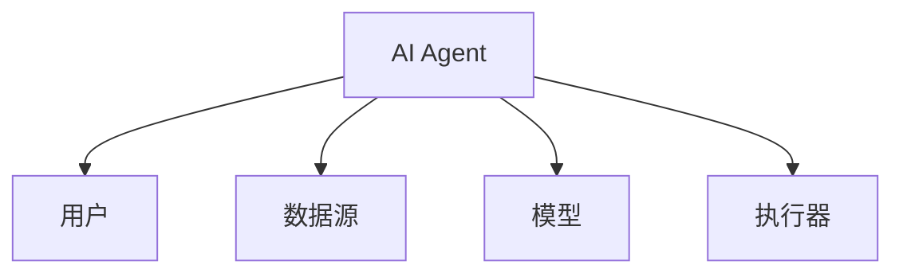
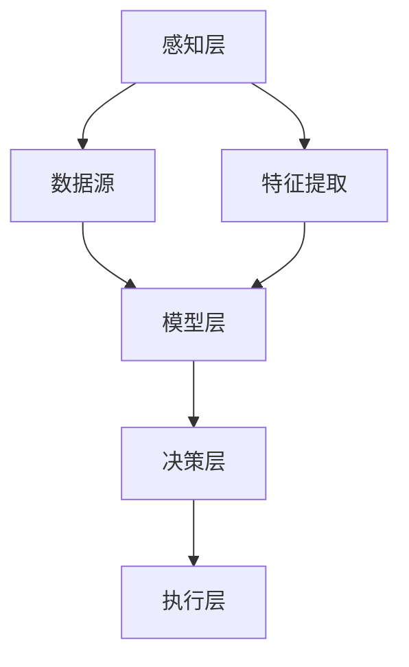
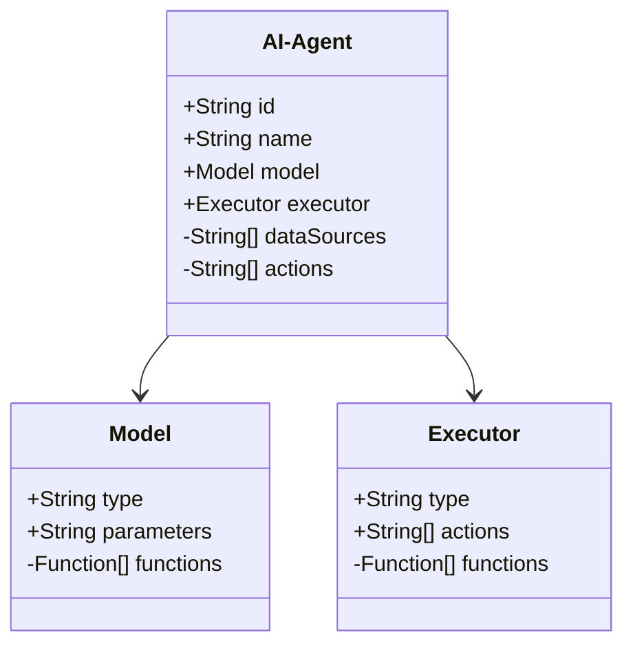
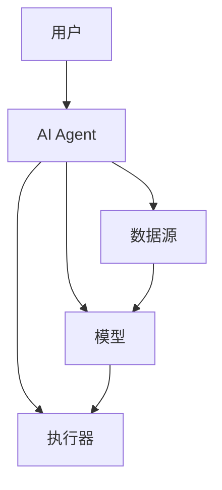
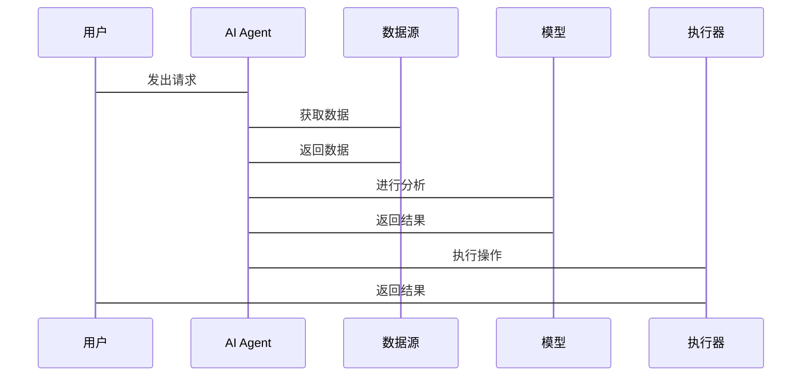

                 


# 案例研究：Fortune 500公司的AI Agent成功应用

> 关键词：AI Agent, Fortune 500, 机器学习, 自然语言处理, 知识图谱, 企业数字化转型

> 摘要：本文通过分析Fortune 500公司中AI Agent的成功应用案例，探讨AI Agent的核心概念、算法原理、系统架构及实际应用场景。结合具体案例，详细解读AI Agent如何助力企业实现智能化转型，并总结其在企业中的应用价值与未来发展方向。

---

## 第1章：AI Agent的背景与概述

### 1.1 AI Agent的基本概念与核心要素

#### 1.1.1 AI Agent的定义
AI Agent（人工智能代理）是一种能够感知环境、自主决策并执行任务的智能体。它通过接收输入信息，利用算法进行分析和推理，最终输出解决方案或执行操作。

#### 1.1.2 AI Agent的核心要素
- **感知能力**：通过传感器、API或其他数据源获取环境信息。
- **决策能力**：利用机器学习模型进行分析和推理，生成决策。
- **自主性**：无需人工干预，能够自主完成任务。
- **适应性**：能够根据环境变化调整行为和策略。

#### 1.1.3 AI Agent与传统软件的区别
| 特性          | 传统软件         | AI Agent       |
|---------------|------------------|----------------|
| 智能性         | 无               | 高              |
| 自主性         | 无               | 高              |
| 学习能力       | 无               | 有              |
| 适应性         | 低               | 高              |

### 1.2 Fortune 500公司中的AI Agent应用背景

#### 1.2.1 Fortune 500公司的数字化转型趋势
Fortune 500公司作为全球顶尖企业，面临着市场竞争加剧、效率要求提升等挑战。数字化转型成为这些企业的必由之路，而AI Agent作为智能化转型的核心技术之一，为企业提供了强大的支持。

#### 1.2.2 AI Agent在企业中的应用场景
- **客户支持**：通过自然语言处理技术为用户提供智能客服。
- **企业决策**：利用机器学习模型辅助高层制定战略决策。
- **供应链管理**：优化供应链流程，提升效率。

#### 1.2.3 AI Agent对企业竞争力的影响
AI Agent能够提高企业效率、增强客户体验、优化资源分配，从而提升企业的市场竞争力。

### 1.3 AI Agent的成功案例概述

#### 1.3.1 AI Agent在客户支持中的应用
某全球通信公司通过部署AI Agent，显著提升了客户支持的响应速度和问题解决率。AI Agent能够24/7为客户提供智能客服，处理常见问题，同时将复杂问题转交给人工客服。

#### 1.3.2 AI Agent在企业决策中的应用
某跨国银行利用AI Agent分析市场数据和客户行为，辅助制定投资策略和风险评估。AI Agent通过实时数据分析，帮助银行做出更精准的决策。

#### 1.3.3 AI Agent在供应链管理中的应用
某知名电子产品制造商通过AI Agent优化供应链流程，预测需求波动，调整生产和库存策略。这不仅降低了成本，还提高了供应链的响应速度。

### 1.4 AI Agent的应用价值与挑战

#### 1.4.1 AI Agent为企业带来的价值
- 提高效率：通过自动化处理任务，节省时间和资源。
- 增强客户体验：提供个性化服务，提升客户满意度。
- 优化决策：通过数据驱动的分析，提升决策的准确性和及时性。

#### 1.4.2 AI Agent应用中的主要挑战
- 数据隐私：AI Agent需要处理大量敏感数据，数据隐私和安全问题不容忽视。
- 技术复杂性：AI Agent的开发和部署需要复杂的技术支持，企业需要具备一定的技术能力。
- 模型可解释性：复杂的机器学习模型可能难以解释其决策过程，影响信任度。

#### 1.4.3 AI Agent的未来发展与潜力
随着技术的进步，AI Agent将更加智能化、个性化和自主化。未来的AI Agent将具备更强的推理能力和适应性，能够处理更复杂的问题，为企业创造更大的价值。

---

## 第2章：AI Agent的核心概念与原理

### 2.1 AI Agent的核心概念

#### 2.1.1 AI Agent的感知与决策机制
AI Agent通过感知环境获取信息，利用算法进行分析和推理，生成决策。感知阶段包括数据采集和特征提取，决策阶段包括模型训练和预测。

#### 2.1.2 AI Agent的自主性与适应性
AI Agent能够自主完成任务，无需人工干预。同时，它能够根据环境变化调整行为和策略，具备较强的适应性。

#### 2.1.3 AI Agent的交互与协作能力
AI Agent能够与用户、其他系统和外部数据源进行交互，实现协作完成复杂任务。交互方式包括文本、语音和图形界面等。

### 2.2 AI Agent的关键技术与原理

#### 2.2.1 机器学习算法在AI Agent中的应用
机器学习算法是AI Agent的核心技术之一。常用的算法包括决策树、随机森林和支持向量机等。这些算法能够帮助AI Agent从数据中学习模式和规律，从而做出预测和决策。

#### 2.2.2 自然语言处理（NLP）在AI Agent中的作用
NLP技术使得AI Agent能够理解和生成自然语言文本。通过NLP，AI Agent可以与用户进行自然的对话交互，理解用户意图并提供相应的服务。

#### 2.2.3 知识图谱与推理技术
知识图谱是一种结构化数据表示方法，能够将实体及其关系表示为图结构。结合推理技术，AI Agent能够基于知识图谱进行推理和决策，提供更智能的服务。

### 2.3 AI Agent的实体关系与架构

#### 2.3.1 实体关系图


#### 2.3.2 架构图


---

## 第3章：AI Agent的算法原理

### 3.1 决策树算法

#### 3.1.1 决策树的基本原理
决策树是一种常用的机器学习算法，用于分类和回归问题。它通过构建树状结构，将数据分成不同的子集，最终做出决策。

#### 3.1.2 决策树的构建过程
1. 数据预处理：清洗数据，处理缺失值和异常值。
2. 特征选择：选择对目标变量影响最大的特征。
3. 决策树生成：通过分裂节点，生成树状结构。
4. 剪枝：防止过拟合，提高泛化能力。

#### 3.1.3 决策树的优缺点
- 优点：易于理解和解释，适合处理分类问题。
- 缺点：对噪声数据敏感，容易过拟合。

#### 3.1.4 决策树的Python实现
```python
from sklearn.tree import DecisionTreeClassifier
from sklearn.model_selection import train_test_split
from sklearn.metrics import accuracy_score

# 数据预处理
X_train, X_test, y_train, y_test = train_test_split(X, y, test_size=0.2)

# 模型训练
model = DecisionTreeClassifier()
model.fit(X_train, y_train)

# 模型预测
y_pred = model.predict(X_test)

# 评估准确率
print("Accuracy:", accuracy_score(y_test, y_pred))
```

### 3.2 随机森林算法

#### 3.2.1 随机森林的基本原理
随机森林是一种基于决策树的集成学习算法。它通过构建多棵决策树，并将它们的结果进行集成，最终做出预测。

#### 3.2.2 随机森林的构建过程
1. 数据预处理：清洗数据，处理缺失值和异常值。
2. 特征选择：选择对目标变量影响最大的特征。
3. 生成决策树：通过随机采样数据，生成多棵决策树。
4. 集成结果：将多棵决策树的结果进行集成，最终做出预测。

#### 3.2.3 随机森林的优缺点
- 优点：能够有效防止过拟合，适合处理高维数据。
- 缺点：计算复杂度较高，需要较多计算资源。

#### 3.2.4 随机森林的Python实现
```python
from sklearn.ensemble import RandomForestClassifier
from sklearn.model_selection import train_test_split
from sklearn.metrics import accuracy_score

# 数据预处理
X_train, X_test, y_train, y_test = train_test_split(X, y, test_size=0.2)

# 模型训练
model = RandomForestClassifier(n_estimators=100)
model.fit(X_train, y_train)

# 模型预测
y_pred = model.predict(X_test)

# 评估准确率
print("Accuracy:", accuracy_score(y_test, y_pred))
```

---

## 第4章：AI Agent的系统架构设计

### 4.1 系统功能设计

#### 4.1.1 领域模型


#### 4.1.2 系统架构图


#### 4.1.3 系统接口设计
- 输入接口：接收用户的输入和数据源的信号。
- 输出接口：输出决策结果和执行操作。
- API接口：与其他系统和数据源进行交互。

#### 4.1.4 系统交互序列图


---

## 第5章：AI Agent的项目实战

### 5.1 项目背景与目标

#### 5.1.1 项目背景
某 Fortune 500 公司希望利用AI Agent优化其客户支持服务，提高客户满意度和响应速度。

#### 5.1.2 项目目标
- 实现智能客服系统，支持多种交互方式。
- 提供24/7的客户支持服务。
- 提高客户满意度和问题解决率。

### 5.2 项目环境与工具

#### 5.2.1 环境配置
- 操作系统：Linux/Windows
- 开发工具：PyCharm/Jupyter Notebook
- 机器学习框架：Scikit-learn
- 自然语言处理库：spaCy/nltk

### 5.3 项目核心实现

#### 5.3.1 数据预处理
```python
import pandas as pd
from sklearn.preprocessing import StandardScaler

# 读取数据
data = pd.read_csv('customer_support.csv')

# 数据清洗
data.dropna()
data = data.drop_duplicates()

# 特征提取
X = data.drop(columns=['label'])
y = data['label']
```

#### 5.3.2 模型训练与优化
```python
from sklearn.ensemble import RandomForestClassifier
from sklearn.model_selection import GridSearchCV

# 参数优化
param_grid = {
    'n_estimators': [100, 200],
    'max_depth': [None, 10, 20],
    'min_samples_split': [2, 5, 10]
}

# 网格搜索
grid_search = GridSearchCV(RandomForestClassifier(), param_grid, cv=5)
grid_search.fit(X_train, y_train)

# 最佳参数
best_params = grid_search.best_params_
```

#### 5.3.3 模型部署与测试
```python
# 模型部署
model = RandomForestClassifier(**best_params)
model.fit(X_train, y_train)

# 模型测试
y_pred = model.predict(X_test)
print("Accuracy:", accuracy_score(y_test, y_pred))
```

### 5.4 项目小结

#### 5.4.1 成功经验
- 数据预处理和特征选择是关键，能够显著提升模型性能。
- 参数优化和模型调优能够提高模型的准确率和泛化能力。
- 与现有系统的集成和接口设计是项目成功的重要保障。

#### 5.4.2 注意事项
- 数据隐私和安全问题需要高度重视。
- 模型的可解释性和透明度是用户信任的基础。
- 系统的可扩展性和灵活性是应对未来需求变化的关键。

---

## 第6章：总结与展望

### 6.1 AI Agent的成功经验总结

#### 6.1.1 核心经验
- 结合企业的实际需求，选择合适的AI Agent解决方案。
- 注重数据质量和模型优化，提升系统的性能和准确率。
- 强调系统集成和接口设计，确保与现有系统的兼容性和协同工作。

#### 6.1.2 成功案例分析
- 客户支持：显著提高响应速度和问题解决率。
- 企业决策：辅助高层制定更精准的战略决策。
- 供应链管理：优化流程，降低成本和时间。

### 6.2 AI Agent的未来展望

#### 6.2.1 技术发展趋势
- 更强的自主性和适应性：AI Agent将更加智能化，能够独立完成更多复杂任务。
- 更好的可解释性和透明度：未来AI Agent需要更清晰地解释其决策过程，增强用户信任。
- 更多的跨领域应用：AI Agent将在更多行业和领域中得到应用，创造更大的价值。

#### 6.2.2 应用前景
- AI Agent将与物联网、区块链等技术结合，推动企业数字化转型。
- AI Agent将在医疗、金融、教育等领域发挥更大的作用，改善用户体验和提升服务效率。

### 6.3 注意事项与建议

#### 6.3.1 注意事项
- 数据隐私和安全问题需要严格遵守相关法律法规。
- 系统的可扩展性和灵活性是应对未来变化的关键。
- 模型的可解释性和透明度是用户信任的重要因素。

#### 6.3.2 拓展阅读
- 推荐阅读《机器学习实战》、《深度学习入门》等书籍，深入理解AI Agent的核心技术。
- 关注AI Agent领域的最新研究成果和行业动态，保持技术领先。

---

## 作者：AI天才研究院/AI Genius Institute & 禅与计算机程序设计艺术 /Zen And The Art of Computer Programming

---

通过以上结构，我们可以看到，AI Agent在Fortune 500公司的成功应用不仅需要技术上的支持，还需要对企业的实际需求和应用场景有深刻的理解。AI Agent作为企业智能化转型的核心技术之一，将在未来发挥更大的作用，为企业创造更多的价值。

