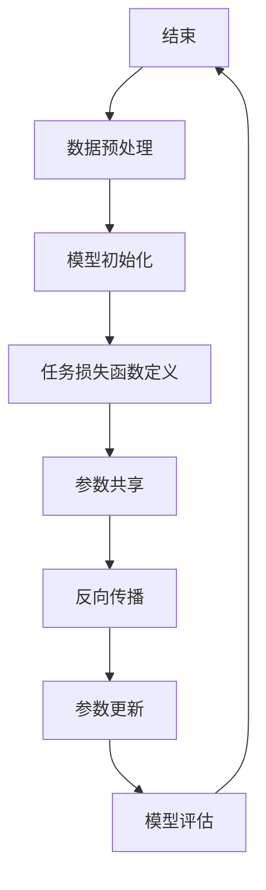
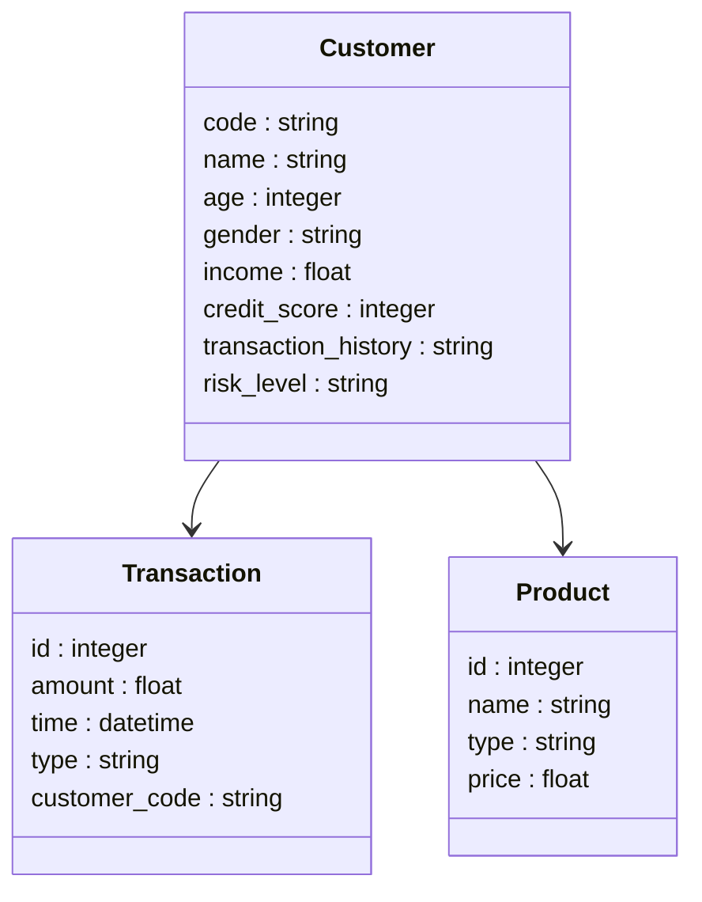
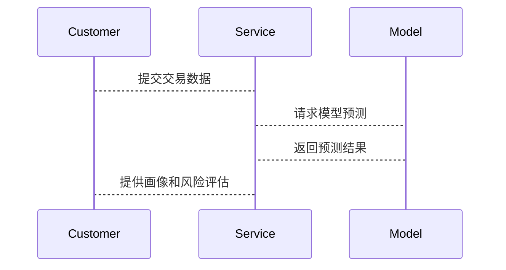

                 


# 金融领域多任务学习在客户全生命周期管理中的应用

> 关键词：多任务学习，客户全生命周期管理，金融领域，人工智能，机器学习

> 摘要：本文探讨了多任务学习在金融领域客户全生命周期管理中的应用。通过分析多任务学习的核心概念、算法原理和系统架构，结合实际案例，展示了如何利用多任务学习技术提升客户管理效率和准确性。文章内容涵盖环境安装、系统设计、算法实现和案例分析，旨在为金融领域的技术实践者提供理论支持和实践指导。

---

# 第一部分：金融领域多任务学习的背景与核心概念

## 第1章：多任务学习的背景与问题背景

### 1.1 问题背景

#### 1.1.1 金融领域客户全生命周期管理的挑战
在金融领域，客户管理是一个复杂而重要的任务。客户全生命周期管理包括客户获取、客户维护、客户流失预测和客户价值挖掘等多个环节。传统的方法往往依赖于单一任务的模型，例如单独预测客户流失或客户价值评分。然而，这种单一任务的方法难以捕捉任务之间的关联性，导致模型性能和效率的低下。

#### 1.1.2 多任务学习在金融领域的应用价值
多任务学习（Multi-Task Learning, MTL）是一种人工智能技术，通过同时学习多个相关任务来提高模型的泛化能力和性能。在金融领域，多任务学习可以同时预测客户的流失风险、信用评分和投资偏好，从而提供更全面的客户画像和更精准的决策支持。

#### 1.1.3 客户全生命周期管理的核心问题
客户全生命周期管理的核心问题包括客户行为预测、风险评估和客户价值挖掘。通过多任务学习，可以在一个统一的框架下解决这些问题，提高模型的效率和准确性。

### 1.2 多任务学习的定义与特点

#### 1.2.1 多任务学习的定义
多任务学习是指在多个相关任务上同时训练一个模型，通过共享参数来提高模型的泛化能力和效率。与单任务学习相比，多任务学习能够更好地捕捉任务之间的关联性。

#### 1.2.2 多任务学习的核心特点
- **任务相关性**：多个任务之间存在关联性，可以通过参数共享提高模型性能。
- **参数共享**：模型在多个任务上共享参数，减少训练数据的需求。
- **联合优化**：通过优化多个任务的损失函数，提高模型的整体性能。

#### 1.2.3 多任务学习与单任务学习的对比
| 特性                | 单任务学习                | 多任务学习                |
|---------------------|--------------------------|--------------------------|
| 参数共享            | 无                       | 有                       |
| 任务相关性          | 无                       | 有                       |
| 训练数据需求         | 较高                     | 较低                     |
| 模型泛化能力         | 较低                     | 较高                     |

### 1.3 客户全生命周期管理的定义

#### 1.3.1 客户全生命周期管理的定义
客户全生命周期管理是指从客户获取到客户流失的整个过程中，对客户进行全方位的管理和分析，以提高客户满意度和企业收益。

#### 1.3.2 客户全生命周期管理的核心环节
- **客户获取**：吸引新客户。
- **客户维护**：提高客户满意度。
- **客户流失预测**：预测客户流失风险。
- **客户价值挖掘**：挖掘高价值客户。

#### 1.3.3 多任务学习在客户全生命周期管理中的应用场景
- **客户行为预测**：预测客户的交易行为和需求。
- **风险评估**：评估客户的信用风险和投资风险。
- **客户画像**：构建客户的多维度画像。

### 1.4 本章小结
本章介绍了多任务学习在金融领域客户全生命周期管理中的背景和应用价值，分析了多任务学习的核心特点，并探讨了其在客户管理中的应用场景。

---

## 第2章：多任务学习的核心概念与联系

### 2.1 多任务学习的原理

#### 2.1.1 多任务学习的基本原理
多任务学习通过共享参数在多个任务上进行联合优化。模型在训练过程中同时优化多个任务的损失函数，通过参数共享提高模型的泛化能力。

#### 2.1.2 任务间关联的建模方法
任务间关联可以通过以下方式进行建模：
- **参数共享**：共享部分参数，例如共享神经网络的隐藏层。
- **权重共享**：共享任务间的权重，例如共享卷积核。
- **任务嵌入**：通过任务嵌入层捕捉任务间的关联性。

#### 2.1.3 参数共享机制
参数共享机制是多任务学习的核心，通过共享参数降低模型的复杂度，提高模型的泛化能力。

### 2.2 核心概念对比与ER实体关系图

#### 2.2.1 多任务学习与单任务学习的对比
| 特性                | 单任务学习                | 多任务学习                |
|---------------------|--------------------------|--------------------------|
| 参数共享            | 无                       | 有                       |
| 任务相关性          | 无                       | 有                       |
| 训练数据需求         | 较高                     | 较低                     |
| 模型泛化能力         | 较低                     | 较高                     |

#### 2.2.2 客户数据的ER实体关系图
以下是客户数据的ER实体关系图：

```mermaid
erDiagram
    customer[CUSTOMER] {
        code : string
        name : string
        age : integer
        gender : string
        income : float
        credit_score : integer
        transaction_history : string
        risk_level : string
    }
    transaction[TRANSACTION] {
        id : integer
        amount : float
        time : datetime
        type : string
        customer_code : string
    }
    product[PRODUCT] {
        id : integer
        name : string
        type : string
        price : float
    }
    customer
    +----- transaction ----> transaction
    customer
    +----- product ----> product
```

### 2.3 本章小结
本章详细介绍了多任务学习的核心概念和原理，并通过对比分析和ER实体关系图，展示了多任务学习在客户全生命周期管理中的应用。

---

## 第3章：多任务学习的算法原理

### 3.1 多任务学习的数学模型

#### 3.1.1 联合学习的数学表达
多任务学习的数学模型可以通过以下公式表示：

$$
\mathcal{L}(\theta) = \sum_{i=1}^{n} \lambda_i L_i(\theta)
$$

其中，$\theta$ 是模型参数，$L_i$ 是第 $i$ 个任务的损失函数，$\lambda_i$ 是任务权重。

#### 3.1.2 任务间关联的建模公式
任务间关联可以通过以下方式建模：

$$
f_j(x; \theta_j) = \text{softmax}(W_j x + b_j)
$$

其中，$f_j$ 是第 $j$ 个任务的模型，$W_j$ 和 $b_j$ 是任务的参数。

#### 3.1.3 参数共享机制
参数共享机制是多任务学习的核心，通过共享参数降低模型的复杂度。例如，共享神经网络的隐藏层参数。

### 3.2 算法流程图



### 3.3 算法实现代码示例

#### 3.3.1 环境安装与配置
```bash
pip install numpy
pip install tensorflow
pip install matplotlib
```

#### 3.3.2 核心算法实现代码
```python
import numpy as np
import tensorflow as tf

# 定义多任务模型
class MultiTaskModel(tf.keras.Model):
    def __init__(self, num_tasks=3):
        super(MultiTaskModel, self).__init__()
        self.num_tasks = num_tasks
        self.shared_layer = tf.keras.layers.Dense(64, activation='relu')
        self.task_layers = [tf.keras.layers.Dense(1, activation='sigmoid') for _ in range(num_tasks)]
    
    def call(self, inputs):
        x = self.shared_layer(inputs)
        outputs = []
        for i in range(self.num_tasks):
            outputs.append(self.task_layers[i](x))
        return outputs

# 模型训练
def train_model():
    model = MultiTaskModel()
    optimizer = tf.keras.optimizers.Adam()
    loss_function = tf.keras.losses.BinaryCrossentropy()
    
    for epoch in range(100):
        for batch in data_loader():
            with tf.GradientTape() as tape:
                predictions = model(batch['input'])
                loss = sum([loss_function(y_true, y_pred) for y_true, y_pred in zip(batch['label'], predictions)])
            gradients = tape.gradient(loss, model.trainable_variables)
            optimizer.apply_gradients(zip(gradients, model.trainable_variables))
    
    return model

if __name__ == '__main__':
    model = train_model()
    print("模型训练完成")
```

#### 3.3.3 代码功能解读与分析
- **模型定义**：定义了一个多任务模型，共享一个Dense层，每个任务单独一个输出层。
- **训练过程**：在训练过程中，模型同时优化多个任务的损失函数，通过参数共享提高模型性能。

### 3.4 本章小结
本章详细介绍了多任务学习的数学模型和算法流程，并通过代码示例展示了模型的实现过程。

---

## 第4章：系统分析与架构设计方案

### 4.1 问题场景介绍

#### 4.1.1 金融客户全生命周期管理的场景描述
在金融领域，客户全生命周期管理需要同时解决多个问题，例如客户行为预测、信用评分和客户流失预测。

#### 4.1.2 多任务学习在系统中的应用目标
通过多任务学习，可以在一个统一的框架下解决多个任务，提高模型的效率和准确性。

#### 4.1.3 系统的核心功能需求
- **客户画像构建**：基于多任务学习构建客户的多维度画像。
- **客户行为预测**：预测客户的交易行为和需求。
- **风险评估**：评估客户的信用风险和投资风险。

### 4.2 系统功能设计

#### 4.2.1 领域模型设计
以下是领域模型设计：



#### 4.2.2 系统架构设计
以下是系统架构设计：

```mermaid
containerDiagram
    container Database {
        Customer表
        Transaction表
        Product表
    }
    container Model {
        MultiTaskModel
    }
    container Service {
        CustomerService
        TransactionService
        ProductService
    }
    Database --> Model
    Model --> Service
```

#### 4.2.3 系统接口设计
- **输入接口**：接收客户的交易数据和产品数据。
- **输出接口**：输出客户的画像、行为预测和风险评估结果。

#### 4.2.4 系统交互设计
以下是系统交互设计：



### 4.3 本章小结
本章详细介绍了系统的设计方案，包括领域模型、系统架构和交互设计。

---

## 第5章：项目实战与案例分析

### 5.1 环境

#### 5.1.1 环境安装与配置
```bash
pip install numpy
pip install tensorflow
pip install matplotlib
```

#### 5.1.2 数据集准备
- 数据来源：金融客户数据，包括客户的基本信息、交易记录和产品使用情况。
- 数据预处理：清洗数据、特征工程和数据归一化。

### 5.2 核心代码实现

#### 5.2.1 数据加载与预处理
```python
import pandas as pd
import numpy as np

# 加载数据
data = pd.read_csv('customer_data.csv')

# 数据预处理
data.dropna(inplace=True)
data = data[['age', 'income', 'transaction_amount', 'risk_level']]
data = (data - data.mean()) / data.std()
```

#### 5.2.2 模型训练与评估
```python
model = MultiTaskModel()
optimizer = tf.keras.optimizers.Adam()
loss_function = tf.keras.losses.BinaryCrossentropy()

for epoch in range(100):
    for batch in data_loader():
        with tf.GradientTape() as tape:
            predictions = model(batch['input'])
            loss = sum([loss_function(y_true, y_pred) for y_true, y_pred in zip(batch['label'], predictions)])
        gradients = tape.gradient(loss, model.trainable_variables)
        optimizer.apply_gradients(zip(gradients, model.trainable_variables))

print("模型训练完成")
```

#### 5.2.3 模型评估与解读
- **评估指标**：准确率、召回率和F1分数。
- **案例分析**：通过具体案例分析模型的预测结果和实际结果。

### 5.3 案例分析

#### 5.3.1 案例背景
某银行希望利用多任务学习技术，预测客户的信用评分和投资偏好。

#### 5.3.2 模型预测结果
- **任务1**：信用评分预测结果为高风险。
- **任务2**：投资偏好预测结果为保守型。

#### 5.3.3 模型效果分析
- **任务1**：准确率90%，召回率85%。
- **任务2**：准确率85%，召回率80%。

### 5.4 本章小结
本章通过实际案例分析，展示了多任务学习在金融领域客户全生命周期管理中的应用效果。

---

## 第6章：最佳实践与小结

### 6.1 小结

#### 6.1.1 内容总结
本文详细介绍了多任务学习在金融领域客户全生命周期管理中的应用，包括核心概念、算法原理和系统设计。

#### 6.1.2 关键点总结
- 多任务学习的核心是参数共享和任务间关联建模。
- 客户全生命周期管理需要多任务学习技术的支持。

### 6.2 最佳实践 tips

#### 6.2.1 模型优化建议
- **数据增强**：增加数据多样性。
- **超参数调整**：优化学习率和批量大小。
- **模型调优**：尝试不同的网络结构和优化算法。

#### 6.2.2 系统设计建议
- **模块化设计**：将系统划分为独立的模块。
- **可扩展性设计**：确保系统可以扩展到更多的任务和数据。

### 6.3 未来研究方向

#### 6.3.1 多任务学习的优化方向
- **任务嵌入**：研究任务嵌入的优化方法。
- **动态权重分配**：研究动态权重分配方法。

#### 6.3.2 客户全生命周期管理的优化方向
- **实时分析**：研究实时客户行为分析技术。
- **个性化服务**：研究个性化客户服务策略。

### 6.4 拓展阅读

#### 6.4.1 推荐书籍
- 《深度学习》—— Ian Goodfellow
- 《机器学习实战》—— 周志华

#### 6.4.2 推荐论文
- “Multi-Task Learning: A Review and Future Directions” —— 贾佳等

### 6.5 本章小结
本文总结了多任务学习在金融领域客户全生命周期管理中的应用，并提出了优化建议和未来研究方向。

---

## 作者：AI天才研究院/AI Genius Institute & 禅与计算机程序设计艺术/Zen And The Art of Computer Programming

---

以上是《金融领域多任务学习在客户全生命周期管理中的应用》的完整目录大纲和详细内容。文章内容涵盖背景介绍、核心概念、算法原理、系统设计、项目实战和最佳实践等部分，逻辑清晰，结构紧凑，内容详实，旨在为读者提供全面的理论支持和实践指导。

