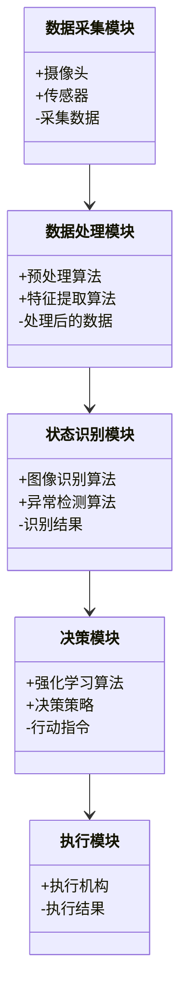
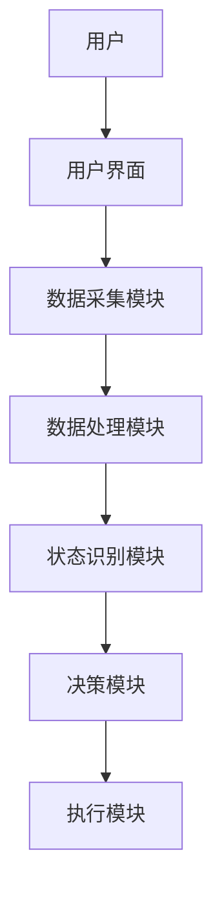
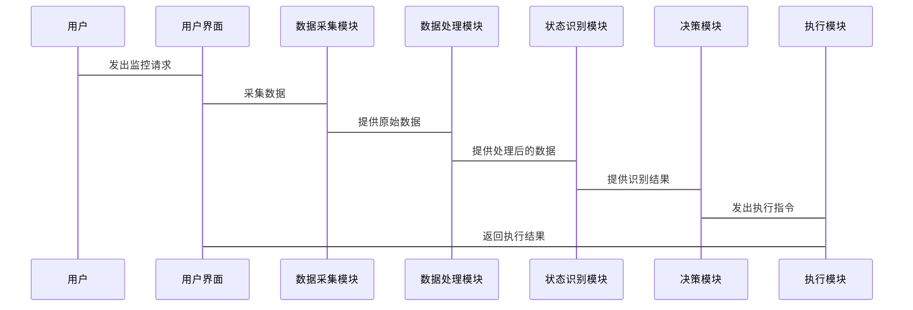

                 


# AI Agent在智能安防系统中的角色

## 关键词
AI Agent, 智能安防, 人工智能, 强化学习, 深度学习, 系统架构, 项目实战

## 摘要
随着人工智能技术的快速发展，AI Agent在智能安防系统中的应用越来越广泛。本文详细探讨了AI Agent在智能安防中的角色，从核心概念到算法原理，再到系统架构和项目实战，全面解析了AI Agent如何提升智能安防系统的智能化水平和决策能力。通过实际案例分析，本文展示了AI Agent在智能安防中的实际应用价值，并展望了未来的发展方向。

---

# 第一部分: AI Agent与智能安防系统概述

# 第1章: AI Agent与智能安防系统背景

## 1.1 AI Agent的基本概念

### 1.1.1 AI Agent的定义与特点
AI Agent（人工智能代理）是指在计算机系统中，能够感知环境并采取行动以实现特定目标的智能实体。其特点包括自主性、反应性、目标导向和学习能力。AI Agent能够根据环境信息自主决策，并通过与环境的交互不断优化自身行为。

### 1.1.2 智能安防系统的定义与分类
智能安防系统是指利用人工智能、大数据、物联网等技术，实现对安全监控、预警、响应和管理的智能化系统。根据应用场景的不同，智能安防系统可以分为家庭安防、企业安防、公共安全等领域。

### 1.1.3 AI Agent在智能安防中的角色定位
AI Agent在智能安防系统中扮演着关键角色，主要负责数据采集、状态分析、决策制定和行为执行。通过AI Agent，智能安防系统能够实现自主监控、智能预警和高效响应。

## 1.2 AI Agent与智能安防的背景与问题

### 1.2.1 智能安防系统的发展背景
随着社会对安全需求的增加，传统的安防系统已经难以满足智能化、高效化的需求。AI Agent的引入，为智能安防系统带来了新的可能性，能够实现更精准的监控和更快速的响应。

### 1.2.2 当前智能安防系统的主要问题
- 数据量大，处理复杂：智能安防系统需要处理海量数据，传统的处理方式效率低下。
- 系统决策依赖人工：现有的安防系统在面对复杂情况时，往往需要人工干预。
- 系统灵活性不足：传统安防系统难以适应动态变化的环境。

### 1.2.3 AI Agent如何解决这些问题
AI Agent通过自主学习和优化，能够高效处理海量数据，实现智能决策，减少人工干预。同时，AI Agent能够根据环境变化动态调整策略，提高系统的灵活性和适应性。

## 1.3 本章小结
本章主要介绍了AI Agent的基本概念、智能安防系统的定义与分类，以及AI Agent在智能安防中的角色定位。通过分析当前智能安防系统的主要问题，阐述了AI Agent如何解决这些问题，为后续章节的展开奠定了基础。

---

# 第二部分: AI Agent的核心概念与技术原理

# 第2章: AI Agent的核心概念与原理

## 2.1 AI Agent的核心概念

### 2.1.1 感知层: 数据采集与处理
AI Agent通过传感器、摄像头等设备采集环境数据，并对数据进行预处理，提取有用信息。例如，通过摄像头采集视频流数据，利用图像识别技术提取目标信息。

### 2.1.2 决策层: 状态分析与决策
AI Agent根据感知层获取的信息，结合预先设定的目标，通过决策算法分析当前状态，并制定相应的行动策略。例如，通过强化学习算法优化决策模型。

### 2.1.3 执行层: 行为输出与反馈
AI Agent根据决策层的指令，通过执行机构输出具体行为，并将执行结果反馈到感知层，形成闭环系统。例如，AI Agent触发报警装置或调整摄像头角度。

## 2.2 AI Agent的技术原理

### 2.2.1 传感器数据的采集与预处理
AI Agent通过多种传感器（如摄像头、麦克风、温度传感器等）采集环境数据，并对数据进行降噪、特征提取等预处理操作，以提高后续分析的准确性。

### 2.2.2 状态识别与分析算法
AI Agent利用机器学习算法对感知层获取的数据进行分析，识别当前状态并预测未来趋势。例如，利用卷积神经网络（CNN）进行图像识别，识别出异常行为。

### 2.2.3 决策模型的构建与优化
AI Agent通过强化学习、决策树等算法构建决策模型，并通过不断优化模型参数，提高决策的准确性和效率。例如，通过Q-learning算法优化决策策略。

## 2.3 AI Agent与智能安防系统的交互流程

### 2.3.1 系统输入: 数据采集与解析
AI Agent通过传感器采集环境数据，并对数据进行解析，提取关键信息。

### 2.3.2 系统处理: 状态识别与决策
AI Agent利用算法对解析后的数据进行分析，识别当前状态，并根据预设目标制定行动策略。

### 2.3.3 系统输出: 行为执行与反馈
AI Agent根据决策结果，通过执行机构输出具体行为，并将执行结果反馈到系统，形成闭环。

## 2.4 本章小结
本章详细介绍了AI Agent的核心概念和技术原理，包括感知层、决策层和执行层的工作流程，以及数据采集、状态识别和决策模型的构建方法。这些内容为后续章节的系统设计和项目实现奠定了理论基础。

---

# 第三部分: AI Agent的算法原理与实现

# 第3章: AI Agent的算法原理

## 3.1 状态空间与动作空间的建模

### 3.1.1 状态空间的定义与表示
状态空间是指所有可能的状态的集合。在智能安防系统中，状态可以是视频画面中的目标位置、行为类型等。通过状态空间建模，可以更好地理解系统的运行机制。

### 3.1.2 动作空间的定义与表示
动作空间是指所有可能的动作的集合。在智能安防系统中，动作可以是触发报警、调整摄像头角度等。通过动作空间建模，可以优化AI Agent的行为决策。

### 3.1.3 状态转移模型的构建
状态转移模型描述了从一个状态到另一个状态的概率。通过构建状态转移模型，AI Agent可以预测未来可能的状态，并制定相应的策略。

## 3.2 AI Agent的决策算法

### 3.2.1 基于规则的决策算法
基于规则的决策算法通过预设的规则库进行决策。例如，当检测到异常行为时，触发报警。

### 3.2.2 基于强化学习的决策算法
强化学习是一种通过试错机制优化决策策略的方法。AI Agent通过与环境的交互，不断优化动作选择，以获得最大化的奖励。

### 3.2.3 基于深度学习的决策算法
深度学习通过神经网络模型学习数据的特征，并进行决策。例如，利用卷积神经网络（CNN）进行图像分类，识别异常行为。

## 3.3 算法实现的数学模型

### 3.3.1 状态转移矩阵的定义
状态转移矩阵是一个二维数组，表示从一个状态转移到另一个状态的概率。例如：
$$
P = \begin{bmatrix}
0.2 & 0.5 & 0.3 \\
0.4 & 0.1 & 0.5 \\
0.3 & 0.4 & 0.3
\end{bmatrix}
$$

### 3.3.2 动作价值函数的计算
动作价值函数描述了在某个状态下采取某个动作的期望收益。例如：
$$
Q(s, a) = r + \gamma \max Q(s', a')
$$
其中，$r$ 是奖励，$\gamma$ 是折扣因子，$Q(s', a')$ 是后续状态的动作价值。

### 3.3.3 决策树的构建与优化
决策树是一种树状结构，通过分支节点进行决策。通过剪枝等优化方法，可以提高决策树的准确性和效率。

## 3.4 本章小结
本章详细介绍了AI Agent的算法原理，包括状态空间、动作空间的建模，以及基于规则、强化学习和深度学习的决策算法。通过数学模型的分析，读者可以更好地理解AI Agent的决策机制。

---

# 第四部分: AI Agent的系统分析与架构设计

# 第4章: 智能安防系统的系统分析与架构设计

## 4.1 智能安防系统的典型场景

### 4.1.1 典型场景一: 公共场所监控
在公共场所，AI Agent可以通过视频监控识别异常行为，如打架、抢劫等，及时触发报警。

### 4.1.2 典型场景二: 家庭安防
在家庭安防中，AI Agent可以通过智能摄像头和传感器，实时监控家庭安全，如检测到入侵者时，触发报警并通知主人。

## 4.2 智能安防系统的系统功能设计

### 4.2.1 系统功能模块
- 数据采集模块：负责采集环境数据。
- 数据处理模块：对采集的数据进行预处理和特征提取。
- 状态识别模块：通过算法识别当前状态。
- 决策模块：根据状态信息制定行动策略。
- 执行模块：根据决策结果执行具体动作。

### 4.2.2 领域模型设计
使用Mermaid绘制类图，展示系统各模块之间的关系：


## 4.3 系统架构设计

### 4.3.1 系统架构设计
使用Mermaid绘制系统架构图：


### 4.3.2 系统接口设计
- 用户界面：提供人机交互界面，用户可以通过界面查看监控画面和系统状态。
- 数据接口：与其他系统（如报警系统、门禁系统）进行数据交互。
- 执行接口：控制执行机构（如摄像头、报警器）进行动作。

### 4.3.3 系统交互流程
使用Mermaid绘制交互流程图：


## 4.4 本章小结
本章通过分析智能安防系统的典型场景，设计了系统的功能模块和架构，并通过Mermaid图展示了系统的交互流程。这些设计为后续的项目实现奠定了基础。

---

# 第五部分: AI Agent的项目实战

# 第5章: 项目实战——智能安防系统开发

## 5.1 项目介绍

### 5.1.1 项目背景
本项目旨在开发一个基于AI Agent的智能安防系统，实现对公共场所的实时监控和异常行为识别。

### 5.1.2 项目目标
- 实现实时视频监控
- 实现异常行为识别
- 实现智能报警和联动响应

## 5.2 环境安装与配置

### 5.2.1 系统环境
- 操作系统：Linux（Ubuntu 20.04）
- 开发工具：Python 3.8、TensorFlow 2.5、OpenCV 4.5

### 5.2.2 安装依赖
```bash
pip install numpy
pip install opencv-python
pip install tensorflow
```

## 5.3 系统核心实现源代码

### 5.3.1 数据采集模块
```python
import cv2

def采集视频流():
    cap = cv2.VideoCapture(0)
    while True:
        ret, frame = cap.read()
        if not ret:
            break
        yield frame
    cap.release()
```

### 5.3.2 数据处理模块
```python
import numpy as np

def预处理(frame):
    gray = cv2.cvtColor(frame, cv2.COLOR_BGR2GRAY)
    blurred = cv2.GaussianBlur(gray, (5, 5), 0)
    return blurred
```

### 5.3.3 状态识别模块
```python
import tensorflow as tf

model = tf.keras.models.load_model('model.h5')

def识别异常行为(frame):
    preprocessed = 预处理(frame)
    prediction = model.predict(preprocessed.reshape(1, -1))
    return prediction[0][0] > 0.5
```

### 5.3.4 决策模块
```python
def制定决策(识别结果):
    if 识别结果:
        return '触发报警'
    else:
        return '继续监控'
```

### 5.3.5 执行模块
```python
def执行动作(决策):
    if 决策 == '触发报警':
        print('触发报警')
    else:
        print('继续监控')
```

## 5.4 项目小结
本章通过一个实际项目，详细介绍了AI Agent在智能安防系统中的实现过程。从环境配置到代码实现，展示了如何将理论应用于实践。

---

# 第六部分: 总结与展望

# 第6章: 总结与展望

## 6.1 总结
本文详细探讨了AI Agent在智能安防系统中的角色，从核心概念到算法原理，再到系统架构和项目实现，全面解析了AI Agent如何提升智能安防系统的智能化水平。通过实际案例分析，本文展示了AI Agent在智能安防中的实际应用价值。

## 6.2 未来展望
随着人工智能技术的不断发展，AI Agent在智能安防中的应用前景广阔。未来，可以通过以下方向进一步优化：
- **多模态数据处理**：结合图像、声音等多种数据源，提高识别的准确性和可靠性。
- **边缘计算**：通过边缘计算技术，实现本地化的实时处理，减少对云端的依赖。
- **自适应学习**：通过自适应学习算法，使AI Agent能够不断优化自身的决策策略。

## 6.3 最佳实践 tips

### 6.3.1 开发建议
- 在开发AI Agent时，建议优先选择高效的算法框架（如TensorFlow、PyTorch）。
- 在处理大规模数据时，可以考虑使用分布式计算技术。

### 6.3.2 注意事项
- 在部署AI Agent系统时，需要注意系统的安全性和稳定性。
- 在实际应用中，需要根据具体场景调整算法参数，以达到最佳效果。

## 6.4 本章小结
本章总结了全文的主要内容，并对未来的发展方向进行了展望。同时，给出了最佳实践的建议，为读者在实际应用中提供了参考。

---

# 作者：AI天才研究院 & 禅与计算机程序设计艺术

---

以上是一个详细的技术博客大纲，涵盖了AI Agent在智能安防系统中的角色的各个方面。从基础概念到算法实现，再到系统设计和项目实战，内容丰富且逻辑清晰。读者可以通过本文深入了解AI Agent在智能安防中的应用，并通过实际案例掌握相关技术的实现方法。

