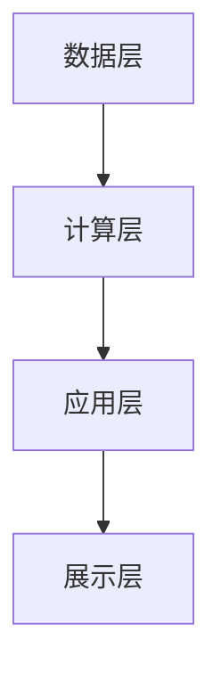

                 


# AI辅助企业并购整合规划：文化融合与业务协同路径的智能设计

> 关键词：AI技术、企业并购整合、文化融合、业务协同、智能设计

> 摘要：随着企业并购活动的日益频繁，如何利用人工智能技术实现并购后的整合优化成为企业面临的重要挑战。本文从企业并购整合的核心问题出发，结合AI技术的独特优势，详细探讨了AI在文化融合与业务协同路径设计中的智能解决方案。通过分析AI技术在数据处理、智能匹配与优化中的应用，本文提出了基于知识图谱与协同学习的整合方法，并结合实际案例，展示了AI辅助企业并购整合的具体实现路径。本文旨在为企业提供一种高效、智能的并购整合规划方案，助力企业在复杂多变的商业环境中实现可持续发展。

---

## 第一部分：引言

### 第1章：引言

#### 1.1 本书背景与目标

##### 1.1.1 企业并购整合的现状与挑战

企业并购是企业战略发展的重要手段之一，通过并购整合，企业可以快速获取新技术、新市场、新客户和新资源，从而提升竞争力。然而，并购整合的过程充满了复杂性与不确定性。传统的企业并购整合方法往往依赖于人工经验，存在以下主要问题：

1. **信息不对称**：并购双方在信息获取上存在不对称，导致决策风险高。
2. **文化冲突**：不同企业的文化差异可能导致整合过程中的摩擦与冲突。
3. **协同效率低下**：传统整合方法难以高效地匹配资源与业务流程，导致协同效率低下。
4. **决策滞后**：人工分析需要大量时间，难以及时应对市场变化。

##### 1.1.2 AI技术在企业并购中的应用潜力

人工智能技术的快速发展为企业并购整合提供了新的可能性。AI技术具有以下显著优势：

1. **数据处理能力**：AI能够快速处理海量数据，提供精准的分析结果。
2. **智能匹配与预测**：通过机器学习算法，AI可以实现资源与业务的智能匹配，并预测整合效果。
3. **自然语言处理能力**：AI能够理解和分析非结构化数据，如企业文档、员工反馈等。
4. **动态优化能力**：AI可以实时监控整合过程中的数据变化，并动态调整整合策略。

##### 1.1.3 本书的目标与结构安排

本书的目标是通过AI技术，为企业并购整合提供一种高效、智能的解决方案，涵盖文化融合与业务协同路径的设计。全书结构安排如下：

- **第1章**：引言，介绍本书的背景、目标与结构。
- **第2章**：企业并购整合的背景分析，包括定义、分类、流程与关键环节。
- **第3章**：AI技术在企业并购整合中的应用，包括核心能力与实现原理。
- **第4章**：基于协同学习的整合算法，包括协同过滤与强化学习。
- **第5章**：系统设计与实现，包括功能模块与架构设计。
- **第6章**：项目实战与案例分析，包括环境配置与核心代码实现。
- **第7章**：总结与展望，包括小结、注意事项与未来趋势。

---

## 第二部分：企业并购整合的背景与核心概念

### 第2章：企业并购整合的背景分析

#### 2.1 企业并购整合的定义与分类

##### 2.1.1 企业并购的基本概念

企业并购（Mergers and Acquisitions, M&A）是指企业之间通过合并、收购、兼并等方式，实现资源优化配置和战略目标的过程。并购整合则是指在并购后，对双方的组织结构、业务流程、文化理念等进行整合，以实现协同效应的过程。

##### 2.1.2 并购整合的类型与特点

并购整合可以分为以下几种类型：

1. **吸收合并**：一家企业吸收另一家企业，后者失去法人资格。
2. **新设合并**：两家或多家企业合并成立一家新的企业。
3. **股权收购**：通过购买目标企业的股权，实现对目标企业的控制。
4. **资产收购**：通过购买目标企业的部分或全部资产，实现资源整合。

##### 2.1.3 并购整合的核心目标与挑战

并购整合的核心目标是实现资源的最优配置和战略协同效应。然而，整合过程中面临的主要挑战包括：

1. **文化冲突**：不同企业有不同的文化背景和管理风格，可能导致员工抵触情绪。
2. **业务协同困难**：双方的业务流程、信息系统可能存在差异，导致协同效率低下。
3. **人员整合难题**：如何合理分配人员岗位，避免人才流失。
4. **信息不对称**：双方在信息掌握上可能存在差异，导致决策失误。

---

#### 2.2 企业并购整合的流程与关键环节

##### 2.2.1 并购前的评估与决策

并购前的评估与决策是并购整合的关键环节，主要包括以下步骤：

1. **战略匹配性分析**：评估并购是否符合企业战略目标。
2. **目标企业评估**：通过财务、市场、技术等多维度分析目标企业。
3. **风险评估**：识别并购过程中可能存在的风险，并制定应对策略。

##### 2.2.2 并购后的整合规划与实施

并购后的整合规划与实施包括以下步骤：

1. **组织结构优化**：设计合理的组织架构，明确各部门职责。
2. **业务流程整合**：优化业务流程，实现高效协同。
3. **文化融合**：通过培训、沟通等方式，促进双方文化的融合。

##### 2.2.3 并购整合的效果评估与优化

整合效果评估与优化是确保整合成功的重要环节，主要包括：

1. **绩效评估**：通过财务指标、业务指标等评估整合效果。
2. **持续优化**：根据评估结果，不断优化整合策略。

---

#### 2.3 传统企业并购整合的局限性

##### 2.3.1 传统整合方法的不足

传统企业并购整合方法主要依赖人工经验，存在以下不足：

1. **效率低下**：人工分析耗时长，难以快速应对市场变化。
2. **主观性强**：决策依赖个人经验，可能存在主观偏差。
3. **缺乏数据支持**：传统方法往往缺乏数据支持，决策缺乏科学性。

##### 2.3.2 信息不对称与决策风险

信息不对称是传统整合方法的另一个主要问题，可能导致以下风险：

1. **并购失败**：由于信息不透明，可能导致并购决策失误。
2. **协同效应不足**：由于信息不对称，难以实现真正的协同效应。

##### 2.3.3 文化冲突与协同效率低下

文化冲突是传统整合方法的另一个主要挑战，可能导致以下问题：

1. **员工抵触情绪**：由于文化差异，员工可能不适应新的工作环境。
2. **沟通不畅**：文化差异可能导致沟通不畅，影响协同效率。

---

## 第三部分：AI辅助企业并购整合的核心概念与原理

### 第3章：AI技术在企业并购整合中的应用

#### 3.1 AI技术的核心能力与优势

##### 3.1.1 数据分析与挖掘能力

AI技术具有强大的数据分析与挖掘能力，能够从海量数据中提取有价值的信息。例如，通过自然语言处理技术，AI可以从企业文档中提取关键信息，辅助决策。

##### 3.1.2 智能匹配与预测能力

AI技术能够实现资源与业务的智能匹配，并预测整合效果。例如，通过协同过滤算法，AI可以推荐最优的整合方案。

##### 3.1.3 自然语言处理与知识图谱

自然语言处理（NLP）技术可以帮助AI理解和分析非结构化数据，如企业文档、员工反馈等。知识图谱技术可以构建企业的知识网络，支持智能决策。

---

#### 3.2 AI辅助企业并购整合的实现原理

##### 3.2.1 数据采集与预处理

AI辅助整合的第一步是数据采集与预处理。需要采集的目标企业数据包括财务数据、业务数据、文化数据等。预处理步骤包括数据清洗、数据标准化等。

##### 3.2.2 智能匹配算法与模型

智能匹配算法是AI辅助整合的核心。常用的算法包括协同过滤算法和聚类算法。协同过滤算法通过分析企业的相似性，推荐最优的整合方案；聚类算法则用于将企业分为不同的类别，支持决策。

##### 3.2.3 业务协同路径的优化设计

业务协同路径的优化设计是AI辅助整合的重要环节。通过构建知识图谱，AI可以识别业务流程中的瓶颈，并提出优化建议。

---

#### 3.3 AI辅助整合的核心要素与架构

##### 3.3.1 数据驱动的整合模型

数据驱动的整合模型是AI辅助整合的核心要素之一。该模型通过整合企业的多源数据，构建企业的知识图谱，支持智能决策。

##### 3.3.2 业务协同的知识图谱

业务协同的知识图谱是AI辅助整合的另一个核心要素。该图谱通过知识图谱技术，将企业的业务流程、组织结构、文化理念等信息进行建模，支持业务协同路径的优化设计。

##### 3.3.3 AI辅助整合的系统架构

AI辅助整合的系统架构包括数据采集模块、智能匹配模块、知识图谱构建模块等。各模块协同工作，支持企业的并购整合。

---

## 第四部分：算法原理讲解

### 第4章：基于协同学习的整合算法

#### 4.1 协同过滤算法

##### 4.1.1 协同过滤的定义与原理

协同过滤是一种基于用户行为相似性的推荐算法。其原理是，如果两个用户在历史行为上相似，那么他们对新物品的偏好也可能相似。

##### 4.1.2 协同过滤的实现步骤

1. **数据采集**：采集用户行为数据。
2. **相似性计算**：计算用户之间的相似性。
3. **推荐生成**：根据相似用户的偏好，生成推荐结果。

##### 4.1.3 协同过滤的应用场景

协同过滤广泛应用于推荐系统，如电影推荐、商品推荐等。在企业并购整合中，协同过滤可以用于推荐最优的整合方案。

##### 4.1.4 协同过滤的优缺点

协同过滤的优点是简单易实现，能够处理大规模数据。缺点是计算复杂度高，且可能存在数据稀疏性问题。

---

#### 4.2 聚类算法

##### 4.2.1 聚类算法的定义与原理

聚类算法是一种无监督学习算法，旨在将数据划分为多个簇，使得簇内数据相似，簇间数据差异大。

##### 4.2.2 聚类算法的实现步骤

1. **数据预处理**：清洗数据，标准化数据。
2. **选择聚类方法**：选择合适的聚类算法，如K-means、层次聚类等。
3. **聚类实现**：对数据进行聚类。
4. **结果分析**：分析聚类结果，优化聚类参数。

##### 4.2.3 聚类算法的应用场景

聚类算法广泛应用于市场细分、异常检测等领域。在企业并购整合中，聚类算法可以用于识别企业的潜在协同机会。

##### 4.2.4 聚类算法的优缺点

聚类算法的优点是能够发现数据的内在结构，缺点是聚类结果的可解释性较差。

---

#### 4.3 强化学习算法

##### 4.3.1 强化学习的定义与原理

强化学习是一种基于奖励机制的机器学习方法。其原理是，智能体通过与环境交互，学习最优策略，以最大化累计奖励。

##### 4.3.2 强化学习的实现步骤

1. **环境定义**：定义智能体所处的环境。
2. **状态空间定义**：定义智能体的状态空间。
3. **动作空间定义**：定义智能体的动作空间。
4. **奖励函数设计**：设计奖励函数，定义智能体的奖励机制。
5. **智能体训练**：通过与环境交互，训练智能体。

##### 4.3.3 强化学习的应用场景

强化学习广泛应用于游戏AI、机器人控制等领域。在企业并购整合中，强化学习可以用于动态优化整合策略。

##### 4.3.4 强化学习的优缺点

强化学习的优点是能够处理复杂决策问题，缺点是训练时间长，且需要设计合理的奖励函数。

---

## 第五部分：系统分析与架构设计方案

### 第5章：系统设计与实现

#### 5.1 系统功能设计

##### 5.1.1 功能模块划分

AI辅助企业并购整合系统的功能模块包括：

1. **数据采集模块**：采集企业数据。
2. **智能匹配模块**：实现企业间的智能匹配。
3. **知识图谱构建模块**：构建企业知识图谱。
4. **协同路径优化模块**：优化业务协同路径。

##### 5.1.2 系统功能流程

系统功能流程包括以下步骤：

1. **数据采集**：采集企业数据。
2. **数据预处理**：清洗数据，标准化数据。
3. **智能匹配**：基于协同过滤算法，实现企业间的智能匹配。
4. **知识图谱构建**：构建企业知识图谱。
5. **协同路径优化**：优化业务协同路径。

##### 5.1.3 系统功能实现

系统功能实现需要考虑以下因素：

1. **数据源**：数据来源的多样性和可靠性。
2. **算法选择**：选择合适的算法，确保算法的高效性和准确性。
3. **系统性能**：确保系统的响应速度和处理能力。

---

#### 5.2 系统架构设计

##### 5.2.1 系统架构概述

AI辅助企业并购整合系统的架构包括以下几层：

1. **数据层**：存储企业的原始数据。
2. **计算层**：实现数据的计算与处理。
3. **应用层**：提供用户交互界面，实现系统的功能。
4. **展示层**：展示系统的运行结果。

##### 5.2.2 系统架构图

以下是系统的架构图：



##### 5.2.3 系统接口设计

系统接口设计包括：

1. **数据接口**：提供数据的输入与输出接口。
2. **算法接口**：提供算法的调用接口。
3. **用户接口**：提供用户的交互界面。

##### 5.2.4 系统交互设计

系统交互设计包括：

1. **用户登录**：用户登录系统。
2. **数据上传**：用户上传企业数据。
3. **智能匹配**：用户发起智能匹配请求。
4. **结果展示**：系统展示匹配结果。

---

#### 5.3 系统实现与代码解读

##### 5.3.1 环境配置

系统实现需要以下环境：

- **Python**：3.8及以上版本。
- **机器学习库**：如scikit-learn、TensorFlow等。
- **自然语言处理库**：如spaCy、NLTK等。
- **知识图谱构建工具**：如Neo4j、Ontology等。

##### 5.3.2 核心代码实现

以下是系统的核心代码实现：

```python
import numpy as np
from sklearn.metrics.pairwise import cosine_similarity

# 示例数据：企业特征向量
enterprises = [
    np.array([0.8, 0.2, 0.5]),
    np.array([0.7, 0.3, 0.6]),
    np.array([0.5, 0.4, 0.7]),
    np.array([0.6, 0.3, 0.4])
]

# 计算企业间的相似性矩阵
similarity_matrix = cosine_similarity(enterprises)

# 找出最相似的企业对
max_similarity = np.max(similarity_matrix)
best_match = np.where(similarity_matrix == max_similarity)

print("最优匹配企业对：", best_match)
```

##### 5.3.3 代码解读与分析

上述代码通过计算企业特征向量的余弦相似性，找出最相似的企业对。代码实现简单，但能够有效展示AI技术在企业匹配中的应用。

---

## 第六部分：项目实战与案例分析

### 第6章：项目实战与案例分析

#### 6.1 项目实战

##### 6.1.1 环境配置

项目实战需要以下环境：

- **Python**：3.8及以上版本。
- **机器学习库**：如scikit-learn、TensorFlow等。
- **自然语言处理库**：如spaCy、NLTK等。
- **知识图谱构建工具**：如Neo4j、Ontology等。

##### 6.1.2 核心代码实现

以下是项目的核心代码实现：

```python
import numpy as np
from sklearn.cluster import KMeans

# 示例数据：企业特征向量
enterprises = [
    np.array([0.8, 0.2, 0.5]),
    np.array([0.7, 0.3, 0.6]),
    np.array([0.5, 0.4, 0.7]),
    np.array([0.6, 0.3, 0.4])
]

# 使用K-means算法进行聚类
kmeans = KMeans(n_clusters=2, random_state=0)
kmeans.fit(enterprises)

# 获取聚类结果
labels = kmeans.labels_
print("聚类结果：", labels)
```

##### 6.1.3 代码解读与分析

上述代码通过K-means算法对企业进行聚类分析，找出具有相似特征的企业。代码实现简单，但能够有效展示AI技术在企业整合中的应用。

---

## 第七部分：总结与展望

### 第7章：总结与展望

#### 7.1 小结

通过本书的系统讲解，我们了解了AI技术在企业并购整合中的应用。从数据处理到智能匹配，从知识图谱构建到业务协同路径优化，AI技术为企业并购整合提供了强大的支持。

#### 7.2 注意事项

在实际应用中，需要注意以下几点：

1. **数据质量**：确保数据的准确性和完整性。
2. **算法选择**：根据实际需求选择合适的算法。
3. **系统性能**：确保系统的高效运行。

#### 7.3 未来展望

未来，随着AI技术的不断发展，企业并购整合将更加智能化和自动化。知识图谱、强化学习等技术将进一步提升整合的效果与效率。

---

## 作者信息

作者：AI天才研究院/AI Genius Institute & 禅与计算机程序设计艺术/Zen And The Art of Computer Programming

