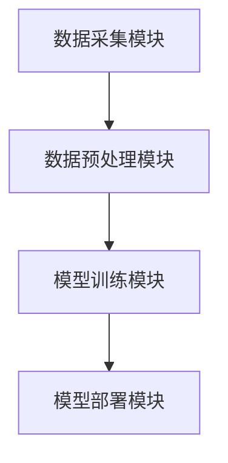
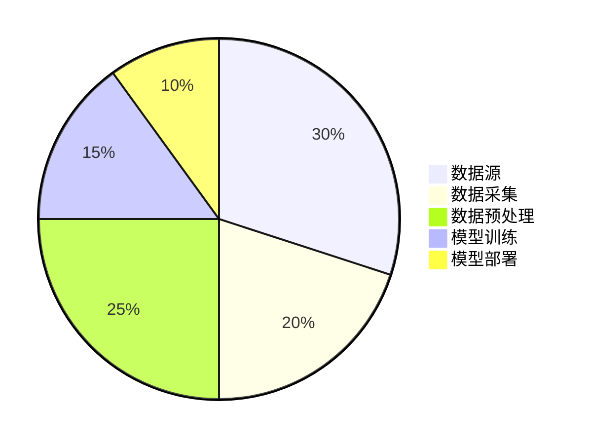
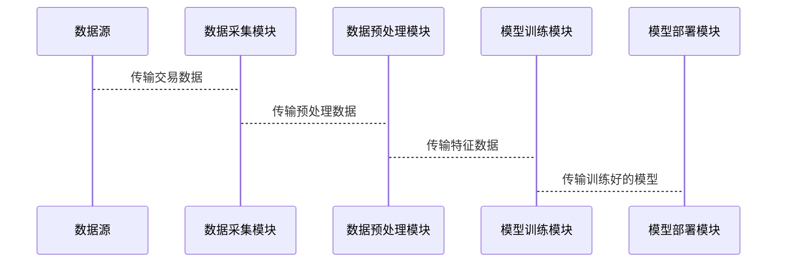

                 


# AI驱动的信用卡欺诈模式识别

> 关键词：信用卡欺诈，人工智能，模式识别，机器学习，深度学习

> 摘要：信用卡欺诈是金融领域的一个重要问题，每年给全球经济带来巨大的损失。随着人工智能技术的发展，利用AI技术进行信用卡欺诈模式识别已经成为一种趋势。本文从信用卡欺诈的基本概念出发，详细探讨了AI技术在信用卡欺诈检测中的应用，包括特征工程、分类算法、监督学习和无监督学习、深度学习等核心内容，并通过实际案例分析展示了AI技术在信用卡欺诈检测中的优势和效果。

---

# 第一部分: 信用卡欺诈模式识别的背景与挑战

## 第1章: 信用卡欺诈的背景与问题概述

### 1.1 信用卡欺诈的背景介绍

#### 1.1.1 信用卡的基本概念与功能
信用卡是一种电子支付工具，允许持卡人在信用额度内进行消费，而无需当场支付现金。信用卡的功能包括消费支付、预授权、转账等。

#### 1.1.2 信用卡欺诈的定义与分类
信用卡欺诈是指利用信用卡进行非法活动，导致持卡人或发卡机构遭受损失的行为。常见的信用卡欺诈类型包括：
- 伪卡欺诈：使用复制的信用卡进行交易。
- 未授权交易：持卡人未经授权的交易。
- 账户盗用：黑客入侵持卡人账户，进行未经授权的交易。
- 恶意欠款：持卡人故意透支信用卡，拒绝还款。

#### 1.1.3 信用卡欺诈的现状与趋势
随着电子商务的快速发展，信用卡欺诈问题日益严重。根据相关统计数据，信用卡欺诈造成的经济损失逐年增长，且欺诈手段也在不断进化，例如利用钓鱼网站、木马程序等技术手段进行欺诈。

### 1.2 信用卡欺诈的典型问题

#### 1.2.1 欺诈交易的常见模式
欺诈交易的常见模式包括：
- 高频交易：短时间内多次小额交易，试图避开交易监控。
- 大额交易：短时间内进行大额交易，利用交易金额大、风险高的特点。
- 地域分散：交易地点分散，跨越多个地区或国家，试图掩盖欺诈行为。

#### 1.2.2 欺诈交易的经济损失分析
信用卡欺诈不仅给发卡机构带来直接经济损失，还可能导致持卡人信用记录受损，甚至引发连锁反应，影响整个金融系统的稳定性。

#### 1.2.3 欺诈交易的复杂性与挑战
欺诈交易的复杂性主要体现在：
- 欺诈手段多样化：从简单的伪卡欺诈到复杂的网络攻击，欺诈手段不断升级。
- 欺诈行为隐蔽性：欺诈者通常会隐藏自己的真实身份和交易行为，使得检测难度加大。
- 数据量大：信用卡交易数据量庞大，传统的检测方法难以处理。

### 1.3 AI技术在欺诈检测中的作用

#### 1.3.1 传统欺诈检测方法的局限性
传统的信用卡欺诈检测方法主要包括规则-based方法和统计方法，但存在以下问题：
- 规则-based方法依赖于人工制定的规则，难以覆盖所有可能的欺诈场景。
- 统计方法依赖于历史数据的分布，难以应对新的欺诈模式。

#### 1.3.2 AI技术在欺诈检测中的优势
AI技术在欺诈检测中的优势主要体现在：
- 高精度：AI算法能够学习复杂的欺诈模式，提高检测准确率。
- 高效率：AI技术能够快速处理大量数据，实时检测欺诈交易。
- 自适应性：AI算法能够自动适应新的欺诈模式，无需人工干预。

#### 1.3.3 AI驱动的信用卡欺诈检测的未来展望
未来的信用卡欺诈检测将更加依赖AI技术，特别是深度学习和无监督学习技术，能够更好地应对复杂的欺诈模式。

### 1.4 本章小结
本章介绍了信用卡欺诈的基本概念、常见模式和经济损失分析，探讨了传统欺诈检测方法的局限性，并重点阐述了AI技术在欺诈检测中的优势和未来发展方向。

---

# 第二部分: 欺诈模式识别的核心概念与原理

## 第2章: 欺诈模式识别的核心概念

### 2.1 欺诈模式识别的基本概念

#### 2.1.1 模式识别的定义与分类
模式识别是指通过计算机技术对数据进行分析和分类，识别出其中的模式。模式识别可以分为图像识别、语音识别、文本分类等多种类型。

#### 2.1.2 欺诈模式识别的定义与特点
欺诈模式识别是指利用模式识别技术，识别信用卡交易中的欺诈模式。其特点包括：
- 数据驱动：基于大量交易数据进行分析。
- 实时性：能够实时检测欺诈交易。
- 高准确性：能够准确识别欺诈交易。

#### 2.1.3 欺诈模式识别的核心要素
欺诈模式识别的核心要素包括：
- 数据特征：交易金额、交易时间、交易地点等。
- 分类算法：监督学习、无监督学习等。
- 模型训练：基于历史数据训练分类模型。

### 2.2 欺诈模式识别的特征工程

#### 2.2.1 特征工程的基本概念
特征工程是指从原始数据中提取有用的特征，用于模型训练和分类。特征工程是欺诈模式识别中的关键步骤。

#### 2.2.2 信用卡欺诈检测的特征选择
信用卡欺诈检测的特征选择包括：
- 交易金额：交易金额的大小。
- 交易时间：交易发生的时间。
- 交易地点：交易发生的地理位置。
- 用户行为：用户的消费习惯、交易频率等。

#### 2.2.3 特征的标准化与归一化处理
为了提高模型的准确性，需要对特征进行标准化和归一化处理。常见的处理方法包括：
- 标准化：将特征值标准化到均值为0，方差为1。
- 归一化：将特征值缩放到0到1之间。

### 2.3 欺诈模式识别的分类算法

#### 2.3.1 分类算法的基本概念
分类算法是模式识别中的核心算法，用于将数据分为不同的类别。常见的分类算法包括决策树、随机森林、支持向量机（SVM）、神经网络等。

#### 2.3.2 信用卡欺诈检测的分类算法
信用卡欺诈检测中常用的分类算法包括：
- 决策树：适用于特征较多的场景。
- 随机森林：适用于特征之间相关性较高的场景。
- 支持向量机（SVM）：适用于数据分布较为复杂的情况。
- 神经网络：适用于非线性分类问题。

#### 2.3.3 分类算法在欺诈检测中的应用
分类算法在欺诈检测中的应用包括：
- 基于决策树的欺诈检测：通过决策树模型对交易数据进行分类，识别欺诈交易。
- 基于随机森林的欺诈检测：利用随机森林算法对交易数据进行分类，识别欺诈交易。
- 基于支持向量机的欺诈检测：利用SVM算法对交易数据进行分类，识别欺诈交易。

### 2.4 本章小结
本章介绍了欺诈模式识别的基本概念，详细探讨了特征工程和分类算法在信用卡欺诈检测中的应用。

---

# 第三部分: AI驱动的欺诈模式识别算法原理

## 第3章: 监督学习算法在欺诈检测中的应用

### 3.1 监督学习的基本原理

#### 3.1.1 监督学习的定义与特点
监督学习是指通过大量标注数据训练模型，使其能够对新的数据进行分类。监督学习的特点包括：
- 需要标注数据：监督学习需要大量的标注数据进行训练。
- 模型可解释性：监督学习模型通常具有较高的可解释性。

#### 3.1.2 监督学习的分类与应用场景
监督学习可以分为回归和分类两类。在信用卡欺诈检测中，监督学习主要用于分类问题。

#### 3.1.3 监督学习的分类算法
监督学习的分类算法包括决策树、随机森林、支持向量机（SVM）、神经网络等。

### 3.2 监督学习在信用卡欺诈检测中的应用

#### 3.2.1 决策树算法在欺诈检测中的应用
决策树是一种常见的监督学习算法，适用于特征较多的场景。决策树算法通过构建树状结构，对交易数据进行分类。

#### 3.2.2 随机森林算法在欺诈检测中的应用
随机森林算法是一种基于决策树的集成算法，适用于特征之间相关性较高的场景。随机森林算法通过构建多棵决策树，提高模型的准确性和鲁棒性。

#### 3.2.3 支持向量机（SVM）在欺诈检测中的应用
支持向量机（SVM）是一种常用的监督学习算法，适用于数据分布较为复杂的情况。SVM算法通过构建超平面，将数据分为不同的类别。

#### 3.2.4 神经网络在欺诈检测中的应用
神经网络是一种常用的监督学习算法，适用于非线性分类问题。神经网络通过多层神经元网络，对交易数据进行分类。

### 3.3 监督学习算法的优缺点

#### 3.3.1 监督学习算法的优点
- 高准确性：监督学习算法能够准确分类欺诈交易。
- 可解释性：监督学习算法通常具有较高的可解释性。

#### 3.3.2 监督学习算法的缺点
- 数据依赖性：监督学习算法需要大量的标注数据进行训练。
- 过度拟合：监督学习算法容易出现过度拟合问题。

### 3.4 本章小结
本章介绍了监督学习的基本原理，详细探讨了决策树、随机森林、支持向量机和神经网络在信用卡欺诈检测中的应用，并分析了监督学习算法的优缺点。

---

## 第4章: 无监督学习算法在欺诈检测中的应用

### 4.1 无监督学习的基本原理

#### 4.1.1 无监督学习的定义与特点
无监督学习是指在没有标注数据的情况下，通过数据的内在结构进行分类。无监督学习的特点包括：
- 不需要标注数据：无监督学习不需要标注数据进行训练。
- 模型不可解释性：无监督学习模型通常具有较低的可解释性。

#### 4.1.2 无监督学习的分类与应用场景
无监督学习可以分为聚类和关联规则挖掘两类。在信用卡欺诈检测中，无监督学习主要用于聚类分析。

### 4.2 无监督学习在信用卡欺诈检测中的应用

#### 4.2.1 K-means算法在欺诈检测中的应用
K-means算法是一种常用的无监督学习算法，适用于聚类分析。K-means算法通过将数据分为不同的簇，识别欺诈交易。

#### 4.2.2 DBSCAN算法在欺诈检测中的应用
DBSCAN算法是一种基于密度的聚类算法，适用于数据分布不均匀的情况。DBSCAN算法通过密度聚类，识别欺诈交易。

#### 4.2.3 关联规则挖掘在欺诈检测中的应用
关联规则挖掘是一种用于发现数据中频繁项集的算法，适用于发现欺诈交易的关联规则。

### 4.3 无监督学习算法的优缺点

#### 4.3.1 无监督学习算法的优点
- 不需要标注数据：无监督学习算法不需要标注数据进行训练。
- 发现新模式：无监督学习算法能够发现数据中的新模式。

#### 4.3.2 无监督学习算法的缺点
- 不可解释性：无监督学习算法通常具有较低的可解释性。
- 计算复杂度高：无监督学习算法通常计算复杂度较高。

### 4.4 本章小结
本章介绍了无监督学习的基本原理，详细探讨了K-means、DBSCAN和关联规则挖掘在信用卡欺诈检测中的应用，并分析了无监督学习算法的优缺点。

---

## 第5章: 深度学习算法在欺诈检测中的应用

### 5.1 深度学习的基本原理

#### 5.1.1 深度学习的定义与特点
深度学习是一种基于人工神经网络的机器学习方法，具有以下特点：
- 多层结构：深度学习模型通常包含多个隐藏层。
- 非线性表达：深度学习模型能够表达复杂的非线性关系。

#### 5.1.2 深度学习的分类与应用场景
深度学习可以分为卷积神经网络（CNN）、循环神经网络（RNN）和自注意力机制（Transformer）等。在信用卡欺诈检测中，深度学习主要用于分类和序列分析。

### 5.2 深度学习在信用卡欺诈检测中的应用

#### 5.2.1 卷积神经网络（CNN）在欺诈检测中的应用
卷积神经网络（CNN）是一种常用的深度学习算法，适用于图像识别和序列分析。在信用卡欺诈检测中，CNN可以用于分析交易序列中的异常模式。

#### 5.2.2 循环神经网络（RNN）在欺诈检测中的应用
循环神经网络（RNN）是一种用于处理序列数据的深度学习算法。在信用卡欺诈检测中，RNN可以用于分析交易时间序列中的异常模式。

#### 5.2.3 Transformer模型在欺诈检测中的应用
Transformer模型是一种基于自注意力机制的深度学习算法，适用于处理长序列数据。在信用卡欺诈检测中，Transformer模型可以用于分析交易时间序列中的全局模式。

### 5.3 深度学习算法的优缺点

#### 5.3.1 深度学习算法的优点
- 高准确性：深度学习算法能够准确分类欺诈交易。
- 强大学习能力：深度学习模型能够学习复杂的非线性关系。

#### 5.3.2 深度学习算法的缺点
- 计算复杂度高：深度学习算法需要大量的计算资源。
- 黑箱问题：深度学习模型通常具有较低的可解释性。

### 5.4 本章小结
本章介绍了深度学习的基本原理，详细探讨了卷积神经网络、循环神经网络和Transformer模型在信用卡欺诈检测中的应用，并分析了深度学习算法的优缺点。

---

# 第四部分: 信用卡欺诈检测系统设计与实现

## 第6章: 信用卡欺诈检测系统的系统设计

### 6.1 系统功能设计

#### 6.1.1 系统功能模块划分
信用卡欺诈检测系统的主要功能模块包括：
- 数据采集模块：采集信用卡交易数据。
- 数据预处理模块：对交易数据进行清洗和特征提取。
- 模型训练模块：利用特征数据训练分类模型。
- 模型部署模块：将训练好的模型部署到生产环境，实时检测欺诈交易。

#### 6.1.2 系统功能设计图
以下是一个信用卡欺诈检测系统的功能设计图：



### 6.2 系统架构设计

#### 6.2.1 系统架构设计图
以下是一个信用卡欺诈检测系统的架构设计图：



### 6.3 系统接口设计

#### 6.3.1 系统接口设计图
以下是一个信用卡欺诈检测系统的接口设计图：



### 6.4 系统交互流程

#### 6.4.1 系统交互流程图
以下是一个信用卡欺诈检测系统的交互流程图：

```mermaid
graph TD
    A[用户] --> B[数据采集模块]: 提交交易请求
    B --> C[数据预处理模块]: 传输预处理数据
    C --> D[模型训练模块]: 传输特征数据
    D --> E[模型部署模块]: 传输训练好的模型
    E --> F[检测结果]: 返回欺诈检测结果
```

### 6.5 本章小结
本章介绍了信用卡欺诈检测系统的系统设计，包括功能设计、架构设计、接口设计和交互流程设计。

---

## 第7章: 信用卡欺诈检测系统的项目实战

### 7.1 环境搭建

#### 7.1.1 开发环境配置
以下是信用卡欺诈检测系统的开发环境配置：

```python
# 安装Python
# 安装必要的Python库
pip install numpy
pip install pandas
pip install scikit-learn
pip install xgboost
pip install keras
pip install tensorflow
```

#### 7.1.2 数据集准备
以下是信用卡欺诈检测系统需要的数据集：

```python
import pandas as pd
# 读取数据集
data = pd.read_csv('credit_card_fraud.csv')
```

### 7.2 系统核心实现

#### 7.2.1 特征工程实现

##### 7.2.1.1 特征选择
以下是信用卡欺诈检测系统中的特征选择：

```python
# 选择特征
features = ['amount', 'time', 'merchant_id', 'card_id']
```

##### 7.2.1.2 特征标准化
以下是信用卡欺诈检测系统中的特征标准化：

```python
from sklearn.preprocessing import StandardScaler
scaler = StandardScaler()
data_scaled = scaler.fit_transform(data[features])
```

#### 7.2.2 模型训练实现

##### 7.2.2.1 监督学习模型训练
以下是信用卡欺诈检测系统中的监督学习模型训练：

```python
from sklearn.model_selection import train_test_split
from sklearn.ensemble import RandomForestClassifier
from sklearn.metrics import accuracy_score

# 划分训练集和测试集
X_train, X_test, y_train, y_test = train_test_split(data_scaled, data['label'], test_size=0.2)

# 训练随机森林模型
model = RandomForestClassifier()
model.fit(X_train, y_train)

# 模型评估
y_pred = model.predict(X_test)
print("Accuracy:", accuracy_score(y_test, y_pred))
```

##### 7.2.2.2 深度学习模型训练
以下是信用卡欺诈检测系统中的深度学习模型训练：

```python
from keras.models import Sequential
from keras.layers import Dense

# 构建神经网络模型
model = Sequential()
model.add(Dense(64, activation='relu', input_dim=4))
model.add(Dense(1, activation='sigmoid'))

# 编译模型
model.compile(optimizer='adam', loss='binary_crossentropy', metrics=['accuracy'])

# 训练模型
model.fit(X_train, y_train, epochs=10, batch_size=32, validation_data=(X_test, y_test))
```

### 7.3 代码实现

#### 7.3.1 特征工程代码
以下是信用卡欺诈检测系统中的特征工程代码：

```python
import pandas as pd
from sklearn.preprocessing import StandardScaler

# 读取数据集
data = pd.read_csv('credit_card_fraud.csv')

# 选择特征
features = ['amount', 'time', 'merchant_id', 'card_id']

# 特征标准化
scaler = StandardScaler()
data_scaled = scaler.fit_transform(data[features])

# 划分训练集和测试集
X_train, X_test, y_train, y_test = train_test_split(data_scaled, data['label'], test_size=0.2)
```

#### 7.3.2 模型训练代码
以下是信用卡欺诈检测系统中的模型训练代码：

```python
from sklearn.ensemble import RandomForestClassifier
from sklearn.metrics import accuracy_score
from keras.models import Sequential
from keras.layers import Dense

# 监督学习模型训练
model_rf = RandomForestClassifier()
model_rf.fit(X_train, y_train)
y_pred_rf = model_rf.predict(X_test)
print("Random Forest Accuracy:", accuracy_score(y_test, y_pred_rf))

# 深度学习模型训练
model_dl = Sequential()
model_dl.add(Dense(64, activation='relu', input_dim=4))
model_dl.add(Dense(1, activation='sigmoid'))

model_dl.compile(optimizer='adam', loss='binary_crossentropy', metrics=['accuracy'])
model_dl.fit(X_train, y_train, epochs=10, batch_size=32, validation_data=(X_test, y_test))
```

### 7.4 实际案例分析

#### 7.4.1 监督学习模型分析
以下是信用卡欺诈检测系统中监督学习模型的分析结果：

```python
print("Random Forest Accuracy:", accuracy_score(y_test, y_pred_rf))
```

#### 7.4.2 深度学习模型分析
以下是信用卡欺诈检测系统中深度学习模型的分析结果：

```python
print("Deep Learning Accuracy:", model_dl.evaluate(X_test, y_test)[1])
```

### 7.5 本章小结
本章通过实际案例分析，详细展示了信用卡欺诈检测系统的环境搭建、特征工程、模型训练和结果分析。

---

# 第五部分: 总结与展望

## 第8章: 总结与展望

### 8.1 本章总结
本文详细探讨了AI技术在信用卡欺诈检测中的应用，包括监督学习、无监督学习和深度学习算法的原理和实现。通过实际案例分析，展示了AI技术在信用卡欺诈检测中的优势和效果。

### 8.2 未来展望
未来，信用卡欺诈检测将更加依赖AI技术，特别是深度学习和无监督学习技术。随着技术的不断发展，信用卡欺诈检测系统将更加智能化、自动化，能够更好地应对复杂的欺诈模式。

### 8.3 最佳实践 Tips
- 数据预处理是关键：特征工程是欺诈检测的核心步骤。
- 模型选择要合理：根据实际场景选择合适的分类算法。
- 模型部署要谨慎：确保模型在生产环境中的稳定性和可靠性。

### 8.4 本章小结
本章总结了本文的主要内容，并展望了信用卡欺诈检测的未来发展方向，同时给出了一些实用的建议。

---

# 作者：AI天才研究院/AI Genius Institute & 禅与计算机程序设计艺术 /Zen And The Art of Computer Programming

