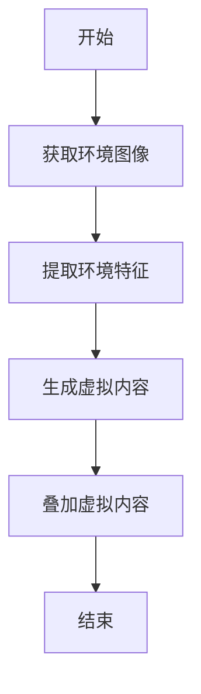
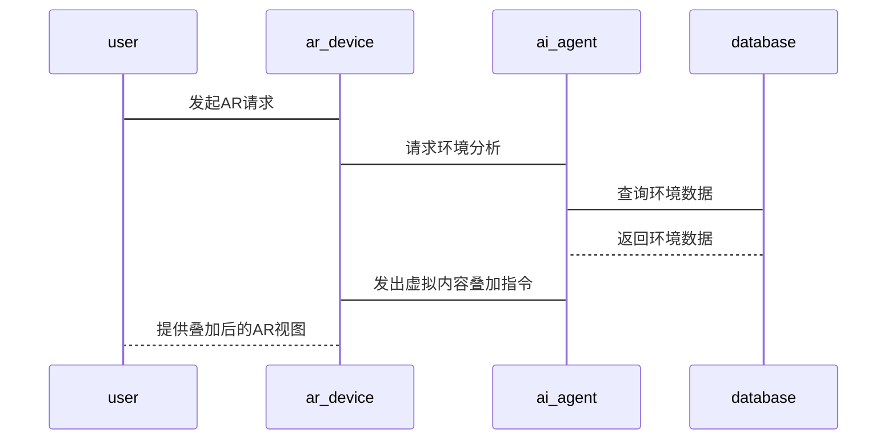

                 


# 企业AI Agent的增强现实(AR)技术集成

---

## 关键词：企业AI Agent, 增强现实(AR), 技术集成, 系统架构, 实际应用, 数学模型

---

## 摘要

本文详细探讨了企业AI Agent与增强现实(AR)技术的集成，分析了AR技术在企业中的应用背景、核心原理以及与AI Agent的结合方式。通过案例分析和系统架构设计，展示了如何将AR技术与AI Agent相结合，提升企业的智能化水平。文章还详细讲解了相关的算法原理、系统设计和项目实战，为读者提供了全面的技术指导。

---

# 第一部分: 企业AI Agent与增强现实(AR)技术概述

## 第1章: 企业AI Agent与增强现实(AR)技术概述

### 1.1 增强现实(AR)技术的基本概念

#### 1.1.1 AR技术的定义与特点

增强现实（Augmented Reality, AR）是一种将数字信息叠加在物理世界中的技术，通过计算机视觉、图形学和用户交互等技术，实现虚拟内容与真实环境的实时融合。AR的核心特点包括实时性、交互性和沉浸性。

#### 1.1.2 AR技术的核心组成要素

1. **传感器**：用于捕捉真实环境的数据，如摄像头、深度传感器等。
2. **渲染引擎**：用于生成和渲染虚拟内容，如OpenGL、WebGL等。
3. **定位与跟踪**：用于确定虚拟内容在真实环境中的位置，如SLAM（同步定位与地图构建）。
4. **用户交互**：支持用户与虚拟内容的交互，如手势识别、语音识别等。

#### 1.1.3 AR技术的发展历程

AR技术起源于20世纪60年代的计算机图形学研究，经历了从学术研究到商业应用的演变。近年来，随着智能手机和计算机视觉技术的普及，AR技术得到了快速发展，广泛应用于游戏、教育、医疗等领域。

### 1.2 AI Agent的基本概念与功能

#### 1.2.1 AI Agent的定义

AI Agent（人工智能代理）是指能够感知环境、自主决策并执行任务的智能实体。AI Agent可以是软件程序，也可以是物理设备，其核心目标是通过智能算法优化任务执行效率。

#### 1.2.2 AI Agent的核心功能

1. **感知**：通过传感器或数据接口获取环境信息。
2. **决策**：基于感知信息，利用算法进行判断和选择。
3. **执行**：通过执行机构或接口完成任务。

#### 1.2.3 AI Agent与传统软件的区别

AI Agent的核心区别在于其自主性和智能性。传统软件依赖于明确的程序逻辑，而AI Agent能够通过学习和适应优化自身行为。

### 1.3 企业AI Agent与AR技术的结合

#### 1.3.1 企业AI Agent的应用场景

1. **企业培训**：通过AR技术提供虚拟培训场景，提升员工技能。
2. **企业营销**：利用AR技术创建虚拟产品展示，增强客户体验。
3. **企业协作**：通过AR技术实现远程团队协作，提升工作效率。

#### 1.3.2 AR技术在企业中的应用

1. **销售展示**：通过AR技术展示产品三维模型，增强客户理解。
2. **培训模拟**：创建虚拟培训场景，降低培训成本。
3. **远程协作**：支持远程团队通过AR技术进行实时协作。

#### 1.3.3 企业AI Agent与AR技术的融合

1. **智能导航**：AI Agent通过AR技术为用户提供实时导航服务。
2. **智能交互**：AI Agent通过AR技术实现与用户的自然交互。
3. **智能决策**：AI Agent通过AR技术优化企业运营决策。

## 1.4 本章小结

本章介绍了AR技术和AI Agent的基本概念，分析了它们在企业中的应用，并探讨了两者结合的可能性和优势。通过结合AR技术和AI Agent，企业能够实现更高效的智能化应用。

---

## 第2章: 企业AI Agent的增强现实集成背景与问题分析

### 2.1 企业数字化转型的背景

#### 2.1.1 数字化转型的定义

数字化转型是指企业通过技术手段优化业务流程、提升效率和竞争力的过程。

#### 2.1.2 数字化转型对企业的影响

1. **提升效率**：通过自动化技术优化业务流程。
2. **降低成本**：通过数据分析减少资源浪费。
3. **增强竞争力**：通过技术创新提升企业市场地位。

#### 2.1.3 数字化转型中的技术挑战

1. **技术复杂性**：需要整合多种先进技术。
2. **数据安全**：需要保护企业数据的安全性。
3. **用户接受度**：需要克服用户对新技术的抵触心理。

### 2.2 增强现实技术在企业中的应用现状

#### 2.2.1 AR技术在企业培训中的应用

1. **虚拟培训场景**：通过AR技术创建逼真的培训环境。
2. **实时反馈**：通过AR技术提供即时反馈，提升培训效果。

#### 2.2.2 AR技术在企业营销中的应用

1. **虚拟产品展示**：通过AR技术展示产品三维模型。
2. **增强客户体验**：通过AR技术提供互动式营销体验。

#### 2.2.3 AR技术在企业协作中的应用

1. **远程协作**：通过AR技术实现远程团队协作。
2. **实时共享**：通过AR技术实现信息实时共享。

### 2.3 企业AI Agent与AR技术结合的必要性

#### 2.3.1 提高企业效率的需求

1. **自动化决策**：通过AI Agent实现自动化决策，提升效率。
2. **智能调度**：通过AI Agent实现资源的智能调度。

#### 2.3.2 提升用户体验的需求

1. **个性化服务**：通过AI Agent提供个性化服务，提升用户体验。
2. **智能交互**：通过AR技术实现自然交互，提升用户体验。

#### 2.3.3 企业智能化发展的趋势

1. **智能化转型**：企业通过智能化转型提升竞争力。
2. **技术融合**：通过技术融合实现更高效的智能化应用。

## 2.4 本章小结

本章分析了企业数字化转型的背景，探讨了AR技术在企业中的应用现状，并强调了企业AI Agent与AR技术结合的必要性。通过结合两者，企业能够实现更高效的智能化应用，提升竞争力。

---

## 第3章: 企业AI Agent的增强现实集成核心概念与联系

### 3.1 增强现实技术的核心原理

#### 3.1.1 AR技术的光学原理

AR技术通过将虚拟内容叠加在真实环境中，利用光学原理实现虚实融合。常用的光学原理包括光线追踪和光栅投影。

#### 3.1.2 AR技术的图像处理原理

AR技术通过图像处理技术实现虚拟内容与真实环境的融合。常用的图像处理技术包括图像分割、特征检测和图像匹配。

#### 3.1.3 AR技术的用户交互原理

AR技术通过用户交互技术实现与用户的互动。常用的交互技术包括手势识别、语音识别和触觉反馈。

### 3.2 AI Agent的核心原理

#### 3.2.1 AI Agent的感知原理

AI Agent通过感知环境信息，利用传感器获取数据，如摄像头、麦克风等。

#### 3.2.2 AI Agent的决策原理

AI Agent通过决策算法，如机器学习和规则引擎，进行判断和选择。

#### 3.2.3 AI Agent的执行原理

AI Agent通过执行机构或接口完成任务，如发送指令、触发动作等。

### 3.3 企业AI Agent与AR技术的集成原理

#### 3.3.1 AR技术为AI Agent提供视觉输入

AR技术通过摄像头等传感器获取环境信息，为AI Agent提供视觉输入。

#### 3.3.2 AI Agent为AR提供智能决策

AI Agent通过分析环境信息，提供智能决策，优化AR技术的应用效果。

#### 3.3.3 两者的结合实现智能化应用

通过结合AR技术和AI Agent，企业能够实现智能化应用，如智能导航、智能交互等。

### 3.4 核心概念属性特征对比表格

| **属性**       | **AR技术**                | **AI Agent**             |
|-----------------|--------------------------|--------------------------|
| 核心功能         | 显示虚拟内容             | 自主决策与执行           |
| 输入方式         | 视觉输入为主              | 多种传感器输入           |
| 输出形式         | 虚拟内容叠加             | 行动指令或反馈           |
| 应用场景         | 增强现实应用             | 企业智能化应用           |

### 3.5 ER实体关系图架构（Mermaid）

```mermaid
erDiagram
    user {
        id
        name
    }
    agent {
        id
        name
    }
    ar_session {
        id
        time
    }
    user --> ar_session : 参与
    agent --> ar_session : 控制
    ar_session --> user : 提供反馈
```

## 3.6 本章小结

本章详细讲解了AR技术和AI Agent的核心原理，并通过对比表格和实体关系图展示了两者的关系。通过结合AR技术和AI Agent，企业能够实现更高效的智能化应用。

---

## 第4章: 企业AI Agent增强现实集成的算法原理与数学模型

### 4.1 增强现实技术中的算法原理

#### 4.1.1 AR技术的图像处理算法

1. **图像分割**：通过图像分割技术，将真实环境与虚拟内容分开。
2. **特征检测**：通过特征检测技术，识别真实环境中的关键点。

#### 4.1.2 AR技术的定位与跟踪算法

1. **SLAM算法**：通过同步定位与地图构建技术，实现虚拟内容与真实环境的定位。
2. **特征匹配**：通过特征匹配技术，实现虚拟内容的精准定位。

### 4.2 AI Agent的算法原理

#### 4.2.1 AI Agent的感知算法

1. **传感器数据融合**：通过多传感器数据融合技术，提升感知精度。
2. **目标检测**：通过目标检测算法，识别环境中的关键目标。

#### 4.2.2 AI Agent的决策算法

1. **机器学习算法**：通过机器学习算法，训练AI Agent的决策模型。
2. **规则引擎**：通过规则引擎，实现基于规则的决策。

### 4.3 企业AI Agent与AR技术结合的算法实现

#### 4.3.1 AR技术为AI Agent提供视觉输入

1. **图像采集**：通过摄像头等传感器获取环境图像。
2. **图像处理**：通过图像处理算法，提取环境特征。

#### 4.3.2 AI Agent为AR提供智能决策

1. **环境分析**：通过AI Agent分析环境特征，生成决策指令。
2. **虚拟内容生成**：通过AR技术生成虚拟内容，并叠加在真实环境中。

### 4.4 算法实现的数学模型与公式

#### 4.4.1 AR技术中的图像处理模型

图像处理模型可以通过以下公式表示：

$$
I_{\text{processed}} = f(I_{\text{input}}, P)
$$

其中，$I_{\text{processed}}$ 是处理后的图像，$I_{\text{input}}$ 是输入图像，$P$ 是处理参数。

#### 4.4.2 AI Agent中的决策模型

决策模型可以通过以下公式表示：

$$
D = g(S, A)
$$

其中，$D$ 是决策结果，$S$ 是环境状态，$A$ 是可选动作。

### 4.5 算法实现的Mermaid流程图



### 4.6 本章小结

本章详细讲解了AR技术和AI Agent的算法原理，并通过数学模型和流程图展示了两者结合的实现过程。通过结合AR技术和AI Agent，企业能够实现更高效的智能化应用。

---

## 第5章: 企业AI Agent增强现实集成的系统架构与设计

### 5.1 系统架构设计

#### 5.1.1 系统组成

1. **AR设备**：如智能手机、AR眼镜等。
2. **AI Agent**：如智能助手、自动化系统等。
3. **企业后台**：如企业服务器、数据库等。

#### 5.1.2 系统功能设计

1. **环境感知**：通过AR设备感知环境信息。
2. **智能决策**：通过AI Agent进行环境分析和决策。
3. **虚拟内容生成**：通过AR技术生成虚拟内容，并叠加在真实环境中。

### 5.2 系统架构图（Mermaid）


### 5.3 系统接口设计

1. **AR设备接口**：如摄像头、麦克风等。
2. **AI Agent接口**：如决策接口、执行接口等。
3. **企业后台接口**：如数据接口、指令接口等。

### 5.4 系统交互设计（Mermaid序列图）



### 5.5 本章小结

本章详细讲解了企业AI Agent与AR技术集成的系统架构与设计，通过系统架构图和序列图展示了系统的组成与交互过程。通过合理的系统设计，企业能够实现高效的智能化应用。

---

## 第6章: 企业AI Agent增强现实集成的项目实战与案例分析

### 6.1 项目环境安装与配置

#### 6.1.1 开发环境

1. **操作系统**：如Windows、MacOS、Linux等。
2. **开发工具**：如Unity、Unreal Engine、Python等。
3. **AR框架**：如ARKit、ARCore、OpenCV等。

#### 6.1.2 依赖库安装

1. **Python库**：如numpy、opencv、scipy等。
2. **AR框架支持**：如安装ARKit或ARCore开发工具。

### 6.2 系统核心实现

#### 6.2.1 AR设备的环境感知实现

```python
import cv2

def capture_image():
    cap = cv2.VideoCapture(0)
    ret, frame = cap.read()
    cap.release()
    return frame
```

#### 6.2.2 AI Agent的智能决策实现

```python
import numpy as np

def ai_decision(features):
    model = load_model('ai_model.h5')
    prediction = model.predict(features)
    return prediction.argmax(axis=1)[0]
```

#### 6.2.3 虚拟内容的生成与叠加

```python
def overlay_virtual_content(real_image, virtual_content):
    overlay_image = cv2.addWeighted(real_image, 0.7, virtual_content, 0.3, 0)
    return overlay_image
```

### 6.3 项目实战案例分析

#### 6.3.1 智能导航系统

1. **应用场景**：为企业员工提供实时导航服务。
2. **实现步骤**：
   - 通过AR设备获取环境图像。
   - 通过AI Agent分析环境特征，生成导航路径。
   - 通过AR技术叠加导航路径在真实环境中。

#### 6.3.2 智能交互系统

1. **应用场景**：为企业客户提供智能化交互体验。
2. **实现步骤**：
   - 通过AR设备获取用户手势。
   - 通过AI Agent分析用户意图，生成交互指令。
   - 通过AR技术实现自然交互。

### 6.4 本章小结

本章通过项目实战和案例分析，展示了企业AI Agent与AR技术集成的具体实现过程。通过详细讲解环境安装、代码实现和案例分析，读者能够更好地理解和应用相关技术。

---

## 第7章: 企业AI Agent增强现实集成的最佳实践与总结

### 7.1 最佳实践

#### 7.1.1 技术选型

1. **AR框架选择**：根据企业需求选择合适的AR框架。
2. **AI Agent选择**：选择适合企业应用场景的AI Agent。

#### 7.1.2 系统优化

1. **性能优化**：通过算法优化和硬件升级提升系统性能。
2. **用户体验优化**：通过界面设计和交互优化提升用户体验。

#### 7.1.3 安全保障

1. **数据安全**：通过加密和访问控制保障数据安全。
2. **系统容错**：通过容错设计保障系统稳定性。

### 7.2 本章小结

本章总结了企业AI Agent与AR技术集成的最佳实践，为读者提供了实际应用中的注意事项和优化建议。通过合理的系统设计和最佳实践，企业能够更好地实现智能化应用。

---

## 作者信息

作者：AI天才研究院/AI Genius Institute & 禅与计算机程序设计艺术/Zen And The Art of Computer Programming

---

本文详细探讨了企业AI Agent与增强现实(AR)技术的集成，从理论到实践，为读者提供了全面的技术指导。通过系统的分析和实际案例的展示，帮助读者更好地理解和应用相关技术。

