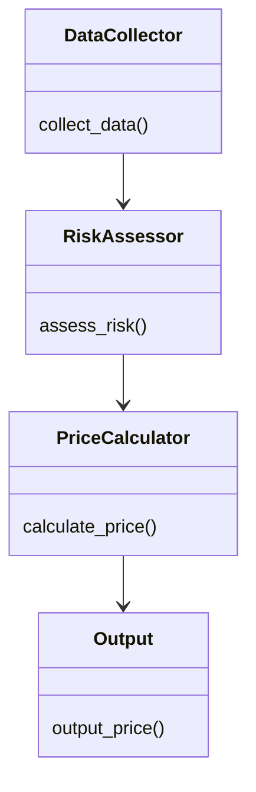
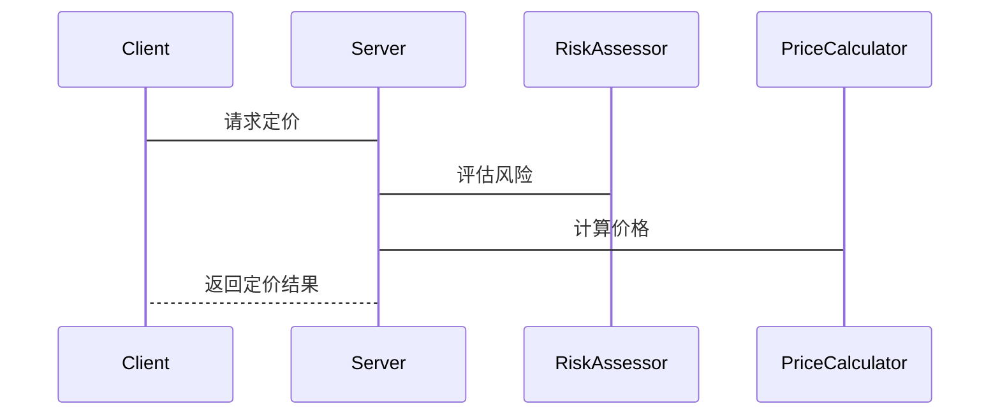

                 


# 如何将特价股票策略应用于数字资产流动性风险定价

> 关键词：特价股票策略, 数字资产, 流动性风险, 定价模型, 算法实现

> 摘要：本文探讨了如何将特价股票策略应用于数字资产流动性风险定价，分析了数字资产市场的特点，提出了基于特价股票策略的流动性风险定价模型，并通过算法实现和系统架构设计，展示了如何在实际中应用这些方法。

---

# 第1章: 特价股票策略的基本原理

## 1.1 特价股票策略的定义与特点

### 1.1.1 特价股票的定义
特价股票是指以低于市场公允价值买入的股票，通常在市场波动或特定事件中出现。这种策略的核心是利用价格波动，捕捉短期套利机会。

### 1.1.2 特价股票策略的核心要素
- **价格优势**：买入价格低于市场价。
- **短期持有**：通常持有时间较短，旨在快速获利。
- **市场时机**：依赖于对市场波动的准确判断。

### 1.1.3 特价股票策略的应用场景
- **市场下跌**：在市场整体下跌时，部分股票价格被低估。
- **突发事件**：公司公告、行业政策变化等导致股价短期波动。
- **市场流动性不足**：在市场流动性低时，可能出现价格错配。

## 1.2 数字资产与流动性风险的基本概念

### 1.2.1 数字资产的定义与特点
数字资产是指以数字形式存在的资产，主要包括比特币、以太坊等加密货币，以及各种代币。其特点包括去中心化、高波动性、交易透明等。

### 1.2.2 流动性风险的定义与分类
流动性风险是指资产在市场中迅速变现的能力下降，导致价格下跌的风险。数字资产的流动性风险主要表现在交易量低、市场深度不足、价格波动剧烈等方面。

### 1.2.3 数字资产流动性风险的特殊性
- **高波动性**：数字资产价格波动远高于传统资产。
- **市场深度不足**：部分数字资产交易量小，市场深度浅。
- **市场参与者行为**：投资者情绪波动大，可能导致流动性突然下降。

## 1.3 特价股票策略与数字资产的结合

### 1.3.1 特价股票策略在传统金融中的应用
- **事件驱动策略**：在公司并购、重组等事件中，利用股价波动获利。
- **市场时机选择**：在市场下跌时买入低估股票。

### 1.3.2 数字资产市场中的流动性风险挑战
- **市场波动性高**：数字资产价格易受市场情绪影响。
- **交易量不稳定性**：交易量可能在短时间内急剧下降。
- **市场深度不足**：部分数字资产市场参与者少，流动性差。

### 1.3.3 特价股票策略在数字资产中的潜在应用
- **价格套利**：在不同市场或平台间寻找价格差异，进行套利交易。
- **短期波动捕捉**：利用市场波动，快速买卖数字资产，获取收益。
- **风险管理**：通过监控市场流动性，及时调整持仓，避免流动性风险。

## 1.4 本章小结
本章介绍了特价股票策略的基本原理，分析了数字资产市场的特点及其流动性风险，并探讨了如何将特价股票策略应用于数字资产的流动性风险管理。通过结合数字资产市场的特殊性，提出了利用特价股票策略进行流动性风险定价的可能性。

---

# 第2章: 数字资产流动性风险定价的核心概念

## 2.1 流动性风险定价的原理

### 2.1.1 流动性风险的量化方法
流动性风险可以通过以下指标量化：
- **买卖价差**：买价与卖价之间的差额。
- **市场深度**：在特定价格水平上的订单量。
- **交易量**：一定时间内的交易总量。

### 2.1.2 流动性风险定价模型的构建
流动性风险定价模型通常包括以下几个步骤：
1. **数据收集**：收集数字资产的历史交易数据。
2. **计算流动性指标**：根据交易数据计算买卖价差、市场深度等指标。
3. **建立定价模型**：将流动性指标与资产价格进行回归分析，建立定价模型。
4. **验证与优化**：通过回测验证模型的有效性，并进行参数优化。

### 2.1.3 流动性风险定价的影响因素
- **市场深度**：市场深度越大，流动性风险越小。
- **交易量**：交易量越大，市场流动性越好。
- **市场参与者行为**：机构投资者的参与可以提高市场流动性。

### 2.1.4 流动性风险定价的数学模型
流动性风险定价模型可以表示为：
$$
P = \alpha \times D + \beta \times V + \gamma
$$
其中，\( P \) 是资产价格，\( D \) 是市场深度，\( V \) 是交易量，\(\alpha\)、\(\beta\) 是回归系数，\(\gamma\) 是截距项。

## 2.2 数字资产市场中的流动性风险特征

### 2.2.1 数字资产市场的波动性
数字资产市场的波动性远高于传统金融市场，主要原因是市场参与者情绪波动大，且市场容量小。

### 2.2.2 数字资产交易的深度与广度
- **交易深度**：在特定价格水平上的订单量。
- **交易广度**：一定价格范围内的订单总量。

### 2.2.3 数字资产市场的参与者行为分析
- **散户为主**：数字资产市场主要由散户参与，导致市场情绪波动大。
- **机构投资者**：部分机构投资者开始进入数字资产市场，提高市场深度和流动性。

## 2.3 特价股票策略与流动性风险定价的关联

### 2.3.1 特价股票策略在流动性风险管理中的作用
- **价格套利**：利用市场流动性不足时的价格差异，进行套利交易。
- **短期波动捕捉**：通过监控市场流动性变化，捕捉短期价格波动。

### 2.3.2 数字资产流动性风险定价的挑战
- **数据获取难度**：数字资产市场的数据分散，获取难度大。
- **市场深度不足**：部分数字资产市场深度不足，导致流动性风险定价困难。
- **市场参与者行为复杂**：投资者行为复杂，影响流动性风险定价模型的准确性。

### 2.3.3 特价股票策略的可扩展性与适应性
- **可扩展性**：特价股票策略可以应用于多种数字资产，具有较强的可扩展性。
- **适应性**：策略可以根据市场变化进行调整，具有较强的适应性。

## 2.4 本章小结
本章详细讲解了流动性风险定价的核心概念，分析了数字资产市场中的流动性风险特征，并探讨了特价股票策略在流动性风险管理中的应用。通过建立数学模型，提出了基于特价股票策略的流动性风险定价方法。

---

# 第3章: 数字资产流动性风险定价的数学模型与算法

## 3.1 流动性风险定价的数学模型

### 3.1.1 基于波动率的流动性风险定价模型
波动率是衡量市场流动性的重要指标之一，可以通过以下公式进行定价：
$$
P = \mu + \sigma \times Z
$$
其中，\( \mu \) 是均值，\( \sigma \) 是波动率，\( Z \) 是标准正态分布随机变量。

### 3.1.2 基于交易量的流动性风险定价模型
交易量是衡量市场流动性的重要指标，可以通过以下公式进行定价：
$$
P = \alpha \times Q + \beta
$$
其中，\( Q \) 是交易量，\( \alpha \) 是回归系数，\( \beta \) 是截距项。

### 3.1.3 综合波动率与交易量的定价模型
综合波动率和交易量的定价模型可以表示为：
$$
P = \alpha \times Q + \beta \times \sigma + \gamma
$$
其中，\( Q \) 是交易量，\( \sigma \) 是波动率，\( \alpha \)、\( \beta \) 是回归系数，\( \gamma \) 是截距项。

## 3.2 特价股票策略的算法实现

### 3.2.1 特价股票策略的数学表达
特价股票策略的数学表达可以表示为：
$$
P_{\text{buy}} < P_{\text{current}} < P_{\text{sell}}
$$
其中，\( P_{\text{buy}} \) 是买入价格，\( P_{\text{current}} \) 是当前价格，\( P_{\text{sell}} \) 是卖出价格。

### 3.2.2 基于机器学习的流动性风险预测算法
使用机器学习模型（如随机森林、神经网络）预测流动性风险，具体步骤如下：
1. **数据预处理**：清洗数据，提取特征。
2. **模型训练**：使用历史数据训练模型。
3. **风险预测**：输入当前数据，预测流动性风险。

### 3.2.3 基于统计学的流动性风险定价算法
统计学方法通常使用回归分析进行定价，具体步骤如下：
1. **数据收集**：收集历史交易数据。
2. **计算指标**：计算买卖价差、市场深度等指标。
3. **建立模型**：建立回归模型，预测资产价格。

## 3.3 算法的优化与改进

### 3.3.1 算法的可解释性优化
通过简化模型或使用可解释性更强的算法（如线性回归），提高算法的可解释性。

### 3.3.2 算法的计算效率提升
优化算法的计算流程，减少计算时间，提高效率。

### 3.3.3 算法的鲁棒性增强
通过引入鲁棒回归或异常值处理方法，增强算法的鲁棒性。

## 3.4 本章小结
本章详细探讨了数字资产流动性风险定价的数学模型，并介绍了特价股票策略的算法实现。通过优化算法，提高了模型的准确性和计算效率。

---

# 第4章: 系统架构设计

## 4.1 问题场景介绍
数字资产市场中的流动性风险定价需要一个高效、稳定的系统架构，能够实时处理大量数据，并快速生成定价结果。

## 4.2 系统功能设计
系统功能模块包括：
1. **数据采集**：实时采集数字资产的交易数据。
2. **风险评估**：计算市场深度、买卖价差等指标，评估流动性风险。
3. **定价计算**：根据风险评估结果，生成资产定价。
4. **结果输出**：输出定价结果，供用户参考。

### 4.2.1 领域模型（mermaid 类图）


### 4.2.2 系统架构设计（mermaid 架构图）


### 4.2.3 系统接口设计
系统接口包括：
1. **数据接口**：与数据源对接，获取实时数据。
2. **用户接口**：提供给用户查询和查看定价结果。
3. **计算接口**：与定价模型对接，进行风险评估和价格计算。

### 4.2.4 系统交互流程（mermaid 序列图）


## 4.3 本章小结
本章设计了数字资产流动性风险定价系统的架构，包括功能模块、系统交互流程等，为系统的实现提供了理论基础。

---

# 第5章: 项目实战

## 5.1 项目背景与目标
项目旨在利用特价股票策略，开发一个数字资产流动性风险定价系统，帮助投资者进行风险管理。

## 5.2 核心功能实现

### 5.2.1 环境搭建
- **编程语言**：Python
- **框架**：Flask 或 Django
- **数据源**：交易所API（如CoinMarketCap、CoinGecko）

### 5.2.2 核心功能实现（Python 代码）
```python
import requests
import pandas as pd
from sklearn.linear_model import LinearRegression

def collect_data(api_key):
    response = requests.get(f"https://api.coingecko.com/coins/markets?vs_currency=usd&order=market_cap_desc", headers={'accept': 'application/json', 'Authorization': f'Bearer {api_key}'})
    data = response.json()
    df = pd.DataFrame(data)
    return df

def calculate_market_depth(df):
    # 计算市场深度
    market_depth = df['volume'].sum() / df['volume'].count()
    return market_depth

def calculate_fluctuation(df):
    # 计算波动率
    df['price_diff'] = df['current_price'].diff()
    fluctuation = df['price_diff'].std()
    return fluctuation

def main():
    api_key = "your_api_key"
    df = collect_data(api_key)
    market_depth = calculate_market_depth(df)
    fluctuation = calculate_fluctuation(df)
    model = LinearRegression()
    model.fit(df[['market_depth', 'fluctuation']], df['price'])
    print(f"定价结果：{model.predict([[market_depth, fluctuation]])}")

if __name__ == "__main__":
    main()
```

## 5.3 项目小结
本章通过实际案例展示了如何将特价股票策略应用于数字资产流动性风险定价，详细介绍了项目环境搭建、核心功能实现以及代码解读，为读者提供了实践指导。

---

# 第6章: 总结与展望

## 6.1 总结
本文探讨了如何将特价股票策略应用于数字资产流动性风险定价，提出了基于数学模型的定价方法，并通过系统架构设计和项目实战展示了其可行性。

## 6.2 展望
未来的研究方向包括：
1. **算法优化**：进一步优化定价模型，提高准确性和效率。
2. **市场扩展**：将策略应用于更多数字资产市场。
3. **风险管理**：结合其他风险管理策略，构建更全面的风险管理系统。

---

# 第7章: 最佳实践与注意事项

## 7.1 最佳实践
- **数据质量**：确保数据来源可靠，数据清洗充分。
- **模型可解释性**：选择可解释性更强的模型，便于调整和优化。
- **系统鲁棒性**：设计鲁棒的系统架构，避免因市场波动导致系统崩溃。

## 7.2 注意事项
- **市场风险**：数字资产市场波动大，需谨慎操作。
- **合规性**：遵守相关法律法规，确保交易合法。
- **数据隐私**：保护用户数据隐私，防止数据泄露。

---

# 附录: 术语表与参考文献

## 附录A: 术语表
- **流动性风险**：资产在市场中迅速变现的能力下降，导致价格下跌的风险。
- **数字资产**：以数字形式存在的资产，主要包括加密货币和代币。
- **特价股票策略**：以低于市场价买入股票的策略，通常用于捕捉短期套利机会。

## 附录B: 参考文献
1. John C. Hull, "风险管理与金融机构"，机械工业出版社，2014年。
2. 张维, "数字资产与区块链技术"，人民邮电出版社，2019年。
3. 李明, "机器学习在金融中的应用"，电子工业出版社，2021年。

---

# 作者信息

作者：AI天才研究院/AI Genius Institute & 禅与计算机程序设计艺术 /Zen And The Art of Computer Programming  
联系方式：[联系作者](#)  
社交媒体：[Twitter](#) | [GitHub](#) | [LinkedIn](#)

---

通过以上章节的详细分析和内容展开，希望本文能够为读者提供关于如何将特价股票策略应用于数字资产流动性风险定价的全面指导，帮助读者理解相关概念、掌握算法实现，并能够在实际中应用这些方法。

