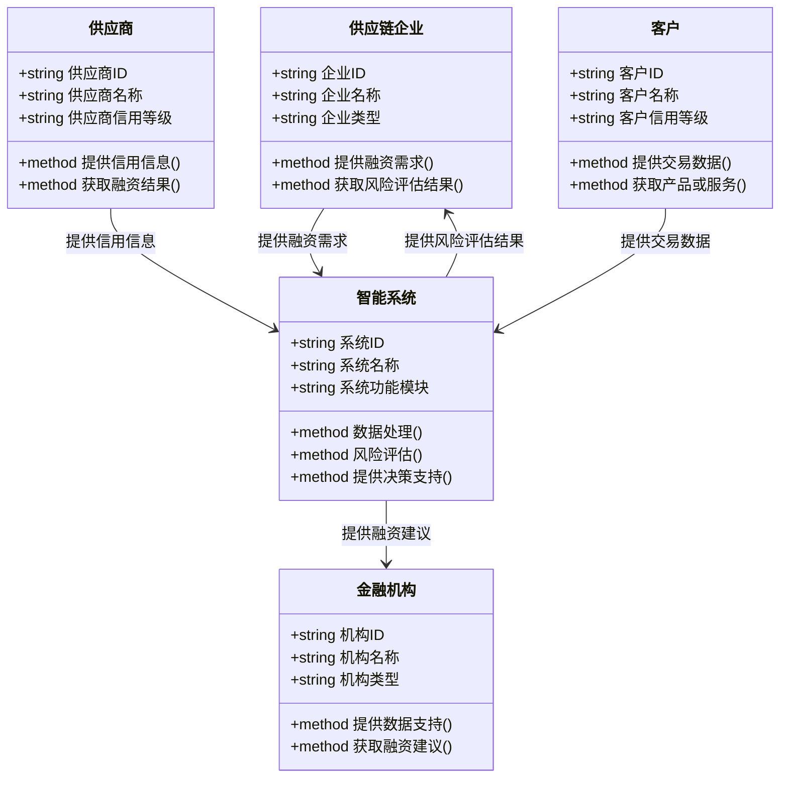

                 


# 《智能供应链金融风险评估》

---

## 关键词：
智能供应链、供应链金融、风险评估、人工智能、机器学习、区块链、系统架构

---

## 摘要：
智能供应链金融风险评估是通过人工智能和大数据技术对供应链金融中的风险进行智能化评估和管理。本文系统地介绍了智能供应链金融的基本概念、核心算法原理、系统架构设计以及实际应用场景，深入分析了如何利用机器学习模型和区块链技术提升风险评估的准确性和效率。文章通过详细的技术实现和案例分析，为读者提供了从理论到实践的全面指导。

---

## 第一部分: 智能供应链金融风险评估概述

### 第1章: 智能供应链金融风险评估的背景与意义

#### 1.1 供应链金融的基本概念
##### 1.1.1 供应链金融的定义
供应链金融是指通过整合供应链上下游资源，为企业提供融资服务的一种金融模式。其核心在于通过分析企业的供应链数据，评估其信用风险，从而提供相应的融资支持。

##### 1.1.2 供应链金融的核心要素
- **供应链结构**：包括供应商、制造商、分销商和客户等。
- **资金流**：资金在供应链中的流动和分配。
- **信用风险**：企业之间的信用风险是供应链金融的核心关注点。

##### 1.1.3 供应链金融的参与者与流程
- **参与者**：包括银行、供应链企业、供应商、客户等。
- **流程**：需求分析、风险评估、融资决策、资金分配等。

#### 1.2 供应链金融风险评估的重要性
##### 1.2.1 供应链金融中的主要风险类型
- **信用风险**：企业违约的可能性。
- **操作风险**：供应链操作中的不确定性。
- **市场风险**：市场波动对供应链的影响。

##### 1.2.2 风险评估在供应链金融中的作用
- **降低融资成本**：通过准确评估风险，优化融资决策。
- **提高供应链效率**：通过风险控制，优化供应链运营。
- **增强企业信用**：帮助上下游企业建立良好的信用记录。

#### 1.3 智能供应链金融的发展趋势
##### 1.3.1 数字化与智能化的融合
- 数据驱动的决策正在改变传统的供应链金融模式。
- AI和大数据技术的应用使得风险评估更加精准。

##### 1.3.2 人工智能在供应链金融中的应用
- **机器学习模型**：用于预测和评估信用风险。
- **自然语言处理**：用于分析非结构化数据，如合同和报告。

##### 1.3.3 未来供应链金融的发展方向
- **区块链技术**：提升数据透明度和信任度。
- **物联网技术**：实时监控供应链数据，提高风险预测能力。

---

## 第2章: 智能供应链金融的核心概念与联系

### 2.1 核心概念解析
#### 2.1.1 供应链的结构与功能
- **结构**：供应商、制造商、分销商、客户构成的网络。
- **功能**：确保产品从生产到交付的高效流动。

#### 2.1.2 金融在供应链中的作用
- **融资支持**：帮助企业在供应链中获得所需资金。
- **风险管理**：通过金融工具降低供应链中的各种风险。

#### 2.1.3 风险评估的定义与方法
- **定义**：评估供应链中可能存在的风险，并制定应对策略。
- **方法**：基于数据的定量分析和专家判断的定性分析。

### 2.2 智能供应链金融的系统架构
#### 2.2.1 数据流与信息流的整合
- **数据来源**：包括供应链中的交易数据、市场数据等。
- **信息处理**：通过数据挖掘和机器学习进行分析。

#### 2.2.2 人工智能技术的应用
- **算法选择**：如随机森林、支持向量机等。
- **模型训练**：利用历史数据训练模型，预测风险。

#### 2.2.3 系统各模块的交互关系
- **数据采集模块**：收集供应链中的实时数据。
- **风险评估模块**：应用机器学习模型进行风险预测。
- **决策支持模块**：提供融资建议和风险控制策略。

### 2.3 核心概念的ER实体关系图
```mermaid
erDiagram
    actor 供应链企业 {
        string 企业ID
        string 企业名称
        string 企业类型
    }
    actor 金融机构 {
        string 机构ID
        string 机构名称
        string 机构类型
    }
    actor 供应商 {
        string 供应商ID
        string 供应商名称
        string 供应商信用等级
    }
    actor 客户 {
        string 客户ID
        string 客户名称
        string 客户信用等级
    }
    actor 智能系统 {
        string 系统ID
        string 系统名称
        string 系统功能模块
    }
    供应链企业 --> 金融机构: 提供融资需求
    供应链企业 --> 供应商: 采购订单
    供应链企业 --> 客户: 提供产品或服务
    金融机构 --> 智能系统: 提供数据支持
    供应商 --> 智能系统: 提供信用信息
    客户 --> 智能系统: 提供交易数据
    智能系统 --> 供应链企业: 提供风险评估结果
    智能系统 --> 金融机构: 提供融资建议
```

---

## 第3章: 智能供应链金融风险评估的算法原理

### 3.1 算法选择与原理
#### 3.1.1 机器学习模型
- **随机森林**：用于分类和回归分析。
- **支持向量机**：用于高维数据的分类。

#### 3.1.2 算法流程
1. **数据预处理**：清洗数据，处理缺失值。
2. **特征提取**：提取关键特征，如信用评分、交易历史等。
3. **模型训练**：使用训练数据训练模型。
4. **风险预测**：对新数据进行风险评估。

### 3.2 算法实现
#### 3.2.1 使用Python实现随机森林模型
```python
from sklearn.ensemble import RandomForestClassifier
from sklearn.model_selection import train_test_split
from sklearn.metrics import accuracy_score

# 数据预处理
data = [...]  # 包含特征和标签的数据集
X = data.drop('risk', axis=1)
y = data['risk']

# 划分训练集和测试集
X_train, X_test, y_train, y_test = train_test_split(X, y, test_size=0.2)

# 初始化模型
model = RandomForestClassifier(n_estimators=100)

# 训练模型
model.fit(X_train, y_train)

# 预测
y_pred = model.predict(X_test)

# 评估准确率
print("准确率:", accuracy_score(y_test, y_pred))
```

#### 3.2.2 算法原理的数学模型
- **随机森林**：基于决策树的集成学习方法。
  $$ \text{随机森林} = \{ \text{决策树}_1, \text{决策树}_2, ..., \text{决策树}_n \} $$
- **投票机制**：通过投票确定最终预测结果。

### 3.3 算法优化与调优
- **超参数调整**：如n_estimators、max_depth等。
- **特征重要性分析**：通过特征重要性评分，优化模型性能。

---

## 第4章: 智能供应链金融风险评估的系统分析与架构设计

### 4.1 系统应用场景
- **企业融资**：帮助企业在供应链中获得融资支持。
- **风险控制**：降低供应链中的信用风险和操作风险。

### 4.2 系统功能设计
#### 4.2.1 领域模型设计


### 4.3 系统架构设计
#### 4.3.1 分层架构设计
- **数据层**：存储供应链数据，如数据库和数据仓库。
- **业务逻辑层**：处理业务逻辑，如风险评估和融资决策。
- **表现层**：用户界面，展示结果和操作界面。

#### 4.3.2 系统交互流程
```mermaid
sequenceDiagram
    actor 供应链企业 -> 智能系统: 提供融资需求
    智能系统 -> 数据库: 查询历史数据
    数据库 --> 智能系统: 返回历史数据
    智能系统 -> 金融机构: 获取信用评分
    金融机构 --> 智能系统: 返回信用评分
    智能系统 -> 供应商: 获取信用信息
    供应商 --> 智能系统: 返回信用信息
    智能系统 -> 客户: 获取交易数据
    客户 --> 智能系统: 返回交易数据
    智能系统 -> 分析模块: 进行风险评估
    分析模块 --> 智能系统: 返回风险评估结果
    智能系统 -> 金融机构: 提供融资建议
    金融机构 --> 智能系统: 返回融资决策
    智能系统 -> 供应链企业: 提供结果反馈
```

---

## 第5章: 智能供应链金融风险评估的项目实战

### 5.1 环境安装与配置
- **安装Python**：确保安装了Python 3.x及以上版本。
- **安装依赖库**：如scikit-learn、pandas、numpy等。

### 5.2 核心代码实现
#### 5.2.1 数据预处理代码
```python
import pandas as pd
from sklearn.impute import SimpleImputer

# 加载数据
data = pd.read_csv('supply_chain_data.csv')

# 处理缺失值
imputer = SimpleImputer(strategy='mean')
data_imputed = imputer.fit_transform(data)
```

#### 5.2.2 模型训练代码
```python
from sklearn.ensemble import RandomForestClassifier
from sklearn.model_selection import train_test_split
from sklearn.metrics import accuracy_score

# 划分训练集和测试集
X_train, X_test, y_train, y_test = train_test_split(data_imputed, target, test_size=0.2)

# 初始化模型
model = RandomForestClassifier(n_estimators=100)

# 训练模型
model.fit(X_train, y_train)

# 预测
y_pred = model.predict(X_test)

# 评估准确率
print("准确率:", accuracy_score(y_test, y_pred))
```

### 5.3 代码解读与分析
- **数据预处理**：使用SimpleImputer处理缺失值，确保数据完整性。
- **模型训练**：随机森林模型通过训练数据学习风险评估规则。
- **结果分析**：准确率反映了模型的预测能力，越高越好。

### 5.4 实际案例分析
- **案例背景**：某制造企业供应链中的风险评估。
- **数据输入**：包括供应商信用评分、订单历史、市场波动等。
- **模型预测**：预测供应链中的潜在风险，并提出应对策略。

### 5.5 项目总结
- **项目目标**：通过智能系统提升供应链金融中的风险评估效率和准确性。
- **实现价值**：降低融资成本，优化供应链管理，增强企业信用。

---

## 第6章: 最佳实践与注意事项

### 6.1 最佳实践 tips
- **数据质量**：确保数据的准确性和完整性，避免偏差。
- **模型选择**：根据具体场景选择合适的算法，避免过度拟合。
- **系统维护**：定期更新模型，适应市场变化。

### 6.2 小结
智能供应链金融风险评估通过整合人工智能和大数据技术，显著提升了供应链金融的效率和准确性。企业可以通过智能化手段优化融资决策，降低风险，提升整体供应链竞争力。

### 6.3 注意事项
- **数据隐私**：确保数据的安全性和隐私性，遵守相关法律法规。
- **模型解释性**：选择具有高解释性的模型，便于业务人员理解和应用。
- **持续优化**：根据实际效果不断优化模型和系统，提升性能。

### 6.4 拓展阅读
- **书籍推荐**：《供应链金融：理论与实践》、《机器学习实战》。
- **技术博客**：推荐关注人工智能和供应链管理领域的技术博客，获取最新动态。

---

## 作者：
AI天才研究院/AI Genius Institute  
禅与计算机程序设计艺术/Zen And The Art of Computer Programming

