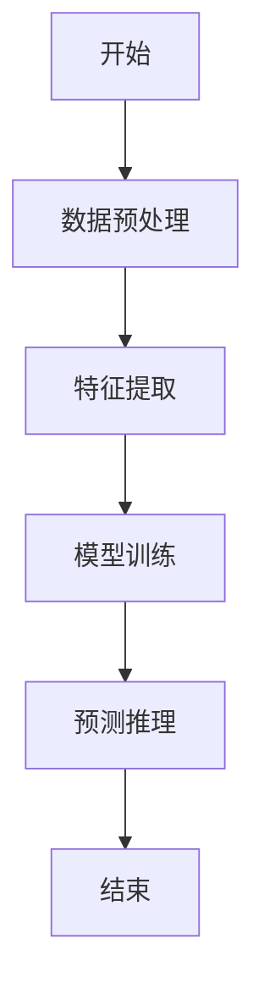
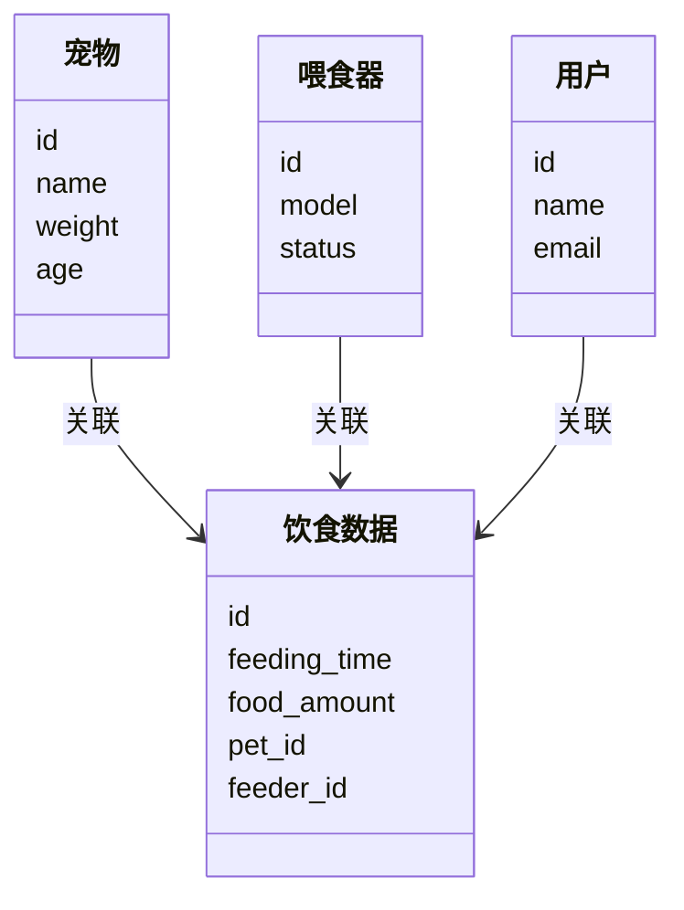
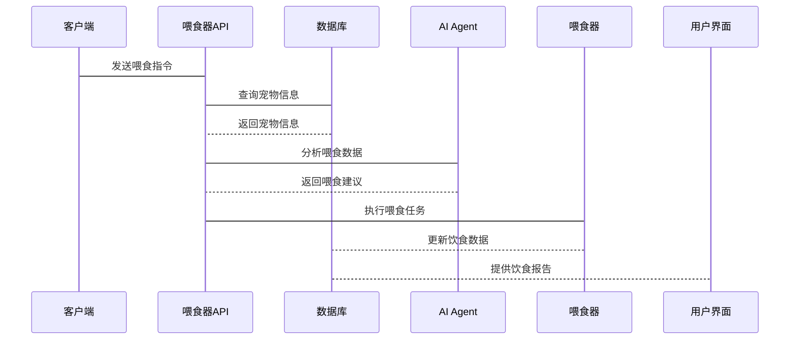

                 


# 智能宠物喂食器：AI Agent的宠物饮食管理系统

> 关键词：智能宠物喂食器, AI Agent, 物联网, 人工智能, 算法原理, 系统架构, 项目实战

> 摘要：本文详细介绍了智能宠物喂食器的设计与实现，结合AI Agent和物联网技术，探讨了宠物饮食管理系统的背景、核心概念、算法原理、系统架构、项目实战以及最佳实践。通过理论与实践相结合，为读者提供全面的技术指导。

---

# 第1章: 背景介绍

## 1.1 智能宠物喂食器的背景

### 1.1.1 宠物喂食管理的现状与痛点
随着宠物数量的增加，宠物主人的时间和精力有限，传统的手动喂食管理方式逐渐显现出诸多痛点。例如，忘记喂食、喂食时间不规律、喂食量不科学等问题，导致宠物健康问题频发。这些问题亟需一种智能化的解决方案。

### 1.1.2 智能化喂食管理的需求
智能化喂食管理的需求主要体现在以下几个方面：
1. **自动化喂食**：通过定时任务和远程控制实现自动喂食。
2. **智能监控**：实时监控宠物的饮食情况，记录宠物的饮食数据。
3. **健康建议**：基于宠物的饮食数据，提供个性化的健康建议。
4. **远程管理**：通过手机APP实现远程控制和管理。

### 1.1.3 AI Agent在宠物喂食管理中的作用
AI Agent（人工智能代理）能够通过学习和分析宠物的饮食数据，提供智能化的决策支持。例如，AI Agent可以根据宠物的体重、活动量等信息，自动调整喂食量和喂食时间，确保宠物的健康。

## 1.2 问题背景与描述

### 1.2.1 宠物饮食管理的核心问题
宠物饮食管理的核心问题包括：
1. **喂食时间不规律**：宠物的饮食时间需要科学规划，才能保证其健康。
2. **喂食量不科学**：不同宠物有不同的饮食需求，需要根据宠物的体重、年龄等因素调整喂食量。
3. **缺乏实时监控**：主人无法实时了解宠物的饮食情况，难以及时发现和解决问题。

### 1.2.2 智能喂食器的功能需求
智能喂食器的功能需求包括：
1. **定时喂食**：支持用户设置定时喂食任务。
2. **远程控制**：通过手机APP实现远程喂食。
3. **饮食记录**：记录每次喂食的时间和喂食量，生成饮食报告。
4. **健康建议**：基于饮食数据，提供健康建议。

### 1.2.3 AI Agent在喂食管理中的应用边界
AI Agent的应用边界主要集中在数据采集、分析和决策支持方面。例如，AI Agent可以分析宠物的饮食数据，预测宠物的健康状况，但具体的喂食任务仍需由智能喂食器执行。

## 1.3 问题解决与核心目标

### 1.3.1 问题解决的思路
通过引入AI Agent和物联网技术，构建一个智能化的宠物饮食管理系统，实现宠物喂食的自动化、智能化和远程化。

### 1.3.2 智能宠物喂食器的核心目标
智能宠物喂食器的核心目标是：
1. 提供自动化喂食功能，确保宠物按时定量进食。
2. 实时监控宠物的饮食情况，记录饮食数据。
3. 提供个性化的健康建议，帮助宠物主人更好地管理宠物的饮食健康。

### 1.3.3 AI Agent的功能实现
AI Agent的功能实现包括：
1. 数据采集：采集宠物的饮食数据，如喂食时间、喂食量等。
2. 数据分析：分析宠物的饮食数据，预测宠物的健康状况。
3. 决策支持：基于分析结果，提供喂食建议和健康建议。

---

# 第2章: AI Agent与智能宠物喂食器的核心概念

## 2.1 AI Agent的定义与原理

### 2.1.1 AI Agent的基本定义
AI Agent是一种智能代理，能够通过感知环境、学习数据并做出决策，从而实现特定的目标。在智能宠物喂食器中，AI Agent主要用于分析宠物的饮食数据，提供智能化的喂食建议。

### 2.1.2 AI Agent的核心原理
AI Agent的核心原理包括：
1. **感知环境**：通过传感器或其他数据源获取宠物的饮食数据。
2. **学习与分析**：利用机器学习算法分析数据，识别宠物的饮食模式。
3. **决策与执行**：基于分析结果，做出喂食决策并执行相应的操作。

### 2.1.3 AI Agent与智能宠物喂食器的关系
AI Agent作为智能宠物喂食器的核心组件，负责分析宠物的饮食数据，并提供智能化的喂食建议。智能喂食器则负责执行喂食任务，确保宠物按时定量进食。

## 2.2 物联网设备与智能宠物喂食器

### 2.2.1 物联网设备的定义
物联网设备是指能够通过互联网与其他设备或系统进行连接和通信的设备。在智能宠物喂食器中，物联网设备主要用于数据的采集和传输。

### 2.2.2 物联网设备在宠物喂食器中的应用
物联网设备在智能宠物喂食器中的应用包括：
1. **数据采集**：通过传感器采集宠物的饮食数据，如喂食时间、喂食量等。
2. **数据传输**：将采集到的数据传输到云端或本地服务器，进行进一步的分析和处理。
3. **远程控制**：通过物联网设备实现远程喂食，如通过手机APP控制喂食器执行喂食任务。

### 2.2.3 物联网设备与AI Agent的协同工作
物联网设备与AI Agent协同工作，实现数据的采集、分析和决策。物联网设备负责采集数据，AI Agent负责分析数据并做出决策，智能喂食器则负责执行决策。

## 2.3 核心概念的对比分析

### 2.3.1 AI Agent与传统喂食器的对比
| 对比维度 | AI Agent喂食器 | 传统喂食器 |
|----------|----------------|-------------|
| 功能     | 自动化喂食、智能化管理 | 手动喂食 |
| 数据采集 | 支持传感器数据采集 | 不支持 |
| 决策能力 | 可以根据数据自动调整喂食策略 | 需要人工调整 |

### 2.3.2 物联网设备与AI Agent的功能对比
| 对比维度 | 物联网设备 | AI Agent |
|----------|------------|-----------|
| 主要功能 | 数据采集与传输 | 数据分析与决策 |
| 应用场景 | 数据采集、远程控制 | 数据分析、决策支持 |
| 依赖性   | 依赖网络通信 | 依赖数据分析算法 |

### 2.3.3 核心概念的属性特征对比表格
| 属性特征 | AI Agent | 物联网设备 |
|----------|-----------|-------------|
| 核心功能 | 数据分析与决策 | 数据采集与传输 |
| 技术基础 | 人工智能、机器学习 | 物联网技术 |
| 应用场景 | 智能化喂食管理 | 数据采集与远程控制 |

## 2.4 ER实体关系图架构

### 2.4.1 实体关系图的定义
实体关系图（Entity-Relationship Diagram）用于描述系统中各实体之间的关系。在智能宠物喂食器中，主要实体包括宠物、喂食器、饮食数据和用户。

### 2.4.2 实体关系图的构建
```mermaid
erDiagram
    class 宠物 {
        id
        name
        weight
        age
    }
    class 喂食器 {
        id
        model
        status
    }
    class 饮食数据 {
        id
        feeding_time
        food_amount
        pet_id
        feeder_id
    }
    class 用户 {
        id
        name
        email
    }
    宠物 --> 饮食数据 : 关联
    喂食器 --> 饮食数据 : 关联
    用户 --> 饮食数据 : 关联
```

### 2.4.3 实体关系图的分析与优化
通过实体关系图可以看出，宠物、喂食器和用户之间通过饮食数据建立关联。这种设计能够有效地管理宠物的饮食数据，支持智能化的喂食管理。

---

# 第3章: AI Agent的算法原理

## 3.1 算法原理概述

### 3.1.1 AI Agent的核心算法
AI Agent的核心算法包括数据预处理、特征提取、模型训练和预测推理四个阶段。

### 3.1.2 算法的数学模型与公式
AI Agent的算法基于机器学习，常用的算法包括线性回归、支持向量机（SVM）和随机森林等。以下是一个简单的线性回归模型：

$$ y = \beta_0 + \beta_1 x + \epsilon $$

其中，$y$ 是目标变量，$x$ 是自变量，$\beta_0$ 和 $\beta_1$ 是模型参数，$\epsilon$ 是误差项。

### 3.1.3 算法的实现步骤
1. **数据预处理**：对数据进行清洗和归一化处理。
2. **特征提取**：从原始数据中提取有用的特征，如喂食时间、喂食量等。
3. **模型训练**：使用训练数据训练模型，调整模型参数。
4. **预测推理**：使用训练好的模型对新数据进行预测，生成喂食建议。

## 3.2 算法的详细讲解

### 3.2.1 算法的输入与输出
- **输入**：宠物的饮食数据，包括喂食时间、喂食量、宠物的体重和活动量等。
- **输出**：智能化的喂食建议，如喂食时间调整、喂食量增减等。

### 3.2.2 算法的流程图


### 3.2.3 算法的实现代码
以下是一个简单的线性回归模型的Python实现代码：

```python
import numpy as np
from sklearn.linear_model import LinearRegression

# 数据预处理
X = np.array([[1], [2], [3], [4], [5]])
y = np.array([2, 3, 5, 6, 8])

# 模型训练
model = LinearRegression()
model.fit(X, y)

# 预测推理
new_X = np.array([[6]])
print(model.predict(new_X))  # 输出预测结果
```

## 3.3 算法的数学模型与公式

### 3.3.1 算法的数学模型
线性回归模型的数学模型可以表示为：

$$ y = \beta_0 + \beta_1 x + \epsilon $$

其中，$\beta_0$ 和 $\beta_1$ 是模型参数，$\epsilon$ 是误差项。

### 3.3.2 算法的数学公式
线性回归模型的参数可以通过最小二乘法求解：

$$ \hat{\beta} = (X^T X)^{-1} X^T y $$

其中，$X$ 是输入特征矩阵，$y$ 是目标变量向量。

### 3.3.3 算法的详细举例说明
以下是一个简单的线性回归模型的实例：

假设我们有以下数据：
- 喂食时间（分钟）：1, 2, 3, 4, 5
- 喂食量（克）：2, 3, 5, 6, 8

通过线性回归模型，我们可以预测当喂食时间为6分钟时的喂食量：

$$ y = 0.8x + 1.2 $$

因此，当喂食时间为6分钟时，预测的喂食量为：

$$ y = 0.8 \times 6 + 1.2 = 5.4 \text{克} $$

---

# 第4章: 系统分析与架构设计方案

## 4.1 问题场景介绍

### 4.1.1 系统目标
智能宠物喂食器的目标是实现宠物饮食的智能化管理，包括定时喂食、远程控制和健康建议。

### 4.1.2 项目介绍
本项目旨在开发一款基于AI Agent的智能宠物喂食器，通过物联网技术实现宠物饮食的智能化管理。

## 4.2 系统功能设计

### 4.2.1 领域模型Mermaid类图


### 4.2.2 功能模块
系统功能模块包括：
1. **数据采集**：通过传感器采集宠物的饮食数据。
2. **数据处理**：对采集到的数据进行预处理和分析。
3. **数据存储**：将处理后的数据存储在数据库中。
4. **用户界面**：提供友好的用户界面，供用户查看和管理宠物的饮食数据。

## 4.3 系统架构设计

### 4.3.1 系统架构Mermaid架构图


### 4.3.2 系统接口设计
系统接口设计包括：
1. **API接口**：用于客户端与喂食器之间的通信。
2. **数据库接口**：用于数据的存储和检索。
3. **AI Agent接口**：用于AI Agent与喂食器之间的通信。

## 4.4 系统交互Mermaid序列图



---

# 第5章: 项目实战

## 5.1 环境安装

### 5.1.1 开发环境
- **操作系统**：Windows/Mac/Linux
- **编程语言**：Python 3.6+
- **开发工具**：PyCharm/VS Code
- **依赖库**：numpy, pandas, scikit-learn, pymongo

### 5.1.2 服务环境
- **数据库**：MongoDB
- **云服务**：阿里云/AWS
- **AI框架**：TensorFlow/Scikit-learn

## 5.2 系统核心实现

### 5.2.1 饮食数据采集
```python
import pymongo

# 连接数据库
client = pymongo.MongoClient("mongodb://localhost:27017/")
db = client["pet_feeding"]
collection = db["feeding_data"]

# 插入数据
data = {
    "feeding_time": "2023-10-01 10:00:00",
    "food_amount": 50,
    "pet_id": "1",
    "feeder_id": "1"
}
collection.insert_one(data)
```

### 5.2.2 AI Agent实现
```python
from sklearn.linear_model import LinearRegression

# 数据预处理
X = np.array([[1], [2], [3], [4], [5]])
y = np.array([2, 3, 5, 6, 8])

# 模型训练
model = LinearRegression()
model.fit(X, y)

# 预测推理
new_X = np.array([[6]])
print(model.predict(new_X))  # 输出预测结果
```

## 5.3 代码应用解读与分析

### 5.3.1 饮食数据采集代码解读
上述代码展示了如何使用MongoDB数据库存储宠物的饮食数据，包括喂食时间、喂食量、宠物ID和喂食器ID。通过插入数据的操作，可以实现饮食数据的采集和存储。

### 5.3.2 AI Agent实现代码解读
上述代码展示了如何使用Scikit-learn库中的线性回归模型进行饮食数据的分析和预测。通过训练模型，可以实现喂食量的预测，为宠物主人提供智能化的喂食建议。

## 5.4 实际案例分析

### 5.4.1 案例背景
假设我们有以下数据：
- 喂食时间（分钟）：1, 2, 3, 4, 5
- 喂食量（克）：2, 3, 5, 6, 8

### 5.4.2 数据分析
通过线性回归模型，我们可以预测当喂食时间为6分钟时的喂食量：

$$ y = 0.8x + 1.2 $$

因此，当喂食时间为6分钟时，预测的喂食量为：

$$ y = 0.8 \times 6 + 1.2 = 5.4 \text{克} $$

### 5.4.3 算法实现
通过Python代码实现线性回归模型的训练和预测，可以为宠物主人提供智能化的喂食建议。

## 5.5 项目小结

### 5.5.1 项目总结
通过本项目的实践，我们实现了基于AI Agent的智能宠物喂食器，能够实现宠物饮食的智能化管理，包括定时喂食、远程控制和健康建议。

### 5.5.2 项目经验总结
在项目开发过程中，我们需要注意以下几点：
1. **数据质量**：数据的准确性和完整性直接影响模型的性能。
2. **算法选择**：选择合适的算法能够提高模型的预测精度。
3. **系统架构**：合理的系统架构能够提高系统的稳定性和可扩展性。

---

# 第6章: 最佳实践

## 6.1 最佳实践 tips

### 6.1.1 数据采集
- 数据采集是整个系统的核心，确保数据的准确性和完整性。
- 使用高精度的传感器，定期校准设备。

### 6.1.2 算法优化
- 根据具体需求选择合适的算法，如线性回归、支持向量机等。
- 定期更新模型，确保模型的预测精度。

### 6.1.3 系统维护
- 定期检查系统硬件和软件，确保系统的稳定运行。
- 提供用户友好的界面，方便用户管理和操作。

## 6.2 小结

### 6.2.1 章节回顾
本章总结了智能宠物喂食器项目的最佳实践，包括数据采集、算法优化和系统维护等方面。

### 6.2.2 经验分享
在实际应用中，我们需要注意数据的质量和系统的维护，确保系统的稳定性和可靠性。

## 6.3 注意事项

### 6.3.1 安全注意事项
- 确保系统的安全性，防止数据泄露和网络攻击。
- 定期更新系统软件，修复安全漏洞。

### 6.3.2 性能优化
- 优化算法的执行效率，减少系统的响应时间。
- 使用高效的数据库查询，提高数据处理速度。

## 6.4 拓展阅读

### 6.4.1 推荐书籍
1. 《机器学习实战》
2. 《深入浅出Python》
3. 《物联网开发指南》

### 6.4.2 推荐博客
1. [AI Agent的实现与应用](https://example.com)
2. [智能宠物喂食器的开发经验分享](https://example.com)

---

# 作者：AI天才研究院/AI Genius Institute & 禅与计算机程序设计艺术 /Zen And The Art of Computer Programming

