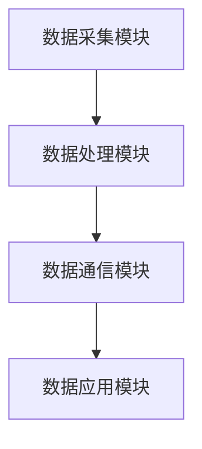
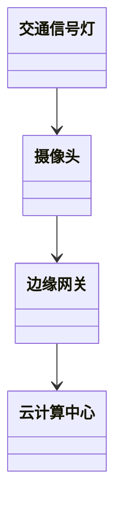
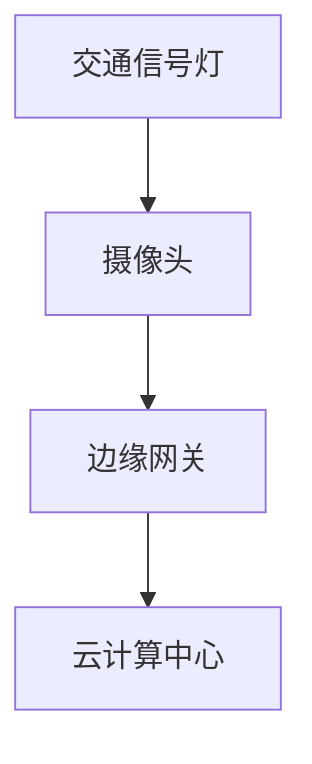
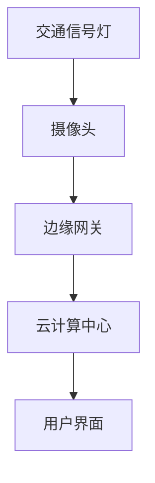

                 

# 边缘计算技术带来的新一轮IT革命与投资机会

---

## 关键词：
边缘计算, IT革命, 投资机会, 分布式计算, 工业互联网, 智慧城市

---

## 摘要：
边缘计算作为一种新兴的计算范式，正在全球范围内掀起新一轮的IT革命。本文将深入分析边缘计算的核心概念、技术原理、系统架构以及实际应用场景，并结合当前市场趋势，探讨边缘计算带来的投资机会。通过具体的技术分析和案例研究，本文旨在为读者提供一个全面而深入的视角，理解边缘计算如何改变我们的生活方式、商业模式以及技术生态系统。

---

# 第一部分：边缘计算技术的背景与核心概念

---

## 第1章：边缘计算技术的定义与背景

### 1.1 边缘计算的定义与特点

#### 1.1.1 边缘计算的定义
边缘计算是一种分布式计算范式，强调将计算能力从传统的中心化云数据中心向数据源（边缘）迁移。通过在靠近数据生成的位置进行数据处理，边缘计算能够显著降低延迟、带宽消耗和数据传输成本。

#### 1.1.2 边缘计算的核心特点
1. **低延迟**：边缘计算将数据处理能力部署在靠近数据源的位置，减少了数据传输的距离和时间，从而降低了延迟。
2. **高实时性**：边缘计算能够实现实时数据处理和决策，适用于需要快速响应的应用场景，如工业自动化、自动驾驶等。
3. **分布式架构**：边缘计算通过分布式部署，提高了系统的可靠性和容错能力，避免了单点故障的风险。
4. **隐私与安全**：边缘计算能够在数据不出边缘设备的情况下完成处理，保护数据隐私，减少数据在传输过程中被篡改或泄露的风险。

#### 1.1.3 边缘计算与云计算的区别与联系
- **区别**：
  - **数据处理位置**：云计算将数据传输到中心化的云数据中心进行处理，而边缘计算将数据处理能力部署在边缘设备。
  - **延迟**：云计算的延迟较高，边缘计算的延迟较低。
  - **带宽消耗**：云计算需要将大量数据传输到云端，边缘计算仅将必要的数据传输到云端，减少了带宽消耗。
- **联系**：
  - 边缘计算和云计算可以协同工作，形成混合计算架构。边缘设备负责实时数据处理，云计算负责全局数据分析和决策。

### 1.2 边缘计算技术的技术演进

#### 1.2.1 从中心化计算到边缘计算的演进
传统的计算模式是以中心化的云数据中心为核心，所有数据都需要传输到云端进行处理。随着物联网（IoT）设备的普及和实时性要求的提高，中心化计算模式的局限性逐渐显现，边缘计算应运而生。

#### 1.2.2 边缘计算的典型应用场景
1. **工业互联网**：工厂中的各种传感器和设备生成大量数据，边缘计算可以在本地进行实时数据分析和决策，实现智能化生产。
2. **智慧城市**：通过边缘计算，城市中的摄像头、交通灯等设备可以实时处理数据，优化交通流量和城市资源配置。
3. **智能家居**：边缘计算可以在家庭设备中本地处理数据，提供更加智能化的服务，如智能安防、能源管理等。

#### 1.2.3 边缘计算的商业价值与社会影响
- **商业价值**：
  - 降低运营成本：通过减少数据传输量和降低延迟，边缘计算可以降低企业的运营成本。
  - 提高效率：边缘计算能够实现实时数据分析和决策，提高企业运营效率。
  - 拓展市场：边缘计算的应用场景广泛，为企业开拓新的市场机会。
- **社会影响**：
  - 提高生活质量：边缘计算可以通过智能化设备提升人们的生活质量。
  - 促进可持续发展：边缘计算可以通过优化资源利用，减少能源浪费，促进可持续发展。

### 1.3 边缘计算的行业应用与投资机会

#### 1.3.1 工业互联网中的边缘计算
工业互联网是边缘计算的重要应用场景。通过边缘计算，企业可以实现生产设备的实时监控、预测性维护和优化生产流程，从而提高生产效率和产品质量。

#### 1.3.2 智慧城市中的边缘计算
在智慧城市建设中，边缘计算可以应用于交通管理、环境监测、公共安全等领域。通过边缘计算，城市管理者可以实现实时数据分析和决策，提高城市管理效率和市民生活质量。

#### 1.3.3 边缘计算的投资热点与未来趋势
- **投资热点**：
  - 边缘计算硬件：如边缘服务器、边缘网关等。
  - 边缘计算软件：如边缘计算平台、边缘AI框架等。
  - 边缘计算服务：如边缘计算解决方案提供商。
- **未来趋势**：
  - 边缘计算与人工智能的结合：边缘AI将成为边缘计算的重要发展方向。
  - 边缘计算的标准化：随着边缘计算的普及，标准化将加速行业的发展。
  - 边缘计算的生态建设：边缘计算生态将更加完善，形成一个开放、合作的生态系统。

### 1.4 本章小结
本章介绍了边缘计算的定义、特点、技术演进以及典型应用场景，并分析了边缘计算的商业价值和社会影响。同时，还探讨了边缘计算在工业互联网和智慧城市建设中的应用，以及其投资热点和未来发展趋势。

---

## 第2章：边缘计算的核心概念与技术原理

### 2.1 边缘计算体系架构

#### 2.1.1 边缘计算的分层架构
边缘计算的体系架构通常包括以下几个层次：
1. **边缘设备层**：包括传感器、摄像头、智能终端等数据采集设备。
2. **边缘计算层**：包括边缘网关、边缘服务器等设备，负责数据的预处理、计算和存储。
3. **云计算层**：包括中心化的云数据中心，负责全局数据分析和决策。

#### 2.1.2 边缘节点的组成与功能
边缘节点是边缘计算的核心组成部分，通常包括以下功能：
1. **数据采集**：通过传感器或其他设备采集数据。
2. **数据处理**：对采集到的数据进行预处理、计算和分析。
3. **数据存储**：对处理后的数据进行存储，供后续分析和决策。
4. **数据通信**：将处理后的数据传输到云端或其他边缘节点。

#### 2.1.3 边缘计算与云计算的协同工作模式
边缘计算和云计算可以通过混合计算架构协同工作。边缘设备负责实时数据处理和局部决策，云端负责全局数据分析和长期存储。这种协同模式能够充分发挥边缘计算和云计算的优势，实现高效的数据处理和决策。

### 2.2 边缘计算的关键技术

#### 2.2.1 边缘计算的计算模型
边缘计算的计算模型主要包括以下几种：
1. **边缘函数计算**：将计算逻辑部署到边缘设备，实现数据的实时处理和响应。
2. **边缘流计算**：基于流数据的实时处理和分析，适用于需要实时反馈的应用场景。
3. **边缘机器学习**：在边缘设备上进行机器学习模型的训练和推理，实现边缘智能。

#### 2.2.2 边缘计算的通信协议
边缘计算的通信协议主要包括以下几种：
1. **MQTT**：轻量级协议，适用于低带宽、高延迟的网络环境。
2. **HTTP**：通用协议，适用于边缘设备与云端之间的通信。
3. **CoAP**：适用于物联网设备之间的通信，支持资源受限的设备。

#### 2.2.3 边缘计算的数据存储与管理
边缘计算的数据存储与管理需要考虑以下几点：
1. **数据分区**：将数据按地理位置或业务逻辑进行分区，实现数据的本地化存储和管理。
2. **数据同步**：实现边缘设备与云端之间的数据同步，确保数据的一致性和完整性。
3. **数据安全**：通过加密、访问控制等技术，保护数据的安全性和隐私性。

### 2.3 边缘计算的核心技术对比分析

#### 2.3.1 边缘计算与雾计算的对比
- **边缘计算**：强调数据的本地处理和实时响应。
- **雾计算**：强调网络边缘的分布式计算，注重资源的共享和协同。

#### 2.3.2 边缘计算与物联网的对比
- **边缘计算**：强调计算能力的边缘化部署和数据的实时处理。
- **物联网**：强调设备的连接和数据的采集，通常依赖于中心化的数据处理模式。

#### 2.3.3 边缘计算与分布式计算的对比
- **边缘计算**：强调边缘设备的自治性和实时性。
- **分布式计算**：强调计算资源的分布式部署和任务的并行处理。

### 2.4 本章小结
本章详细介绍了边缘计算的体系架构、关键技术以及与相关技术的对比分析。通过对边缘计算的核心概念和技术原理的探讨，为后续的内容奠定了基础。

---

## 第3章：边缘计算的算法原理与数学模型

### 3.1 边缘计算中的数据处理算法

#### 3.1.1 边缘节点的数据预处理算法
数据预处理是边缘计算中的重要环节，主要包括数据清洗、数据转换和数据增强等步骤。通过数据预处理，可以提高数据的质量和可用性。

#### 3.1.2 边缘计算中的分布式算法
分布式算法是边缘计算的核心算法之一，主要包括分布式一致性算法、分布式共识算法和分布式任务调度算法等。这些算法能够保证边缘设备之间的协同工作和数据的一致性。

#### 3.1.3 边缘计算中的实时计算算法
实时计算算法是边缘计算中的关键技术，主要包括实时流处理算法和实时事件驱动算法。这些算法能够实现实时数据处理和快速响应。

### 3.2 边缘计算中的数学模型

#### 3.2.1 边缘计算中的线性回归模型
线性回归模型是边缘计算中常用的一种数学模型，用于预测和分析数据之间的关系。通过线性回归模型，可以实现数据的预测和趋势分析。

#### 3.2.2 边缘计算中的聚类算法
聚类算法是边缘计算中常用的无监督学习算法，用于将数据分成不同的类别。通过聚类算法，可以实现数据的分类和模式识别。

#### 3.2.3 边缘计算中的神经网络模型
神经网络模型是边缘计算中常用的深度学习算法，用于实现复杂的模式识别和数据分类。通过神经网络模型，可以实现边缘设备的智能化决策。

### 3.3 边缘计算中的算法优化

#### 3.3.1 边缘计算中的模型压缩技术
模型压缩技术是边缘计算中的重要优化技术，通过减少模型的参数数量和计算复杂度，降低边缘设备的资源消耗。

#### 3.3.2 边缘计算中的分布式训练技术
分布式训练技术是边缘计算中的关键优化技术，通过在多个边缘设备上并行训练模型，提高模型的训练效率和准确率。

#### 3.3.3 边缘计算中的隐私保护技术
隐私保护技术是边缘计算中的重要优化技术，通过加密、匿名化和差分隐私等技术，保护数据的隐私性和安全性。

### 3.4 本章小结
本章详细探讨了边缘计算中的数据处理算法、数学模型和算法优化技术。通过对这些算法的分析和对比，可以更好地理解边缘计算的技术原理和实现方法。

---

## 第4章：边缘计算的系统架构与设计

### 4.1 边缘计算系统的整体架构

#### 4.1.1 边缘计算系统的分层架构
边缘计算系统的整体架构通常包括以下层次：
1. **数据采集层**：包括传感器、摄像头等设备，负责数据的采集和传输。
2. **数据处理层**：包括边缘网关、边缘服务器等设备，负责数据的预处理、计算和存储。
3. **数据通信层**：包括网络设备和通信协议，负责数据的传输和通信。
4. **数据应用层**：包括各种应用程序和用户界面，负责数据的展示和应用。

#### 4.1.2 边缘计算系统的功能模块
边缘计算系统的功能模块主要包括数据采集模块、数据处理模块、数据通信模块和数据应用模块。这些模块协同工作，实现边缘计算系统的整体功能。

#### 4.1.3 边缘计算系统的架构图
以下是边缘计算系统的架构图：

### 4.2 边缘计算系统的系统设计

#### 4.2.1 问题场景介绍
在智慧城市建设中，边缘计算可以应用于交通管理领域。通过边缘计算，可以实现交通流量的实时监控和优化。

#### 4.2.2 系统功能设计

##### 4.2.2.1 领域模型
以下是交通管理系统的领域模型：

##### 4.2.2.2 系统架构设计
以下是交通管理系统的系统架构图：

##### 4.2.2.3 系统接口设计
交通管理系统的主要接口包括：
1. **摄像头接口**：用于采集交通流量数据。
2. **边缘网关接口**：用于接收摄像头数据并进行处理。
3. **云计算中心接口**：用于接收边缘网关处理后的数据并进行全局分析。

##### 4.2.2.4 系统交互设计
以下是交通管理系统的交互流程图：

### 4.3 本章小结
本章通过具体案例分析，详细介绍了边缘计算系统的整体架构、功能模块和系统设计。通过对交通管理系统的分析，可以更好地理解边缘计算在实际应用中的设计和实现。

---

## 第5章：边缘计算的投资机会与未来趋势

### 5.1 边缘计算的投资热点

#### 5.1.1 边缘计算硬件
边缘计算硬件是边缘计算的重要组成部分，包括边缘服务器、边缘网关等设备。随着边缘计算的普及，边缘计算硬件市场将快速增长。

#### 5.1.2 边缘计算软件
边缘计算软件包括边缘计算平台、边缘AI框架等。这些软件能够为边缘设备提供强大的计算能力和智能化功能。

#### 5.1.3 边缘计算服务
边缘计算服务包括边缘计算解决方案提供商、边缘计算运维服务等。随着边缘计算应用的广泛，边缘计算服务市场也将迅速增长。

### 5.2 边缘计算的未来趋势

#### 5.2.1 边缘计算与人工智能的结合
边缘计算与人工智能的结合将推动边缘AI的发展，实现边缘设备的智能化决策和自主学习。

#### 5.2.2 边缘计算的标准化
随着边缘计算的普及，标准化将加速行业的发展，形成一个统一的边缘计算标准和技术规范。

#### 5.2.3 边缘计算的生态建设
边缘计算生态将更加完善，形成一个开放、合作的生态系统，为各行业提供丰富的边缘计算解决方案。

### 5.3 本章小结
本章分析了边缘计算的投资热点和未来趋势，指出边缘计算硬件、软件和服务市场的投资机会，以及边缘计算与人工智能、标准化和生态建设的未来发展。

---

## 作者信息

作者：AI天才研究院/AI Genius Institute & 禅与计算机程序设计艺术 /Zen And The Art of Computer Programming

