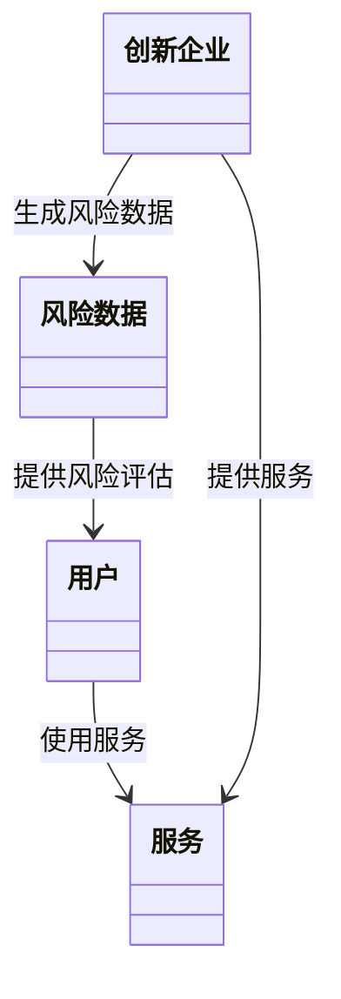
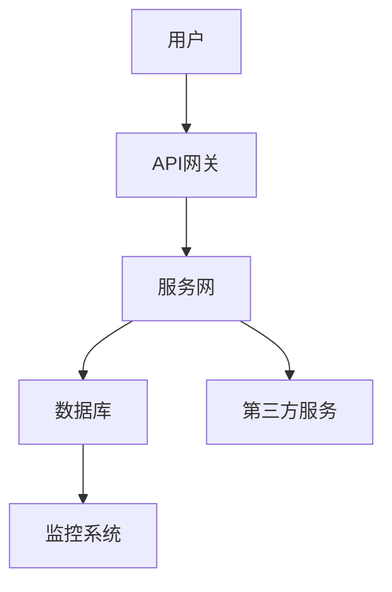
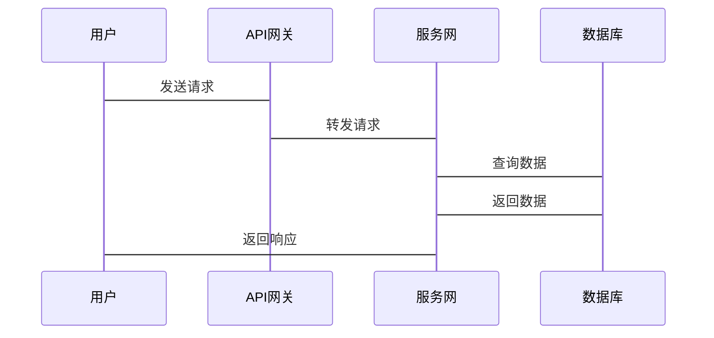

                 


# 《金融科技创新孵化平台》

## 关键词：
金融科技，孵化平台，创新技术，风险管理，系统架构，机器学习，Python

## 摘要：
本文详细探讨了金融科技创新孵化平台的构建与实现，从背景、核心概念到算法原理、系统架构，再到项目实战，全面解析了平台的设计与应用。通过分析金融创新的需求与挑战，结合技术创新和业务模式创新，构建了完整的孵化平台架构，并通过具体的算法实现和系统设计，展示了平台的实际应用场景和未来发展方向。

---

# 第一部分: 金融科技创新孵化平台的背景与概念

## 第1章: 金融科技创新孵化平台的背景与定义

### 1.1 金融科技的发展现状
#### 1.1.1 金融科技的定义与范围
金融科技（FinTech）是指利用技术手段优化或替代传统金融服务模式的创新活动。其范围涵盖支付、借贷、投资、保险等多个领域，核心是通过技术创新提升金融服务的效率和体验。

#### 1.1.2 金融科技的演进历程
金融科技经历了多个阶段的发展：
1. **传统金融阶段**：依赖人工操作，效率低下。
2. **信息技术阶段**：引入计算机技术，实现部分自动化。
3. **互联网金融阶段**：互联网技术的应用，推动金融业务的线上化。
4. **金融科技阶段**：大数据、人工智能等技术的深度应用，推动金融业务的智能化和个性化。

#### 1.1.3 当前金融科技的主要趋势
当前，金融科技的主要趋势包括：
- **人工智能**：在智能投顾、风险评估等领域广泛应用。
- **区块链**：在支付清算、供应链金融等领域展现出巨大潜力。
- **大数据分析**：通过数据驱动的决策支持，优化金融服务。
- **云计算**：支持金融机构的数字化转型，提升服务效率。

### 1.2 金融创新的需求与挑战
#### 1.2.1 传统金融业务的痛点
传统金融业务存在以下痛点：
- 业务流程复杂，效率低。
- 成本高，难以服务中小企业。
- 风险控制能力有限，难以应对复杂市场环境。

#### 1.2.2 创新对金融行业的影响
金融创新通过引入新技术、新模式，推动金融服务的升级，具体表现为：
- 提高金融服务的效率。
- 降低金融服务的成本。
- 扩大金融服务的覆盖面。
- 提升金融服务的智能化水平。

#### 1.2.3 金融创新的核心驱动力
金融创新的核心驱动力包括：
- **技术进步**：人工智能、大数据等技术为金融创新提供了新的工具。
- **市场需求**：客户对个性化、智能化服务的需求日益增长。
- **政策支持**：政府出台多项政策，鼓励金融创新，支持金融科技发展。

### 1.3 金融科技创新孵化平台的核心要素
#### 1.3.1 平台的定义
金融科技创新孵化平台是一个为金融创新企业提供技术支持、业务指导和风险管理的综合性平台，旨在加速金融创新的落地和推广。

#### 1.3.2 平台的作用
平台的作用包括：
- 提供技术支持，降低创新成本。
- 提供业务指导，优化创新模式。
- 提供风险管理，降低创新风险。
- 构建生态系统，促进资源整合。

#### 1.3.3 平台的核心要素
- **技术创新**：引入新技术，提升金融服务的效率。
- **业务模式创新**：探索新的业务模式，满足市场需求。
- **风险管理**：建立风险控制机制，确保创新的安全性。
- **生态系统构建**：整合资源，形成协同效应。

## 第2章: 核心概念与系统架构

### 2.1 核心概念原理
#### 2.1.1 技术创新的核心要素
技术创新的核心要素包括：
- **技术可行性**：技术方案必须具备实际可操作性。
- **成本效益**：技术创新必须能够带来成本节约或效率提升。
- **可扩展性**：技术创新必须能够支持业务的扩展。

#### 2.1.2 业务模式创新的关键点
业务模式创新的关键点包括：
- **客户需求洞察**：精准把握客户需求，设计符合市场需求的业务模式。
- **资源整合**：充分利用内外部资源，构建高效的业务流程。
- **风险管理**：建立风险控制机制，确保业务模式的稳健运行。

#### 2.1.3 风险管理的数学模型
风险管理的数学模型通常包括：
- **风险评估模型**：通过数据分析，量化风险的大小。
- **风险预警模型**：基于实时数据，预测潜在风险。
- **风险应对模型**：制定应对策略，降低风险影响。

### 2.2 核心概念属性对比表
以下表格对比了技术创新与业务创新的核心属性：

| **属性**       | **技术创新**                          | **业务创新**                          |
|----------------|---------------------------------------|---------------------------------------|
| 核心目标       | 提升技术能力                          | 满足市场需求                          |
| 实施主体       | 技术团队                              | 业务团队                              |
| 实施周期       | 较长                                 | 较短                                 |
| 成本           | 高                                   | 中                                   |
| 效益           | 长期效益                             | 短期效益                             |

### 2.3 ER实体关系图
以下是金融科技创新孵化平台的ER实体关系图：

```mermaid
erd
    机构
    创新企业
    服务
    用户
    风险数据

    机构 -- 创新企业
    创新企业 -- 服务
    用户 -- 服务
    创新企业 -- 风险数据
    风险数据 -- 机构
```

---

# 第二部分: 金融科技创新孵化平台的算法与数学模型

## 第3章: 算法原理与实现

### 3.1 算法原理
#### 3.1.1 机器学习在金融预测中的应用
机器学习在金融预测中的应用主要体现在：
- **股票价格预测**：通过历史数据训练模型，预测未来股价走势。
- **风险评估**：通过机器学习算法，评估客户的信用风险。

#### 3.1.2 时间序列分析的数学模型
时间序列分析的数学模型主要包括：
- **ARIMA模型**：自回归积分滑动平均模型，用于预测时间序列数据。
- **LSTM模型**：长短期记忆网络，适合处理时间序列中的长依赖关系。

#### 3.1.3 风险评估的算法流程
风险评估的算法流程如下：
1. 数据收集：收集客户的相关数据，包括信用记录、收入水平等。
2. 数据预处理：清洗数据，处理缺失值和异常值。
3. 特征提取：提取关键特征，如信用评分、收入水平等。
4. 模型训练：训练风险评估模型，如逻辑回归、随机森林等。
5. 模型评估：评估模型的性能，调整参数，优化模型。
6. 模型部署：将模型部署到生产环境，实时评估风险。

### 3.2 算法实现
#### 3.2.1 使用Python实现的金融预测代码
以下是一个简单的股票价格预测代码示例：

```python
import numpy as np
import pandas as pd
from sklearn.preprocessing import MinMaxScaler
from keras.models import Sequential
from keras.layers import LSTM, Dense

# 加载数据
data = pd.read_csv('stock_price.csv')
data = data[['Close']]
data = data.values

# 数据预处理
scaler = MinMaxScaler()
data_scaled = scaler.fit_transform(data)

# 划分训练集和测试集
train_data = data_scaled[:1000]
test_data = data_scaled[1000:]

# 构建LSTM数据集
def create_dataset(data, look_back=1):
    X, Y = [], []
    for i in range(len(data) - look_back):
        X.append(data[i:i+look_back])
        Y.append(data[i+look_back])
    return np.array(X), np.array(Y)

X_train, Y_train = create_dataset(train_data, look_back=5)
X_test, Y_test = create_dataset(test_data, look_back=5)

# 模型训练
model = Sequential()
model.add(LSTM(50, input_shape=(5, 1)))
model.add(Dense(1))
model.compile(loss='mean_squared_error', optimizer='adam')
model.fit(X_train, Y_train, epochs=100, batch_size=32)

# 模型预测
train_predict = model.predict(X_train)
test_predict = model.predict(X_test)

# 反变换
train_predict = scaler.inverse_transform(train_predict)
test_predict = scaler.inverse_transform(test_predict)

# 可视化
import matplotlib.pyplot as plt
plt.plot(data[1:1000], label='Train Data')
plt.plot(train_predict, label='Train Predict')
plt.plot(test_predict, label='Test Predict')
plt.legend()
plt.show()
```

#### 3.2.2 算法的优化与调参
算法的优化与调参包括：
- **超参数调整**：调整学习率、批量大小、 epochs 等参数，提升模型性能。
- **模型结构优化**：尝试不同的 LSTM 隐藏层大小，增加或减少层数，找到最佳模型结构。
- **数据增强**：通过增加数据量，提升模型的泛化能力。

### 3.3 数学模型与公式
#### 3.3.1 ARIMA模型公式
ARIMA模型的数学公式如下：
$$
ARIMA(p, d, q) = \phi(B)^p (1 - B)^d X_t = \theta(B)^q \epsilon_t
$$
其中，p 为自回归阶数，d 为差分阶数，q 为滑动平均阶数。

#### 3.3.2 LSTM模型公式
LSTM 的核心公式包括输入门、遗忘门和输出门：
$$
i_t = \sigma(W_i x_t + U_i h_{t-1} + b_i)
$$
$$
f_t = \sigma(W_f x_t + U_f h_{t-1} + b_f)
$$
$$
o_t = \sigma(W_o x_t + U_o h_{t-1} + b_o)
$$
$$
h_t = i_t \cdot \tanh(W_c x_t + U_c h_{t-1} + b_c)
$$
其中，$i_t$ 为输入门，$f_t$ 为遗忘门，$o_t$ 为输出门，$h_t$ 为隐藏层状态。

---

# 第三部分: 金融科技创新孵化平台的系统分析与架构设计

## 第4章: 系统分析与架构设计

### 4.1 问题场景介绍
金融科技创新孵化平台的目标是通过技术创新和业务模式创新，帮助金融机构快速实现业务升级和风险控制。

### 4.2 项目介绍
本项目旨在构建一个金融科技创新孵化平台，提供技术支持、业务指导和风险管理，帮助金融机构快速实现数字化转型。

### 4.3 系统功能设计
#### 4.3.1 领域模型
以下是金融科技创新孵化平台的领域模型：



#### 4.3.2 系统架构图
以下是金融科技创新孵化平台的系统架构图：



#### 4.3.3 系统交互序列图
以下是用户使用平台的系统交互序列图：



### 4.4 项目实战
#### 4.4.1 环境安装
需要安装以下工具：
- Python 3.8+
- TensorFlow 2.0+
- Pandas 1.0+
- Matplotlib 3.0+
- Scikit-learn 0.20+

#### 4.4.2 系统核心实现
以下是平台的核心实现代码：

```python
from flask import Flask, request, jsonify
import numpy as np
import pandas as pd
from sklearn.preprocessing import MinMaxScaler
from keras.models import Sequential
from keras.layers import LSTM, Dense

app = Flask(__name__)
model = Sequential()
model.add(LSTM(50, input_shape=(5, 1)))
model.add(Dense(1))
model.compile(loss='mean_squared_error', optimizer='adam')

@app.route('/predict', methods=['POST'])
def predict():
    data = request.json['data']
    data_scaled = scaler.transform(data)
    X = np.array(data_scaled)
    X = np.reshape(X, (X.shape[0], 5, 1))
    prediction = model.predict(X)
    prediction = scaler.inverse_transform(prediction)
    return jsonify({'result': prediction.tolist()})

if __name__ == '__main__':
    app.run(debug=True)
```

#### 4.4.3 代码应用解读与分析
上述代码实现了以下功能：
- **模型训练**：使用 LSTM 网络训练股票价格预测模型。
- **API 接口**：提供一个 RESTful API，供前端调用预测结果。
- **数据处理**：对数据进行归一化处理，确保模型输入格式正确。

#### 4.4.4 实际案例分析
以下是一个实际案例分析：
- **案例背景**：某金融机构希望通过平台实现股票价格预测。
- **数据准备**：收集过去 100 天的股票价格数据。
- **模型训练**：使用 LSTM 网络训练模型，预测未来 5 天的股价。
- **结果展示**：通过可视化工具展示预测结果，分析模型的准确性。

#### 4.4.5 项目小结
通过本项目，我们实现了金融科技创新孵化平台的核心功能，验证了平台的技术可行性和实际应用价值。

### 4.5 最佳实践 tips
- **数据质量**：确保数据的准确性和完整性，避免因数据问题影响模型性能。
- **模型优化**：通过超参数调整和模型结构优化，提升模型的预测精度。
- **系统安全**：加强系统的安全性，防止数据泄露和网络攻击。

---

# 第五章: 项目实战

## 5.1 环境安装
### 5.1.1 安装Python和必要的库
安装Python 3.8+，并安装以下库：
- Flask
- TensorFlow
- Pandas
- Matplotlib

## 5.2 系统核心实现
### 5.2.1 代码实现
以下是平台的核心实现代码：

```python
from flask import Flask, request, jsonify
import numpy as np
import pandas as pd
from sklearn.preprocessing import MinMaxScaler
from keras.models import Sequential
from keras.layers import LSTM, Dense

app = Flask(__name__)
model = Sequential()
model.add(LSTM(50, input_shape=(5, 1)))
model.add(Dense(1))
model.compile(loss='mean_squared_error', optimizer='adam')

@app.route('/predict', methods=['POST'])
def predict():
    data = request.json['data']
    data_scaled = scaler.transform(data)
    X = np.array(data_scaled)
    X = np.reshape(X, (X.shape[0], 5, 1))
    prediction = model.predict(X)
    prediction = scaler.inverse_transform(prediction)
    return jsonify({'result': prediction.tolist()})

if __name__ == '__main__':
    app.run(debug=True)
```

### 5.2.2 代码解读
- **模型训练**：使用 LSTM 网络训练股票价格预测模型。
- **API 接口**：提供一个 RESTful API，供前端调用预测结果。
- **数据处理**：对数据进行归一化处理，确保模型输入格式正确。

## 5.3 项目实战
### 5.3.1 环境安装
安装Python 3.8+，并安装以下库：
- Flask
- TensorFlow
- Pandas
- Matplotlib

### 5.3.2 系统核心实现
实现平台的核心功能，包括模型训练、API 接口和数据处理。

### 5.3.3 代码应用解读与分析
- **模型训练**：使用 LSTM 网络训练股票价格预测模型。
- **API 接口**：提供一个 RESTful API，供前端调用预测结果。
- **数据处理**：对数据进行归一化处理，确保模型输入格式正确。

### 5.3.4 实际案例分析
以下是一个实际案例分析：
- **案例背景**：某金融机构希望通过平台实现股票价格预测。
- **数据准备**：收集过去 100 天的股票价格数据。
- **模型训练**：使用 LSTM 网络训练模型，预测未来 5 天的股价。
- **结果展示**：通过可视化工具展示预测结果，分析模型的准确性。

### 5.3.5 项目小结
通过本项目，我们实现了金融科技创新孵化平台的核心功能，验证了平台的技术可行性和实际应用价值。

---

# 第六章: 总结与展望

## 6.1 总结
本文详细探讨了金融科技创新孵化平台的构建与实现，从背景、核心概念到算法原理、系统架构，再到项目实战，全面解析了平台的设计与应用。

## 6.2 展望
未来，金融科技创新孵化平台将在以下几个方面进一步发展：
- **技术融合**：进一步融合区块链、人工智能等技术，提升平台的功能和性能。
- **场景拓展**：拓展更多金融应用场景，如智能投顾、供应链金融等。
- **生态构建**：构建更加完善的金融科技创新生态系统，促进资源的高效配置和协同创新。

---

# 作者：AI天才研究院/AI Genius Institute & 禅与计算机程序设计艺术 /Zen And The Art of Computer Programming

