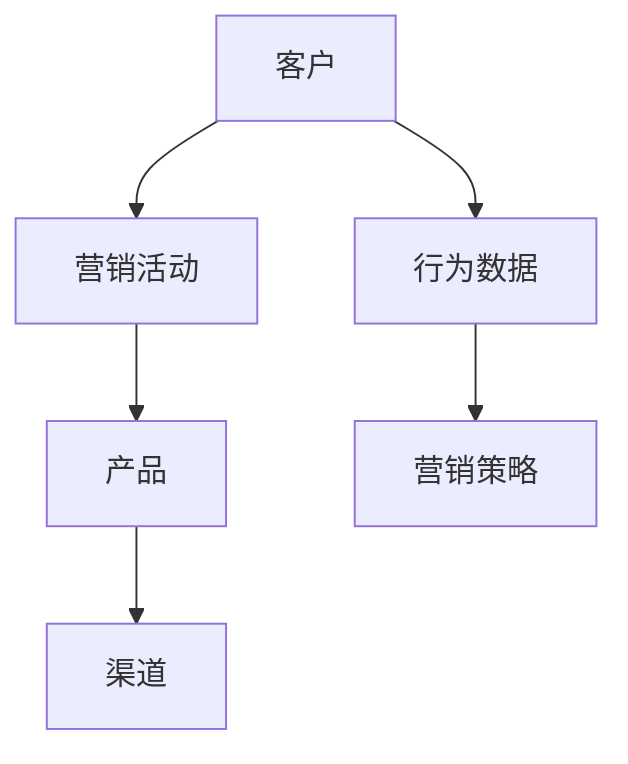
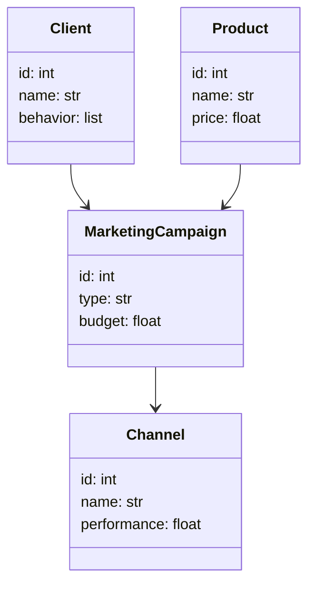
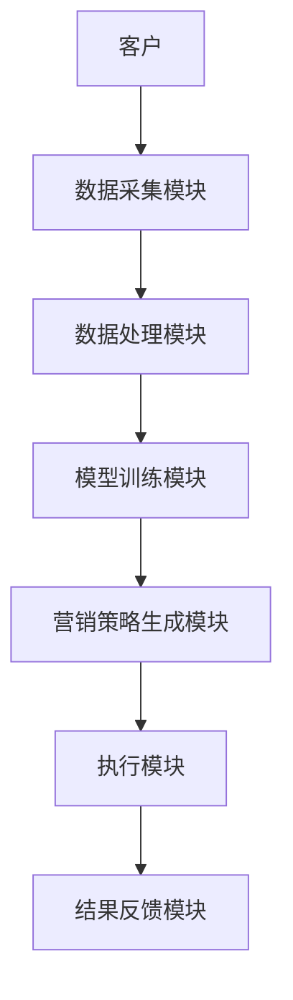

                 


# AI Agent在企业数字营销优化中的应用

> 关键词：AI Agent, 数字营销, 人工智能营销, 营销优化, 智能营销系统

> 摘要：本文深入探讨了AI Agent在企业数字营销优化中的应用，从背景介绍、核心概念、算法原理、系统架构到项目实战，全面解析了AI Agent如何通过数据驱动的精准营销、自动化决策和实时优化能力，帮助企业提升营销效率和客户体验。通过实际案例分析，本文展示了AI Agent在数字营销中的巨大潜力和实际价值。

---

# 第一部分: AI Agent与企业数字营销的背景

## 第1章: AI Agent与企业数字营销的背景

### 1.1 AI Agent的基本概念

#### 1.1.1 AI Agent的定义
AI Agent（人工智能代理）是指能够感知环境、做出决策并执行任务的智能实体。它通过数据驱动的方式，结合机器学习和自然语言处理技术，为企业提供自动化、智能化的解决方案。

#### 1.1.2 AI Agent的核心特征
- **自主性**：能够独立感知环境并做出决策。
- **反应性**：能够实时响应环境变化并调整策略。
- **学习能力**：通过数据和反馈不断优化自身的性能。
- **可扩展性**：能够适应不同规模和复杂度的营销场景。

#### 1.1.3 AI Agent与传统营销工具的对比
| 特性               | AI Agent                          | 传统营销工具                    |
|--------------------|----------------------------------|---------------------------------|
| 数据处理能力       | 强大，支持实时数据分析          | 有限，依赖人工整理与分析        |
| 决策能力           | 基于机器学习模型，精准高效       | 依赖人工经验，可能存在偏差       |
| 自动化能力         | 高度自动化，支持全渠道营销       | 半自动化或手动操作               |
| 可扩展性           | 支持大规模数据处理               | 通常受限于人工处理能力           |

### 1.2 数字营销的现状与挑战

#### 1.2.1 数字营销的定义与范围
数字营销是指通过数字渠道（如网站、社交媒体、电子邮件等）进行产品推广、客户互动和销售管理的营销方式。其范围涵盖广告投放、内容营销、搜索引擎优化（SEO）、社交媒体营销等多个方面。

#### 1.2.2 传统数字营销的局限性
- **数据孤岛**：不同渠道的数据难以整合，导致决策缺乏全局性。
- **效率低下**：人工操作占主导，难以快速响应市场变化。
- **精准度不足**：基于经验的营销策略可能导致资源浪费。

#### 1.2.3 企业数字化转型的迫切需求
随着市场竞争的加剧和消费者需求的多样化，企业亟需通过数字化转型提升营销效率、优化客户体验并降低运营成本。AI Agent的引入为企业提供了强大的技术支撑。

### 1.3 AI Agent在数字营销中的作用

#### 1.3.1 提高营销效率
AI Agent能够自动化处理海量数据，快速生成营销策略，显著提高工作效率。

#### 1.3.2 优化客户体验
通过实时分析客户行为数据，AI Agent能够提供个性化的产品推荐和定制化的内容，从而提升客户满意度和忠诚度。

#### 1.3.3 数据驱动的精准营销
AI Agent能够基于数据进行精准定位目标客户，优化广告投放策略，降低营销成本并提高转化率。

### 1.4 本章小结
本章介绍了AI Agent的基本概念及其在数字营销中的重要性，分析了传统数字营销的局限性，并强调了AI Agent在提升营销效率和客户体验方面的巨大潜力。

---

# 第二部分: AI Agent的核心概念与原理

## 第2章: AI Agent的核心概念

### 2.1 AI Agent的感知能力

#### 2.1.1 数据采集与处理
AI Agent通过收集客户行为数据、市场趋势数据等，构建全面的营销数据视图。常用的数据采集方式包括网页爬取、API接口调用和日志分析。

#### 2.1.2 自然语言处理（NLP）在营销中的应用
NLP技术能够帮助AI Agent理解客户评论、解析社交媒体内容，从而提取情感倾向和关键词，为营销策略提供支持。

#### 2.1.3 数据分析与洞察提取
通过数据清洗、特征工程和统计分析，AI Agent能够从海量数据中提取有价值的营销洞察，为决策提供依据。

### 2.2 AI Agent的决策能力

#### 2.2.1 基于数据的决策模型
AI Agent利用机器学习模型（如随机森林、神经网络）对数据进行建模，预测市场趋势和客户行为，生成最优营销策略。

#### 2.2.2 强化学习在营销决策中的应用
强化学习通过模拟不同营销策略的效果，选择最优行动路径，动态调整营销方案。

#### 2.2.3 预测与推荐算法
基于协同过滤、矩阵分解等推荐算法，AI Agent能够为客户提供个性化的产品推荐，提高转化率。

### 2.3 AI Agent的执行能力

#### 2.3.1 自动化营销工具的集成
AI Agent能够与电子邮件营销工具、广告投放平台等无缝对接，实现营销活动的自动化执行。

#### 2.3.2 实时反馈与调整
通过实时监控营销活动的效果数据，AI Agent能够快速调整策略，确保营销目标的实现。

#### 2.3.3 多渠道营销的协调与优化
AI Agent能够协调不同渠道的营销活动，优化资源分配，提升整体营销效果。

### 2.4 AI Agent的核心属性对比

| 特性               | 传统营销工具                     | AI Agent                          |
|--------------------|----------------------------------|----------------------------------|
| 数据处理能力       | 依赖人工整理，效率低             | 强大，支持实时数据分析             |
| 决策能力           | 基于经验，可能存在偏差           | 基于数据和机器学习，精准高效       |
| 自动化能力         | 半自动化或手动操作               | 高度自动化，支持全渠道营销         |
| 可扩展性           | 通常受限于人工处理能力           | 支持大规模数据处理                 |

### 2.5 AI Agent的ER实体关系图



---

# 第三部分: AI Agent的算法原理与数学模型

## 第3章: AI Agent的算法原理

### 3.1 强化学习算法

#### 3.1.1 强化学习的基本原理
强化学习是一种通过试错方式来优化决策的算法。AI Agent通过与环境的交互，获得奖励或惩罚，逐步优化自身的行为策略。

#### 3.1.2 Q-learning算法
Q-learning是一种经典的强化学习算法，其核心思想是通过Q值表记录状态-动作对的价值，并通过策略迭代更新Q值表。

#### 3.1.3 算法步骤
1. 初始化Q值表。
2. 确定当前状态。
3. 选择动作（探索或利用）。
4. 执行动作并观察环境反馈。
5. 更新Q值表。

#### 3.1.4 优化算法的数学模型
Q-learning的数学模型如下：

$$ Q(s, a) = Q(s, a) + \alpha \cdot [r + \gamma \cdot \max Q(s', a') - Q(s, a)] $$

其中：
- \( Q(s, a) \) 表示状态 \( s \) 下动作 \( a \) 的Q值。
- \( \alpha \) 是学习率。
- \( \gamma \) 是折扣因子。
- \( r \) 是奖励值。
- \( s' \) 是下一个状态。

#### 3.1.5 算法实现
以下是一个简单的Q-learning算法的Python代码示例：

```python
import numpy as np

# 初始化Q值表
Q = np.zeros([state_space, action_space])

# 设置超参数
alpha = 0.1
gamma = 0.9

# Q-learning算法
def q_learning(current_state):
    # 探索与利用策略
    if np.random.random() < 0.1:  # 探索概率
        action = np.random.randint(action_space)
    else:  # 利用策略
        action = np.argmax(Q[current_state])
    # 执行动作并获得奖励
    next_state, reward = get_next_state_and_reward(current_state, action)
    # 更新Q值表
    Q[current_state][action] += alpha * (reward + gamma * np.max(Q[next_state]) - Q[current_state][action])
    return action

# 示例调用
current_state = 0
action = q_learning(current_state)
```

---

## 第3.2 个性化推荐算法

#### 3.2.1 协同过滤算法
协同过滤是一种基于用户相似性推荐商品的算法。其核心思想是找到与当前用户行为相似的用户群体，推荐他们喜欢的商品。

#### 3.2.2 矩阵分解算法
矩阵分解（如奇异值分解SVD）通过将用户-物品矩阵分解为用户因子矩阵和物品因子矩阵，实现推荐目标。

#### 3.2.3 算法实现
以下是一个基于协同过滤的推荐算法的Python代码示例：

```python
from sklearn.metrics.pairwise import cosine_similarity

# 计算用户相似度矩阵
user_similarity = cosine_similarity(user_features)

# 找到最相似的用户
def get_recommendations(user_id, user_similarity, item_ids):
    similar_users = np.argsort(user_similarity[user_id])[::-1]
    recommended_items = []
    for user in similar_users:
        if user != user_id:
            recommended_items.extend(train_data[user])
            break  # 假设只推荐最相似用户的物品
    return recommended_items

# 示例调用
user_id = 0
recommendations = get_recommendations(user_id, user_similarity, item_ids)
```

---

## 第3.3 数据分析与预测算法

#### 3.3.1 时间序列预测算法
时间序列预测算法（如ARIMA）用于预测未来的市场趋势和客户行为。

#### 3.3.2 集成学习算法
集成学习通过组合多个模型的预测结果，提高预测的准确性和稳定性。

#### 3.3.3 算法实现
以下是一个基于随机森林的预测模型的Python代码示例：

```python
from sklearn.ensemble import RandomForestRegressor
from sklearn.metrics import mean_absolute_error

# 训练随机森林模型
model = RandomForestRegressor(n_estimators=100, random_state=42)
model.fit(X_train, y_train)

# 预测并评估结果
y_pred = model.predict(X_test)
print("预测误差:", mean_absolute_error(y_test, y_pred))

# 示例调用
new_data = np.array([[1, 2, 3, 4]])  # 示例输入数据
prediction = model.predict(new_data)
print("预测结果:", prediction[0])
```

---

## 第4章: 系统分析与架构设计方案

### 4.1 项目介绍

#### 4.1.1 项目背景
本项目旨在通过AI Agent优化一个电商平台的数字营销策略，提升销售额和客户满意度。

#### 4.1.2 项目目标
- 实现客户行为分析。
- 提供个性化推荐服务。
- 优化广告投放策略。

### 4.2 系统功能设计

#### 4.2.1 领域模型类图


#### 4.2.2 系统架构图


---

## 第5章: 项目实战

### 5.1 环境安装与配置

#### 5.1.1 安装Python
```bash
python --version
# 如果需要安装Python，请参考官方文档
```

#### 5.1.2 安装必要的库
```bash
pip install numpy scikit-learn pandas matplotlib
```

### 5.2 系统核心实现源代码

#### 5.2.1 数据采集模块
```python
import requests
from bs4 import BeautifulSoup

def scrape_data(url):
    response = requests.get(url)
    soup = BeautifulSoup(response.text, 'html.parser')
    data = []
    for item in soup.find_all('div', class_='product-item'):
        data.append({
            'id': item['id'],
            'name': item.find('h3').text,
            'price': float(item.find('p').text)
        })
    return data

# 示例调用
url = 'https://example.com/products'
data = scrape_data(url)
print(data)
```

#### 5.2.2 数据分析模块
```python
from sklearn.ensemble import RandomForestRegressor
import pandas as pd

# 加载数据
data = pd.read_csv('marketing_data.csv')

# 数据预处理
data.dropna(inplace=True)
X = data.drop('target', axis=1)
y = data['target']

# 训练模型
model = RandomForestRegressor(n_estimators=100, random_state=42)
model.fit(X, y)

# 预测
new_data = X.iloc[[-1]]  # 使用最后一行数据作为示例
prediction = model.predict(new_data)
print(f'预测结果: {prediction[0]:.2f}')
```

### 5.3 实际案例分析

#### 5.3.1 案例背景
某电商平台希望通过AI Agent优化广告投放策略，提升点击率和转化率。

#### 5.3.2 数据分析与建模
通过对历史广告数据的分析，构建一个基于点击率的广告优化模型。

#### 5.3.3 算法实现与优化
通过A/B测试验证不同广告策略的效果，选择最优方案进行推广。

### 5.4 项目小结
本项目通过AI Agent实现了数据驱动的营销优化，显著提升了广告点击率和客户转化率，验证了AI技术在数字营销中的巨大价值。

---

## 第6章: 最佳实践与注意事项

### 6.1 小结
本文全面探讨了AI Agent在企业数字营销中的应用，从算法原理到系统设计，再到项目实战，为读者提供了完整的解决方案。

### 6.2 注意事项
- **数据隐私**：在处理客户数据时，必须遵守相关法律法规，确保数据隐私和安全。
- **模型迭代**：AI Agent需要不断迭代优化，以适应市场变化和客户需求。
- **团队协作**：AI Agent的实现需要数据科学家、软件工程师和营销专家的密切合作。

### 6.3 拓展阅读
- 《机器学习实战》
- 《人工智能：一种现代的方法》
- 《数字营销的奥秘》

---

# 作者：AI天才研究院/AI Genius Institute & 禅与计算机程序设计艺术 /Zen And The Art of Computer Programming

---

以上是《AI Agent在企业数字营销优化中的应用》的完整内容，涵盖了从理论到实践的各个方面，旨在为企业数字化转型提供有力的技术支持和实践指导。

