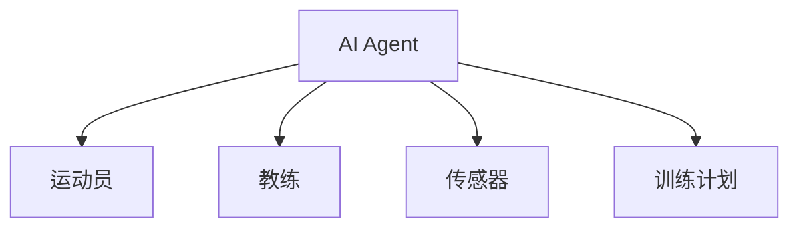
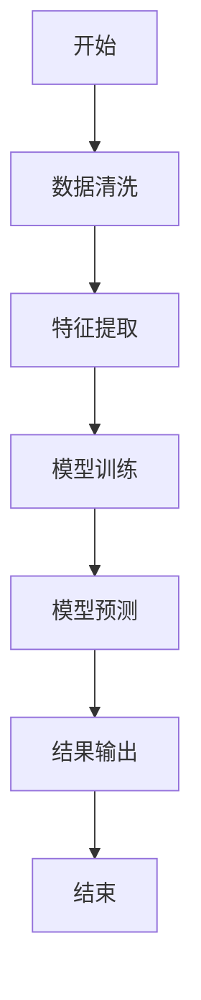
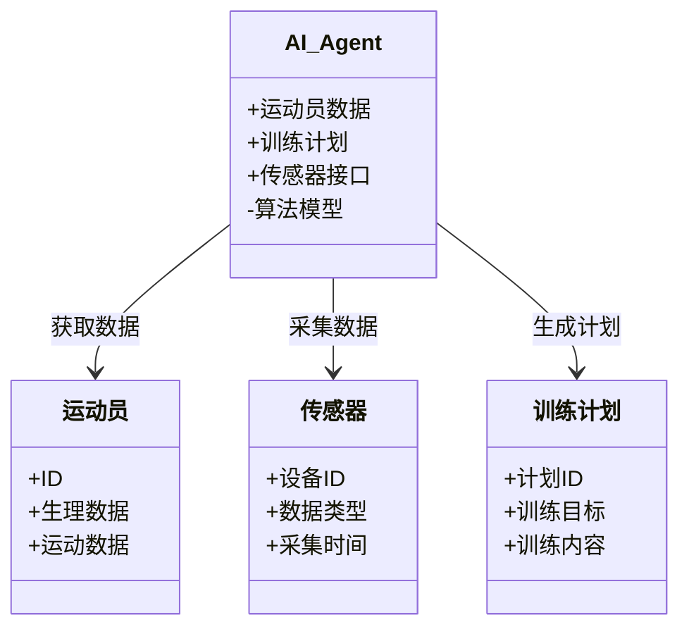
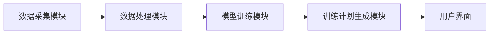

                 


# AI Agent在体育训练中的应用：个性化训练计划制定

## 关键词：AI Agent、个性化训练、机器学习、深度学习、强化学习

## 摘要：  
随着人工智能技术的飞速发展，AI Agent在体育训练中的应用日益广泛。本文详细探讨了AI Agent如何通过数据分析和机器学习算法，为运动员制定个性化的训练计划。通过分析运动员的生理数据、运动表现和训练历史，AI Agent能够实时调整训练策略，优化训练效果，帮助运动员达到最佳竞技状态。本文从AI Agent的基本概念、算法原理、系统架构到实际项目案例，全面解析了其在个性化训练计划制定中的应用，并展望了未来的发展方向。

---

# 第一部分: AI Agent在体育训练中的应用背景

## 第1章: AI Agent与体育训练的结合

### 1.1 AI Agent的基本概念

#### 1.1.1 AI Agent的定义
AI Agent（人工智能代理）是指能够感知环境、自主决策并执行任务的智能实体。在体育训练中，AI Agent可以通过分析运动员的数据，提供个性化的训练建议和实时反馈。

#### 1.1.2 AI Agent的核心特征
- **自主性**：AI Agent能够独立决策，无需人工干预。
- **反应性**：能够实时感知环境变化并做出调整。
- **学习能力**：通过机器学习算法不断优化训练计划。
- **交互性**：能够与运动员、教练和其他系统进行实时交互。

#### 1.1.3 AI Agent与传统训练方式的区别
传统的训练计划通常是基于经验制定的，缺乏数据支持和实时调整能力。而AI Agent能够结合大量数据，实时优化训练方案，显著提高了训练的科学性和效率。

---

### 1.2 体育训练中的AI Agent应用背景

#### 1.2.1 体育训练的数字化转型
随着科技的发展，体育训练逐渐从经验驱动转向数据驱动。通过传感器、智能设备和AI技术，运动员的生理数据和运动表现可以实时采集和分析。

#### 1.2.2 数据驱动的训练计划优化
AI Agent可以通过分析运动员的运动数据、生理指标和训练历史，发现潜在问题并提供优化建议。例如，AI Agent可以根据运动员的疲劳程度调整训练强度。

#### 1.2.3 个性化训练的需求与挑战
不同运动员的体质、技能和恢复能力各不相同，传统的统一训练计划难以满足个性化需求。AI Agent能够根据个体差异制定个性化的训练方案，但实现这一目标需要解决数据采集、模型训练和实时反馈等技术难题。

---

### 1.3 个性化训练计划的意义

#### 1.3.1 个性化训练的目标
个性化训练的目标是根据运动员的个体特点，制定最优的训练计划，最大化其竞技表现并降低受伤风险。

#### 1.3.2 个性化训练的优势
- **提高训练效率**：通过数据分析，AI Agent能够找到最适合运动员的训练方式。
- **降低受伤风险**：实时监控运动员的生理指标，避免过度训练。
- **提升竞技水平**：通过精准的训练计划，帮助运动员在比赛中发挥最佳水平。

#### 1.3.3 个性化训练的实现路径
个性化训练的实现需要结合运动员的生理数据、运动表现和训练历史，利用机器学习算法进行建模和预测，最终生成个性化的训练计划。

---

## 1.4 本章小结
本章介绍了AI Agent的基本概念、在体育训练中的应用背景以及个性化训练的意义。通过AI Agent，体育训练将从经验驱动转向数据驱动，实现更科学、更高效的训练方式。

---

# 第二部分: AI Agent的核心概念与原理

## 第2章: AI Agent的核心概念与联系

### 2.1 AI Agent的感知与决策机制

#### 2.1.1 数据采集与特征提取
AI Agent需要通过传感器、摄像头等设备采集运动员的生理数据（如心率、肌张力）和运动数据（如速度、加速度）。特征提取是将这些数据转化为可分析的特征，例如将心率变化转化为疲劳程度的指标。

#### 2.1.2 数据分析与模式识别
通过机器学习算法，AI Agent可以分析提取的特征，识别运动员的运动模式和潜在问题。例如，利用聚类算法将运动员的训练数据分为不同的组别，找出最适合的训练方式。

#### 2.1.3 训练计划的自适应调整
AI Agent可以根据分析结果，动态调整训练计划。例如，当运动员出现疲劳时，AI Agent可以降低训练强度或增加恢复时间。

---

### 2.2 AI Agent与体育训练的实体关系

#### 2.2.1 实体关系图（ER图）
以下是体育训练中AI Agent与相关实体的关系图（使用Mermaid）：



#### 2.2.2 体育训练场景中的实体交互
在体育训练场景中，AI Agent与运动员、教练和传感器交互，实时获取数据并制定训练计划。

#### 2.2.3 系统架构的模块划分
AI Agent系统通常包括数据采集模块、数据分析模块和训练计划生成模块。

---

### 2.3 AI Agent的算法原理

#### 2.3.1 机器学习算法概述
机器学习算法是AI Agent的核心，常用的算法包括：

- **监督学习**：如线性回归、支持向量机（SVM）。
- **无监督学习**：如聚类算法（K均值聚类）。
- **强化学习**：如Q-learning和Deep Q-Network（DQN）。

#### 2.3.2 深度学习算法概述
深度学习算法在处理复杂数据时表现优异，常用的模型包括卷积神经网络（CNN）和循环神经网络（RNN）。

#### 2.3.3 强化学习算法概述
强化学习适用于需要动态调整的场景，例如实时调整训练计划。

---

## 2.4 本章小结
本章详细介绍了AI Agent的核心概念、感知与决策机制以及算法原理。通过这些技术，AI Agent能够实现对运动员的个性化训练计划制定。

---

# 第三部分: AI Agent的算法原理与数学模型

## 第3章: AI Agent的算法原理

### 3.1 监督学习算法

#### 3.1.1 线性回归模型
线性回归是一种简单但强大的监督学习算法，用于预测连续型变量。其数学模型如下：

$$ y = \beta_0 + \beta_1 x + \epsilon $$

其中，$y$ 是目标变量，$x$ 是特征变量，$\beta_0$ 和 $\beta_1$ 是模型参数。

#### 3.1.2 支持向量机（SVM）
SVM适用于分类和回归问题。其核心思想是将数据映射到高维空间，并找到一个超平面来分割数据。

#### 3.1.3 决策树算法
决策树是一种基于树状结构的分类算法，能够处理复杂的数据关系。常用的决策树算法包括ID3、C4.5和CART。

---

### 3.2 无监督学习算法

#### 3.2.1 K均值聚类
K均值聚类是一种常用的无监督学习算法，用于将数据分为K个簇。其目标函数为：

$$ \text{目标函数} = \sum_{i=1}^{K} \sum_{j=1}^{n_i} (x_{ij} - \mu_i)^2 $$

其中，$K$ 是簇的个数，$n_i$ 是第$i$个簇的数据点数，$\mu_i$ 是第$i$个簇的均值。

#### 3.2.2 层次聚类
层次聚类是一种逐步合并或分割数据点的聚类算法，适用于数据关系复杂的场景。

#### 3.2.3 主成分分析（PCA）
PCA是一种降维技术，用于提取数据的主要特征。其数学模型如下：

$$ Y = X \cdot P $$

其中，$Y$ 是降维后的数据，$X$ 是原始数据，$P$ 是降维矩阵。

---

### 3.3 强化学习算法

#### 3.3.1 Q-learning算法
Q-learning是一种基于值函数的强化学习算法，其更新公式为：

$$ Q(s, a) = Q(s, a) + \alpha \cdot [r + \gamma \cdot \max Q(s', a) - Q(s, a)] $$

其中，$\alpha$ 是学习率，$\gamma$ 是折扣因子。

#### 3.3.2 Deep Q-Network（DQN）
DQN是一种结合深度学习和强化学习的算法，用于处理高维状态空间。

#### 3.3.3 政策梯度方法
政策梯度方法是一种直接优化策略的强化学习算法，适用于复杂的动作空间。

---

## 3.4 算法流程图（Mermaid）
以下是线性回归算法的流程图：



---

## 3.5 本章小结
本章详细介绍了AI Agent中常用的机器学习算法，包括监督学习、无监督学习和强化学习，并通过数学公式和流程图进行了直观的解释。

---

# 第四部分: AI Agent的系统架构与设计

## 第4章: AI Agent的系统架构与设计

### 4.1 系统功能设计

#### 4.1.1 领域模型（Mermaid类图）
以下是AI Agent系统的领域模型：



---

### 4.2 系统架构设计

#### 4.2.1 系统架构图（Mermaid）
以下是AI Agent系统的架构图：



---

### 4.3 系统接口设计

#### 4.3.1 数据接口
AI Agent需要与传感器、数据库和用户界面进行交互。以下是数据接口的交互图：

```mermaid
graph LR
A[AI Agent] --> B[传感器]: 获取数据
A --> C[数据库]: 存储数据
A --> D[用户界面]: 显示结果
```

---

## 4.4 本章小结
本章详细介绍了AI Agent系统的架构设计，包括功能模块划分、系统架构图和接口设计。通过这些设计，AI Agent能够高效地采集数据、训练模型并生成训练计划。

---

# 第五部分: AI Agent的项目实战

## 第5章: AI Agent的项目实战

### 5.1 环境安装

#### 5.1.1 安装Python
```bash
# 安装Python
sudo apt-get install python3 python3-pip
```

#### 5.1.2 安装依赖库
```bash
pip install numpy pandas scikit-learn matplotlib
```

---

### 5.2 核心代码实现

#### 5.2.1 数据采集与预处理
```python
import pandas as pd
import numpy as np

# 数据采集
data = pd.read_csv('train_data.csv')
# 数据清洗
data.dropna(inplace=True)
```

#### 5.2.2 特征提取与建模
```python
from sklearn.model_selection import train_test_split
from sklearn.linear_model import LinearRegression

# 划分训练集和测试集
X_train, X_test, y_train, y_test = train_test_split(data.drop('target', axis=1), data['target'], test_size=0.2)
# 模型训练
model = LinearRegression()
model.fit(X_train, y_train)
```

#### 5.2.3 模型预测与评估
```python
# 模型预测
y_pred = model.predict(X_test)
# 模型评估
from sklearn.metrics import r2_score
print(r2_score(y_test, y_pred))
```

---

### 5.3 案例分析

#### 5.3.1 案例背景
假设我们有一个运动员的训练数据，包括心率、速度和加速度等指标。

#### 5.3.2 数据分析
通过机器学习模型，我们发现运动员在高强度训练后恢复能力较差，因此需要调整训练计划。

#### 5.3.3 训练计划优化
根据模型建议，调整训练计划，例如减少高强度训练的频率，增加恢复训练的比例。

---

## 5.4 项目小结
本章通过一个实际案例，详细介绍了AI Agent项目的实现过程，包括环境安装、代码实现和案例分析。通过这些实践，读者可以更好地理解AI Agent在个性化训练计划制定中的应用。

---

# 第六部分: 总结与展望

## 第6章: 总结与展望

### 6.1 本章总结
本文详细探讨了AI Agent在体育训练中的应用，特别是个性化训练计划的制定。通过机器学习算法和数据科学技术，AI Agent能够实时优化训练计划，帮助运动员提高竞技水平并降低受伤风险。

---

### 6.2 未来展望
随着AI技术的不断发展，AI Agent在体育训练中的应用将更加广泛。未来，AI Agent可以通过边缘计算和物联网技术实现更实时的训练监控，同时结合增强现实（AR）技术为运动员提供沉浸式的训练体验。

---

## 作者：AI天才研究院/AI Genius Institute & 禅与计算机程序设计艺术 /Zen And The Art of Computer Programming

