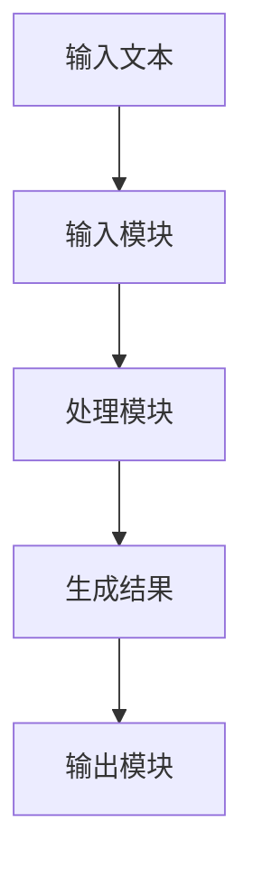
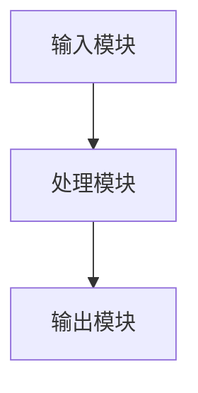
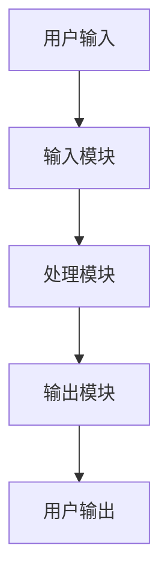

                 

# AI Agent的多语言支持：跨语言理解与生成

## 关键词：AI Agent，多语言支持，跨语言理解，跨语言生成，NLP，机器学习

## 摘要：  
随着全球化的深入和技术的进步，AI Agent在跨语言环境中的应用越来越广泛。本文将深入探讨AI Agent在多语言支持方面的技术细节，涵盖跨语言理解与生成的核心原理、算法模型、系统架构以及实际应用案例。通过逐步分析，我们将揭示如何实现高效、准确的跨语言交互，为读者提供一个全面的技术视角。

---

# 第1章: AI Agent与多语言支持概述

## 1.1 AI Agent的基本概念

### 1.1.1 AI Agent的定义与特点  
AI Agent（人工智能代理）是一种能够感知环境、自主决策并执行任务的智能实体。它具备以下特点：  
- **自主性**：无需外部干预，自主完成任务。  
- **反应性**：能够实时感知环境并做出反应。  
- **目标导向**：基于目标驱动行为。  
- **学习能力**：通过数据和经验不断优化自身性能。  

### 1.1.2 多语言支持的重要性  
在全球化的背景下，AI Agent需要能够理解并生成多种语言，以满足不同用户的需求。多语言支持不仅提升了用户体验，还扩大了AI Agent的应用范围。  

### 1.1.3 跨语言理解与生成的背景  
随着AI技术的发展，跨语言交互需求日益增长。例如，多语言客服系统、跨语言信息检索、全球社交媒体分析等场景都需要AI Agent具备跨语言能力。

---

## 1.2 多语言NLP的挑战与机遇

### 1.2.1 多语言NLP的核心问题  
- **语言多样性**：不同语言的语法、词汇差异较大，增加了模型训练的难度。  
- **数据稀缺性**：某些小语种的数据量有限，导致模型性能不足。  
- **计算资源限制**：跨语言任务通常需要更多的计算资源。  

### 1.2.2 跨语言理解的难点  
- **词汇对齐**：不同语言中相同概念的词汇可能差异较大。  
- **语义理解**：跨语言语义分析需要同时理解多种语言的上下文。  
- **文化差异**：语言背后的文化差异可能影响语义理解。  

### 1.2.3 跨语言生成的挑战  
- **生成一致性**：跨语言生成需要保持逻辑一致性和语义准确性。  
- **语言适应性**：生成结果需要符合目标语言的语法和表达习惯。  
- **模型泛化能力**：模型需要在多种语言上表现出色。  

### 1.2.4 跨语言NLP的机遇  
- **技术进步**：预训练模型（如BERT、GPT）的多语言版本为跨语言任务提供了强大支持。  
- **应用场景扩展**：跨语言能力使得AI Agent能够服务于更多领域和用户群体。  

---

## 1.3 本书的核心目标与结构

### 1.3.1 本书的研究范围  
本书主要探讨AI Agent在多语言环境中的理解与生成能力，涵盖跨语言NLP的核心技术、算法实现以及系统设计。

### 1.3.2 目录结构概览  
- 第1章：AI Agent与多语言支持概述。  
- 第2章：多语言NLP的基础知识。  
- 第3章：跨语言理解的算法与模型。  
- 第4章：跨语言生成的算法与模型。  
- 第5章：跨语言理解与生成的系统架构。  
- 第6章：项目实战与案例分析。  

### 1.3.3 学习本书的建议  
- **理论与实践结合**：理解算法原理的同时，尝试实现相关模型。  
- **多语言数据集**：熟悉常用多语言数据集，如WMT、UDTreebank等。  
- **持续学习**：AI技术快速发展，需持续关注最新研究成果。  

---

# 第2章: 多语言NLP的基础知识

## 2.1 多语言NLP的模型与工具

### 2.1.1 Transformer模型简介  
Transformer模型由Vaswney等人提出，基于自注意力机制，广泛应用于多语言NLP任务。其核心公式为：  
$$ \text{Attention}(Q,K,V) = \text{softmax}\left(\frac{QK^T}{\sqrt{d_k}}\right)V $$  

### 2.1.2 多语言模型的训练方法  
- **多任务学习**：在一个模型中同时训练多种语言任务。  
- **预训练与微调**：利用大规模多语言数据进行预训练，再在特定任务上进行微调。  

### 2.1.3 常见的多语言NLP工具  
- **spaCy**：支持多种语言的NLP处理。  
- **fasttext**：适合多语言文本分类。  
- **Hugging Face**：提供丰富的多语言模型和工具。  

---

## 2.2 跨语言理解的核心原理

### 2.2.1 语言表示的统一性  
跨语言理解的核心是将不同语言的文本映射到一个统一的语义空间。例如，使用跨语言词嵌入（如XLM）将多种语言的词汇表示到同一向量空间。

### 2.2.2 跨语言词嵌入的构建  
跨语言词嵌入通过对比学习或对齐技术，将不同语言的词汇对齐到同一嵌入空间。例如，使用语言对齐矩阵对齐不同语言的词向量。

### 2.2.3 跨语言句法分析的挑战  
跨语言句法分析需要同时理解多种语言的语法结构，可以通过共享参数或跨语言预训练模型实现。

---

## 2.3 跨语言生成的实现方法

### 2.3.1 跨语言翻译的基本原理  
跨语言翻译通常采用神经机器翻译模型，如Transformer-based的模型。其基本流程为：  
1. 将源语言文本编码为序列。  
2. 解码为目标语言文本。  
3. 输出生成的目标语言文本。  

### 2.3.2 基于预训练模型的生成策略  
- **微调模型**：在特定任务上对多语言预训练模型进行微调。  
- **零样本生成**：利用预训练模型的泛化能力直接生成目标语言文本。  

### 2.3.3 跨语言生成的优化技巧  
- **数据增强**：通过数据增强技术增加训练数据的多样性。  
- **多任务学习**：结合相关任务（如翻译和文本摘要）提升生成性能。  

---

## 2.4 跨语言理解与生成的对比分析

### 2.4.1 語言模型与翻译模型的对比  
- 语言模型：主要关注单语言的语义理解和生成。  
- 翻译模型：专注于跨语言文本转换。  

### 2.4.2 語言模型的适用场景  
- 单语言文本生成、对话系统、内容生成。  

### 2.4.3 翻译模型的适用场景  
- 跨语言信息检索、机器翻译、跨语言客服系统。  

---

## 2.5 跨语言NLP的未来发展方向

### 2.5.1 多模态跨语言模型  
结合视觉、听觉等多模态信息，提升跨语言理解能力。  

### 2.5.2 小语种支持  
通过迁移学习和数据合成技术，提升小语种的NLP性能。  

### 2.5.3 真实场景应用  
将跨语言NLP技术应用于实际场景，如跨境电商、全球社交媒体分析等。  

---

# 第3章: 跨语言理解的算法与模型

## 3.1 跨语言理解的模型架构

### 3.1.1 多语言BERT模型  
多语言BERT（mBERT）是在多语言数据上预训练的BERT模型，支持多种语言的文本理解任务。

### 3.1.2 XLM-R模型  
XLM-R是一种基于Transformer的多语言模型，支持100多种语言，性能优于单语言模型。

### 3.1.3 跨语言模型的对比  
| 模型 | 语言数量 | 预训练数据 | 主要特点 |
|------|----------|------------|----------|
| BERT | 100+     | 多语言文本 | 支持多种任务 |
| XLM-R | 100+     | 多语言文本 | 高效轻量 |

---

## 3.2 跨语言理解的训练策略

### 3.2.1 多任务学习  
在同一模型中同时训练多种语言任务，如文本分类、命名实体识别等。

### 3.2.2 数据对齐技术  
通过数据对齐技术，将不同语言的数据对齐到同一语义空间，提升模型的跨语言性能。

### 3.2.3 跨语言预训练  
在大规模多语言数据上进行预训练，提取跨语言的语义特征。

---

## 3.3 跨语言理解的评估指标

### 3.3.1 常见的NLP评估指标  
- **准确率（Accuracy）**：分类任务的正确预测比例。  
- **F1分数（F1 Score）**：综合 precision 和 recall 的指标。  

### 3.3.2 跨语言任务的专用评估方法  
- **跨语言评估（Cross-Lingual Evaluation）**：在目标语言上评估模型性能。  
- **零样本评估（Zero-Shot Evaluation）**：在未见过的语言上评估模型性能。  

---

## 3.4 跨语言理解的数学模型

### 3.4.1 自注意力机制  
自注意力机制用于捕捉文本中的长距离依赖关系，公式为：  
$$ \text{Attention}(Q,K,V) = \text{softmax}\left(\frac{QK^T}{\sqrt{d_k}}\right)V $$  

### 3.4.2 模型训练目标  
跨语言理解模型的训练目标是通过最小化损失函数，优化模型参数。常用的损失函数包括：  
- 分类任务：交叉熵损失。  
- 生成任务：负对数似然损失。  

---

## 3.5 跨语言理解的优化技巧

### 3.5.1 数据增强  
通过数据增强技术，如同义词替换、句式变化等，提升模型的泛化能力。  

### 3.5.2 参数共享  
在多语言模型中，共享部分参数可以减少模型参数量，提升计算效率。  

### 3.5.3 多任务学习  
通过结合多种任务，提升模型的跨语言理解能力。  

---

# 第4章: 跨语言生成的算法与模型

## 4.1 跨语言生成的模型架构

### 4.1.1 多语言GPT模型  
多语言GPT模型（如GPT-NEO）支持多种语言的文本生成任务。

### 4.1.2 跨语言翻译模型  
基于Transformer的翻译模型（如NMT）支持跨语言文本生成。

### 4.1.3 模型对比分析  
| 模型 | 语言数量 | 生成能力 | 主要特点 |
|------|----------|----------|----------|
| GPT | 100+     | 强大      | 支持多种任务 |
| NMT | 100+     | 精准      | 专注于翻译 |

---

## 4.2 跨语言生成的训练策略

### 4.2.1 预训练与微调  
- 预训练阶段：在大规模多语言数据上进行无监督学习。  
- 微调阶段：在特定任务上进行有监督微调。  

### 4.2.2 多任务学习  
结合多种生成任务（如翻译和文本摘要）进行联合优化。  

### 4.2.3 数据平衡技术  
通过数据采样和加权策略，平衡不同语言的数据分布，避免模型偏向某一语言。  

---

## 4.3 跨语言生成的评估与优化

### 4.3.1 生成任务的评估指标  
- **BLEU**：基于n-gram的精确度评估指标。  
- **ROUGE**：基于召回率的评估指标。  

### 4.3.2 模型生成结果的分析方法  
- **人工评估**：通过人工评估生成结果的准确性和流畅性。  
- **自动评估**：基于BLEU、ROUGE等指标量化评估生成质量。  

### 4.3.3 模型性能的优化技巧  
- **调整生成长度**：避免生成过长或过短的文本。  
- **优化温度参数**：通过调整温度参数控制生成的多样性和确定性。  

---

## 4.4 跨语言生成的数学模型

### 4.4.1 变压器解码器  
解码器部分的生成过程可以表示为：  
$$ P(y|x) = \prod_{i=1}^n P(y_i|x_{<i}, y_{<i}) $$  

### 4.4.2 损失函数  
生成任务常用的损失函数是交叉熵损失：  
$$ \mathcal{L} = -\frac{1}{N}\sum_{i=1}^N \sum_{j=1}^M y_{ij}\log p(y_{ij}) $$  

---

## 4.5 跨语言生成的系统实现

### 4.5.1 系统模块划分  
- 输入模块：接收输入文本。  
- 处理模块：执行跨语言生成任务。  
- 输出模块：输出生成结果。  

### 4.5.2 系统流程图  

---

# 第5章: 跨语言理解与生成的系统架构

## 5.1 系统架构设计

### 5.1.1 模块划分  
- **输入模块**：接收多种语言的输入文本。  
- **处理模块**：执行跨语言理解与生成任务。  
- **输出模块**：输出处理结果。  

### 5.1.2 数据流与模块交互  

---

## 5.2 系统功能设计

### 5.2.1 功能需求  
- 支持多种语言的文本理解与生成。  
- 提供跨语言翻译、文本摘要等服务。  

### 5.2.2 系统接口设计  
- **API接口**：提供RESTful API接口，供外部调用。  
- **数据格式**：支持JSON格式的数据输入输出。  

---

## 5.3 系统实现的技术选型

### 5.3.1 模型训练框架  
- **Hugging Face**：支持多语言模型的训练与部署。  
- **TensorFlow/PyTorch**：常用的深度学习框架。  

### 5.3.2 数据处理工具  
- **spaCy**：多语言NLP工具。  
- **NLTK**：通用NLP工具。  

---

## 5.4 系统部署与优化

### 5.4.1 系统部署环境  
- **云服务器**：支持多语言模型的部署与运行。  
- **容器化技术**：使用Docker进行容器化部署。  

### 5.4.2 系统优化技巧  
- **模型压缩**：通过剪枝等技术减少模型大小。  
- **分布式训练**：利用分布式计算提升训练效率。  

---

## 5.5 系统架构图

---

# 第6章: 项目实战与案例分析

## 6.1 项目环境搭建

### 6.1.1 开发环境安装与配置  
- 安装Python、虚拟环境（如virtualenv）。  
- 安装必要的库（如Hugging Face、TensorFlow）。  

### 6.1.2 数据集准备与预处理  
- 下载多语言数据集（如WMT）。  
- 数据清洗与格式化。  

---

## 6.2 系统核心实现

### 6.2.1 跨语言理解实现  
- 使用Hugging Face的多语言模型进行文本分类。  

### 6.2.2 跨语言生成实现  
- 使用GPT模型生成跨语言文本。  

---

## 6.3 实际案例分析

### 6.3.1 案例背景  
- 项目目标：构建一个多语言客服系统。  

### 6.3.2 系统实现  
- 实现多语言文本理解与生成功能。  

### 6.3.3 案例总结  
- 成功实现了跨语言客服系统的功能。  
- 提升了用户体验和系统性能。  

---

## 6.4 项目小结

### 6.4.1 项目成果  
- 成功构建了一个支持多语言的AI Agent系统。  
- 验证了跨语言NLP技术的实际应用价值。  

### 6.4.2 经验总结  
- 数据预处理是关键，需仔细清洗和对齐。  
- 模型选择需结合具体任务需求。  

---

## 作者：AI天才研究院 & 禅与计算机程序设计艺术

