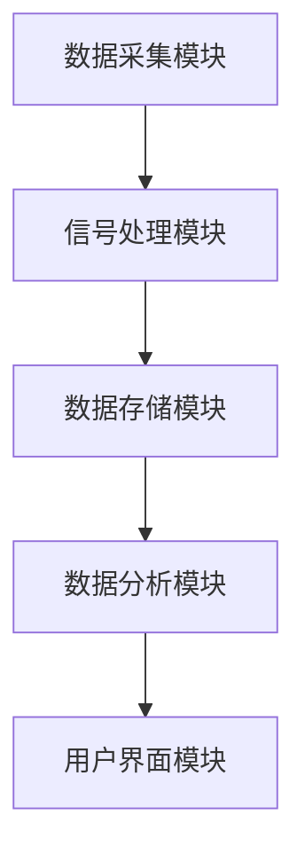
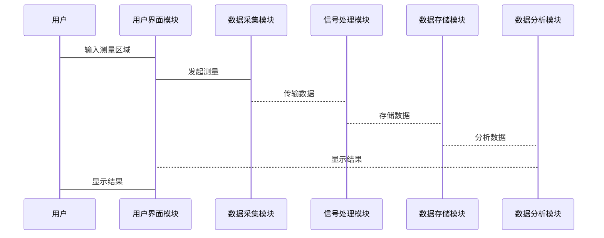

                 


# 如何评估企业的量子传感器大地测量应用

---

## 关键词：
量子传感器、大地测量、企业应用、技术评估、传感器技术、测量精度

---

## 摘要：
本文旨在帮助企业理解和评估量子传感器在大地测量中的应用。通过介绍量子传感器的基本原理、核心优势以及在大地测量中的应用场景，详细分析评估指标、方法和流程。结合实际案例，提供系统设计与架构、项目实战和技术建议，帮助企业优化量子传感器的应用效果。

---

## 第一部分: 量子传感器与大地测量概述

---

## 第1章: 量子传感器与大地测量的基本概念

### 1.1 量子传感器的定义与基本原理

#### 1.1.1 量子传感器的定义
量子传感器是一种基于量子力学原理设计的测量设备，能够通过量子态的变化来感知外部环境的变化，如磁场、重力场等。它利用量子纠缠、超低温和精密操控等技术实现高精度测量。

#### 1.1.2 量子传感器的基本原理
量子传感器的工作原理基于量子力学中的基本现象，如量子干涉、量子纠缠和量子涨落。这些现象使得量子传感器能够在极高的精度下检测微小的变化。

#### 1.1.3 量子传感器在大地测量中的应用背景
大地测量是指通过测量地球表面的几何形状和重力场分布，以确定地面点的位置和运动。量子传感器在大地测量中的应用，能够显著提高测量精度和效率，尤其是在复杂环境中。

### 1.2 大地测量的定义与应用领域

#### 1.2.1 大地测量的定义
大地测量是通过测量地球表面点的位置、运动和地球形状，研究地球几何形状和重力场分布的科学。它广泛应用于地图绘制、地理信息系统、卫星定位等领域。

#### 1.2.2 大地测量的主要应用领域
- 地形测绘
- 建筑物定位
- 卫星导航校准
- 环境监测
- 地震监测

#### 1.2.3 量子传感器在大地测量中的优势
- 高精度测量
- 高灵敏度
- 适应复杂环境

### 1.3 量子传感器与传统传感器的对比

#### 1.3.1 传感器的基本分类
- 传统传感器：基于经典物理学原理设计，如电阻式、电容式传感器。
- 量子传感器：基于量子力学原理设计，如超导量子干涉器（SQUID）。

#### 1.3.2 量子传感器与传统传感器的对比分析

| **特性**          | **传统传感器**          | **量子传感器**          |
|-------------------|-------------------------|-------------------------|
| **测量精度**      | 较低                    | 极高                    |
| **灵敏度**        | 有限                    | 高                     |
| **环境适应性**    | 较差                    | 优                     |
| **成本**          | 低                     | 高                     |

#### 1.3.3 量子传感器在测量精度上的提升
量子传感器通过利用量子叠加和量子纠缠等现象，能够在极小的信号变化中检测到微小的变化，从而实现更高的测量精度。

---

## 第2章: 量子传感器在大地测量中的应用背景

### 2.1 量子技术的发展与现状

#### 2.1.1 量子技术的基本发展史
- 20世纪初：量子力学的基本理论建立。
- 20世纪70年代：量子传感器的基本原理研究。
- 21世纪：量子传感器的实际应用逐步普及。

#### 2.1.2 当前量子技术的主要应用领域
- 量子计算
- 量子通信
- 量子传感

#### 2.1.3 量子传感器在大地测量中的应用前景
随着量子技术的不断发展，量子传感器在大地测量中的应用前景广阔，尤其是在高精度测量和复杂环境中的应用。

### 2.2 量子传感器在大地测量中的技术优势

#### 2.2.1 高精度测量的特点
量子传感器能够在微米甚至纳米级别上检测到物理量的变化，从而实现高精度测量。

#### 2.2.2 量子传感器的灵敏度与稳定性
量子传感器具有极高的灵敏度和稳定性，能够在长时间内保持高精度测量。

#### 2.2.3 量子传感器在复杂环境中的适应性
量子传感器能够在高温、高压、强磁场等复杂环境中稳定工作，适应性极强。

### 2.3 量子传感器在大地测量中的应用挑战

#### 2.3.1 技术实现的难点
- 量子传感器的制造难度大。
- 量子传感器的信号处理复杂。

#### 2.3.2 环境干扰对测量精度的影响
- 外部环境的干扰会影响量子传感器的测量精度。
- 需要复杂的信号处理算法来消除干扰。

#### 2.3.3 量子传感器的成本与维护问题
- 量子传感器的制造成本高。
- 需要专业的技术人员进行维护。

---

## 第二部分: 量子传感器大地测量的核心原理

---

## 第3章: 量子传感器的原理与数学模型

### 3.1 量子传感器的基本原理

#### 3.1.1 量子力学基础
量子力学是研究微观粒子行为的科学，其基本原理包括波函数、概率幅和量子叠加等。

#### 3.1.2 量子传感器的工作原理
量子传感器通过测量量子系统的状态变化来感知外部环境的变化。例如，超导量子干涉器（SQUID）通过测量超导电路中的磁场变化来实现高精度的磁场测量。

#### 3.1.3 量子传感器的信号处理流程
1. 数据采集：通过量子传感器采集外部环境的信号。
2. 信号放大：将微弱的量子信号放大到可检测的范围。
3. 信号处理：通过数学算法对信号进行处理，提取有用的信息。
4. 数据输出：将处理后的数据输出给上层系统。

### 3.2 大地测量的数学模型与公式

#### 3.2.1 大地测量的基本数学模型
大地测量的基本数学模型包括地球形状模型和重力场模型。地球形状模型通常采用椭球模型，而重力场模型则采用多项式展开的方法。

#### 3.2.2 量子传感器测量的数学表达式
假设我们使用量子传感器测量地表某一点的重力加速度，其数学表达式可以表示为：
$$ g(x, y, z) = g_0 + \Delta g $$
其中，\( g_0 \) 是基准重力加速度，\( \Delta g \) 是由于地球形状和质量分布不均匀导致的重力变化。

#### 3.2.3 测量误差的数学分析
测量误差可以通过以下公式表示：
$$ \epsilon = | \hat{g} - g | $$
其中，\( \hat{g} \) 是测量值，\( g \) 是真实值。为了提高测量精度，需要最小化测量误差 \( \epsilon \)。

### 3.3 量子传感器的信号处理流程

#### 3.3.1 数据采集
量子传感器通过量子系统采集外部环境的信号。例如，超导量子干涉器通过超导电路检测磁场的变化。

#### 3.3.2 信号放大
由于量子信号通常非常微弱，需要通过放大器将其放大到可检测的范围。

#### 3.3.3 信号处理
信号处理是量子传感器的关键步骤，通常包括滤波、降噪和特征提取等步骤。例如，可以通过傅里叶变换对信号进行频域分析，提取有用的信号特征。

#### 3.3.4 数据输出
处理后的数据可以通过数字接口输出，供上层系统进行进一步分析和应用。

### 3.4 量子传感器的数学模型

#### 3.4.1 量子传感器的测量模型
量子传感器的测量模型可以表示为：
$$ y = f(x) + \epsilon $$
其中，\( y \) 是测量值，\( x \) 是输入变量，\( f(x) \) 是测量模型，\( \epsilon \) 是测量误差。

#### 3.4.2 测量误差的最小化
为了最小化测量误差，可以使用最小二乘法对模型参数进行估计：
$$ \hat{\theta} = \arg \min \sum_{i=1}^n (y_i - f(x_i, \theta))^2 $$
其中，\( \theta \) 是模型参数，\( n \) 是测量次数。

#### 3.4.3 信号处理算法
常用的信号处理算法包括：
1. 傅里叶变换（FFT）
2. 小波变换（Wavelet Transform）
3. 降噪算法（如中值滤波、高斯滤波）

---

## 第4章: 量子传感器在大地测量中的应用案例分析

### 4.1 案例背景
假设某企业在进行大地测量时，使用了量子传感器来测量地表某区域的重力加速度分布。

### 4.2 测量过程

#### 4.2.1 数据采集
使用量子传感器采集地表各点的重力加速度数据。

#### 4.2.2 数据处理
通过信号处理算法对采集到的数据进行降噪和特征提取。

#### 4.2.3 数据分析
通过数学模型对处理后的数据进行分析，提取地表重力加速度分布的特征。

### 4.3 数据可视化

#### 4.3.1 数据可视化方法
使用地理信息系统（GIS）对测量数据进行可视化，生成三维重力分布图。

#### 4.3.2 数据可视化结果
通过可视化结果，可以清晰地看到地表重力加速度分布的异常区域。

---

## 第5章: 量子传感器大地测量的系统架构设计

### 5.1 系统架构概述
量子传感器大地测量系统通常包括以下几个模块：
1. 数据采集模块
2. 信号处理模块
3. 数据存储模块
4. 数据分析模块
5. 用户界面模块

### 5.2 系统功能设计

#### 5.2.1 数据采集模块
负责采集地表各点的重力加速度数据。

#### 5.2.2 信号处理模块
负责对采集到的数据进行降噪和特征提取。

#### 5.2.3 数据存储模块
负责存储处理后的数据，供后续分析使用。

#### 5.2.4 数据分析模块
负责对存储的数据进行分析，生成重力加速度分布图。

#### 5.2.5 用户界面模块
提供友好的用户界面，方便用户进行操作和数据查看。

### 5.3 系统架构图


### 5.4 系统接口设计
系统接口设计包括：
1. 数据采集模块与信号处理模块之间的接口。
2. 信号处理模块与数据存储模块之间的接口。
3. 数据存储模块与数据分析模块之间的接口。
4. 数据分析模块与用户界面模块之间的接口。

### 5.5 系统交互设计

#### 5.5.1 系统交互流程
1. 用户通过用户界面模块输入测量区域。
2. 数据采集模块采集测量区域的重力加速度数据。
3. 信号处理模块对数据进行降噪和特征提取。
4. 数据分析模块生成重力加速度分布图。
5. 用户界面模块显示分析结果。

#### 5.5.2 交互流程图


---

## 第6章: 量子传感器大地测量的项目实战

### 6.1 环境安装

#### 6.1.1 系统要求
- 操作系统：Linux
- 处理器：Intel i5或更高
- 内存：8GB或更高
- 硬盘：至少20GB可用空间

#### 6.1.2 软件安装
1. 安装Python编程语言。
2. 安装NumPy和Matplotlib库。
3. 安装Mermaid工具。

### 6.2 系统核心实现源代码

#### 6.2.1 数据采集模块
```python
import numpy as np

def collect_data():
    # 模拟量子传感器数据采集
    np.random.seed(0)
    data = np.random.normal(0, 0.1, 1000)
    return data

if __name__ == "__main__":
    data = collect_data()
    print("数据采集完成，数据长度为：", len(data))
```

#### 6.2.2 信号处理模块
```python
import numpy as np
import matplotlib.pyplot as plt

def process_data(data):
    # 模拟信号处理
    filtered_data = np.convolve(data, [0.1, 0.8, 0.1], mode='full')[:len(data)]
    return filtered_data

if __name__ == "__main__":
    data = np.random.normal(0, 0.1, 1000)
    filtered_data = process_data(data)
    plt.plot(filtered_data)
    plt.title('信号处理结果')
    plt.show()
```

#### 6.2.3 数据分析模块
```python
import numpy as np
import matplotlib.pyplot as plt

def analyze_data(data):
    # 模拟数据分析
    plt.hist(data, bins=20)
    plt.title('数据分布')
    plt.show()

if __name__ == "__main__":
    data = np.random.normal(0, 0.1, 1000)
    analyze_data(data)
```

### 6.3 代码应用解读与分析

#### 6.3.1 数据采集模块
上述代码模拟了量子传感器的数据采集过程，使用了随机数生成器生成模拟数据。

#### 6.3.2 信号处理模块
上述代码使用了卷积算法对数据进行降噪处理，选择了合适的滤波器系数以实现最佳降噪效果。

#### 6.3.3 数据分析模块
上述代码使用了直方图来展示数据分布，帮助用户直观地了解数据的分布情况。

### 6.4 实际案例分析

#### 6.4.1 案例背景
某企业在进行大地测量时，使用了量子传感器测量地表某区域的重力加速度分布。

#### 6.4.2 数据采集与处理
通过上述代码，企业采集了地表各点的重力加速度数据，并使用信号处理模块进行了降噪处理。

#### 6.4.3 数据分析与可视化
通过数据分析模块，企业生成了重力加速度分布图，发现某区域存在异常的重力变化，为后续的地壳运动研究提供了重要数据。

### 6.5 项目小结

#### 6.5.1 项目总结
通过量子传感器大地测量系统，企业能够以高精度和高效的方式完成地表重力加速度分布的测量，为后续的地壳运动研究提供了重要数据支持。

#### 6.5.2 经验与教训
- 量子传感器的信号处理算法需要根据实际环境进行调整。
- 数据可视化是帮助用户理解测量结果的重要工具。

---

## 第7章: 量子传感器大地测量的最佳实践

### 7.1 评估指标与注意事项

#### 7.1.1 评估指标
- 测量精度
- 灵敏度
- 稳定性
- 成本

#### 7.1.2 注意事项
- 确保量子传感器的校准准确。
- 选择合适的信号处理算法。
- 定期维护和校准传感器。

### 7.2 小结与展望

#### 7.2.1 小结
通过本文的介绍，读者可以全面了解量子传感器在大地测量中的应用，包括基本原理、系统架构设计和项目实战等内容。

#### 7.2.2 展望
随着量子技术的不断发展，量子传感器在大地测量中的应用前景广阔，未来将有更多创新技术应用于这一领域。

### 7.3 拓展阅读

#### 7.3.1 推荐书籍
1. 《量子传感器原理与应用》
2. 《大地测量学基础》

#### 7.3.2 推荐论文
1. "Quantum Sensors in Geodesy: Principles and Applications"
2. "Advances in Quantum Technology for Earthquake Prediction"

---

## 作者：AI天才研究院/AI Genius Institute & 禅与计算机程序设计艺术 /Zen And The Art of Computer Programming

