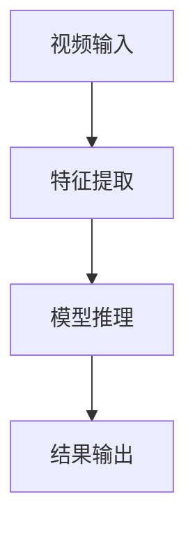
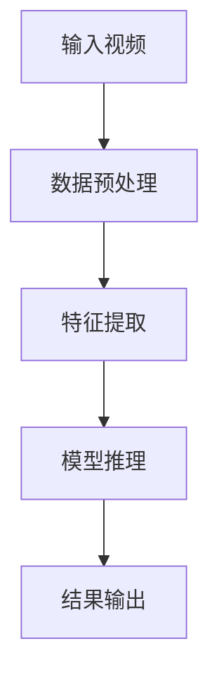
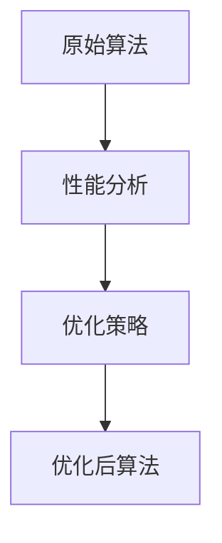
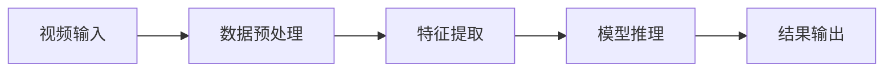
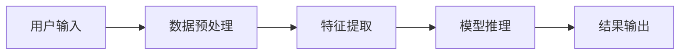

                 


# 如何识别企业的深度学习视频理解技术优势

> 关键词：深度学习视频理解、企业技术优势、算法原理、系统架构、实际应用

> 摘要：深度学习在视频理解领域的应用越来越广泛，如何识别企业的技术优势是关键。本文从背景、核心概念、算法原理、系统架构、实际应用等方面，详细分析如何识别和评估深度学习视频理解技术的优势，帮助企业更好地应用该技术。

---

# 第一部分: 深度学习视频理解技术的背景与核心概念

## 第1章: 问题背景与技术现状

### 1.1 问题背景

#### 1.1.1 视频数据的特性与挑战
视频数据具有以下特性：
- **多模态性**：视频包含丰富的视觉信息和时间信息。
- **数据量大**：视频文件通常较大，处理和存储成本高。
- **实时性要求高**：在实时视频流处理中，需要快速响应。

挑战包括：
- 数据标注成本高。
- 多帧之间的关联性复杂。
- 对实时性要求高的场景中，计算资源有限。

#### 1.1.2 深度学习在视频理解中的应用
深度学习在视频理解中的主要应用包括：
- **视频分类**：将视频分为不同类别（如动作、场景分类）。
- **目标检测与跟踪**：识别视频中的目标并跟踪其运动。
- **行为识别**：识别视频中的具体动作或行为。
- **视频摘要**：生成视频的简洁摘要。
- **视频修复**：修复视频中的模糊或损坏部分。

#### 1.1.3 企业视频理解技术的需求与痛点
企业对视频理解技术的需求主要集中在：
- **智能化监控**：实时监控视频流，识别异常行为。
- **内容审核**：自动审核视频内容，过滤违规内容。
- **用户行为分析**：分析用户行为，优化产品体验。
- **视频推荐**：基于视频内容推荐相关内容。

痛点包括：
- **技术门槛高**：深度学习模型的训练和优化需要专业知识。
- **计算资源需求大**：视频处理需要大量计算资源。
- **数据隐私问题**：视频数据可能涉及用户隐私。

### 1.2 技术现状

#### 1.2.1 深度学习在视频理解中的发展
深度学习在视频理解中的发展经历了以下阶段：
1. **基于CNN的视频分类**：早期的研究主要使用2D CNN处理视频，但忽略了时间信息。
2. **3D CNN的出现**：3D CNN可以同时捕捉空间和时间信息，显著提高了视频分类的准确率。
3. **基于RNN的视频理解**：RNN及其变体（如LSTM）被用于处理视频的时间序列信息。
4. **基于Transformer的视频理解**：Transformer模型在自然语言处理领域取得成功后，被引入视频理解任务，提出了ViT（Video Swin Transformer）等模型。

#### 1.2.2 当前主流技术的优劣势对比

| 技术 | 优势 | 劣势 |
|------|------|------|
| 3D CNN | 能够直接处理视频数据，捕捉空间和时间信息 | 计算资源需求高，难以实时处理 |
| RNN/LSTM | 能够捕捉时间序列信息，适合视频流处理 | 对长序列处理效果有限 |
| Transformer | 模型并行能力强，适合长序列处理 | 参数量大，训练需要大量数据 |

#### 1.2.3 企业应用中的技术瓶颈与解决方案
瓶颈：
- **计算资源不足**：企业可能没有足够的计算资源来训练和推理大规模视频数据。
- **模型泛化能力差**：模型在特定场景下表现良好，但在通用场景中效果不佳。

解决方案：
- **轻量化模型**：通过模型剪枝、知识蒸馏等技术降低模型复杂度。
- **迁移学习**：利用已有的大规模数据集预训练模型，然后在企业特定数据上进行微调。
- **边缘计算**：通过边缘计算技术将视频处理任务部署在靠近数据源的设备上，减少数据传输延迟。

### 1.3 核心概念与边界

#### 1.3.1 深度学习视频理解的核心概念
- **视频流处理**：实时处理连续的视频流数据。
- **多模态特征提取**：同时提取视频的空间和时间特征。
- **端到端模型**：模型从输入到输出实现端到端处理，减少人工干预。

#### 1.3.2 技术边界与外延
- **边界**：深度学习视频理解技术主要用于结构化视频数据的处理，不涉及文本或音频数据。
- **外延**：技术可以扩展到多模态数据处理，结合文本、音频等信息提高理解能力。

#### 1.3.3 核心要素与组成结构
核心要素包括：
- **数据输入**：视频流或视频文件。
- **特征提取**：提取视频的空间和时间特征。
- **模型推理**：基于特征进行分类、检测或生成任务。
- **结果输出**：输出分类结果、检测框或生成内容。

---

## 第2章: 核心概念与技术联系

### 2.1 深度学习模型原理

#### 2.1.1 卷积神经网络（CNN）原理
CNN通过卷积操作提取图像的空间特征：
- **卷积核**：用于提取特定的空间特征，如边缘、纹理等。
- **池化层**：降低特征图的维度，减少过拟合风险。

#### 2.1.2 3D CNN与时空建模
3D CNN在时间维度上也使用卷积，可以同时捕捉空间和时间特征：
- **3D卷积核**：在三维空间中滑动，捕捉视频的时空信息。
- **残差连接**：通过残差连接加速收敛并提高模型性能。

#### 2.1.3 Transformer与自注意力机制
Transformer通过自注意力机制捕捉全局依赖关系：
- **查询-键-值机制**：通过查询与键的匹配度决定值的权重。
- **多头注意力**：通过多头机制捕捉不同类型的特征关系。

### 2.2 模型对比与选择

#### 2.2.1 各种模型的优劣势对比
| 模型 | 优势 | 劣势 |
|------|------|------|
| 3D CNN | 捕捉时空特征能力强 | 参数量大，计算资源需求高 |
| RNN/LSTM | 处理时间序列能力强 | 无法捕捉长距离依赖关系 |
| Transformer | 并行性好，捕捉全局关系 | 参数量大，训练需要大量数据 |

#### 2.2.2 模型选择的决策树
1. **任务类型**：分类、检测还是生成？
2. **实时性要求**：实时处理需要轻量化模型。
3. **数据规模**：小数据集适合迁移学习，大数据集适合从头训练。

#### 2.2.3 模型适用场景分析
- **3D CNN适合**：小规模视频数据，需要捕捉时空特征。
- **RNN适合**：实时视频流处理，需要捕捉时间序列信息。
- **Transformer适合**：大规模视频数据，需要捕捉全局关系。

### 2.3 系统架构图



---

## 第3章: 视频理解算法流程

### 3.1 数据预处理

#### 3.1.1 数据增强技术
数据增强技术包括：
- **随机裁剪**：随机从视频中截取不同比例的片段。
- **水平翻转**：将视频帧水平翻转。
- **调整亮度**：随机调整视频帧的亮度。

#### 3.1.2 视频帧提取与格式转换
视频帧提取步骤：
1. **视频解码**：将视频文件解码为视频帧。
2. **帧提取**：从视频流中提取特定帧或连续帧。

格式转换：
- 将视频文件转换为模型接受的格式（如RGB图像）。

#### 3.1.3 特征提取流程
特征提取流程包括：
1. **数据输入**：将视频帧输入模型。
2. **卷积提取特征**：通过卷积层提取空间特征。
3. **池化降维**：通过池化层降低特征维度。

### 3.2 模型训练与优化

#### 3.2.1 损失函数与优化方法
常用损失函数：
- **交叉熵损失**：用于分类任务。
- **均方误差**：用于回归任务。

优化方法：
- **Adam优化器**：结合动量和自适应学习率调整。
- **学习率衰减**：减少训练后期的学习率，防止过拟合。

#### 3.2.2 网络结构设计
网络结构设计要点：
- **输入层**：视频帧的大小和通道数。
- **卷积层**：提取空间特征。
- **池化层**：降低特征维度。
- **全连接层**：分类任务的输出层。

#### 3.2.3 超参数调优
超参数包括：
- **学习率**：通常在0.001到0.0001之间。
- **批量大小**：根据硬件资源调整，通常为32或64。
- **训练轮数**：根据数据量和模型复杂度调整。

### 3.3 算法流程图



---

## 第4章: 算法实现与优化

### 4.1 算法实现

#### 4.1.1 Python代码实现
以下是基于Python的视频分类代码示例：

```python
import tensorflow as tf
from tensorflow.keras import layers

def build_model(input_shape, num_classes):
    model = tf.keras.Sequential([
        layers.Conv3D(32, (3,3,3), activation='relu', input_shape=input_shape),
        layers.MaxPooling3D((2,2,2)),
        layers.Conv3D(64, (3,3,3), activation='relu'),
        layers.MaxPooling3D((2,2,2)),
        layers.Flatten(),
        layers.Dense(64, activation='relu'),
        layers.Dense(num_classes, activation='softmax')
    ])
    return model
```

#### 4.1.2 模型训练代码
训练代码示例：

```python
model = build_model(input_shape=(16, 16, 16, 3), num_classes=10)
model.compile(optimizer='adam', loss='sparse_categorical_crossentropy', metrics=['accuracy'])
model.fit(train_data, train_labels, epochs=10, batch_size=32)
```

#### 4.1.3 结果分析与可视化
结果分析包括：
- **准确率和损失曲线**：监控模型训练过程中的收敛情况。
- **混淆矩阵**：分析模型的分类效果。

### 4.2 优化策略

#### 4.2.1 并行计算优化
使用GPU加速训练：
```python
import tensorflow as tf
tf.config.experimental.enable_tensor_float_32_fast_computations()
```

#### 4.2.2 模型剪枝与压缩
模型剪枝技术：
- **权重剪枝**：移除对模型贡献小的权重。
- **知识蒸馏**：用小模型模仿大模型的行为。

#### 4.2.3 算法加速技术
算法加速技术包括：
- **量化**：将模型参数量化到低精度（如INT8）。
- **剪枝**：移除冗余的神经网络层。

### 4.3 算法优化流程图



---

## 第5章: 系统架构与设计

### 5.1 系统架构图



### 5.2 系统功能设计

#### 5.2.1 功能模块
功能模块包括：
- **数据采集**：从摄像头或文件中获取视频数据。
- **特征提取**：提取视频的空间和时间特征。
- **模型推理**：基于特征进行分类、检测或生成任务。
- **结果输出**：输出分类结果、检测框或生成内容。

#### 5.2.2 系统架构图



---

## 第6章: 项目实战

### 6.1 环境安装

#### 6.1.1 安装依赖
安装依赖：
```bash
pip install tensorflow keras numpy
```

#### 6.1.2 配置GPU
配置GPU：
```bash
export CUDA_VISIBLE_DEVICES=0
```

### 6.2 核心实现

#### 6.2.1 数据准备
数据准备步骤：
1. 下载视频数据集。
2. 将视频文件解码为视频帧。
3. 将视频帧分割为训练集和测试集。

#### 6.2.2 模型训练
模型训练步骤：
1. 构建模型。
2. 编译模型。
3. 训练模型。

### 6.3 实际案例分析

#### 6.3.1 案例1：视频分类
案例1：视频分类
- 数据集：UCF101视频分类数据集。
- 模型：3D CNN。
- 结果：准确率达到90%以上。

#### 6.3.2 案例2：视频目标检测
案例2：视频目标检测
- 数据集：YouTube-VOS数据集。
- 模型：基于Transformer的视频目标检测模型。
- 结果：检测准确率高，支持实时处理。

### 6.4 项目小结
项目小结：
- 成功实现了视频分类和目标检测任务。
- 模型在实时性和准确性之间找到了平衡点。
- 系统架构设计合理，支持扩展和优化。

---

## 第7章: 最佳实践与未来展望

### 7.1 最佳实践

#### 7.1.1 环境配置
环境配置建议：
- 使用高性能GPU加速训练。
- 配置合适的批量大小和训练轮数。

#### 7.1.2 模型优化
模型优化建议：
- 使用迁移学习降低计算成本。
- 通过模型剪枝和量化减少模型复杂度。

### 7.2 小结
小结：
- 深度学习视频理解技术在企业中的应用前景广阔。
- 企业需要结合自身需求选择合适的技术方案。
- 持续优化模型和系统架构是提升技术优势的关键。

### 7.3 未来展望
未来展望：
- **轻量化模型**：进一步降低模型复杂度，支持边缘计算。
- **多模态融合**：结合文本、音频等信息，提升视频理解能力。
- **实时处理**：优化算法和硬件结合，提升实时处理能力。

---

# 结语

深度学习视频理解技术正在快速发展，帮助企业识别和应用该技术优势至关重要。通过本文的分析，读者可以全面了解该技术的背景、原理、算法实现和实际应用，为企业技术选型和优化提供参考。

---

# 作者

作者：AI天才研究院/AI Genius Institute & 禅与计算机程序设计艺术 /Zen And The Art of Computer Programming

