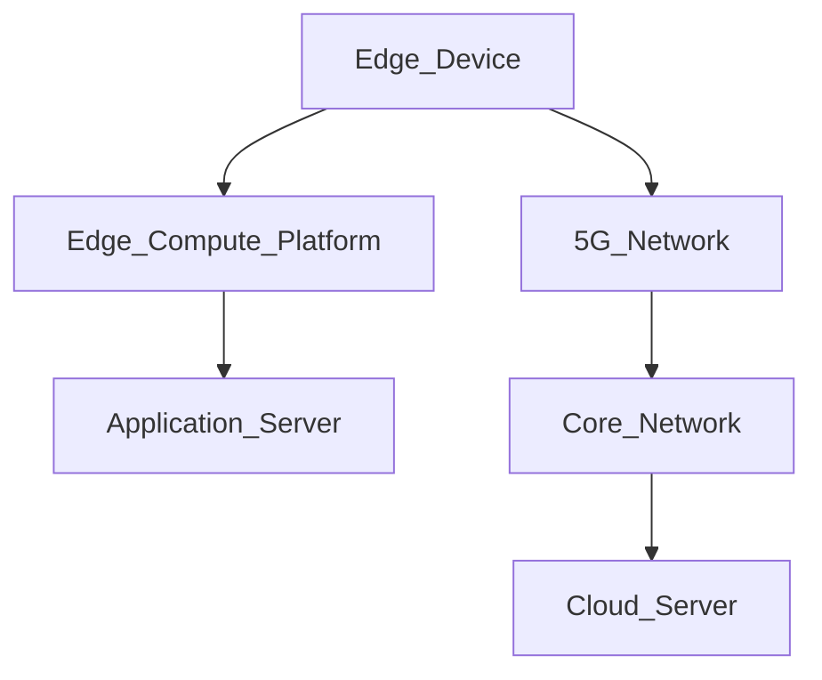
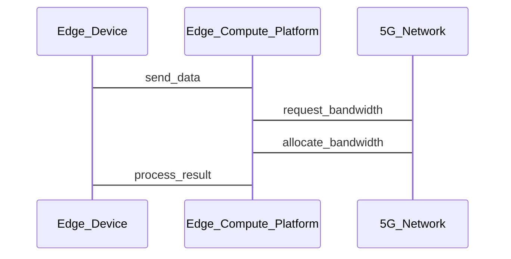

                 


# 如何识别企业的边缘计算5G优化优势

> 关键词：边缘计算、5G优化、企业优势、算法原理、系统架构

> 摘要：边缘计算和5G技术的结合为企业带来了更低的延迟、更高的带宽和更好的实时性。本文将从核心概念、算法原理、系统架构设计、项目实战等多个方面，详细分析边缘计算5G优化的优势，并提供具体的实现案例和注意事项。

---

## 第一部分: 引言

### 第1章: 什么是边缘计算与5G优化

#### 1.1 边缘计算的基本概念
- **1.1.1 边缘计算的定义**  
  边缘计算是一种分布式计算范式，将数据处理和存储从云端转移到靠近数据源的地方，减少数据传输的延迟。

- **1.1.2 边缘计算的核心特点**  
  - 分布式架构：数据在靠近源的设备上进行处理。  
  - 低延迟：减少数据传输到云端的时间。  
  - 高实时性：适用于需要实时反馈的应用场景。

- **1.1.3 边缘计算与云计算的区别**  
  边缘计算强调数据的局部处理，而云计算则是集中式处理。两者可以结合使用，形成混合计算模式。

#### 1.2 5G技术的核心优势
- **1.2.1 5G的定义与特点**  
  5G（第五代移动通信技术）具有高速度、低延迟、大连接容量和大规模设备连接能力。

- **1.2.2 5G与4G的区别**  
  - 高速：5G的理论速度是10 Gbps，而4G约为1 Gbps。  
  - 低延迟：5G的延迟低于1 ms，4G则为50 ms左右。  
  - 大连接：5G可以支持每平方公里100万个连接，而4G仅支持10万个连接。

- **1.2.3 5G的三大应用场景**  
  - 增强型移动宽带（eMBB）：如高清视频、虚拟现实。  
  - 大规模机器类通信（mMTC）：如物联网设备。  
  - 高可靠低时延通信（URLLC）：如工业自动化、自动驾驶。

#### 1.3 边缘计算与5G的结合
- **1.3.1 边缘计算与5G的关系**  
  边缘计算通过将数据处理靠近设备，减少对5G网络的依赖，从而提高效率。

- **1.3.2 边缘计算在5G中的作用**  
  边缘计算可以缓解5G核心网的负担，提高网络的灵活性和扩展性。

- **1.3.3 边缘计算与5G的协同优化**  
  通过边缘计算和5G的协同，可以实现更低的延迟、更高的带宽和更好的资源利用率。

---

## 第二部分: 企业边缘计算5G优化的优势分析

### 第2章: 企业边缘计算5G优化的核心概念

#### 2.1 边缘计算5G优化的背景
- **2.1.1 企业数字化转型的背景**  
  数字化转型要求企业提高数据处理效率，减少对云端的依赖。

- **2.1.2 边缘计算在企业中的应用**  
  - 工业自动化：实时监控生产线。  
  - 智慧城市：智能交通管理。  
  - 智慧医疗：实时数据传输。

- **2.1.3 5G技术对企业边缘计算的推动**  
  5G的低延迟和高带宽为边缘计算提供了更好的网络支持。

#### 2.2 边缘计算5G优化的边界与外延
- **2.2.1 边缘计算的边界**  
  边缘计算仅处理部分数据，不涉及云端的集中式处理。

- **2.2.2 5G优化的外延**  
  5G优化不仅包括网络性能的提升，还包括与边缘计算的协同优化。

- **2.2.3 边缘计算与5G优化的结合**  
  边缘计算和5G优化相互促进，形成一个高效的数据处理和传输体系。

#### 2.3 边缘计算5G优化的概念结构
- **2.3.1 边缘计算的层次结构**  
  边缘计算包括设备层、网络层和应用层。

- **2.3.2 5G优化的模块化结构**  
  5G优化包括射频优化、网络切片优化和QoS优化。

- **2.3.3 边缘计算与5G优化的协同结构**  
  边缘计算和5G优化在资源分配、数据传输和网络管理方面协同工作。

#### 2.4 边缘计算5G优化的核心要素
- **2.4.1 边缘设备**  
  边缘设备负责数据的采集和初步处理。

- **2.4.2 5G网络**  
  5G网络提供高速、低延迟的通信通道。

- **2.4.3 边缘计算平台**  
  边缘计算平台负责数据的处理和应用的运行。

---

## 第三部分: 边缘计算5G优化的核心优势

### 第3章: 边缘计算5G优化的核心优势

#### 3.1 低延迟与实时性
- **3.1.1 边缘计算的低延迟优势**  
  边缘计算将数据处理靠近设备，减少数据传输的距离，降低延迟。

- **3.1.2 5G网络的低延迟特性**  
  5G网络通过优化协议和减少处理时间，进一步降低延迟。

- **3.1.3 低延迟在企业中的应用**  
  - 工业自动化：实时监控生产线，快速响应异常情况。  
  - 自动驾驶：快速处理传感器数据，确保行车安全。

#### 3.2 高带宽与大连接
- **3.2.1 边缘计算的高带宽需求**  
  边缘计算需要处理大量的数据，对带宽要求高。

- **3.2.2 5G网络的大连接能力**  
  5G网络可以支持大规模设备的连接，满足边缘计算的需求。

- **3.2.3 高带宽在企业中的应用**  
  - 视频监控：高清视频传输和实时分析。  
  - 智能城市：大规模传感器数据的传输和处理。

#### 3.3 高可用性与可靠性
- **3.3.1 边缘计算的高可用性**  
  边缘计算通过分布式架构，提高系统的可用性。

- **3.3.2 5G网络的可靠性**  
  5G网络通过冗余设计和快速故障恢复，确保数据传输的可靠性。

- **3.3.3 高可用性在企业中的应用**  
  - 金融行业：实时交易处理，确保金融系统的稳定性。  
  - 医疗行业：实时患者数据传输，确保医疗设备的可靠性。

#### 3.4 边缘计算5G优化的成本优势
- **3.4.1 边缘计算的成本优势**  
  边缘计算通过减少对云端的依赖，降低数据传输和存储的成本。

- **3.4.2 5G网络的成本优化**  
  5G网络通过优化资源分配，降低网络建设和运维成本。

- **3.4.3 边缘计算5G优化的总成本分析**  
  边缘计算和5G优化的结合可以显著降低企业的整体IT成本。

---

## 第四部分: 边缘计算5G优化的算法原理

### 第4章: 边缘计算5G优化的算法原理

#### 4.1 边缘计算5G优化的核心算法
- **4.1.1 边缘计算中的资源分配算法**  
  资源分配算法通过动态调整设备和网络的资源分配，提高系统的效率。

- **4.1.2 5G网络中的切片技术**  
  网络切片技术将5G网络划分为多个虚拟网络，满足不同应用场景的需求。

- **4.1.3 边缘计算与5G协同优化算法**  
  协同优化算法通过实时调整边缘计算和5G网络的参数，实现资源的最优配置。

#### 4.2 边缘计算5G优化的数学模型
- **4.2.1 边缘计算资源分配模型**  
  $$ R_i = \frac{C_i}{D_i} $$
  其中，$R_i$ 表示第i个设备的资源利用率，$C_i$ 表示计算能力，$D_i$ 表示数据量。

- **4.2.2 5G网络切片模型**  
  $$ S_j = \frac{B_j}{N_j} $$
  其中，$S_j$ 表示第j个切片的带宽利用率，$B_j$ 表示总带宽，$N_j$ 表示切片数量。

- **4.2.3 边缘计算与5G协同优化模型**  
  $$ O_{total} = \sum_{i=1}^{n} O_i $$
  其中，$O_{total}$ 表示总优化目标，$O_i$ 表示第i个优化目标。

#### 4.3 边缘计算5G优化的公式推导
- **4.3.1 边缘计算资源分配公式**  
  通过优化资源分配，使得系统的整体延迟最小化。

- **4.3.2 5G网络切片公式**  
  通过动态调整切片参数，满足不同应用场景的需求。

- **4.3.3 边缘计算与5G协同优化公式**  
  通过联合优化边缘计算和5G网络的参数，实现资源的最优配置。

---

## 第五部分: 边缘计算5G优化的系统架构设计

### 第5章: 边缘计算5G优化的系统架构设计

#### 5.1 问题场景介绍
- **5.1.1 问题背景**  
  企业需要在工业自动化中实现低延迟、高带宽的数据传输。

- **5.1.2 问题描述**  
  传统云计算模式延迟高，无法满足实时性要求。

- **5.1.3 问题解决**  
  通过边缘计算和5G优化，实现低延迟、高带宽的数据处理。

#### 5.2 项目介绍
- **5.2.1 项目目标**  
  实现边缘计算与5G网络的协同优化。

- **5.2.2 项目范围**  
  包括边缘设备、5G网络和边缘计算平台的设计与实现。

#### 5.3 系统功能设计
- **5.3.1 系统功能模块**  
  - 数据采集模块：负责数据的采集和初步处理。  
  - 网络传输模块：负责数据的高速传输。  
  - 边缘计算模块：负责数据的处理和应用的运行。

- **5.3.2 领域模型设计（mermaid类图）**  
  ```mermaid
  classDiagram
  class Edge_Device {
    + ID: string
    + Data: string
    + send_data()
  }
  class Edge_Compute_Platform {
    + Resources: string
    + Process_Data(Edge_Device)
  }
  class 5G_Network {
    + Bandwidth: string
    + Latency: string
    + Connect(Edge_Device)
  }
  Edge_Device --> Edge_Compute_Platform: send_data
  Edge_Device --> 5G_Network: Connect
  Edge_Compute_Platform --> 5G_Network: Bandwidth
  ```

#### 5.4 系统架构设计（mermaid架构图）


#### 5.5 系统接口设计
- **5.5.1 边缘设备与边缘计算平台接口**  
  - 数据接口：数据采集和传输。  
  - 控制接口：设备管理和配置。

- **5.5.2 边缘计算平台与5G网络接口**  
  - 网络接口：带宽分配和网络切片配置。

#### 5.6 系统交互设计（mermaid序列图）


---

## 第六部分: 边缘计算5G优化的项目实战

### 第6章: 边缘计算5G优化的项目实战

#### 6.1 环境安装
- **6.1.1 硬件环境**  
  - 边缘设备：树莓派、嵌入式设备。  
  - 5G网络：支持5G的路由器或调制解调器。

- **6.1.2 软件环境**  
  - 边缘计算平台：Kubernetes、Docker。  
  - 5G网络管理：Open5GCore。

#### 6.2 系统核心实现源代码
- **6.2.1 边缘设备代码**
  ```python
  import serial
  import time

  ser = serial.Serial('COM3', 9600)
  while True:
      data = ser.readline().decode('utf-8')
      if data:
          print(f"Received data: {data}")
          # 发送数据到边缘计算平台
          send_to_platform(data)
      time.sleep(0.1)
  ```

- **6.2.2 边缘计算平台代码**
  ```python
  import socket

  def process_data(data):
      # 数据处理逻辑
      print(f"Processing data: {data}")

  def send_to_platform(data):
      with socket.socket(socket.AF_INET, socket.SOCK_DGRAM) as s:
          s.sendto(data.encode('utf-8'), ('localhost', 5000))

  if __name__ == '__main__':
      import sys
      data = sys.argv[1]
      process_data(data)
  ```

- **6.2.3 5G网络优化代码**
  ```python
  import threading

  def optimize_bandwidth():
      while True:
          # 动态调整带宽
          adjust_bandwidth()
          time.sleep(1)

  def adjust_bandwidth():
      # 根据当前负载调整带宽
      pass

  if __name__ == '__main__':
      threading.Thread(target=optimize_bandwidth).start()
  ```

#### 6.3 代码应用解读与分析
- **6.3.1 边缘设备代码解读**  
  边缘设备通过串口接收数据，并将其发送到边缘计算平台。

- **6.3.2 边缘计算平台代码解读**  
  边缘计算平台接收数据，进行处理，并通过UDP协议将结果发送回边缘设备。

- **6.3.3 5G网络优化代码解读**  
  通过多线程优化，动态调整网络带宽，确保数据传输的高效性。

#### 6.4 实际案例分析和详细讲解剖析
- **6.4.1 案例背景**  
  某企业需要在工业自动化中实现低延迟的数据处理。

- **6.4.2 案例实现**  
  - 边缘设备采集生产线数据。  
  - 边缘计算平台处理数据并发送指令。  
  - 5G网络优化带宽，确保数据传输的实时性。

- **6.4.3 案例结果**  
  生产线效率提升，延迟降低，系统稳定性提高。

#### 6.5 项目小结
- **6.5.1 项目总结**  
  边缘计算与5G优化的结合，显著提高了企业的数据处理效率。

- **6.5.2 经验总结**  
  - 硬件和网络的协同优化是关键。  
  - 数据的安全性和隐私保护需要重点关注。

---

## 第七部分: 总结与展望

### 第7章: 总结与展望

#### 7.1 核心内容总结
- 边缘计算与5G优化的结合，为企业带来了更低的延迟、更高的带宽和更好的实时性。
- 通过算法优化和系统架构设计，可以显著提高企业的数据处理效率。

#### 7.2 未来展望
- **7.2.1 技术发展**  
  - 更智能的边缘计算算法。  
  - 更高效的5G网络优化技术。

- **7.2.2 应用场景拓展**  
  - 更多行业的应用，如金融、教育、医疗。  
  - 边缘计算与人工智能的结合。

- **7.2.3 挑战与机遇**  
  - 技术的进一步成熟和普及。  
  - 数据安全和隐私保护的挑战。

---

## 附录

### 附录A: 术语表
- 边缘计算：将数据处理和存储从云端转移到靠近数据源的地方。  
- 5G优化：通过优化网络参数和协议，提高5G网络的性能。

### 附录B: 工具推荐
- 边缘计算平台：Kubernetes、Docker。  
- 5G网络管理：Open5GCore、Magma。

---

## 作者：AI天才研究院 & 禅与计算机程序设计艺术

---

以上是《如何识别企业的边缘计算5G优化优势》的技术博客文章的完整内容，涵盖了从核心概念到实际应用的各个方面，通过详细的分析和具体的案例，帮助读者系统地理解和应用边缘计算5G优化的优势。

