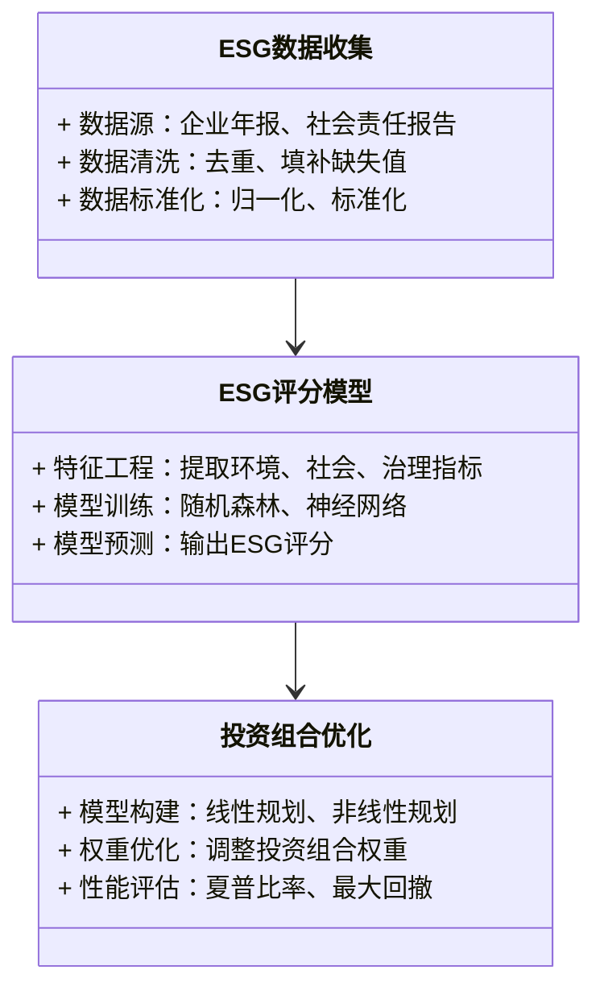

                 


# 巴菲特-芒格的ESG投资策略：平衡社会责任和财务回报

---

## 关键词

- ESG投资
- 巴菲特投资策略
- 芒格投资策略
- 财务回报
- 社会责任
- 可持续投资
- ESG评分模型

---

## 摘要

本文深入探讨了巴菲特和芒格的ESG投资策略，分析了如何在投资决策中平衡社会责任与财务回报。通过详细阐述ESG的核心概念、数学模型、系统架构及实际案例，本文为读者提供了全面的ESG投资策略解析，帮助投资者在追求收益的同时，实现可持续发展目标。

---

# 第一部分：巴菲特与芒格的ESG投资策略背景

## 第1章：ESG投资的背景与意义

### 1.1 ESG投资的定义与背景

#### 1.1.1 什么是ESG投资
ESG投资是一种通过评估企业环境、社会和治理表现来指导投资决策的投资策略。它强调企业在可持续发展方面的表现，包括环境保护、社会责任和公司治理等方面。

#### 1.1.2 ESG投资的起源与发展
ESG投资起源于20世纪60年代的环境运动，随着全球对可持续发展的关注增加，ESG投资逐渐成为主流。巴菲特和芒格作为价值投资的倡导者，也逐渐将ESG因素纳入其投资决策中。

#### 1.1.3 ESG投资的重要性
ESG投资不仅有助于推动社会进步和环境保护，还能帮助投资者规避风险、提升投资回报。通过关注企业的社会责任和治理结构，投资者可以更全面地评估企业的长期价值。

---

### 1.2 巴菲特与芒格的投资理念

#### 1.2.1 巴菲特的价值投资理论
巴菲特的价值投资理论强调购买具有持续竞争优势的企业，关注企业的内在价值和管理层素质。他认为，具备良好治理结构和社会责任感的企业更有可能实现长期成功。

#### 1.2.2 芒格的多元思维模型
芒格的多元思维模型强调跨学科思考，关注企业的微观和宏观环境。他主张通过分析企业的社会影响和环境表现，来评估其长期投资价值。

#### 1.2.3 巴菲特与芒格的ESG投资共识
尽管巴菲特和芒格的投资策略有所不同，但他们都认可ESG因素的重要性。他们认为，具备良好社会责任和环境表现的企业更有可能在长期实现稳定增长。

---

### 1.3 ESG与财务回报的平衡

#### 1.3.1 ESG与财务回报的关系
ESG投资并不意味着牺牲财务回报，相反，通过关注企业的可持续发展能力，ESG投资可以帮助投资者规避风险，实现更稳定的回报。

#### 1.3.2 如何平衡社会责任与财务回报
投资者可以通过筛选具备良好ESG表现的企业，构建多元化的投资组合，以实现社会责任与财务回报的平衡。

#### 1.3.3 ESG投资的长期价值
ESG投资的长期价值体现在企业的可持续发展能力上。通过关注ESG因素，投资者可以更好地规避政策风险、环境风险和社会风险，实现长期稳定的回报。

---

## 第2章：ESG投资的核心概念与框架

### 2.1 ESG的三重维度

#### 2.1.1 环境（E）维度
环境维度关注企业在环境保护方面的表现，包括能源消耗、碳排放、资源利用等方面。具备良好环境表现的企业更有可能实现长期发展。

#### 2.1.2 社会（S）维度
社会维度关注企业在社会责任方面的表现，包括员工福利、社区贡献、劳动权益等方面。具备良好社会责任的企业更受投资者青睐。

#### 2.1.3 治理（G）维度
治理维度关注企业的治理结构和管理层素质，包括董事会结构、高管薪酬、透明度等方面。良好的治理结构是企业长期成功的关键。

---

### 2.2 ESG投资的核心要素

#### 2.2.1 ESG评分体系
ESG评分体系通过量化企业的环境、社会和治理表现，帮助企业评估其ESG表现。常用的ESG评分体系包括Sustainalytics、MSCI和FTSE等。

#### 2.2.2 ESG数据来源
ESG数据来源包括企业年报、社会责任报告、第三方评级机构数据等。通过多源数据的整合，投资者可以更全面地评估企业的ESG表现。

#### 2.2.3 ESG风险与机会评估
通过分析企业的ESG风险和机会，投资者可以更好地评估其投资组合的潜在风险和收益。具备良好ESG表现的企业更有可能实现长期稳定发展。

---

### 2.3 巴菲特与芒格的ESG投资框架

#### 2.3.1 巴菲特的ESG投资策略
巴菲特的ESG投资策略注重企业的长期价值和治理结构，他认为具备良好治理结构和社会责任感的企业更有可能实现长期成功。

#### 2.3.2 芒格的ESG投资策略
芒格的ESG投资策略注重企业的微观和宏观环境，关注企业的社会影响和环境表现，通过多元思维模型评估企业的长期投资价值。

#### 2.3.3 两者的异同点
尽管巴菲特和芒格的ESG投资策略有所不同，但他们都强调企业的社会责任和治理结构，注重企业的长期价值。

---

# 第二部分：ESG投资策略的数学模型与算法

## 第3章：ESG评分模型

### 3.1 ESG评分模型的构建

#### 3.1.1 数据收集与预处理
ESG评分模型的构建需要收集企业的环境、社会和治理数据，并进行清洗和标准化处理。

#### 3.1.2 指标权重的确定
通过分析各ESG指标的重要性，确定各指标的权重。常用的权重确定方法包括主成分分析和层次分析法。

#### 3.1.3 评分算法的选择
常用的评分算法包括线性回归、决策树和随机森林等。根据数据特点和模型复杂度选择合适的评分算法。

---

### 3.2 基于机器学习的ESG评分模型

#### 3.2.1 数据特征提取
通过特征工程提取对企业ESG表现有重要影响的特征，例如碳排放强度、员工满意度等。

#### 3.2.2 模型训练与验证
使用训练数据训练模型，并通过交叉验证评估模型的性能。常用的模型包括支持向量机和神经网络等。

#### 3.2.3 模型评估与优化
通过评估指标（如准确率、召回率和F1值）优化模型性能。常用的优化方法包括参数调优和特征选择。

---

### 3.3 ESG评分模型的实现

#### 3.3.1 Python代码实现
```python
import pandas as pd
from sklearn.ensemble import RandomForestClassifier
from sklearn.metrics import accuracy_score

# 加载数据
data = pd.read_csv('esg_data.csv')

# 特征工程
features = data[['环境表现', '社会表现', '治理表现']]
target = data['ESG评分']

# 模型训练
model = RandomForestClassifier()
model.fit(features, target)

# 模型预测
predictions = model.predict(features)
print("准确率:", accuracy_score(target, predictions))
```

#### 3.3.2 模型结果分析
通过分析模型输出，评估企业的ESG表现，并将其与实际数据进行对比，验证模型的准确性。

#### 3.3.3 模型的实际应用
将模型应用于实际投资决策中，通过ESG评分筛选具备良好表现的企业，构建投资组合。

---

## 第4章：ESG投资组合优化模型

### 4.1 投资组合优化的数学模型

#### 4.1.1 线性规划模型
$$ \text{目标函数：} \min w^T \Sigma w $$
$$ \text{约束条件：} \sum w_i = 1, w_i \geq 0 $$

#### 4.1.2 非线性规划模型
$$ \text{目标函数：} \min w^T \Sigma w - \lambda \mu^T w $$
$$ \text{约束条件：} \sum w_i = 1, w_i \geq 0 $$

#### 4.1.3 风险调整后的回报模型
$$ \text{目标函数：} \max \mu^T w - \lambda w^T \Sigma w $$
$$ \text{约束条件：} \sum w_i = 1, w_i \geq 0 $$

---

### 4.2 基于ESG评分的投资组合

#### 4.2.1 投资组合构建
通过ESG评分筛选具备良好表现的企业，构建多元化的投资组合，以平衡社会责任与财务回报。

#### 4.2.2 投资组合优化
通过优化模型调整投资组合的权重，降低风险并提升回报。常用的优化方法包括均值-方差优化和风险平滑优化。

#### 4.2.3 投资组合评估
通过回测和风险指标（如夏普比率和最大回撤）评估投资组合的性能，验证其有效性和稳定性。

---

# 第三部分：系统分析与架构设计方案

## 第5章：ESG投资系统的架构设计

### 5.1 问题场景介绍
本部分介绍ESG投资系统的目标和应用场景，包括数据收集、模型构建和投资组合优化等模块。

### 5.2 系统功能设计

#### 5.2.1 领域模型（Mermaid 类图）


#### 5.2.2 系统架构设计（Mermaid 架构图）


#### 5.2.3 系统接口设计
定义系统各模块之间的接口，包括数据输入输出格式和API接口设计。

#### 5.2.4 系统交互流程（Mermaid 序列图）
```mermaid
sequenceDiagram
    数据源 -> 数据处理模块：提供ESG数据
    数据处理模块 -> 模型构建模块：清洗和标准化数据
    模型构建模块 -> 投资组合优化模块：提供ESG评分
    投资组合优化模块 -> 结果展示模块：输出优化结果
```

---

## 第6章：项目实战

### 6.1 环境安装

#### 6.1.1 安装Python和相关库
安装Python和必要的库（如Pandas、Scikit-learn和Plotly）。

#### 6.1.2 数据收集
收集企业的环境、社会和治理数据，构建ESG数据集。

### 6.2 系统核心实现

#### 6.2.1 ESG评分模型实现
实现ESG评分模型，包括数据预处理、特征工程和模型训练。

#### 6.2.2 投资组合优化实现
实现投资组合优化模型，包括模型构建、权重优化和结果展示。

### 6.3 代码实现与解读

#### 6.3.1 ESG评分模型代码
```python
import pandas as pd
from sklearn.ensemble import RandomForestRegressor
from sklearn.metrics import mean_squared_error

# 数据加载
data = pd.read_csv('esg_data.csv')

# 特征工程
features = data[['环境表现', '社会表现', '治理表现']]
target = data['ESG评分']

# 模型训练
model = RandomForestRegressor()
model.fit(features, target)

# 预测结果
predictions = model.predict(features)
print("均方误差:", mean_squared_error(target, predictions))
```

#### 6.3.2 投资组合优化代码
```python
import numpy as np
from scipy.optimize import minimize

# 定义目标函数
def objective(weights, returns, covariance):
    return np.dot(weights.T, np.dot(covariance, weights)) * 0.5

# 定义约束条件
def constraint(weights):
    return np.sum(weights) - 1

# 最优化问题
initial_guess = np.array([1.0] * len(returns)) / len(returns)
result = minimize(objective, initial_guess, args=(returns, covariance), method='SLSQP', constraints={'type': 'eq', 'fun': constraint})

# 输出结果
optimal_weights = result.x
print("最优权重:", optimal_weights)
```

### 6.4 实际案例分析

#### 6.4.1 案例背景
选择一个具体的行业或企业，分析其ESG表现和投资价值。

#### 6.4.2 数据分析与模型应用
通过模型评估企业的ESG表现，并将其纳入投资组合进行优化。

#### 6.4.3 案例结果与解读
解读模型输出结果，分析投资组合的优化效果和潜在风险。

---

## 第7章：最佳实践与小结

### 7.1 小结

#### 7.1.1 核心内容总结
总结本文的核心内容，包括ESG投资的背景、核心概念、数学模型和系统架构。

#### 7.1.2 投资策略总结
总结巴菲特和芒格的ESG投资策略，强调平衡社会责任与财务回报的重要性。

### 7.2 注意事项

#### 7.2.1 数据质量
强调数据质量的重要性，建议投资者使用可靠的ESG数据源。

#### 7.2.2 模型选择
建议根据具体场景选择合适的模型和算法，避免过度复杂化。

#### 7.2.3 风险管理
提醒投资者关注模型的局限性和潜在风险，合理管理投资组合。

### 7.3 拓展阅读

#### 7.3.1 ESG投资相关书籍
推荐几本关于ESG投资的经典书籍，供读者深入学习。

#### 7.3.2 相关研究论文
推荐几篇关于ESG投资的学术论文，帮助读者了解最新的研究成果。

#### 7.3.3 行业报告与白皮书
推荐几份权威机构发布的ESG投资报告，帮助读者了解行业动态。

---

## 作者信息

作者：AI天才研究院/AI Genius Institute & 禅与计算机程序设计艺术/Zen And The Art of Computer Programming

---

感谢您的阅读！希望本文能为您提供有价值的内容和启发。如需进一步探讨，请随时联系作者。

