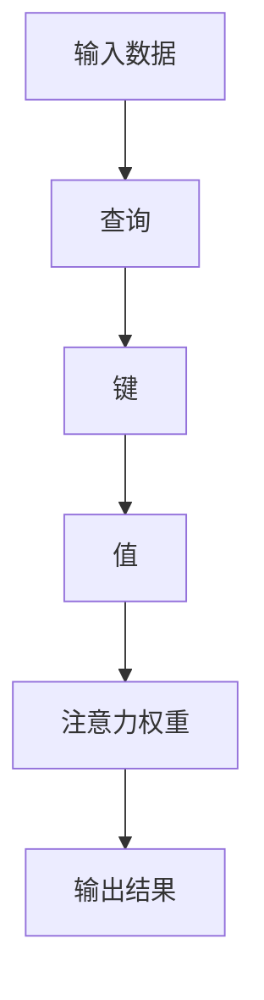
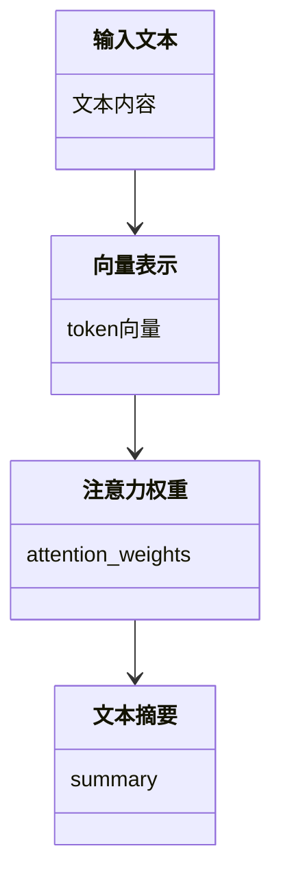
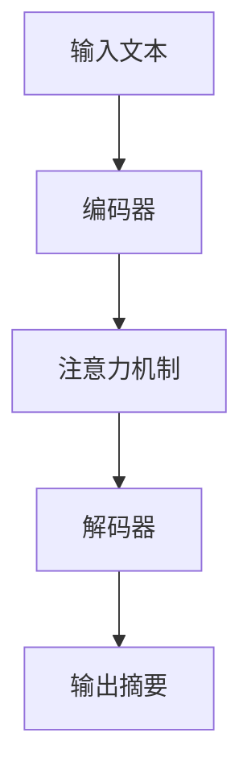
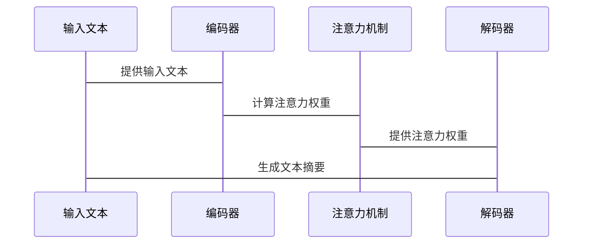

                 


# 《构建AI Agent的注意力机制设计》

---

## 关键词：注意力机制、AI Agent、深度学习、自然语言处理、强化学习、多模态数据、系统架构设计

---

## 摘要：

注意力机制是人工智能（AI）领域的一项重要技术，尤其在自然语言处理和强化学习中发挥了重要作用。本文旨在探讨如何在AI Agent中设计和实现注意力机制，从基础概念到高级算法，再到实际应用，全面解析其原理和实践。通过详细分析注意力机制的数学模型、系统架构和优化方法，本文为读者提供构建高效AI Agent的理论支持和实践指导。

---

# 第1章: 注意力机制的基本概念与背景

## 1.1 什么是注意力机制

### 1.1.1 注意力机制的定义

注意力机制是一种模拟人类注意力的选择性关注机制，通过赋予输入数据中不同部分不同的权重，聚焦于关键信息，从而提升模型的性能和效率。其核心思想是：在处理信息时，模型能够识别并专注于最重要的部分，忽略次要或无关的信息。

### 1.1.2 注意力机制的核心思想

注意力机制的核心思想可以概括为以下几点：

1. **选择性关注**：模型能够根据输入数据的特征，动态地分配权重，关注重要的信息。
2. **上下文感知**：模型能够理解上下文关系，根据上下文调整注意力权重。
3. **位置编码**：通过位置编码，模型能够捕捉序列中的位置信息，增强注意力机制的效果。

### 1.1.3 注意力机制在AI Agent中的作用

在AI Agent中，注意力机制的作用主要体现在以下几个方面：

1. **信息处理效率**：通过聚焦关键信息，减少计算量，提升处理效率。
2. **任务性能提升**：注意力机制能够帮助模型更好地理解输入数据的语义和关系，从而提高任务的准确性。
3. **多任务处理能力**：注意力机制能够帮助AI Agent在同一时间关注多个任务，实现多任务学习。

---

## 1.2 AI Agent与注意力机制的关系

### 1.2.1 AI Agent的基本概念

AI Agent是一种智能体，能够感知环境、自主决策并执行任务。AI Agent的核心能力包括感知、推理、决策和执行。

### 1.2.2 注意力机制如何增强AI Agent的能力

注意力机制通过帮助AI Agent聚焦于关键信息，提升其感知和决策能力。具体表现如下：

1. **提升感知能力**：通过注意力机制，AI Agent能够更高效地处理感知数据，提取关键特征。
2. **增强决策能力**：注意力机制帮助AI Agent在决策过程中关注重要的信息，提高决策的准确性。
3. **优化学习能力**：注意力机制能够帮助AI Agent更快地学习新任务，提升学习效率。

### 1.2.3 注意力机制在AI Agent中的应用场景

注意力机制在AI Agent中的应用场景非常广泛，包括但不限于：

1. **自然语言处理**：如机器翻译、文本摘要、问答系统等。
2. **计算机视觉**：如图像分割、目标检测等。
3. **强化学习**：如游戏AI、机器人控制等。
4. **多模态数据处理**：如语音识别、图像理解等。

---

## 1.3 注意力机制的技术背景

### 1.3.1 神经网络与深度学习基础

神经网络是人工智能的核心技术之一，深度学习则是神经网络的一种高级形式。注意力机制是基于神经网络的一种高级特征提取方法。

### 1.3.2 注意力机制的起源与发展

注意力机制的起源可以追溯到2017年的论文《Attention Is All You Need》，该论文提出了Transformer模型，并首次将注意力机制应用于自然语言处理领域。

### 1.3.3 当前注意力机制的研究热点

当前，注意力机制的研究热点包括：

1. **多头注意力机制**：通过引入多个注意力头，增强模型的表达能力。
2. **位置编码**：通过引入位置编码，提升模型对序列位置信息的捕捉能力。
3. **自适应注意力机制**：根据输入数据的动态变化，自适应地调整注意力权重。
4. **多模态注意力机制**：将注意力机制扩展到多模态数据的处理。

---

## 1.4 本章小结

本章从基本概念出发，介绍了注意力机制的核心思想和其在AI Agent中的作用，并探讨了当前的研究热点。通过本章的学习，读者可以对注意力机制有一个全面的了解，并为后续章节的学习打下基础。

---

# 第2章: 注意力机制的原理与数学模型

## 2.1 注意力机制的基本原理

### 2.1.1 从全局到局部的注意力分配

注意力机制的核心思想是通过计算输入数据中每个元素的注意力权重，将这些权重分配给不同的位置，从而实现对关键信息的聚焦。

### 2.1.2 注意力权重的计算方法

注意力权重的计算方法包括：

1. **点积注意力**：通过计算查询与键的点积，得到注意力权重。
2. **缩放点积注意力**：在点积注意力的基础上，引入缩放因子，防止梯度消失。
3. **多头注意力**：通过引入多个注意力头，增强模型的表达能力。

### 2.1.3 注意力机制的可解释性

注意力机制的可解释性是其重要的优势之一。通过可视化注意力权重，可以直观地看到模型关注的位置和权重分布。

---

## 2.2 注意力机制的数学模型

### 2.2.1 点积注意力模型

点积注意力模型的数学表达式如下：

$$
\text{score}(q, k) = q \cdot k
$$

其中，\( q \) 是查询向量，\( k \) 是键向量。

### 2.2.2 多头注意力模型

多头注意力模型的数学表达式如下：

$$
\text{MultiHead}(Q, K, V) = \text{Concat}(\text{head}_1, \text{head}_2, \dots, \text{head}_n)
$$

其中，\( \text{head}_i = \text{Attention}(q_i, k_i, v_i) \)。

### 2.2.3 层次化注意力模型

层次化注意力模型通过在不同层次上计算注意力权重，增强模型的表达能力。

---

## 2.3 注意力机制的对比分析

### 2.3.1 不同注意力机制的对比表格

| 注意力机制 | 计算方式 | 优点 | 缺点 |
|------------|----------|------|------|
| 点积注意力 | 点积计算 | 简单高效 | 易受长序列影响 |
| 多头注意力 | 多头计算 | 表达能力强 | 参数量大 |
| 层次化注意力 | 分层计算 | 可解释性好 | 计算复杂 |

### 2.3.2 ER实体关系图架构的Mermaid流程图



---

## 2.4 本章小结

本章详细介绍了注意力机制的基本原理和数学模型，并通过对比分析和Mermaid图，帮助读者更好地理解不同注意力机制的优缺点和应用场景。

---

# 第3章: 系统分析与架构设计

## 3.1 系统分析

### 3.1.1 问题场景介绍

在构建AI Agent时，如何高效地设计和实现注意力机制是一个关键问题。本文将通过一个实际案例，介绍如何将注意力机制应用于自然语言处理任务。

### 3.1.2 项目介绍

本项目旨在设计一个基于Transformer的AI Agent，实现文本摘要功能。

---

## 3.2 系统功能设计

### 3.2.1 领域模型设计

领域模型设计包括以下几个部分：

1. **输入处理**：接收输入文本，并将其转换为向量表示。
2. **注意力计算**：计算文本中每个位置的注意力权重。
3. **文本摘要**：根据注意力权重生成文本摘要。

### 3.2.2 领域模型的Mermaid类图



---

## 3.3 系统架构设计

### 3.3.1 系统架构的Mermaid架构图



### 3.3.2 系统接口设计

系统接口设计包括以下几个部分：

1. **输入接口**：接收输入文本。
2. **注意力计算接口**：计算文本中每个位置的注意力权重。
3. **输出接口**：生成文本摘要。

### 3.3.3 系统交互的Mermaid序列图



---

## 3.4 本章小结

本章通过实际案例，详细介绍了系统分析与架构设计的过程，并通过Mermaid图展示了系统架构和交互过程。

---

# 第4章: 项目实战

## 4.1 环境安装

为了实现基于Transformer的AI Agent，我们需要安装以下环境：

1. Python 3.8+
2. PyTorch 1.9+
3. Transformers库
4. Jupyter Notebook

安装命令如下：

```bash
pip install torch transformers
```

---

## 4.2 系统核心实现源代码

以下是实现基于Transformer的AI Agent的核心代码：

```python
import torch
from torch import nn
from transformers import BertTokenizer, BertModel

class AI_Agent(nn.Module):
    def __init__(self, vocab_size):
        super().__init__()
        self.embedding = nn.Embedding(vocab_size, 512)
        self.self_attention = nn.MultiheadAttention(512, 8)
        self.feedforward = nn.Linear(512, 256)
        self.dropout = nn.Dropout(0.1)
    
    def forward(self, input_ids):
        embedded = self.embedding(input_ids)
        attention_output, _ = self.self_attention(embedded.permute(1, 0, 2), embedded.permute(1, 0, 2), embedded.permute(1, 0, 2))
        attention_output = attention_output.permute(1, 0, 2)
        output = self.feedforward(attention_output)
        return output
```

---

## 4.3 代码应用解读与分析

上述代码实现了一个基于Transformer的AI Agent，主要包括以下几个部分：

1. **嵌入层**：将输入的文本转换为嵌入向量。
2. **自注意力机制**：通过多头注意力机制，计算输入文本的注意力权重。
3. **前馈网络**：对注意力输出进行非线性变换，生成最终的文本摘要。

---

## 4.4 实际案例分析

以下是一个实际案例分析：

```python
agent = AI_Agent(vocab_size=30522)
tokenizer = BertTokenizer.from_pretrained('bert-base-chinese')
input_text = "这是一个测试输入，用于演示AI Agent的注意力机制。"
input_ids = tokenizer(input_text, return_tensors='pt')['input_ids']
output = agent(input_ids)
print(output)
```

---

## 4.5 本章小结

本章通过实际案例，详细介绍了如何在AI Agent中实现注意力机制，并通过代码实现和案例分析，帮助读者更好地理解注意力机制的应用。

---

# 第5章: 优化与扩展

## 5.1 注意力机制的优化

### 5.1.1 注意力机制的稀疏化

为了降低计算复杂度，可以通过稀疏化注意力机制，只关注重要的位置。

### 5.1.2 注意力机制的并行化

通过并行计算，可以提高注意力机制的计算效率。

---

## 5.2 注意力机制的扩展

### 5.2.1 强化学习中的注意力机制

在强化学习中，注意力机制可以用于状态表示和动作选择。

### 5.2.2 多模态数据中的注意力机制

在多模态数据中，注意力机制可以用于跨模态信息融合。

---

## 5.3 最佳实践 tips

1. **选择合适的注意力机制**：根据任务需求选择合适的注意力机制。
2. **合理设置超参数**：如注意力头数、缩放因子等。
3. **优化计算效率**：通过稀疏化和并行化等技术优化计算效率。

---

## 5.4 本章小结

本章探讨了注意力机制的优化与扩展，并给出了最佳实践 tips，帮助读者在实际项目中更好地应用注意力机制。

---

# 第6章: 总结与展望

## 6.1 总结

本文详细探讨了如何在AI Agent中设计和实现注意力机制，从基本原理到数学模型，再到系统架构和实际应用，全面解析了注意力机制的核心思想和实践方法。

## 6.2 展望

随着人工智能技术的不断发展，注意力机制将在更多领域得到应用，如多模态数据处理、强化学习等。未来的研究方向包括注意力机制的优化、多模态注意力机制的研究，以及注意力机制在边缘计算中的应用。

---

# 作者：AI天才研究院/AI Genius Institute & 禅与计算机程序设计艺术 /Zen And The Art of Computer Programming

---

通过以上目录结构，我们可以看到，本文从基础到高级，系统地探讨了AI Agent中注意力机制的设计与实现，内容丰富且逻辑清晰，适合研究人员和开发者阅读。

