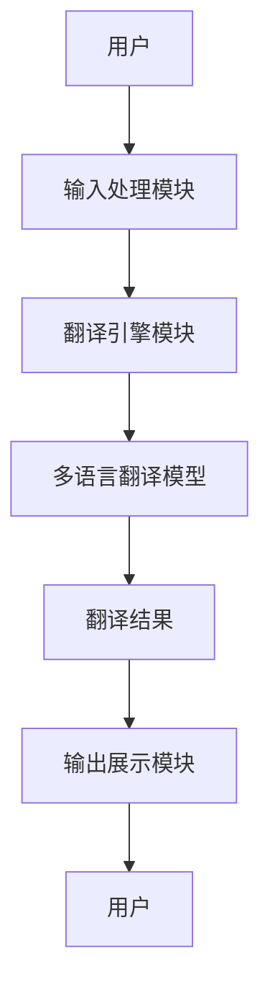
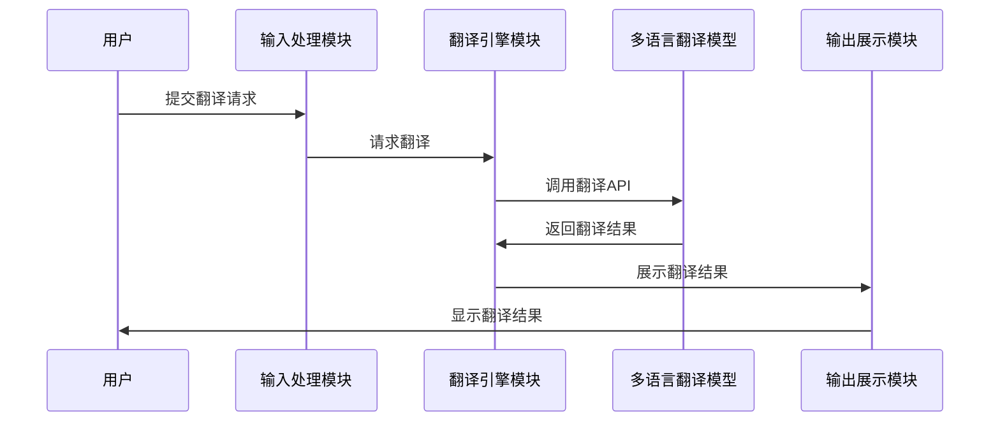

                 


# 构建多语言翻译AI Agent

> 关键词：多语言翻译，AI Agent，机器学习，自然语言处理，神经机器翻译

> 摘要：本文将详细探讨构建一个多语言翻译AI Agent的各个方面，从背景和挑战到核心概念、算法原理、系统设计、项目实战以及最佳实践。通过逐步分析，我们将深入理解如何利用现代AI技术解决多语言翻译问题，并构建一个高效、准确的AI Agent。

---

# 第一部分: 引言

## 第1章: 多语言翻译AI Agent的背景与挑战

### 1.1 多语言翻译的背景

#### 1.1.1 当前全球化背景下的语言障碍问题

在当今全球化的社会中，语言障碍仍然是一个重要的问题。随着国际交流的增加，人们对多语言翻译的需求日益增长。传统的翻译工具往往依赖于规则和词典，难以处理复杂的语义和上下文信息。而AI技术的引入，特别是自然语言处理（NLP）的进步，为解决这一问题提供了新的可能性。

#### 1.1.2 AI技术在语言翻译中的作用

AI技术，尤其是深度学习和神经网络，已经在机器翻译领域取得了显著进展。神经机器翻译（Neural Machine Translation, NMT）通过训练大型模型，能够捕捉语言的复杂性，并生成更自然的翻译结果。AI Agent作为智能体，可以进一步优化翻译流程，提供更个性化的服务。

#### 1.1.3 多语言翻译的市场需求与应用场景

多语言翻译的应用场景广泛，包括国际商务、旅游、教育、医疗等。企业需要将文档翻译成多种语言以满足全球客户需求；个人在跨国交流中也需要实时翻译支持。此外，多语言翻译在内容分发、社交媒体等领域也有重要应用。

### 1.2 AI Agent的基本概念

#### 1.2.1 什么是AI Agent

AI Agent（智能体）是指在计算机系统中，能够感知环境并采取行动以实现目标的实体。AI Agent可以是软件程序，也可以是机器人或其他智能设备。在多语言翻译中，AI Agent可以作为一个智能助手，帮助用户完成翻译任务。

#### 1.2.2 AI Agent的核心特征

- **自主性**：AI Agent能够独立决策和行动。
- **反应性**：能够实时感知环境并做出响应。
- **社交能力**：能够与人类或其他智能体进行交互。
- **学习能力**：能够通过数据和经验不断优化性能。

#### 1.2.3 AI Agent在多语言翻译中的应用潜力

AI Agent可以作为多语言翻译的智能助手，不仅能够翻译文本，还可以根据上下文提供解释、建议和反馈。通过结合自然语言处理和机器学习技术，AI Agent能够提供更智能、更高效的翻译服务。

---

## 第2章: 多语言翻译AI Agent的核心问题

### 2.1 多语言翻译的难点

#### 2.1.1 不同语言的语法与语义差异

每种语言都有其独特的语法结构和语义特点，这使得直接翻译变得复杂。例如，中文是语调语言，而英语是语序语言，这种差异会影响翻译的准确性。

#### 2.1.2 跨语言语境的理解与建模

在多语言翻译中，理解上下文和语境是关键。例如，同一个词汇在不同的语境中可能有不同的含义，AI Agent需要能够捕捉这些细微差别。

#### 2.1.3 稀缺语言的翻译数据获取

许多小语种的数据量有限，这使得训练高质量的多语言翻译模型变得困难。数据不足可能导致翻译效果差，甚至无法支持某些语言。

### 2.2 AI Agent在多语言翻译中的角色

#### 2.2.1 多语言翻译AI Agent的功能定位

AI Agent在多语言翻译中扮演着多重角色，包括但不限于：

- **翻译引擎**：负责将源语言翻译为目标语言。
- **上下文理解**：分析语境，提供更准确的翻译。
- **用户交互**：与用户进行自然语言对话，提供翻译服务。

#### 2.2.2 多语言翻译AI Agent的交互方式

AI Agent可以通过多种方式与用户交互，例如：

- **文本输入**：用户输入文本，AI Agent返回翻译结果。
- **语音交互**：用户通过语音输入，AI Agent进行实时翻译。
- **多模态交互**：结合文本、语音、图像等多种方式，提供更丰富的交互体验。

#### 2.2.3 多语言翻译AI Agent的性能指标

性能指标是衡量AI Agent翻译能力的重要标准，包括：

- **翻译准确性**：翻译结果与原文的相似度。
- **翻译速度**：处理请求的时间。
- **支持语言数量**：能够处理的语言种类。
- **用户体验**：用户对翻译服务的满意度。

---

# 第二部分: 多语言翻译AI Agent的核心概念与原理

## 第3章: 多语言翻译模型

### 3.1 神经机器翻译模型

#### 3.1.1 神经机器翻译的基本原理

神经机器翻译（NMT）基于深度学习模型，通过训练大量平行文本，学习源语言到目标语言的映射关系。其核心是编码器-解码器架构，编码器将源语言句子编码为向量表示，解码器将其解码为目标语言句子。

#### 3.1.2 Transformer模型在多语言翻译中的应用

Transformer模型由Google于2017年提出，其核心是多头自注意力机制。在多语言翻译中，Transformer模型可以同时处理多种语言，通过共享参数减少数据需求。

#### 3.1.3 多语言模型的训练策略

多语言模型的训练策略包括：

- **多任务学习**：同时训练多种语言的翻译任务。
- **数据增强**：通过生成更多样化的训练数据。
- **跨语言预训练**：利用大规模的单语数据进行预训练。

### 3.2 多语言翻译模型的挑战

#### 3.2.1 跨语言数据不平衡问题

不同语言的训练数据量差异可能导致模型在某些语言上的表现不佳。

#### 3.2.2 跨语言模型的适应性问题

模型在不同语言之间的迁移能力有限，需要针对特定语言进行微调。

#### 3.2.3 多语言翻译的实时性与效率问题

在实时翻译中，模型需要在有限的时间内完成翻译任务，这对计算资源提出了更高要求。

---

## 第4章: AI Agent的核心算法与实现

### 4.1 基于Transformer的AI Agent算法

#### 4.1.1 Transformer模型的结构解析

Transformer模型由编码器和解码器组成，编码器负责将输入序列编码为向量，解码器负责将向量解码为输出序列。

#### 4.1.2 多头注意力机制的实现细节

多头注意力机制通过并行处理多个子空间，增强了模型对长距离依赖关系的捕捉能力。

#### 4.1.3 前向网络与损失函数的优化

前向网络负责将向量映射到输出空间，损失函数用于衡量预测结果与真实结果的差异，通过反向传播优化模型参数。

### 4.2 多语言翻译AI Agent的算法实现

#### 4.2.1 多语言翻译模型的输入处理

输入处理包括对文本的分词、编码和格式化，确保模型能够正确处理输入数据。

#### 4.2.2 翻译结果的生成与优化

翻译结果的生成基于解码器的输出，优化包括基于语言模型的平滑和重排序。

#### 4.2.3 翻译质量的评估与反馈

翻译质量评估通过BLEU、ROUGE等指标进行，反馈用于模型的持续优化。

---

# 第三部分: 系统分析与架构设计

## 第5章: 多语言翻译AI Agent的系统架构

### 5.1 系统功能模块划分

#### 5.1.1 输入处理模块

输入处理模块负责接收用户的输入，并进行预处理，包括分词、去噪等。

#### 5.1.2 翻译引擎模块

翻译引擎模块负责调用多语言翻译模型，生成翻译结果。

#### 5.1.3 输出展示模块

输出展示模块将翻译结果以用户友好的形式展示，可能包括文本、语音或图像。

### 5.2 系统架构设计

#### 5.2.1 分层架构设计

系统采用分层架构，包括数据层、业务逻辑层和表现层，每一层负责不同的功能。

#### 5.2.2 微服务架构设计

采用微服务架构，将系统划分为多个独立的服务，每个服务负责特定的功能，如翻译引擎、用户管理等。

#### 5.2.3 可扩展性设计

通过模块化设计和负载均衡技术，确保系统能够扩展以支持更多的语言和更大的用户量。

### 5.3 系统接口设计

系统接口设计包括：

- **API接口**：提供RESTful API，供其他系统调用。
- **用户界面**：提供直观的Web或移动应用界面，供用户交互。

### 5.4 系统交互流程

系统交互流程包括：

1. 用户输入需要翻译的文本。
2. 输入处理模块对文本进行预处理。
3. 翻译引擎模块调用多语言翻译模型生成翻译结果。
4. 输出展示模块将翻译结果展示给用户。

---

## 第6章: 系统架构图

### 6.1 系统架构图（Mermaid）



---

## 第7章: 系统交互流程图

### 7.1 系统交互流程图（Mermaid）



---

# 第四部分: 项目实战

## 第8章: 多语言翻译AI Agent的实现

### 8.1 环境安装

要实现多语言翻译AI Agent，首先需要安装以下环境：

- **Python 3.8+**
- **TensorFlow或Keras**
- **Transformers库（Hugging Face）**
- **Flask或Django（用于Web应用）**
- **Jieba（中文分词工具，可选）**

### 8.2 系统核心实现源代码

以下是一个简单的多语言翻译AI Agent的核心代码示例：

```python
from transformers import AutoTokenizer, AutoModelForSeq2Seq
import torch

# 加载预训练模型
model_name = "facebook/m2m100"
tokenizer = AutoTokenizer.from_pretrained(model_name)
model = AutoModelForSeq2Seq.from_pretrained(model_name)

def translate(source_text, target_lang):
    inputs = tokenizer(source_text, return_tensors="pt", truncation=True)
    outputs = model.generate(**inputs, max_length=50, forced_bos_token_id=tokenizer.get_lang_id(target_lang))
    return tokenizer.decode(outputs[0], skip_special_tokens=True)

# 示例翻译
source_text = "Hello, how are you?"
target_lang = "zh"  # 翻译成中文
result = translate(source_text, target_lang)
print(result)  # 输出：你好，你怎么样？
```

### 8.3 代码应用解读与分析

上述代码使用了Hugging Face的Transformers库，加载了一个多语言翻译模型m2m-100。该模型支持多种语言的翻译，通过指定目标语言的ID，可以将源语言文本翻译为目标语言。

### 8.4 实际案例分析

例如，将英文句子“Hello, how are you?”翻译成中文：

1. 输入处理模块接收输入文本“Hello, how are you?”。
2. 翻译引擎模块调用翻译模型，指定目标语言为中文。
3. 模型生成翻译结果“你好，你怎么样？”。
4. 输出展示模块将结果展示给用户。

---

## 第9章: 项目小结

通过以上步骤，我们成功实现了多语言翻译AI Agent的核心功能。从环境安装到代码实现，再到案例分析，整个过程展示了如何利用现代AI技术构建高效的翻译工具。

---

# 第五部分: 最佳实践、小结、注意事项、拓展阅读

## 第10章: 最佳实践

### 10.1 小结

本文详细探讨了构建多语言翻译AI Agent的各个方面，从背景与挑战到核心概念、算法原理、系统设计和项目实战。通过理论与实践的结合，我们能够更好地理解如何利用AI技术解决实际问题。

### 10.2 注意事项

在实际应用中，需要注意以下几点：

- **数据质量**：确保训练数据的多样性和准确性。
- **模型优化**：通过微调和优化算法提升翻译效果。
- **用户体验**：设计直观友好的交互界面，提升用户体验。

### 10.3 拓展阅读

建议读者进一步阅读以下内容：

- **《神经机器翻译实战》**：深入理解神经机器翻译的原理与实现。
- **《AI Agent设计与应用》**：探索AI Agent在更多领域的应用。
- **Hugging Face官方文档**：学习如何使用Transformers库进行多语言翻译。

---

# 结语

通过本文的探讨，我们不仅了解了多语言翻译AI Agent的核心概念，还掌握了其实现的关键技术。未来，随着AI技术的不断发展，多语言翻译AI Agent将变得更加智能和高效，为全球化的交流提供更有力的支持。

---

# 作者信息

作者：AI天才研究院/AI Genius Institute & 禅与计算机程序设计艺术 /Zen And The Art of Computer Programming

---

**版权声明：** 本博客版权归作者所有，未经授权，不得转载。

