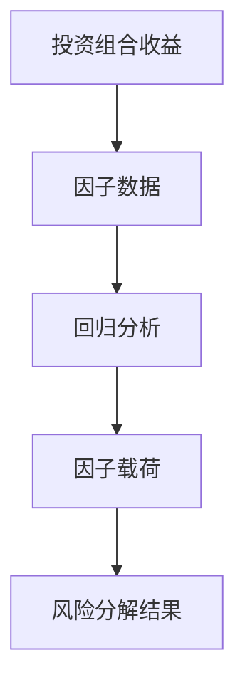
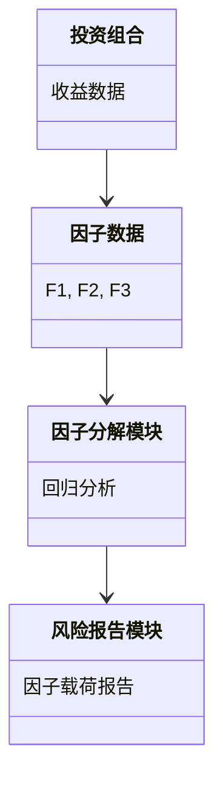
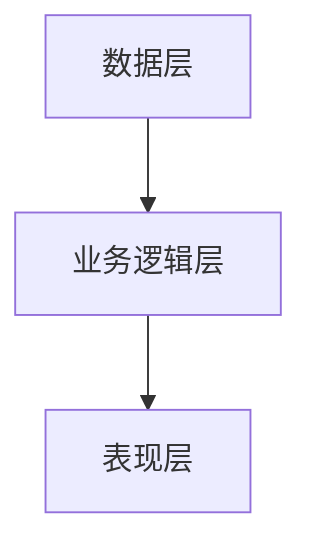
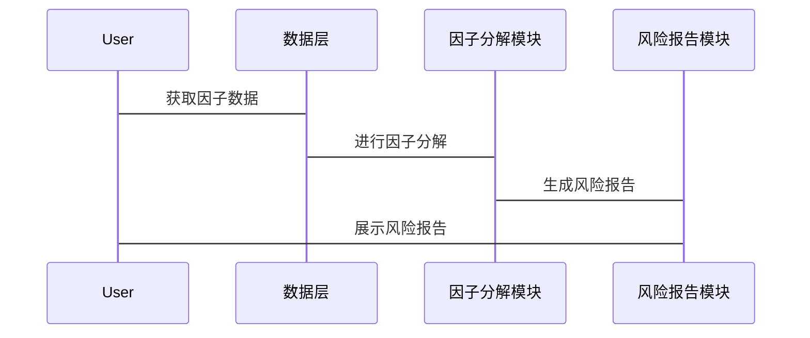

                 


# 风险因子分解：深入理解投资组合风险来源

## 关键词：投资组合、风险因子、风险分解、风险来源、因子分解

## 摘要：  
本文深入探讨了风险因子分解的核心原理、数学模型及其在投资组合管理中的应用。通过分析风险因子的定义、分类及其相互关系，结合具体的算法实现和项目案例，帮助读者理解如何通过分解风险因子来优化投资组合的风险管理。本文还提供了系统的架构设计和最佳实践建议，为投资组合的风险分析和管理提供了全面的指导。

---

# 第1章 风险因子分解的背景与基础

## 1.1 风险因子分解的背景与意义

### 1.1.1 投资组合风险的基本概念  
在投资领域，风险是衡量投资组合表现的重要指标之一。投资组合的风险通常表现为波动性、收益的不确定性以及潜在的损失。风险因子分解是一种方法，通过将投资组合的风险分解为多个可解释的因子，帮助投资者更好地理解风险来源并进行有效的风险管理。

### 1.1.2 风险因子分解的重要性  
风险因子分解的核心目标是将投资组合的整体风险拆解为多个具体的因子，每个因子代表一种特定的风险来源。通过这种方式，投资者可以更清晰地识别和管理不同类型的风崄，从而制定更科学的投资策略。例如，市场风险、流动性风险、信用风险等都可以通过因子分解的方式进行量化和分析。

### 1.1.3 风险因子分解的应用场景  
风险因子分解在投资组合管理中的应用场景广泛，包括：  
1. **风险定价**：通过分解风险因子，可以更准确地定价金融资产，帮助投资者评估其真实风险。  
2. **风险对冲**：通过识别特定风险因子，投资者可以采取对冲策略，降低投资组合的整体风险。  
3. **资产配置**：风险因子分解为资产配置提供了更精细的视角，帮助投资者优化资产配置策略。  
4. **风险报告**：通过分解风险因子，投资机构可以生成更详细的风险报告，满足监管要求并提升透明度。

---

## 1.2 风险因子分解的核心概念

### 1.2.1 风险因子的定义与分类  
风险因子可以定义为影响资产或投资组合收益的某种系统性风险因素。常见的风险因子包括：  
- **市场因子（Market Factor）**：反映整体市场的波动性，如标普500指数的波动。  
- **规模因子（Size Factor）**：反映小盘股相对于大盘股的溢价。  
- **价值因子（Value Factor）**：反映低市盈率股票相对于高市盈率股票的溢价。  
- **动量因子（Momentum Factor）**：反映过去收益较高的资产在未来短期内保持较高收益的趋势。  
- **信用因子（Credit Factor）**：反映不同信用等级资产之间的风险差异。  

### 1.2.2 风险因子分解的目标与方法  
风险因子分解的目标是将投资组合的收益波动分解为多个风险因子的贡献。常用的方法包括：  
1. **回归分析**：通过回归模型，将投资组合的收益与各风险因子的波动性进行拟合。  
2. **主成分分析（PCA）**：通过降维技术，提取影响投资组合收益的主要风险因子。  
3. **因子模型**：如APT模型和CAPM模型，通过构建因子模型来分解风险。  

### 1.2.3 风险因子分解的边界与外延  
风险因子分解的边界在于其仅考虑系统性风险，而不包括非系统性风险（即特定于个别资产的风崄）。外延则在于，风险因子分解可以应用于不同类型的投资组合，包括股票、债券、基金等资产类别。

---

## 1.3 风险因子分解的核心要素

### 1.3.1 风险因子的属性特征对比  
以下是对常见风险因子的属性对比：

| 风险因子 | 描述 | 数据来源 | 影响范围 |
|----------|------|----------|----------|
| 市场因子 | 整体市场的波动性 | 指数收益率 | 全市场 |
| 规模因子 | 小盘股与大盘股的收益差异 | 资产规模 | 单一资产 |
| 价值因子 | 低市盈率股票与高市盈率股票的收益差异 | 市盈率 | 单一资产 |
| 动量因子 | 过去收益与未来收益的相关性 | 收益历史 | 单一资产 |
| 信用因子 | 不同信用等级资产的收益差异 | 信用评级 | 单一资产 |

### 1.3.2 风险因子分解的数学模型  
风险因子分解的数学模型通常可以表示为：  
$$ R_p = \beta_1 F_1 + \beta_2 F_2 + ... + \beta_n F_n + \epsilon $$  
其中，$R_p$ 是投资组合的收益，$F_i$ 是第$i$个风险因子，$\beta_i$ 是因子的载荷，$\epsilon$ 是特异风险。

### 1.3.3 风险因子分解的流程与步骤  
1. **数据收集**：收集相关资产的历史收益数据和因子数据。  
2. **因子选择**：选择影响投资组合收益的主要因子。  
3. **回归分析**：通过回归模型，估计各因子的载荷。  
4. **因子贡献分析**：计算各因子对投资组合收益的贡献。  

---

## 1.4 本章小结  

通过本章的介绍，我们理解了风险因子分解的背景、核心概念以及其在投资组合管理中的重要性。接下来，我们将深入探讨风险因子分解的核心原理及其数学模型。

---

# 第2章 风险因子分解的核心概念与联系

## 2.1 风险因子分解的原理

### 2.1.1 风险因子分解的基本原理  
风险因子分解的基本原理是通过因子模型将投资组合的收益分解为多个风险因子的线性组合。这些因子可以是市场因子、风格因子或其他特定的经济指标。

### 2.1.2 风险因子分解的数学表达式  
$$ R_p = \beta_1 F_1 + \beta_2 F_2 + ... + \beta_n F_n + \epsilon $$  
其中，$\beta_i$ 表示第$i$个因子的载荷，$F_i$ 是第$i$个因子的收益，$\epsilon$ 是特异风险。

### 2.1.3 风险因子分解的统计模型  
常见的统计模型包括回归分析和主成分分析（PCA）。回归分析用于估计因子载荷，而PCA用于提取主要因子。

---

## 2.2 风险因子分解的核心概念对比

### 2.2.1 风险因子与收益因子的对比  
| 风险因子 | 收益因子 |
|----------|----------|
| 影响整体市场的波动 | 影响特定资产的收益 |
| 可以通过因子模型进行分解 | 可以通过回归分析进行分解 |

### 2.2.2 风险因子与市场因子的对比  
| 风险因子 | 市场因子 |
|----------|----------|
| 包括市场因子和其他特定因子 | 仅指整体市场的波动性 |

### 2.2.3 风险因子与特定风险的对比  
| 风险因子 | 特定风险 |
|----------|----------|
| 影响整个市场的系统性风险 | 影响单一资产的非系统性风险 |

---

## 2.3 风险因子分解的ER实体关系图


---

## 2.4 本章小结  

通过本章的分析，我们深入理解了风险因子分解的核心概念及其与相关概念的联系。接下来，我们将探讨风险因子分解的算法原理。

---

# 第3章 风险因子分解的算法原理

## 3.1 风险因子分解的算法概述

### 3.1.1 常见的风险因子分解算法  
常用的算法包括回归分析、主成分分析（PCA）和因子模型（如APT模型和CAPM模型）。

### 3.1.2 算法选择的依据  
选择算法时需要考虑数据的特征、因子的类型以及目标分解的精度。

### 3.1.3 算法的优缺点对比  
| 算法 | 优点 | 缺点 |
|------|------|------|
| 回归分析 | 简单易懂 | 对异常值敏感 |
| PCA | 降维能力强 | 解释性差 |
| APT模型 | 解释性高 | 需要假设多个因子 |

---

## 3.2 风险因子分解的数学模型

### 3.2.1 风险因子分解的线性回归模型  
$$ R_p = \beta_1 F_1 + \beta_2 F_2 + ... + \beta_n F_n + \epsilon $$  

### 3.2.2 风险因子分解的因子模型  
以CAPM模型为例：  
$$ R_p = R_f + \beta (R_m - R_f) $$  
其中，$R_p$ 是投资组合的收益，$R_f$ 是无风险利率，$R_m$ 是市场收益。

---

## 3.3 风险因子分解的算法实现

### 3.3.1 使用Python实现风险因子分解

```python
import pandas as pd
import numpy as np
from sklearn.linear_model import LinearRegression

# 假设我们有因子数据和投资组合收益数据
factors = pd.DataFrame({
    'F1': np.random.randn(100),
    'F2': np.random.randn(100),
    'F3': np.random.randn(100)
})

portfolio_returns = np.random.randn(100)

# 使用线性回归模型进行风险因子分解
model = LinearRegression()
model.fit(factors, portfolio_returns)

beta = model.coef_
print("因子载荷：", beta)
```

### 3.3.2 使用mermaid流程图展示算法流程



---

## 3.4 本章小结  

通过本章的分析，我们了解了风险因子分解的算法原理及其实现方法。接下来，我们将探讨风险因子分解的系统分析与架构设计。

---

# 第4章 风险因子分解的系统分析与架构设计

## 4.1 风险因子分解的系统分析

### 4.1.1 问题场景介绍  
我们假设有一个投资组合，包含多个资产，需要对其风险进行分解。

### 4.1.2 系统功能设计  
- 数据采集模块：收集因子数据和投资组合收益数据。  
- 因子分解模块：对因子进行分解，计算因子载荷。  
- 风险报告模块：生成风险分解报告，展示各因子的贡献。

### 4.1.3 领域模型设计



---

## 4.2 风险因子分解的系统架构设计

### 4.2.1 系统架构设计  
- 数据层：存储因子数据和投资组合收益数据。  
- 业务逻辑层：实现因子分解的算法逻辑。  
- 表现层：展示风险分解结果。



### 4.2.2 接口设计  
- 数据接口：提供因子数据和投资组合收益数据的接口。  
- 报告接口：提供风险分解报告的接口。

### 4.2.3 交互流程设计  


---

## 4.3 本章小结  

通过本章的分析，我们了解了风险因子分解的系统架构设计。接下来，我们将通过一个具体项目实战来进一步理解其应用。

---

# 第5章 风险因子分解的项目实战

## 5.1 项目实战概述

### 5.1.1 项目背景  
我们希望通过分解风险因子来优化投资组合的风险管理。

### 5.1.2 项目目标  
- 实现风险因子分解算法。  
- 分析投资组合的风险来源。  
- 生成风险分解报告。

---

## 5.2 项目环境安装

### 5.2.1 安装Python和相关库  
```bash
pip install pandas numpy sklearn matplotlib
```

---

## 5.3 项目核心实现

### 5.3.1 收集数据  
```python
import pandas as pd
import numpy as np

# 假设我们有因子数据和投资组合收益数据
factors = pd.DataFrame({
    'F1': np.random.randn(100),
    'F2': np.random.randn(100),
    'F3': np.random.randn(100)
})

portfolio_returns = np.random.randn(100)
```

### 5.3.2 进行因子分解  
```python
from sklearn.linear_model import LinearRegression

model = LinearRegression()
model.fit(factors, portfolio_returns)

beta = model.coef_
print("因子载荷：", beta)
```

### 5.3.3 可视化结果  
```python
import matplotlib.pyplot as plt

plt.bar(range(len(beta)), beta)
plt.xticks(range(len(beta)), ['F1', 'F2', 'F3'])
plt.title('因子载荷')
plt.show()
```

---

## 5.4 项目案例分析

### 5.4.1 案例数据解读  
假设我们有一个投资组合，其收益数据如下：  
$$ R_p = [0.05, 0.03, 0.02, ..., 0.01] $$  

通过因子分解，我们得到因子载荷如下：  
$$ \beta = [0.7, 0.2, 0.1] $$  

### 5.4.2 风险分解结果分析  
从结果可以看出，市场因子（F1）对投资组合收益的贡献最大，其次是规模因子（F2），最后是信用因子（F3）。

---

## 5.5 本章小结  

通过本章的实战项目，我们深入理解了风险因子分解的具体实现和应用。接下来，我们将总结最佳实践和注意事项。

---

# 第6章 风险因子分解的最佳实践与小结

## 6.1 最佳实践

### 6.1.1 数据选择  
选择高质量的因子数据和投资组合收益数据，确保数据的完整性和准确性。

### 6.1.2 模型选择  
根据具体场景选择合适的因子分解模型，如回归分析、PCA或因子模型。

### 6.1.3 模型验证  
通过回测和验证，确保因子分解模型的有效性和稳定性。

---

## 6.2 小结与注意事项

### 6.2.1 核心要点  
- 风险因子分解是理解投资组合风险来源的重要工具。  
- 选择合适的算法和模型可以提高分解的准确性。  
- 数据质量对分解结果有重要影响。

### 6.2.2 注意事项  
- 风险因子分解仅考虑系统性风险，忽略特异风险。  
- 模型选择需结合具体场景和数据特征。  
- 分解结果需结合实际情况进行解释和应用。

---

## 6.3 拓展阅读

### 6.3.1 推荐书籍  
- 《投资学》（作者：查理斯·埃文斯）  
- 《因子投资》（作者：杰里米·西格尔）  

### 6.3.2 推荐博客  
- 因子投资与风险管理（https://www.foo.com/）  

---

## 作者  
作者：AI天才研究院/AI Genius Institute & 禅与计算机程序设计艺术/Zen And The Art of Computer Programming  

---

通过本文的系统分析和详细讲解，我们深入理解了风险因子分解的核心原理及其在投资组合管理中的应用。希望本文能为读者提供有价值的见解和实践指导。

