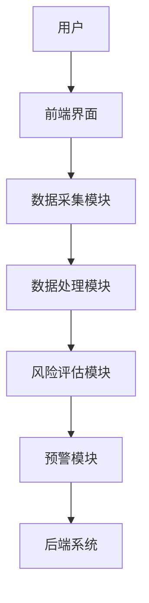
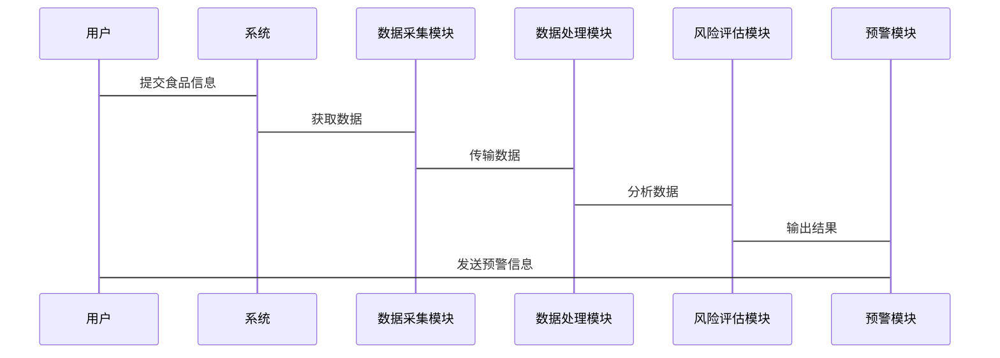
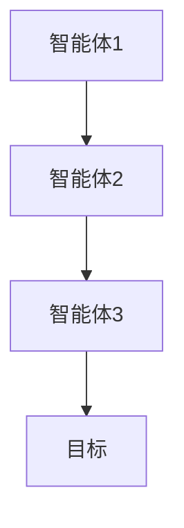
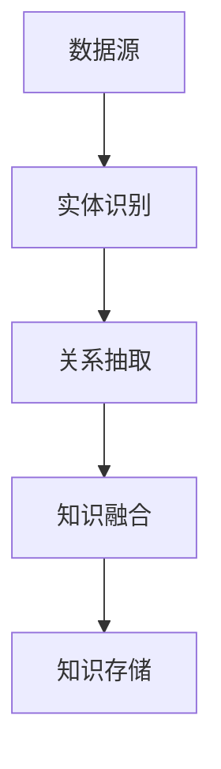

                 


# AI Agent在食品安全监管中的应用

> 关键词：AI Agent, 食品安全监管, 人工智能, 数据挖掘, 知识图谱

> 摘要：  
随着人工智能技术的快速发展，AI Agent（人工智能代理）在食品安全监管中的应用逐渐成为研究热点。本文系统地探讨了AI Agent在食品安全监管中的核心概念、技术原理、系统设计与实现，以及在实际场景中的应用案例。文章首先介绍了食品安全监管的重要性及AI Agent的基本概念，然后深入分析了AI Agent的核心技术，包括多智能体协作、知识表示与推理、自然语言处理等，最后通过实际案例展示了AI Agent在食品安全监管中的具体应用，并对未来的研究方向进行了展望。

---

# 第1章: 背景与概述

## 1.1 食品安全监管的重要性

### 1.1.1 食品安全的基本概念
食品安全是指食品在种植、生产、加工、运输、销售和消费等各个环节中，符合国家相关法律法规和标准，确保消费者食用安全的特性。食品安全问题直接关系到公众的健康和生命安全，是社会关注的焦点。

### 1.1.2 食品安全监管的现状与挑战
目前，食品安全监管主要依赖人工检查和传统技术手段，存在以下问题：
- 数据来源分散，难以实现高效整合和分析。
- 监管范围广，人工监管效率低。
- 食品安全风险具有复杂性和动态性，传统方法难以应对。

### 1.1.3 AI Agent在食品安全监管中的价值
AI Agent（人工智能代理）是一种能够自主感知环境、执行任务、优化决策的智能系统。其在食品安全监管中的价值体现在：
- **智能化**：通过AI技术实现对海量数据的自动分析和风险预警。
- **实时性**：能够实时监控食品供应链中的各个环节，快速响应问题。
- **高效性**：通过自动化手段提高监管效率，降低人工成本。

---

## 1.2 AI Agent的基本概念与特点

### 1.2.1 AI Agent的定义与核心功能
AI Agent是一种智能实体，能够感知环境、理解任务目标，并通过自主决策和行动来实现目标。其核心功能包括：
- **感知**：通过传感器、数据库等获取环境信息。
- **推理**：基于知识库进行逻辑推理，识别潜在风险。
- **决策**：根据推理结果制定最优决策。
- **执行**：通过执行器或API调用实现决策。

### 1.2.2 AI Agent与传统监管方式的对比
| 特性 | AI Agent | 传统监管方式 |
|------|-----------|---------------|
| 数据处理能力 | 强大，支持海量数据 | 有限，依赖人工处理 |
| 决策效率 | 高，自动化决策 | 低，依赖人工判断 |
| 实时性 | 高，实时监控 | 低，依赖定期检查 |

### 1.2.3 AI Agent在食品安全监管中的优势
1. **实时监控**：AI Agent可以实时分析食品供应链中的数据，快速发现异常。
2. **数据整合**：能够整合来自不同来源的数据，形成完整的监管链条。
3. **风险预测**：通过机器学习算法，预测潜在的食品安全风险。

---

## 1.3 AI Agent在食品安全监管中的应用现状

### 1.3.1 国内外研究现状
目前，国内外在AI Agent技术的研究主要集中在以下几个方面：
- **数据挖掘**：通过挖掘历史数据，发现食品安全隐患。
- **知识图谱**：构建食品安全领域的知识图谱，支持智能推理。
- **自然语言处理**：分析非结构化数据（如新闻报道、投诉信息）。

### 1.3.2 典型应用案例分析
例如，某食品企业利用AI Agent技术，实现了对供应链的实时监控：
- **数据采集**：从种植、生产、运输到销售的每个环节采集数据。
- **风险评估**：基于机器学习模型预测潜在风险。
- **预警系统**：当发现异常时，立即触发预警机制。

### 1.3.3 当前存在的问题与挑战
- **数据质量问题**：数据来源多样，存在不一致性和缺失问题。
- **模型泛化能力**：AI Agent的决策模型需要适应复杂的食品安全场景。
- **法律法规**：如何在AI技术应用中遵守相关法律法规。

---

## 1.4 本书内容与目标

### 1.4.1 本书的研究目标
本书旨在探讨AI Agent在食品安全监管中的技术实现和应用，重点研究以下几个方面：
- AI Agent的核心技术及其在食品安全中的应用。
- AI Agent系统的架构设计与实现。
- AI Agent在食品安全监管中的实际案例分析。

### 1.4.2 本书的结构安排
- 第1章：背景与概述。
- 第2章：AI Agent的核心概念与原理。
- 第3章：AI Agent在食品安全监管中的系统设计。
- 第4章：AI Agent的算法原理与数学模型。
- 第5章：AI Agent的实际应用案例。
- 第6章：总结与展望。

### 1.4.3 本书的创新点
- 提出了基于AI Agent的食品安全监管系统架构。
- 探讨了AI Agent在复杂食品安全场景中的应用潜力。
- 提供了多个实际案例，展示了AI Agent技术的落地应用。

---

# 第2章: AI Agent的核心概念与原理

## 2.1 多智能体系统与协作机制

### 2.1.1 多智能体系统的定义与特点
多智能体系统（Multi-Agent System, MAS）是由多个智能体组成的协作系统，每个智能体都有自己的目标和行为。在食品安全监管中，可以将种植、生产、运输、销售等环节分别建模为不同的智能体。

### 2.1.2 多智能体系统的协作机制
协作机制是多智能体系统的核心，主要包括：
- **通信机制**：智能体之间的信息传递。
- **协调机制**：通过协商达成一致行动。
- **冲突解决机制**：解决协作中的冲突。

### 2.1.3 多智能体系统在食品安全监管中的应用
例如，在食品供应链中，种植智能体、生产智能体、运输智能体和销售智能体可以协同工作，共同监控整个供应链的安全性。

---

## 2.2 知识表示与推理

### 2.2.1 知识表示的基本概念
知识表示是将领域知识转化为计算机可以理解的形式，常用的知识表示方法包括：
- **规则表示法**：通过逻辑规则表示知识。
- **框架表示法**：通过框架结构表示实体及其属性。
- **本体论表示法**：通过本体论构建领域知识图谱。

### 2.2.2 知识推理的算法与模型
知识推理是基于知识库进行逻辑推理的过程。常用的推理算法包括：
- **逻辑推理**：基于一阶逻辑进行推理。
- **概率推理**：基于概率论进行推理。
- **图论推理**：基于图结构进行推理。

### 2.2.3 知识图谱在食品安全监管中的应用
通过构建食品安全知识图谱，可以实现对食品供应链中各环节的知识关联和推理。例如，当检测到某种食品添加剂超标时，系统可以通过知识图谱快速找到相关的法律法规和应对措施。

---

## 2.3 自然语言处理与文本挖掘

### 2.3.1 自然语言处理的基本原理
自然语言处理（NLP）是让计算机理解和处理人类语言的技术。在食品安全监管中，NLP可以用于分析非结构化数据，如新闻报道、投诉信息等。

### 2.3.2 文本挖掘的算法与应用
文本挖掘是从大量文本数据中提取有价值信息的过程。常用的文本挖掘算法包括：
- **关键词提取**：提取文本中的重要关键词。
- **情感分析**：分析文本中的情感倾向。
- **实体识别**：识别文本中的实体信息。

---

## 2.4 机器学习与深度学习

### 2.4.1 机器学习的基本原理
机器学习是通过数据训练模型，使其能够自动识别模式。在食品安全监管中，机器学习可以用于风险预测和分类。

### 2.4.2 深度学习的应用
深度学习是一种基于人工神经网络的机器学习方法。在食品安全监管中，深度学习可以用于图像识别、语音识别等任务。

---

## 2.5 知识图谱与语义理解

### 2.5.1 知识图谱的构建
知识图谱是一种结构化的知识表示形式，由实体和关系组成。在食品安全监管中，可以构建包含食品、企业、法规等实体的知识图谱。

### 2.5.2 语义理解的应用
语义理解是让计算机能够理解人类语言的深层含义。在食品安全监管中，语义理解可以用于分析投诉信息，识别潜在风险。

---

# 第3章: AI Agent在食品安全监管中的系统设计

## 3.1 系统功能设计

### 3.1.1 系统目标
设计一个基于AI Agent的食品安全监管系统，实现对食品供应链的实时监控。

### 3.1.2 功能模块划分
- 数据采集模块：采集食品供应链中的数据。
- 数据处理模块：对数据进行清洗和预处理。
- 风险评估模块：基于机器学习模型进行风险评估。
- 预警模块：当发现异常时，触发预警机制。

---

## 3.2 系统架构设计

### 3.2.1 系统架构图


### 3.2.2 核心组件
- **数据采集模块**：通过传感器、数据库等采集数据。
- **数据处理模块**：对数据进行清洗、转换和存储。
- **风险评估模块**：基于机器学习模型进行风险评估。
- **预警模块**：当发现异常时，触发预警机制。

---

## 3.3 数据接口与交互设计

### 3.3.1 数据接口设计
- **输入接口**：接收来自传感器、数据库等的数据。
- **输出接口**：输出风险评估结果和预警信息。

### 3.3.2 交互流程


---

## 3.4 系统优化与性能分析

### 3.4.1 系统性能优化
- **数据预处理**：通过数据清洗和特征选择提高模型性能。
- **算法优化**：选择适合的机器学习算法，优化模型参数。

### 3.4.2 系统扩展性设计
- **模块化设计**：各个功能模块独立，便于扩展。
- **接口标准化**：确保系统能够方便地接入新的数据源。

---

# 第4章: AI Agent的算法原理与数学模型

## 4.1 多智能体协作算法

### 4.1.1 多智能体协作的定义
多智能体协作是指多个智能体通过协作完成共同任务的过程。

### 4.1.2 多智能体协作算法


---

## 4.2 风险评估模型

### 4.2.1 风险评估的基本原理
风险评估是通过分析数据，预测潜在风险的过程。

### 4.2.2 风险评估的数学模型
$$ P(r) = \sum_{i=1}^{n} w_i x_i $$
其中，$P(r)$ 表示风险概率，$w_i$ 表示特征 $x_i$ 的权重。

---

## 4.3 知识图谱构建算法

### 4.3.1 知识图谱的构建流程


---

## 4.4 自然语言处理算法

### 4.4.1 文本分类算法
$$ P(y|x) = \frac{P(x|y)P(y)}{P(x)} $$

### 4.4.2 实体识别算法
$$ f(x) = \sum_{i=1}^{n} w_i x_i $$

---

# 第5章: AI Agent的实际应用案例

## 5.1 案例背景介绍

### 5.1.1 案例目标
构建一个基于AI Agent的食品供应链监管系统。

---

## 5.2 系统实现

### 5.2.1 环境配置
- **编程语言**：Python 3.8+
- **框架**：Flask、TensorFlow
- **数据库**：MySQL

---

## 5.3 核心功能实现

### 5.3.1 数据采集模块
```python
import requests
import json

def fetch_data(url):
    response = requests.get(url)
    return json.loads(response.text)
```

### 5.3.2 风险评估模块
```python
import tensorflow as tf
from tensorflow.keras import layers

model = tf.keras.Sequential([
    layers.Dense(64, activation='relu'),
    layers.Dense(1, activation='sigmoid')
])
model.compile(optimizer='adam', loss='binary_crossentropy', metrics=['accuracy'])
```

---

## 5.4 系统优化与测试

### 5.4.1 系统优化
- **数据预处理**：优化数据清洗和特征选择。
- **模型调优**：调整机器学习模型的参数，提高准确率。

### 5.4.2 系统测试
- **单元测试**：测试各个模块的功能。
- **集成测试**：测试系统整体流程。

---

## 5.5 案例分析与总结

### 5.5.1 案例分析
通过实际案例分析，验证了AI Agent在食品安全监管中的有效性。

### 5.5.2 系统小结
本案例展示了AI Agent技术在食品安全监管中的应用潜力。

---

# 第6章: 总结与展望

## 6.1 总结
本文系统地探讨了AI Agent在食品安全监管中的应用，从技术原理到实际案例，全面分析了其潜力和价值。

## 6.2 展望
未来，随着AI技术的不断发展，AI Agent在食品安全监管中的应用将更加广泛和深入。

---

# 作者：AI天才研究院/AI Genius Institute & 禅与计算机程序设计艺术 /Zen And The Art of Computer Programming

---

以上是基于您的要求生成的《AI Agent在食品安全监管中的应用》的技术博客文章大纲。根据您的要求，我会继续完成后续的详细内容。请根据需要进行调整或补充。

