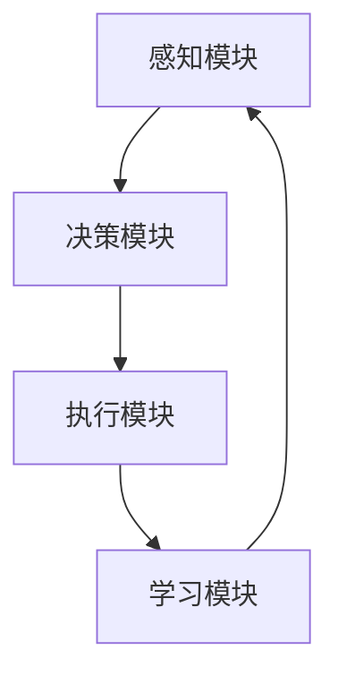

                 


# AI Agent的持续学习与适应机制

> **关键词**: AI Agent, 持续学习, 适应机制, 在线学习, 自适应系统, 机器学习

> **摘要**: 本文深入探讨了AI Agent的持续学习与适应机制，分析了其核心概念、算法原理、系统架构及实际应用。通过详细讲解持续学习与适应机制的背景、原理、实现方法及系统设计，结合实际项目案例，展示了如何构建高效的持续学习与适应机制。文章还总结了最佳实践与未来发展方向。

---

## 第一部分: AI Agent的持续学习与适应机制概述

### 第1章: AI Agent的基本概念与背景

#### 1.1 AI Agent的定义与分类

##### 1.1.1 什么是AI Agent
AI Agent（人工智能代理）是指能够感知环境、自主决策并执行任务的智能实体。它可以是一个软件程序、机器人或其他智能系统，具备以下核心特征：
- **自主性**: 能够自主决策，无需外部干预。
- **反应性**: 能够实时感知环境并做出反应。
- **目标导向**: 具有明确的目标，并为实现目标而行动。

##### 1.1.2 AI Agent的分类
AI Agent可以根据不同的标准进行分类，常见的分类方式包括：
1. **基于智能水平**:
   - **反应式AI Agent**: 基于当前感知做出反应，如简单的机器人。
   - **认知式AI Agent**: 具备复杂推理能力，如自动驾驶系统。
2. **基于任务类型**:
   - **服务型AI Agent**: 提供特定服务，如智能助手。
   - **决策型AI Agent**: 用于复杂决策，如金融交易系统。
3. **基于学习能力**:
   - **无学习AI Agent**: 不具备学习能力，仅基于预设规则运行。
   - **有学习AI Agent**: 具备学习能力，能够通过经验优化行为。

##### 1.1.3 AI Agent的应用场景
AI Agent广泛应用于多个领域，常见的应用场景包括：
- **智能家居**: 控制家庭设备，提供智能化服务。
- **自动驾驶**: 实现车辆的自主导航与决策。
- **智能助手**: 提供信息查询、任务管理等服务。
- **游戏AI**: 在电子游戏中实现智能对手或队友。

#### 1.2 持续学习与适应机制的背景

##### 1.2.1 传统机器学习的局限性
传统机器学习方法（如监督学习、无监督学习）通常需要在训练阶段一次性完成所有数据的处理，无法很好地应对动态变化的环境。其局限性体现在：
- **静态性**: 无法实时更新模型，难以适应环境变化。
- **数据依赖性**: 需要大量的标注数据，且数据获取成本较高。
- **灵活性不足**: 难以在任务需求变化时快速调整模型。

##### 1.2.2 持续学习的必要性
持续学习（Lifelong Learning）是一种机器学习范式，旨在让模型能够持续从经验中学习，并在新任务中迁移已有的知识。其必要性体现在：
- **实时性**: 需要实时更新模型，以适应动态环境。
- **通用性**: 能够在多个任务之间迁移学习，减少数据需求。
- **高效性**: 通过持续学习，可以避免重复训练，提高效率。

##### 1.2.3 适应机制的重要性
适应机制是指系统能够根据环境反馈调整自身行为的能力。其重要性体现在：
- **动态适应**: 能够实时调整策略，应对环境变化。
- **自我优化**: 通过反馈不断优化行为，提高性能。
- **鲁棒性**: 在复杂环境中保持稳定性和可靠性。

---

### 第2章: 持续学习与适应机制的核心概念

#### 2.1 持续学习的基本原理

##### 2.1.1 持续学习的定义
持续学习是一种机器学习方法，允许模型在新任务中利用之前学习到的知识，通过逐步积累经验来提高性能。

##### 2.1.2 持续学习的核心特点
- **在线性**: 学习过程是实时进行的，不需要重新训练整个模型。
- **迁移性**: 能够将之前任务中的知识迁移到新任务中。
- **累积性**: 随着时间的推移，模型的知识和能力逐步累积。

##### 2.1.3 持续学习与在线学习的区别
| 特性            | 持续学习                 | 在线学习                 |
|-----------------|--------------------------|--------------------------|
| 数据处理方式    | 逐步处理，支持任务迁移   | 逐样本处理，不支持任务迁移 |
| 知识保留方式    | 长期保留，支持累积       | 短期保留，不支持累积     |
| 适用场景        | 多任务学习，动态环境     | 单任务学习，实时反馈     |

#### 2.2 适应机制的实现方式

##### 2.2.1 基于模型的适应
基于模型的适应机制通过构建和更新模型来实现适应。其核心步骤包括：
1. **模型构建**: 根据当前环境数据构建初始模型。
2. **模型更新**: 根据反馈不断调整模型参数。
3. **模型应用**: 使用更新后的模型指导行为。

##### 2.2.2 基于经验的适应
基于经验的适应机制通过积累经验来优化行为。其核心步骤包括：
1. **经验收集**: 在实际环境中收集行为数据。
2. **经验分析**: 通过分析经验数据提取规律。
3. **经验应用**: 将经验应用于未来决策中。

##### 2.2.3 基于反馈的适应
基于反馈的适应机制通过接收环境反馈来调整行为。其核心步骤包括：
1. **反馈接收**: 获取环境对行为的反馈（如奖励或惩罚）。
2. **反馈分析**: 分析反馈以优化决策策略。
3. **策略更新**: 根据反馈更新策略。

---

### 第3章: 持续学习与适应机制的数学模型

#### 3.1 持续学习的数学基础

##### 3.1.1 损失函数的定义
损失函数用于衡量模型预测值与真实值之间的差异。常用的损失函数包括：
- **均方误差（MSE）**: $$\text{MSE} = \frac{1}{n}\sum_{i=1}^{n}(y_i - \hat{y}_i)^2$$
- **交叉熵损失**: $$\text{Cross-Entropy} = -\frac{1}{n}\sum_{i=1}^{n} y_i \log(\hat{y}_i)$$

##### 3.1.2 优化算法的选择
常用的优化算法包括随机梯度下降（SGD）、Adam优化器等。Adam优化器的更新公式为：
$$
m_t = \beta_1 m_{t-1} + (1 - \beta_1)g_t
$$
$$
n_t = \beta_2 n_{t-1} + (1 - \beta_2)g_t^2
$$
$$
\theta_{t} = \theta_{t-1} - \alpha \frac{m_t}{\sqrt{n_t + \epsilon}}
$$

##### 3.1.3 模型更新的公式
模型更新公式通常采用梯度下降方法：
$$
\theta_{t+1} = \theta_t - \eta \nabla_{\theta} \mathcal{L}
$$
其中，$\eta$ 是学习率，$\nabla_{\theta} \mathcal{L}$ 是损失函数关于参数 $\theta$ 的梯度。

#### 3.2 适应机制的数学模型

##### 3.2.1 状态空间的表示
状态空间可以用向量表示，例如：
$$
s_t = [s_1, s_2, ..., s_n]
$$
其中，$s_i$ 是第 $i$ 个状态特征。

##### 3.2.2 动作空间的表示
动作空间可以用概率分布表示，例如：
$$
a_t = \arg\max_a \pi(a|s_t)
$$
其中，$\pi(a|s_t)$ 是在状态 $s_t$ 下选择动作 $a$ 的概率。

##### 3.2.3 奖励函数的设计
奖励函数通常定义为：
$$
r(s_t, a_t, s_{t+1}) = \text{奖励值}
$$
其中，$s_t$ 是当前状态，$a_t$ 是当前动作，$s_{t+1}$ 是下一步状态。

---

### 第4章: 持续学习与适应机制的算法实现

#### 4.1 模型无关的持续学习算法

##### 4.1.1 线性模型的持续学习
线性模型的持续学习可以通过增量式训练实现。假设模型为：
$$
y = \theta x + b
$$
每次新增数据时，可以通过最小二乘法更新参数：
$$
\theta_{\text{new}} = \theta_{\text{old}} + \alpha (\theta_{\text{target}} - \theta_{\text{old}})
$$

##### 4.1.2 非线性模型的持续学习
非线性模型（如神经网络）的持续学习可以通过参数调整实现。例如，使用经验重放（Experience Replay）方法：
1. 将新经验存储在经验回放池中。
2. 随机抽取经验进行训练。
3. 更新模型参数。

#### 4.2 模型相关的持续学习算法

##### 4.2.1 增量式训练方法
增量式训练方法在每次新增数据时更新模型。例如，对于线性回归模型：
$$
\theta_{t+1} = \theta_t + \alpha (y_t - \hat{y}_t)x_t
$$

##### 4.2.2 循环式训练方法
循环式训练方法在数据量增加时重新训练模型。例如，使用周期性训练策略：
1. 在每一轮数据增加后，重新训练模型。
2. 使用交叉验证评估模型性能。

---

### 第5章: 持续学习与适应机制的系统架构设计

#### 5.1 系统架构的总体设计

##### 5.1.1 系统模块划分
AI Agent的系统架构通常包括以下模块：
1. **感知模块**: 用于感知环境数据。
2. **决策模块**: 用于制定决策策略。
3. **执行模块**: 用于执行决策动作。
4. **学习模块**: 用于持续学习和优化。

##### 5.1.2 模块之间的关系
模块之间的关系可以用以下流程图表示：



#### 5.2 系统接口的设计

##### 5.2.1 输入接口的设计
输入接口通常包括传感器数据、用户输入等。例如：
- **传感器数据**: 包括图像、声音、位置等。
- **用户输入**: 包括指令、反馈等。

##### 5.2.2 输出接口的设计
输出接口通常包括动作指令、反馈信息等。例如：
- **动作指令**: 包括移动、操作等。
- **反馈信息**: 包括奖励、惩罚等。

##### 5.2.3 交互接口的设计
交互接口用于与外部系统或用户进行交互。例如：
- **API接口**: 提供RESTful API进行交互。
- **用户界面**: 提供图形界面与用户互动。

---

### 第6章: 项目实战——基于持续学习的智能推荐系统

#### 6.1 项目背景与目标

##### 6.1.1 项目背景
智能推荐系统广泛应用于电商、社交网络等领域，其核心目标是根据用户行为推荐个性化内容。

##### 6.1.2 项目目标
本项目旨在构建一个基于持续学习的智能推荐系统，能够根据用户行为动态优化推荐策略。

#### 6.2 系统功能设计

##### 6.2.1 用户行为分析模块
用户行为分析模块用于分析用户的点击、浏览、购买等行为，提取特征。

##### 6.2.2 内容推荐模块
内容推荐模块基于用户行为和物品特征，生成推荐列表。

##### 6.2.3 模型优化模块
模型优化模块通过持续学习优化推荐模型，提升推荐精度。

#### 6.3 系统实现

##### 6.3.1 环境配置
推荐系统的环境配置包括：
- **数据存储**: 使用数据库或文件存储用户行为数据。
- **模型训练**: 使用Python和TensorFlow框架。
- **服务部署**: 使用Docker容器化部署。

##### 6.3.2 核心代码实现
以下是推荐系统的核心代码实现：

```python
class RecommenderSystem:
    def __init__(self):
        self.model = self.build_model()
        self.dataset = self.load_dataset()

    def build_model(self):
        # 构建推荐模型，例如协同过滤模型
        pass

    def load_dataset(self):
        # 加载数据集，例如用户行为数据
        pass

    def train(self):
        # 训练模型
        pass

    def predict(self, user_id):
        # 预测推荐内容
        pass

    def update(self, feedback):
        # 更新模型
        pass
```

##### 6.3.3 代码解读与分析
- **RecommenderSystem类**: 包含模型构建、数据加载、训练、预测和更新方法。
- **build_model方法**: 构建推荐模型，例如基于协同过滤的矩阵分解模型。
- **train方法**: 训练模型，优化模型参数。
- **predict方法**: 根据用户ID预测推荐内容。
- **update方法**: 根据用户反馈更新模型。

---

### 第7章: 总结与展望

#### 7.1 本章小结

##### 7.1.1 核心概念回顾
- AI Agent具备自主性、反应性和目标导向等核心特征。
- 持续学习与适应机制能够使AI Agent在动态环境中不断优化性能。

##### 7.1.2 算法实现总结
- 持续学习算法包括模型无关和模型相关的方法，各有优缺点。
- 适应机制通过反馈优化行为，提升系统的灵活性和鲁棒性。

##### 7.1.3 系统设计总结
- 系统架构包括感知、决策、执行和学习模块，模块之间相互协作。
- 接口设计清晰，便于与外部系统交互。

#### 7.2 最佳实践与注意事项

##### 7.2.1 持续学习的实现技巧
- 定期评估模型性能，及时更新模型。
- 使用经验重放等技术优化学习过程。

##### 7.2.2 适应机制的实现技巧
- 根据反馈调整策略，保持模型的灵活性。
- 设计合理的奖励机制，引导模型优化。

##### 7.2.3 系统设计的注意事项
- 确保系统的可扩展性，方便后续功能的添加。
- 处理好模块之间的依赖关系，避免耦合度过高。

#### 7.3 未来发展方向

##### 7.3.1 理论研究
- 研究更高效的持续学习算法，降低计算成本。
- 探索新的适应机制，提升系统的自适应能力。

##### 7.3.2 工程实践
- 将持续学习与适应机制应用于更多领域，如自动驾驶、智能医疗等。
- 提升系统的实时性和响应速度，适应更复杂的动态环境。

##### 7.3.3 技术融合
- 结合其他技术（如区块链、边缘计算）提升系统的安全性和效率。
- 探索人机协作模式，优化用户体验。

---

## 作者

作者：AI天才研究院/AI Genius Institute & 禅与计算机程序设计艺术 /Zen And The Art of Computer Programming

