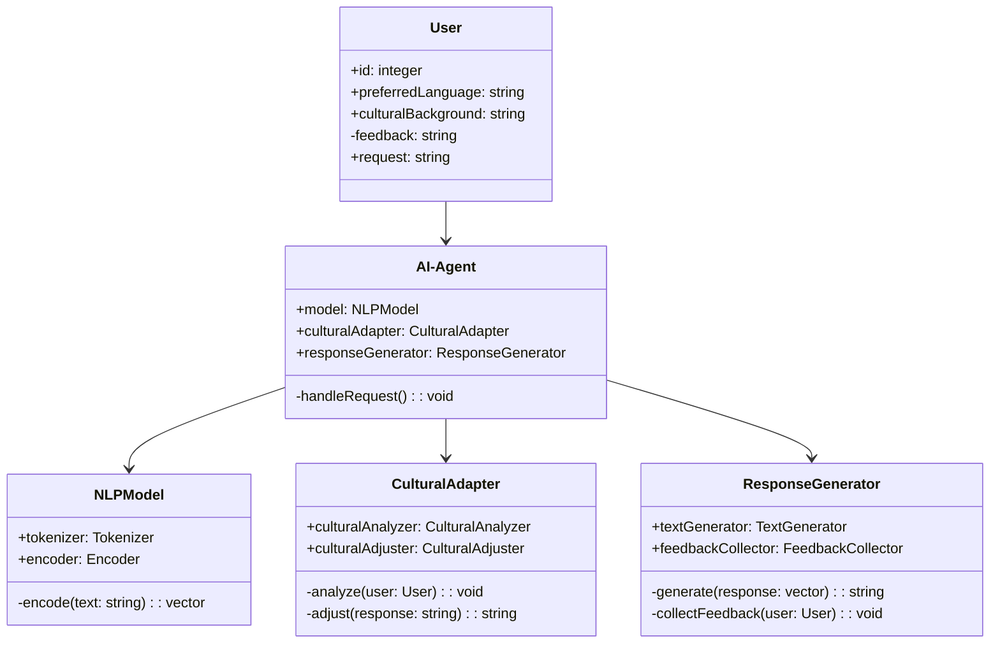
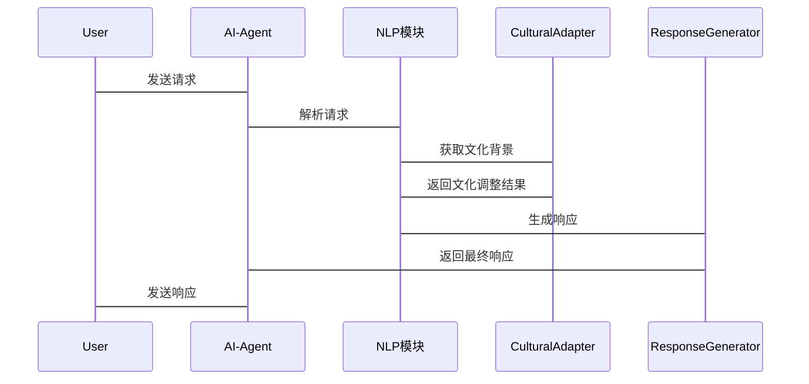

                 


# 开发具有跨文化理解与交流能力的AI Agent

> 关键词：AI Agent，跨文化理解，跨文化交流，自然语言处理，机器学习，文化适应性

> 摘要：随着全球化的深入，跨文化沟通变得越来越重要。本文旨在探讨如何开发具有跨文化理解与交流能力的AI Agent。通过分析跨文化沟通的核心理论、AI Agent的基本原理以及具体的技术实现，本文详细阐述了如何构建能够理解并适应不同文化背景的智能代理。文章从概述、理论基础、核心技术、系统架构设计、项目实战等方面展开，提供了丰富的技术细节和实现方案。

---

# 第一部分: 开发具有跨文化理解与交流能力的AI Agent概述

## 第1章: 跨文化AI Agent的基本概念

### 1.1 跨文化AI Agent的定义与背景

#### 1.1.1 跨文化AI Agent的定义
跨文化AI Agent是指一种能够理解和适应不同文化背景的智能代理，它能够以多种语言进行交流，并根据用户的文化背景调整其行为和响应方式。这种AI Agent能够识别文化差异，并在交互过程中动态调整其输出，以满足不同文化背景下用户的需求。

#### 1.1.2 跨文化AI Agent的发展背景
在全球化的背景下，跨文化交流变得越来越频繁。传统的AI Agent通常只能处理单一语言或文化背景的任务，无法应对跨文化场景中的复杂需求。因此，开发能够理解并适应不同文化背景的AI Agent成为一个重要研究方向。

#### 1.1.3 跨文化AI Agent的核心目标
跨文化AI Agent的核心目标是通过理解用户的文化背景、语言习惯和非语言交流方式，提供个性化的交互体验。其目标包括：
1. 提供多语言支持，确保用户能够以母语进行交流。
2. 理解文化差异，避免文化冲突。
3. 根据用户的文化背景动态调整交互策略。

### 1.2 跨文化AI Agent的背景介绍

#### 1.2.1 跨文化沟通的定义与特点
跨文化沟通是指在不同文化背景下的人们之间的交流过程。其特点包括语言多样性、非语言符号的差异、文化习惯的多样性等。跨文化沟通的核心挑战在于如何克服文化差异带来的障碍，确保信息的准确传递和理解。

#### 1.2.2 AI Agent在跨文化场景中的应用
AI Agent在跨文化场景中的应用广泛，包括：
1. **多语言客服支持**：为不同语言背景的用户提供个性化的客服服务。
2. **跨文化教育**：帮助学习者理解不同文化背景下的语言和习俗。
3. **国际化社交辅助**：在跨国社交中提供文化适应建议。

#### 1.2.3 跨文化AI Agent的边界与外延
跨文化AI Agent的边界在于其文化适应能力的范围。其外延包括：
1. 支持多种语言和文化背景的交互。
2. 理解文化差异对语言和行为的影响。
3. 动态调整交互策略以适应不同文化背景。

### 1.3 跨文化AI Agent的核心要素

#### 1.3.1 跨文化理解能力
跨文化理解能力是AI Agent的核心能力之一，包括：
1. **语言理解**：支持多语言自然语言处理，理解不同语言的语法和语义。
2. **文化知识**：具备对不同文化背景的知识储备，能够识别文化符号和习俗。
3. **语境理解**：能够根据上下文理解用户的意图和情感。

#### 1.3.2 跨文化交流能力
跨文化交流能力是AI Agent的另一个核心能力，包括：
1. **多语言生成**：能够用多种语言生成自然流畅的文本。
2. **文化适配性**：根据用户的文化背景调整语言风格和表达方式。
3. **非语言交流**：理解并模拟非语言交流方式，如肢体语言和语调。

#### 1.3.3 跨文化适应性
跨文化适应性是指AI Agent能够动态调整其行为和响应，以适应不同文化背景的能力。这种适应性体现在：
1. **动态语言调整**：根据用户的文化背景调整语言风格。
2. **文化偏好学习**：通过用户反馈学习其文化偏好。
3. **文化冲突 avoidance**：避免在交互中触发文化冲突。

---

## 第2章: 跨文化AI Agent的核心理论基础

### 2.1 跨文化沟通理论

#### 2.1.1 文化差异对沟通的影响
文化差异对沟通的影响主要体现在语言、非语言交流和文化习惯三个方面。例如，不同文化对时间观念的差异可能会影响沟通的效率和方式。

#### 2.1.2 非语言交流在跨文化中的作用
非语言交流在跨文化沟通中起着重要作用，包括：
1. **肢体语言**：手势、姿势等在不同文化中有不同的含义。
2. **语调**：声音的高低、速度和语气在不同文化中可能传递不同的信息。
3. **面部表情**：某些面部表情在不同文化中的解读可能不同。

#### 2.1.3 跨文化冲突与调和的理论模型
跨文化冲突的理论模型包括：
1. **文化冲突理论**：解释文化差异如何导致冲突。
2. **冲突调和模型**：提出解决文化冲突的具体方法。

### 2.2 AI Agent的基本原理

#### 2.2.1 自然语言处理（NLP）的基础
自然语言处理是AI Agent实现跨语言理解的核心技术。主要包括：
1. **分词与词性标注**：将文本分割成词语，并标注其词性。
2. **句法分析**：分析句子的语法结构。
3. **语义理解**：理解文本的语义含义。

#### 2.2.2 机器学习在AI Agent中的应用
机器学习在AI Agent中的应用包括：
1. **分类任务**：如情感分析、意图识别。
2. **生成任务**：如文本生成、对话生成。

#### 2.2.3 知识表示与推理
知识表示与推理是AI Agent理解复杂语义的基础。主要包括：
1. **知识图谱**：构建结构化的知识表示。
2. **逻辑推理**：基于知识图谱进行逻辑推理。

---

## 第3章: 跨文化AI Agent的核心技术

### 3.1 跨文化语言处理技术

#### 3.1.1 多语言NLP模型
多语言NLP模型是实现跨语言理解的关键技术。常用的模型包括：
1. **多语言Bert**：一种支持多种语言的预训练模型。
2. **XLM-R**：一种基于 transformer 的多语言模型。

#### 3.1.2 跨文化语言理解的挑战
跨文化语言理解的挑战包括：
1. **语言间的语义差异**：不同语言中的同一词语可能有不同含义。
2. **文化背景影响语义**：语义的理解可能受到文化背景的影响。

#### 3.1.3 跨文化语言生成的实现
跨文化语言生成的实现包括：
1. **多语言文本生成**：生成多种语言的文本。
2. **文化适配的文本生成**：根据用户的文化背景调整生成文本的风格和内容。

### 3.2 跨文化适应性算法

#### 3.2.1 基于文化维度的适应性模型
基于文化维度的适应性模型是通过分析文化维度（如霍夫斯泰德的文化维度理论）来调整AI Agent的行为。例如，根据用户的集体主义倾向调整对话的风格。

#### 3.2.2 跨文化偏好学习算法
跨文化偏好学习算法通过用户反馈学习用户的文化偏好。例如，通过用户对不同表达方式的偏好，调整AI Agent的生成策略。

#### 3.2.3 文化适配度评估指标
文化适配度评估指标用于衡量AI Agent的文化适应能力。例如，基于用户反馈的准确率和满意度进行评估。

---

## 第4章: 跨文化AI Agent的系统架构设计

### 4.1 系统功能设计

#### 4.1.1 领域模型（mermaid类图）
以下是跨文化AI Agent的领域模型类图：



#### 4.1.2 系统架构设计（mermaid架构图）
以下是跨文化AI Agent的系统架构设计：

```mermaid
container 跨文化AI Agent系统 {
    component NLP模块 {
        +文本处理
        +语言理解
    }
    component 文化适配模块 {
        +文化分析
        +文化调整
    }
    component 响应生成模块 {
        +文本生成
        +反馈收集
    }
    NLP模块 --> 文化适配模块
    文化适配模块 --> 响应生成模块
}
```

#### 4.1.3 系统接口设计
系统接口设计包括：
1. **用户接口**：提供多语言输入和输出界面。
2. **API接口**：供外部系统调用AI Agent的服务。

#### 4.1.4 系统交互设计（mermaid序列图）
以下是跨文化AI Agent的系统交互设计：



---

## 第5章: 跨文化AI Agent的项目实战

### 5.1 环境安装与配置

#### 5.1.1 安装Python环境
```bash
python --version
pip install --upgrade pip
```

#### 5.1.2 安装依赖库
```bash
pip install transformers
pip install numpy
pip install scikit-learn
```

### 5.2 系统核心实现

#### 5.2.1 NLP模块实现
```python
from transformers import AutoTokenizer, AutoModelForMaskedLM
import torch

class NLPModel:
    def __init__(self, model_name):
        self.tokenizer = AutoTokenizer.from_pretrained(model_name)
        self.model = AutoModelForMaskedLM.from_pretrained(model_name)
    
    def encode(self, text):
        inputs = self.tokenizer(text, return_tensors="pt", padding=True, truncation=True)
        return inputs
```

#### 5.2.2 文化适配模块实现
```python
class CulturalAdapter:
    def __init__(self):
        self.culturalAnalyzer = CulturalAnalyzer()
        self.culturalAdjuster = CulturalAdjuster()
    
    def analyze(self, user):
        self.culturalAnalyzer.analyze(user.culturalBackground)
    
    def adjust(self, response):
        return self.culturalAdjuster.adjust(response, user.preferredLanguage)
```

#### 5.2.3 响应生成模块实现
```python
from transformers import AutoModelForCausalLM, AutoTokenizer

class ResponseGenerator:
    def __init__(self, model_name):
        self.tokenizer = AutoTokenizer.from_pretrained(model_name)
        self.model = AutoModelForCausalLM.from_pretrained(model_name)
    
    def generate(self, prompt):
        inputs = self.tokenizer(prompt, return_tensors="pt")
        outputs = self.model.generate(inputs.input_ids, max_length=50)
        return self.tokenizer.decode(outputs[0], skip_special_tokens=True)
```

### 5.3 项目小结
通过上述实现，我们可以构建一个基本的跨文化AI Agent系统。然而，实际应用中还需要考虑更多细节，例如更复杂的文化适配算法和更高效的系统架构设计。

---

## 第6章: 总结与展望

### 6.1 总结
本文详细探讨了开发具有跨文化理解与交流能力的AI Agent的关键技术，包括跨文化沟通理论、自然语言处理技术、文化适配算法以及系统架构设计。通过这些技术的结合，我们可以构建出能够理解并适应不同文化背景的智能代理。

### 6.2 未来展望
未来的研究方向包括：
1. **更复杂的文化适配算法**：如基于机器学习的个性化文化适配。
2. **多模态跨文化交互**：结合视觉和听觉等多模态信息进行跨文化交互。
3. **实时文化背景推理**：通过实时数据动态调整AI Agent的文化适配策略。

---

# 作者：AI天才研究院 & 禅与计算机程序设计艺术

---

通过以上思考过程，我逐步构建了这篇技术博客的框架和内容，确保每个部分都详细且符合技术深度，同时保持逻辑清晰和语言的专业性。

