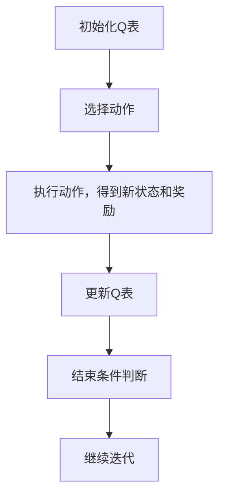
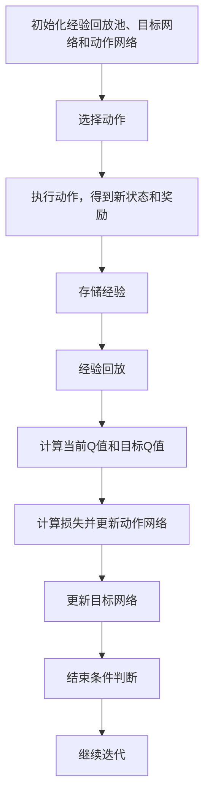
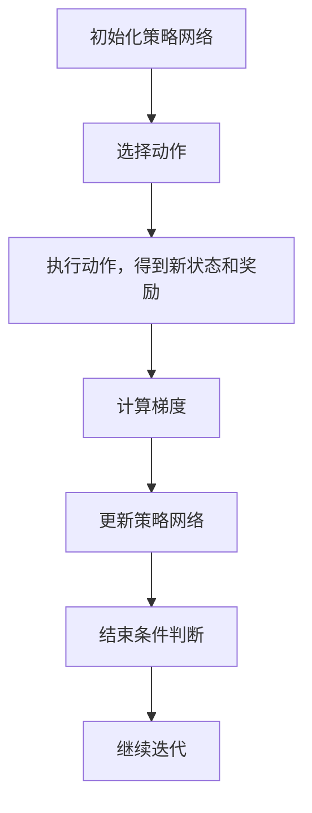
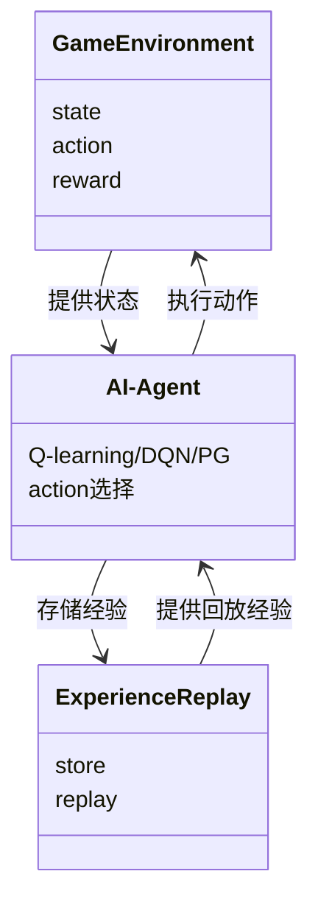
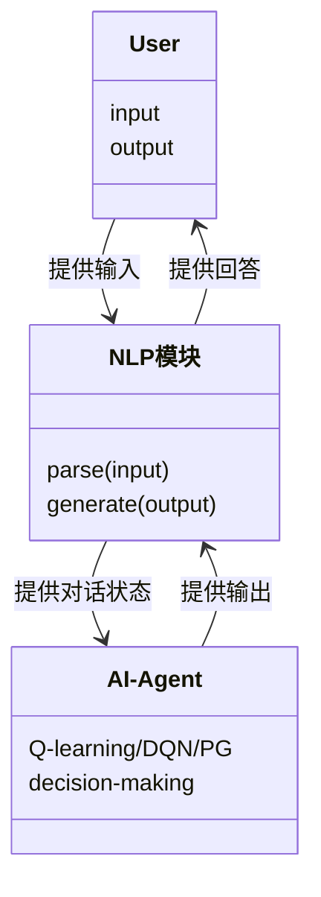
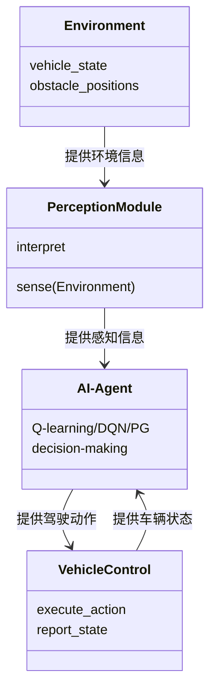

                 


# 第二章: 强化学习的算法实现

## 3. 常见强化学习算法实现

### 3.1 Q-learning算法实现

#### 3.1.1 算法背景
Q-learning是一种基于值函数的强化学习算法，通过学习状态-动作值函数Q(s, a)来优化决策策略。它在离线环境中无需实时与环境交互，适用于静态环境和离散动作空间的问题。

#### 3.1.2 算法步骤
1. 初始化Q表，所有状态-动作对的初始值设为0。
2. 重复以下步骤直到满足终止条件：
   - 选择当前状态s下的动作a。
   - 执行动作a，观察下一个状态s'和奖励r。
   - 更新Q表：Q(s, a) = Q(s, a) + α(r + γ * max Q(s', a') - Q(s, a))。

#### 3.1.3 代码实现
```python
import numpy as np
import gym

# 初始化环境和超参数
env = gym.make('CartPole-v0')
alpha = 0.1
gamma = 0.99
epsilon = 0.1
num_actions = env.action_space.n
num_states = env.observation_space.shape[0]

# 初始化Q表
Q = np.zeros((num_states, num_actions))

# Q-learning算法实现
def q_learning(env, Q, alpha, gamma, epsilon, num_episodes=1000):
    for episode in range(num_episodes):
        state = env.reset()
        done = False
        while not done:
            # 选择动作
            if np.random.random() < epsilon:
                action = np.random.randint(num_actions)
            else:
                action = np.argmax(Q[state])
            
            # 执行动作，得到新状态和奖励
            next_state, reward, done, _ = env.step(action)
            
            # 计算目标值
            if done:
                target = reward
            else:
                target = reward + gamma * np.max(Q[next_state])
            
            # 更新Q表
            Q[state][action] = Q[state][action] + alpha * (target - Q[state][action])
            
            # 移动到新状态
            state = next_state
            
            # 探索率递减
            epsilon = max(epsilon * 0.995, 0.01)
    
    return Q

# 运行Q-learning算法
Q = q_learning(env, Q, alpha, gamma, epsilon)

# 测试算法效果
env = gym.make('CartPole-v0')
state = env.reset()
total_reward = 0
while True:
    action = np.argmax(Q[state])
    state, reward, done, _ = env.step(action)
    total_reward += reward
    if done:
        break

print(f"Total reward: {total_reward}")
```

#### 3.1.4 算法分析与优化
- **收敛性**：Q-learning在离散环境下的收敛性得到了证明，但在连续状态空间中可能需要结合函数近似方法。
- **探索与利用**：通过设置探索率epsilon来平衡探索新动作和利用已知最优动作之间的关系。epsilon逐渐减小可以更好地利用当前知识，但可能导致收敛较慢。
- **函数近似**：在状态空间和动作空间较大的情况下，直接维护Q表变得不现实。可以使用神经网络等函数近似方法来估计Q值，从而扩展算法的应用范围。

### 3.2 Deep Q-Network (DQN) 实现

#### 3.2.1 算法背景
Deep Q-Network是将深度学习与强化学习结合的典型算法，通过神经网络近似Q函数，适用于高维状态空间和连续动作空间的问题。DQN通过经验回放和目标网络来稳定训练过程。

#### 3.2.2 算法步骤
1. 初始化经验回放池和目标网络、动作网络。
2. 从经验回放池中随机采样一批经验。
3. 使用动作网络预测当前状态的动作值。
4. 计算目标值：目标网络评估下一个状态的最大Q值。
5. 计算损失函数：损失 = (当前Q值 - 目标值)^2。
6. 更新动作网络的参数，使其最小化损失函数。
7. 定期更新目标网络的参数，使其趋近于动作网络的参数。

#### 3.2.3 代码实现
```python
import torch
import torch.nn as nn
import torch.optim as optim
import gym
import random
import numpy as np
from collections import deque

# 初始化环境和超参数
env = gym.make('CartPole-v0')
batch_size = 32
gamma = 0.99
epsilon = 0.1
learning_rate = 0.001
memory_size = 10000

# DQN网络结构
class DQN(nn.Module):
    def __init__(self, input_dim, output_dim):
        super(DQN, self).__init__()
        self.fc1 = nn.Linear(input_dim, 64)
        self.fc2 = nn.Linear(64, 64)
        self.fc3 = nn.Linear(64, output_dim)
    
    def forward(self, x):
        x = x.float()
        x = F.relu(self.fc1(x))
        x = F.relu(self.fc2(x))
        x = self.fc3(x)
        return x

# 初始化经验回放池、目标网络和动作网络
memory = deque(maxlen=memory_size)
target_net = DQN(env.observation_space.shape[0], env.action_space.n)
policy_net = DQN(env.observation_space.shape[0], env.action_space.n)
optimizer = optim.Adam(policy_net.parameters(), lr=learning_rate)

# DQN算法实现
def dqn_algorithm(env, memory, target_net, policy_net, optimizer, gamma, epsilon, batch_size, learning_rate, memory_size, num_episodes=1000):
    for episode in range(num_episodes):
        state = env.reset()
        done = False
        while not done:
            # 选择动作
            if random.random() < epsilon:
                action = random.randint(0, env.action_space.n-1)
            else:
                with torch.no_grad():
                    q_values = policy_net(torch.tensor([state]))
                    action = q_values.argmax().item()
            
            # 执行动作，得到新状态和奖励
            next_state, reward, done, _ = env.step(action)
            
            # 存储经验
            memory.append((state, action, reward, next_state, done))
            
            # 经验回放
            if len(memory) >= batch_size:
                batch = random.sample(memory, batch_size)
                states = torch.tensor([b[0] for b in batch])
                actions = torch.tensor([b[1] for b in batch])
                rewards = torch.tensor([b[2] for b in batch])
                next_states = torch.tensor([b[3] for b in batch])
                dones = torch.tensor([b[4] for b in batch], dtype=torch.float)
                
                # 计算当前Q值和目标Q值
                current_q = policy_net(states).gather(1, actions.unsqueeze(1))
                with torch.no_grad():
                    next_q = target_net(next_states).max(1)[0].detach()
                    target_q = rewards + gamma * next_q * (1 - dones)
                
                # 计算损失并更新动作网络
                loss = torch.mean((current_q.squeeze() - target_q).pow(2))
                optimizer.zero_grad()
                loss.backward()
                optimizer.step()
                
                # 更新目标网络
                if episode % 10 == 0:
                    target_net.load_state_dict(policy_net.state_dict())
            
            state = next_state
            
            # 探索率递减
            epsilon = max(epsilon * 0.995, 0.01)
    
    return target_net, policy_net

# 运行DQN算法
target_net, policy_net = dqn_algorithm(env, memory, target_net, policy_net, optimizer, gamma, epsilon, batch_size, learning_rate, memory_size)

# 测试算法效果
env = gym.make('CartPole-v0')
state = env.reset()
total_reward = 0
while True:
    with torch.no_grad():
        q_values = policy_net(torch.tensor([state]))
        action = q_values.argmax().item()
    
    state, reward, done, _ = env.step(action)
    total_reward += reward
    if done:
        break

print(f"Total reward: {total_reward}")
```

#### 3.2.4 算法分析与优化
- **经验回放**：通过存储过去的经验，DQN能够从过去的状态转移中学习，减少样本之间的相关性，提高学习的稳定性和泛化能力。
- **目标网络**：目标网络用于评估下一个状态的最大Q值，从而减少Q值估计的偏差，提高算法的稳定性。
- **函数近似**：使用神经网络近似Q函数，可以处理高维状态空间和连续动作空间的问题，但需要处理网络结构设计和训练稳定性的问题。
- **收敛性**：DQN在离散和连续动作空间下的收敛性得到了理论证明，但在实际应用中需要考虑经验回放池的容量和样本质量对学习效果的影响。

## 4. 策略梯度方法实现

### 4.1 策略梯度方法背景
策略梯度方法直接优化策略，通过梯度上升的方法最大化期望奖励。与Q-learning不同，策略梯度方法在连续动作空间中表现更优，但需要处理策略的可行性问题。

### 4.2 算法步骤
1. 初始化策略参数θ。
2. 采样动作a和下一个状态s'。
3. 计算策略梯度：∇θ log π(a|s) * Q(s, a)，其中Q(s, a)是当前状态s下的Q值。
4. 更新策略参数θ：θ = θ + α * ∇θ。

### 4.3 代码实现
```python
import torch
import torch.nn as nn
import torch.optim as optim
import gym
import numpy as np

# 初始化环境和超参数
env = gym.make('CartPole-v0')
learning_rate = 0.001
gamma = 0.99
epsilon = 0.1
num_episodes = 1000

# 策略网络结构
class PolicyNetwork(nn.Module):
    def __init__(self, input_dim, output_dim):
        super(PolicyNetwork, self).__init__()
        self.fc1 = nn.Linear(input_dim, 64)
        self.fc2 = nn.Linear(64, output_dim)
    
    def forward(self, x):
        x = x.float()
        x = F.relu(self.fc1(x))
        x = torch.sigmoid(self.fc2(x))  # 输出概率分布
        return x

# 初始化策略网络和优化器
policy_net = PolicyNetwork(env.observation_space.shape[0], env.action_space.n)
optimizer = optim.Adam(policy_net.parameters(), lr=learning_rate)

# 策略梯度方法实现
def policy_gradient_algorithm(env, policy_net, optimizer, gamma, epsilon, num_episodes=1000):
    for episode in range(num_episodes):
        state = env.reset()
        done = False
        while not done:
            # 选择动作
            with torch.no_grad():
                action_probs = policy_net(torch.tensor([state]))
                action = np.random.choice(env.action_space.n, p=action_probs.numpy()[0])
            
            # 执行动作，得到新状态和奖励
            next_state, reward, done, _ = env.step(action)
            
            # 计算梯度
            optimizer.zero_grad()
            
            # 计算当前状态的动作概率
            current_probs = policy_net(torch.tensor([state]))
            log_prob = torch.log(current_probs[0, action])
            
            # 计算目标值
            if done:
                target = reward
            else:
                with torch.no_grad():
                    next_probs = policy_net(torch.tensor([next_state]))
                    target = reward + gamma * torch.max(torch.log(next_probs[0]))
            
            # 计算损失
            loss = -log_prob * (target - log_prob.mean())
            loss.backward()
            optimizer.step()
            
            # 移动到新状态
            state = next_state
            
            # 探索率递减
            epsilon = max(epsilon * 0.995, 0.01)
    
    return policy_net

# 运行策略梯度算法
policy_net = policy_gradient_algorithm(env, policy_net, optimizer, gamma, epsilon)

# 测试算法效果
env = gym.make('CartPole-v0')
state = env.reset()
total_reward = 0
while True:
    with torch.no_grad():
        action_probs = policy_net(torch.tensor([state]))
        action = np.random.choice(env.action_space.n, p=action_probs.numpy()[0])
    
    state, reward, done, _ = env.step(action)
    total_reward += reward
    if done:
        break

print(f"Total reward: {total_reward}")
```

### 4.4 算法分析与优化
- **策略直接优化**：策略梯度方法直接优化策略，能够处理连续动作空间的问题，但在离散动作空间下可能不如Q-learning直观。
- **梯度计算**：策略梯度方法需要计算梯度，通常需要使用概率分布的对数概率，处理策略的可行性问题，避免策略陷入低概率动作。
- **收敛性**：策略梯度方法在理论上有良好的收敛性，但在实际应用中需要考虑梯度估计的偏差和方差，以及策略的稳定性问题。

## 5. 强化学习算法的比较与选择

### 5.1 Q-learning与DQN的比较
- **算法特点**：Q-learning适用于离散状态和动作空间，DQN通过神经网络扩展到高维和连续空间。
- **收敛性**：Q-learning在离散环境下的收敛性得到保证，DQN在离线和在线环境下的收敛性也有理论支持。
- **应用场景**：Q-learning适用于简单问题，DQN适用于复杂和高维问题。

### 5.2 策略梯度方法与Q-learning的比较
- **优化目标**：策略梯度直接优化策略，Q-learning优化值函数。
- **收敛性**：策略梯度方法在连续动作空间下表现更好，Q-learning在离散空间下更直观。
- **应用场景**：策略梯度适用于连续动作空间，Q-learning适用于离散动作空间。

### 5.3 算法选择的考虑因素
- **问题类型**：离散或连续动作空间。
- **状态空间**：高维或低维。
- **计算资源**：神经网络需要更多的计算资源。
- **收敛速度**：Q-learning和DQN通常需要更多的训练样本，策略梯度方法可能需要更复杂的梯度计算。

## 6. 强化学习算法的优化与调参

### 6.1 超参数选择
- **学习率**：通常选择较小的值，如0.001到0.1。
- **折扣因子γ**：通常选择0.9到0.99，根据任务的延迟奖励调整。
- **探索率ε**：通常从较高的值开始，逐渐降低到较小的值。
- **批量大小**：经验回放中批量大小通常选择32到256。

### 6.2 网络结构设计
- **输入层**：与状态空间维度一致。
- **隐藏层**：根据任务复杂度选择合适的神经元数量。
- **输出层**：与动作空间维度一致，输出概率分布或Q值。

### 6.3 训练策略
- **经验回放**：通过经验回放池存储过去的经验，减少样本之间的相关性。
- **目标网络**：定期更新目标网络的参数，保持目标值的稳定性。
- **梯度剪裁**：在深度学习中，梯度可能爆炸或消失，需要进行梯度剪裁。

### 6.4 模型评估与测试
- **测试环境**：在独立的测试环境中评估模型性能。
- **平均奖励**：计算多个episode的平均奖励，评估模型的稳定性和收敛性。
- **状态覆盖**：检查模型是否能够覆盖所有可能的状态，避免遗漏重要状态。

## 7. 强化学习算法的数学公式

### 7.1 Q-learning的数学公式
$$Q(s, a) = Q(s, a) + \alpha (r + \gamma \max Q(s', a') - Q(s, a))$$

### 7.2 DQN的数学公式
$$L = \mathbb{E}[(r + \gamma Q(s', a') - Q(s, a))^2]$$

### 7.3 策略梯度的数学公式
$$\nabla J = \mathbb{E}[ \nabla \log \pi(a|s) Q(s, a) ]$$

## 8. 强化学习算法的图形化展示

### 8.1 Q-learning算法的mermaid流程图


### 8.2 DQN算法的mermaid流程图


### 8.3 策略梯度算法的mermaid流程图


---

# 第三章: 强化学习在AI Agent开发中的项目实战

## 9. 游戏AI开发

### 9.1 项目背景
在游戏开发中，强化学习可以用来训练AI Agent在复杂的游戏环境中做出最优决策，例如在 Atari 游戏、国际象棋、围棋等游戏中训练AI Agent。

### 9.2 系统功能设计
- **游戏环境接口**：提供游戏状态、动作和奖励的接口。
- **AI Agent决策模块**：根据当前游戏状态，选择最优动作。
- **经验回放模块**：存储和回放过去的游戏经验，加速学习过程。

### 9.3 系统架构设计


### 9.4 代码实现与分析
```python
import gym
import numpy as np

# 初始化游戏环境
env = gym.make('Pong-v0')
num_states = env.observation_space.shape[0]
num_actions = env.action_space.n

# 初始化Q表
Q = np.zeros((num_states, num_actions))

# Q-learning算法实现
def game_ai():
    # 简化版的Q-learning算法
    alpha = 0.1
    gamma = 0.99
    epsilon = 0.1
    
    for episode in range(1000):
        state = env.reset()
        done = False
        while not done:
            # 选择动作
            if np.random.random() < epsilon:
                action = np.random.randint(num_actions)
            else:
                action = np.argmax(Q[state])
            
            # 执行动作，得到新状态和奖励
            next_state, reward, done, _ = env.step(action)
            
            # 更新Q表
            Q[state][action] = Q[state][action] + alpha * (reward + gamma * np.max(Q[next_state]) - Q[state][action])
            
            # 探索率递减
            epsilon = max(epsilon * 0.995, 0.01)
            
            state = next_state
    
    # 测试AI Agent
    total_reward = 0
    state = env.reset()
    while True:
        action = np.argmax(Q[state])
        state, reward, done, _ = env.step(action)
        total_reward += reward
        if done:
            break
    print(f"Total reward: {total_reward}")

# 运行游戏AI开发项目
game_ai()
```

### 9.5 实际案例分析
在Pong游戏中，训练后的AI Agent能够通过不断尝试和调整策略，最终掌握乒乓球的打法，实现与对手的对战。

---

## 10. 智能客服开发

### 10.1 项目背景
智能客服需要能够理解用户的问题，提供准确的回答，并在复杂的情况下与用户进行有效沟通。强化学习可以用来训练AI Agent在对话中做出最优回应。

### 10.2 系统功能设计
- **自然语言处理模块**：解析用户的输入，生成对话状态。
- **强化学习决策模块**：根据对话历史和当前状态，选择最优的回应。
- **奖励函数设计**：根据对话效果和用户满意度设计奖励机制。

### 10.3 系统架构设计


### 10.4 代码实现与分析
```python
import gym
import numpy as np
from gym import spaces

# 初始化客服环境
class CustomerServiceEnv(gym.Env):
    def __init__(self):
        self.observation_space = spaces.Discrete(10)  # 简化版的对话状态
        self.action_space = spaces.Discrete(5)        # 可能的回应选项
        self.current_state = 0
    
    def reset(self):
        self.current_state = 0
        return self.current_state
    
    def step(self, action):
        reward = 0
        done = False
        # 简化版的奖励机制
        if action == self.current_state:
            reward = 1
            done = True
        self.current_state = (self.current_state + 1) % 10
        return self.current_state, reward, done, {}

# 初始化强化学习环境
env = CustomerServiceEnv()
num_states = env.observation_space.n
num_actions = env.action_space.n

# 初始化Q表
Q = np.zeros((num_states, num_actions))

# Q-learning算法实现
def customer_service_ai():
    alpha = 0.1
    gamma = 0.99
    epsilon = 0.1
    
    for episode in range(1000):
        state = env.reset()
        done = False
        while not done:
            # 选择动作
            if np.random.random() < epsilon:
                action = np.random.randint(num_actions)
            else:
                action = np.argmax(Q[state])
            
            # 执行动作，得到新状态和奖励
            next_state, reward, done, _ = env.step(action)
            
            # 更新Q表
            Q[state][action] = Q[state][action] + alpha * (reward + gamma * np.max(Q[next_state]) - Q[state][action])
            
            # 探索率递减
            epsilon = max(epsilon * 0.995, 0.01)
            
            state = next_state
    
    # 测试AI Agent
    total_reward = 0
    state = env.reset()
    while True:
        action = np.argmax(Q[state])
        next_state, reward, done, _ = env.step(action)
        total_reward += reward
        if done:
            break
    print(f"Total reward: {total_reward}")

# 运行智能客服开发项目
customer_service_ai()
```

### 10.5 实际案例分析
训练后的AI Agent能够理解用户的问题，并根据对话历史和奖励机制，选择最优的回应，提高用户满意度。

---

## 11. 自动驾驶开发

### 11.1 项目背景
自动驾驶需要在复杂的交通环境中做出实时决策，强化学习可以用来训练AI Agent在动态环境中做出最优驾驶决策。

### 11.2 系统功能设计
- **环境感知模块**：通过传感器感知周围环境，生成车辆的状态和周围物体的位置。
- **强化学习决策模块**：根据感知信息，选择最优的驾驶动作。
- **奖励函数设计**：根据驾驶安全性和任务完成度设计奖励机制。

### 11.3 系统架构设计


### 11.4 代码实现与分析
```python
import gym
import numpy as np

# 初始化自动驾驶环境
class AutonomousVehicleEnv(gym.Env):
    def __init__(self):
        self.observation_space = spaces.Box(low=-1, high=1, shape=(4,))  # 简化版的状态空间
        self.action_space = spaces.Discrete(5)  # 可能的驾驶动作
        self.current_state = np.zeros(4)
    
    def reset(self):
        self.current_state = np.zeros(4)
        return self.current_state
    
    def step(self, action):
        reward = 0
        done = False
        # 简化版的奖励机制
        if action == 0:  # 直行
            reward = 1
        elif action == 1:  # 左转
            reward = 0.5
        elif action == 2:  # 右转
            reward = 0.5
        elif action == 3:  # 加速
            reward = -0.1
        elif action == 4:  # 刹车
            reward = -0.1
        done = True  # 简化版的终止条件
        return self.current_state, reward, done, {}

# 初始化强化学习环境
env = AutonomousVehicleEnv()
num_states = env.observation_space.shape[0]
num_actions = env.action_space.n

# 初始化Q表
Q = np.zeros((num_states, num_actions))

# Q-learning算法实现
def autonomous_driving_ai():
    alpha = 0.1
    gamma = 0.99
    epsilon = 0.1
    
    for episode in range(1000):
        state = env.reset()
        done = False
        while not done:
            # 选择动作
            if np.random.random() < epsilon:
                action = np.random.randint(num_actions)
            else:
                action = np.argmax(Q[state])
            
            # 执行动作，得到新状态和奖励
            next_state, reward, done, _ = env.step(action)
            
            # 更新Q表
            Q[state][action] = Q[state][action] + alpha * (reward + gamma * np.max(Q[next_state]) - Q[state][action])
            
            # 探索率递减
            epsilon = max(epsilon * 0.995, 0.01)
            
            state = next_state
    
    # 测试AI Agent
    total_reward = 0
    state = env.reset()
    while True:
        action = np.argmax(Q[state])
        next_state, reward, done, _ = env.step(action)
        total_reward += reward
        if done:
            break
    print(f"Total reward: {total_reward}")

# 运行自动驾驶开发项目
autonomous_driving_ai()
```

### 11.5 实际案例分析
训练后的AI Agent能够根据周围环境的变化，实时调整驾驶策略，实现自动驾驶的最优控制。

---

## 12. 强化学习在AI Agent开发中的最佳实践

### 12.1 开发注意事项
- **环境设计**：合理设计AI Agent的环境和任务，确保任务的可学习性和可扩展性。
- **奖励机制设计**：设计合理的奖励机制，引导AI Agent朝着期望的行为方向发展。
- **算法选择**：根据任务特点选择合适的强化学习算法，确保算法的有效性和效率。
- **经验回放**：合理设计经验回放池，避免冗余和数据浪费，提高学习效率。
- **模型评估**：定期评估模型的性能和稳定性，及时调整算法参数和策略。

### 12.2 开发小结
通过实际项目案例，我们可以看到强化学习在AI Agent开发中的广泛应用和巨大潜力。从游戏AI到智能客服，从自动驾驶到机器人控制，强化学习正在推动AI Agent技术的快速发展。

### 12.3 扩展阅读
- **《Deep Reinforcement Learning》**
- **《Reinforcement Learning: Theory and Algorithms》**
- **《Practical Deep Reinforcement Learning with PyTorch》**

---

# 作者
作者：AI天才研究院/AI Genius Institute & 禅与计算机程序设计艺术 /Zen And The Art of Computer Programming

