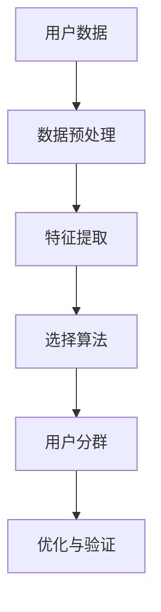
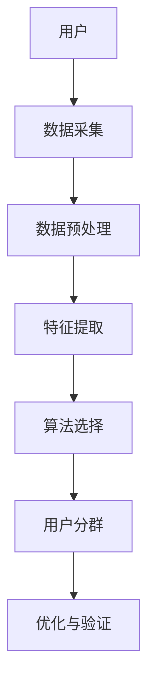
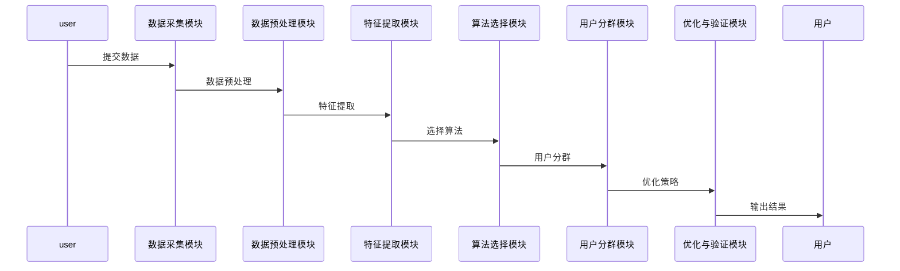

                 


# 彼得林奇如何分析公司的用户细分策略有效性

## 关键词：用户细分，策略分析，彼得林奇，数据分析，用户画像

## 摘要：本文详细探讨了彼得林奇如何通过用户细分策略的有效性分析来优化公司业务。文章从用户细分的基本概念入手，分析了其重要性及应用场景，并结合具体的算法和系统架构设计，展示了如何通过数据分析和用户画像构建，来实现精准的用户细分策略。通过实例分析，文章详细解读了彼得林奇的分析框架，并总结了最佳实践和注意事项，为读者提供了深刻的见解和实用的指导。

---

## 第一部分: 用户细分策略分析的背景与核心概念

### 第1章: 用户细分策略分析概述

#### 1.1 用户细分的基本概念

##### 1.1.1 用户细分的定义与背景

用户细分是指根据用户的属性、行为、需求和偏好等特征，将用户群体划分为多个子群体的过程。这种划分可以帮助企业更好地理解用户，制定针对性的营销策略和服务方案。彼得·林奇（Peter Lynch）作为著名的投资家和基金经理，他在分析公司用户细分策略时，强调了对用户行为和需求的深入理解，以及如何通过数据驱动的方法优化用户细分策略。

##### 1.1.2 用户细分的重要性与应用场景

用户细分在企业经营中的重要性不言而喻。通过用户细分，企业可以更精准地定位目标用户，制定差异化的营销策略，提高用户满意度和忠诚度。例如，在电商领域，用户细分可以帮助企业识别高价值用户和低价值用户，从而优化资源配置。在金融领域，用户细分可以帮助企业识别高风险用户和低风险用户，从而制定更有效的风险管理策略。

##### 1.1.3 彼得·林奇分析方法的核心思想

彼得·林奇在其投资生涯中，注重对公司的基本面分析，尤其是对公司用户群体的理解。他认为，用户细分是企业制定战略的重要基础，只有深入理解用户的需求和行为，才能制定出有效的市场策略。他强调，用户细分不仅仅是数据的划分，更是对用户行为和需求的深刻洞察。

---

#### 1.2 用户细分策略的有效性分析

##### 1.2.1 策略有效性的定义与衡量标准

用户细分策略的有效性可以通过多个维度来衡量。例如，用户细分是否能够准确反映用户的特征和需求，用户细分后的策略是否能够提高企业的营销效率和用户满意度等。彼得·林奇认为，用户细分策略的有效性最终体现在企业的业绩提升和用户满意度的提高上。

##### 1.2.2 彼得·林奇的分析框架

彼得·林奇的用户细分分析框架主要包括以下几个步骤：
1. **数据采集与清洗**：收集用户的相关数据，并对数据进行清洗和预处理。
2. **用户画像构建**：根据用户的基本信息、行为数据和需求数据，构建用户画像。
3. **用户分群**：通过聚类分析、分类算法等方法，将用户划分为不同的群体。
4. **策略制定与优化**：根据用户分群的结果，制定针对性的营销策略，并不断优化策略以提高效果。

##### 1.2.3 用户细分与企业战略的关系

用户细分是企业战略的重要组成部分。通过用户细分，企业可以更好地理解用户需求，优化资源配置，提高市场占有率和客户满意度。彼得·林奇强调，用户细分不仅是数据的划分，更是企业战略的核心之一。

---

#### 1.3 本章小结

本章主要介绍了用户细分的基本概念、重要性以及彼得·林奇的分析框架。用户细分是企业制定精准营销策略的重要基础，而彼得·林奇的分析框架为我们提供了一种系统化的方法来分析用户细分策略的有效性。

---

## 第二部分: 用户细分策略的核心概念与联系

### 第2章: 用户细分的核心概念与原理

#### 2.1 用户画像与用户分群

##### 2.1.1 用户画像的构建方法

用户画像是通过收集和分析用户的基本信息、行为数据和需求数据，构建出用户特征的综合描述。例如，可以通过用户的年龄、性别、收入水平、消费习惯等信息，构建出不同类型的用户画像。

##### 2.1.2 用户分群的常见方法

用户分群的常见方法包括聚类分析、分类算法、决策树等。其中，聚类分析是一种常用的用户分群方法，它通过将用户按照相似性自动分组，帮助我们发现用户群体的内在结构。

##### 2.1.3 用户分群与用户细分的关系

用户分群是用户细分的基础，而用户细分则是对用户分群的进一步细化和优化。通过用户分群，我们可以初步识别用户群体的特征，而通过用户细分，我们可以更精准地定位用户的需求和行为。

---

#### 2.2 用户细分的数学模型与方法

##### 2.2.1 用户细分的数学模型

用户细分的数学模型主要包括聚类分析和分类算法。例如，K-means聚类算法是一种常用的聚类方法，其数学模型如下：

$$ J = \sum_{i=1}^{k} \sum_{j=1}^{n} (x_j - c_i)^2 $$

其中，$k$是聚类的数量，$n$是数据点的数量，$x_j$是数据点，$c_i$是第$i$个聚类的中心点。

##### 2.2.2 用户细分的对比表

| 方法         | 优点                     | 缺点                     |
|--------------|--------------------------|--------------------------|
| 聚类分析     | 自动发现数据分布         | 需要预先确定聚类数量       |
| 分类算法     | 可以根据标签进行预测       | 需要有标签数据             |

---

#### 2.3 用户细分的流程与架构

##### 2.3.1 用户细分的流程图



##### 2.3.2 用户细分的系统架构图



---

### 第3章: 用户细分的算法原理与实现

#### 3.1 聚类分析算法

##### 3.1.1 K-means算法的原理与实现

K-means算法是一种常用的聚类算法，其基本原理是通过迭代优化，将数据点划分为$k$个簇，使得簇内数据点的相似性最大化。以下是K-means算法的Python实现示例：

```python
from sklearn.cluster import KMeans

# 假设X是数据矩阵，n_clusters是聚类数量
kmeans = KMeans(n_clusters=n_clusters, random_state=0)
kmeans.fit(X)
print(kmeans.labels_)
```

##### 3.1.2 层次聚类算法的原理与实现

层次聚类是一种基于树状结构的聚类方法，其基本原理是通过逐步合并或分割数据点，构建一棵树状结构。以下是层次聚类算法的Python实现示例：

```python
from sklearn.cluster import AgglomerativeClustering

# 假设X是数据矩阵
ac = AgglomerativeClustering(n_clusters=n_clusters)
ac.fit_predict(X)
```

##### 3.1.3 DBSCAN算法的原理与实现

DBSCAN是一种基于密度的聚类算法，其基本原理是通过密度 reachable 的概念，将数据点划分为不同的簇。以下是DBSCAN算法的Python实现示例：

```python
from sklearn.cluster import DBSCAN

# 假设X是数据矩阵，eps是邻域半径，min_samples是最小样本数
dbscan = DBSCAN(eps=eps, min_samples=min_samples)
dbscan.fit(X)
print(dbscan.labels_)
```

---

#### 3.2 分类算法在用户细分中的应用

##### 3.2.1 决策树算法的原理与实现

决策树是一种基于树状结构的分类算法，其基本原理是通过特征选择和分裂，构建一棵决策树，用于分类或回归。以下是决策树算法的Python实现示例：

```python
from sklearn.tree import DecisionTreeClassifier

# 假设X是特征矩阵，y是目标标签
dt = DecisionTreeClassifier()
dt.fit(X, y)
print(dt.predict(X))
```

##### 3.2.2 随机森林算法的原理与实现

随机森林是一种基于决策树的集成算法，其基本原理是通过随机采样和特征选择，构建多棵决策树，并通过投票或平均的方式进行预测。以下是随机森林算法的Python实现示例：

```python
from sklearn.ensemble import RandomForestClassifier

# 假设X是特征矩阵，y是目标标签
rf = RandomForestClassifier()
rf.fit(X, y)
print(rf.predict(X))
```

##### 3.2.3 支持向量机算法的原理与实现

支持向量机是一种基于几何的分类算法，其基本原理是通过找到一个超平面，将数据点分为两类。以下是支持向量机算法的Python实现示例：

```python
from sklearn.svm import SVC

# 假设X是特征矩阵，y是目标标签
svm = SVC()
svm.fit(X, y)
print(svm.predict(X))
```

---

#### 3.3 算法实现的数学模型与公式

##### 3.3.1 K-means算法的数学模型

$$ J = \sum_{i=1}^{k} \sum_{j=1}^{n} (x_j - c_i)^2 $$

其中，$k$是聚类的数量，$n$是数据点的数量，$x_j$是数据点，$c_i$是第$i$个聚类的中心点。

##### 3.3.2 决策树算法的数学模型

$$ Gini指数 = \sum_{i=1}^{m} p_i(1 - p_i) $$

其中，$m$是类别的数量，$p_i$是第$i$个类别的概率。

---

## 第三部分: 用户细分策略的系统分析与架构设计

### 第4章: 用户细分系统的分析与设计

#### 4.1 项目背景与目标

##### 4.1.1 项目背景介绍

用户细分系统的开发是为了帮助企业更好地理解用户需求，优化资源配置，提高市场占有率和客户满意度。

##### 4.1.2 项目目标与范围

项目的总体目标是开发一个用户细分系统，能够根据用户的基本信息、行为数据和需求数据，自动划分用户群体，并制定针对性的营销策略。

##### 4.1.3 项目关键成功因素

项目的成功关键在于数据的准确性和算法的有效性。只有通过高质量的数据和高效的算法，才能实现精准的用户细分。

---

#### 4.2 系统功能设计

##### 4.2.1 用户数据采集模块

用户数据采集模块负责收集用户的基本信息、行为数据和需求数据，并将这些数据存储在数据库中。

##### 4.2.2 用户分群处理模块

用户分群处理模块负责对用户数据进行预处理、特征提取和算法选择，并输出用户分群的结果。

##### 4.2.3 策略分析与优化模块

策略分析与优化模块负责根据用户分群的结果，制定针对性的营销策略，并不断优化策略以提高效果。

---

#### 4.3 系统架构设计

##### 4.3.1 系统架构图


##### 4.3.2 模块之间的交互关系

用户数据通过数据采集模块进入系统，经过预处理和特征提取后，选择合适的算法进行用户分群，最终输出用户分群的结果，并根据结果优化策略。

##### 4.3.3 系统接口设计

系统接口主要包含数据接口和用户接口。数据接口用于与外部数据源对接，用户接口用于与前端或客户端对接。

---

#### 4.4 系统交互设计

##### 4.4.1 用户与系统交互的序列图



---

## 第四部分: 用户细分策略的项目实战

### 第5章: 项目实战

#### 5.1 环境安装与配置

##### 5.1.1 环境要求

建议使用Python 3.6及以上版本，安装必要的库如Pandas、NumPy、Scikit-learn等。

##### 5.1.2 安装依赖

```bash
pip install pandas numpy scikit-learn
```

---

#### 5.2 核心代码实现

##### 5.2.1 数据预处理代码

```python
import pandas as pd
import numpy as np

# 读取数据
data = pd.read_csv('user_data.csv')

# 数据清洗
data.dropna(inplace=True)
```

##### 5.2.2 特征提取代码

```python
# 提取特征
features = data[['age', 'gender', 'income', 'behavior']]
```

##### 5.2.3 算法选择与实现代码

```python
from sklearn.cluster import KMeans

# 选择K-means算法
kmeans = KMeans(n_clusters=3, random_state=0)
kmeans.fit(features)
print(kmeans.labels_)
```

##### 5.2.4 用户分群与策略制定代码

```python
# 根据分群结果制定策略
cluster_centers = kmeans.cluster_centers_
for i in range(len(cluster_centers)):
    print(f'Cluster {i}: {cluster_centers[i]}')
```

---

#### 5.3 案例分析与解读

##### 5.3.1 案例背景

假设我们有一个电商公司，希望通过用户细分来优化营销策略。

##### 5.3.2 数据分析与解读

通过对用户数据的分析，我们发现用户群体可以分为三个主要群体：高价值用户、中价值用户和低价值用户。针对高价值用户，我们可以制定个性化的营销策略；针对低价值用户，我们可以制定引流策略。

##### 5.3.3 策略优化与总结

通过用户细分，我们成功识别了高价值用户，并制定了一系列精准营销策略，最终提高了用户的购买频率和满意度。

---

## 第五部分: 用户细分策略的最佳实践

### 第6章: 最佳实践

#### 6.1 小结

用户细分是企业制定精准营销策略的重要基础。通过数据分析和用户画像构建，我们可以更深入地理解用户需求，优化资源配置，提高市场占有率和客户满意度。

#### 6.2 注意事项

在实际应用中，需要注意数据质量和算法选择。同时，要不断优化用户分群策略，以适应市场变化和用户需求的变化。

#### 6.3 拓展阅读

建议读者进一步阅读《用户细分与数据分析》、《数据驱动的营销策略》等书籍，以深入理解用户细分的相关知识。

---

## 结语

用户细分是企业经营中的重要环节，而彼得·林奇的分析框架为我们提供了一种系统化的方法来分析用户细分策略的有效性。通过本文的探讨，我们希望读者能够更好地理解用户细分的核心概念和实践方法，并能够将其应用到实际工作中，从而提高企业的竞争力和市场占有率。

---

## 作者

作者：AI天才研究院/AI Genius Institute  
禅与计算机程序设计艺术/Zen And The Art of Computer Programming

