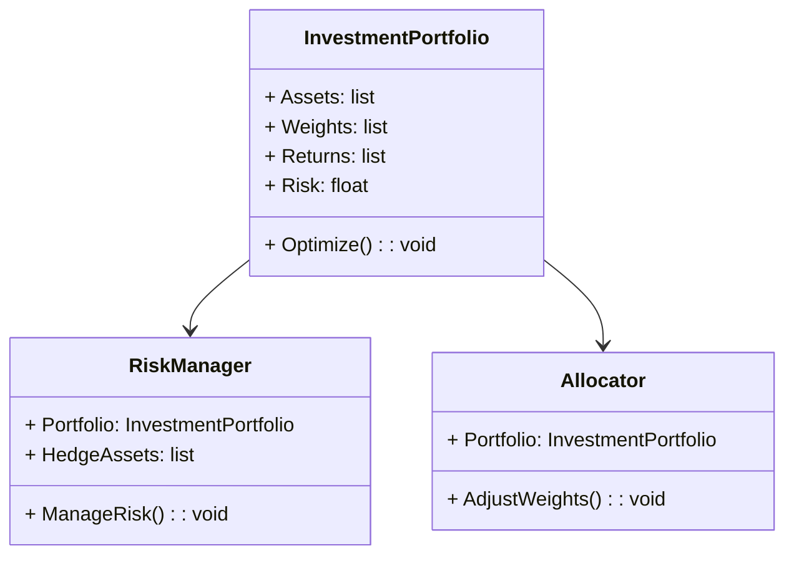
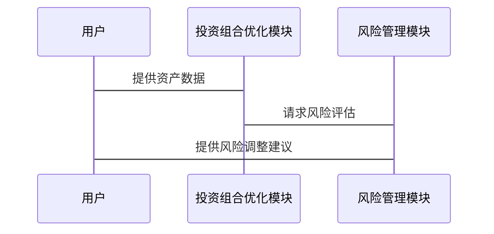

                 


# 投资组合保险策略：保护收益的方法

**关键词：** 投资组合保险、风险管理、收益保护、资产配置、风险对冲、动态调整

**摘要：** 本文探讨了投资组合保险策略的核心概念、数学模型、实现方法及其在实际投资中的应用。通过分析不同的保险策略，如现金保障策略和对冲基金策略，本文详细讲解了如何通过优化资产配置和动态调整来保护投资收益，同时控制风险。文章还结合实际案例，展示了如何在不同市场环境下应用这些策略，并提供了最佳实践建议，帮助投资者在复杂多变的市场中实现稳健收益。

---

## 第一部分：投资组合保险策略概述

### 第1章：投资组合保险策略的基本概念

#### 1.1 投资组合保险的定义与背景

**1.1.1 什么是投资组合保险**

投资组合保险（Portfolio Insurance）是一种通过优化资产配置和风险管理，以保护投资组合免受重大损失并稳定收益的策略。其核心目标是在不同市场环境下，确保投资组合的价值不会大幅波动，同时追求长期收益的最大化。

**1.1.2 投资组合保险的必要性**

在金融市场中，投资者面临多种风险，包括市场波动、经济衰退、通货膨胀等。投资组合保险通过分散投资、风险对冲和动态调整等手段，帮助投资者在不确定的市场中降低风险，保护本金安全，同时抓住潜在收益机会。

**1.1.3 投资组合保险的发展历程**

投资组合保险的概念起源于20世纪60年代，随着金融理论的发展和风险管理技术的进步，逐渐形成了一系列成熟的策略。现代投资组合保险结合了行为金融学、量化分析和机器学习等技术，能够更精准地识别和应对市场风险。

#### 1.2 投资组合保险的核心目标

**1.2.1 保护本金安全**

投资组合保险的首要目标是保护投资者的本金不受重大损失。通过合理配置低风险资产（如现金、债券）和高风险资产（如股票、衍生品），在市场下跌时减少损失，确保本金的安全性。

**1.2.2 稳定投资收益**

在市场波动较大的情况下，投资组合保险策略能够通过动态调整资产配置，平滑收益曲线，避免因短期波动导致的收益大幅波动，从而实现收益的长期稳定增长。

**1.2.3 风险与收益的平衡**

投资组合保险并不是完全消除风险，而是在可控范围内优化风险与收益的平衡。通过量化分析和风险对冲，投资者可以在承担适度风险的同时，获得更高的收益。

#### 1.3 投资组合保险的主要策略

**1.3.1 现金保障策略**

现金保障策略是一种简单而有效的方法，通过将一部分资金配置为现金或现金等价物，确保在市场下跌时能够迅速变现，避免进一步损失。这种方法特别适合风险承受能力较低的投资者。

**1.3.2 指数基金策略**

指数基金策略通过投资市场指数（如标普500）来分散风险，同时获得市场的平均收益。这种方法的优点是分散性强，费用低，适合长期投资。

**1.3.3 对冲基金策略**

对冲基金策略通过做多和做空相结合，利用市场波动赚取收益。这种方法适合有较高风险承受能力和专业投资知识的投资者。

#### 1.4 投资组合保险的适用场景

**1.4.1 个人投资者**

个人投资者通常风险承受能力较低，适合采用现金保障策略和指数基金策略，以保护本金并获得稳定收益。

**1.4.2 机构投资者**

机构投资者可以通过对冲基金策略和复杂的量化模型，在更大规模上进行风险对冲，实现收益的最大化。

**1.4.3 不同市场环境下的应用**

在牛市中，投资组合保险策略可以适当增加高风险资产的配置；在熊市中，则需要减少高风险资产，增加低风险资产的配置，以降低整体风险。

---

### 第2章：投资组合保险策略的核心原理

#### 2.1 投资组合保险的数学模型

**2.1.1 投资组合的收益与风险公式**

投资组合的收益可以用期望收益率来表示，而风险则通过标准差来衡量。数学模型如下：

$$ E(r_p) = \sum w_i E(r_i) $$

$$ \sigma_p = \sqrt{\sum w_i^2 \sigma_i^2 + 2 \sum w_i w_j \sigma_{i,j} } $$

其中，\( w_i \) 是第i种资产的权重，\( E(r_i) \) 是第i种资产的期望收益率，\( \sigma_i \) 是第i种资产的风险（标准差），\( \sigma_{i,j} \) 是第i和第j种资产之间的协方差。

**2.1.2 马科维茨有效前沿理论**

马科维茨的有效前沿理论指出，对于给定的风险水平，存在一个最优的投资组合，该组合的期望收益最大。相反，对于给定的期望收益，该组合的风险最小。这一理论为投资组合保险提供了理论基础。

**2.1.3 风险调整后的收益模型**

通过夏普比率（Sharpe Ratio）可以衡量投资组合的风险调整后收益：

$$ S = \frac{E(r_p) - r_f}{\sigma_p} $$

其中，\( r_f \) 是无风险利率，\( \sigma_p \) 是投资组合的风险（标准差）。

#### 2.2 投资组合保险的资产配置

**2.2.1 资产配置的基本原则**

资产配置需要根据投资者的风险承受能力、投资目标和市场环境进行动态调整。通常，资产配置包括股票、债券、现金等不同资产类别。

**2.2.2 不同资产类别的风险收益特征**

| 资产类别 | 风险 | 收益 |
|----------|------|------|
| 现金     | 低   | 低   |
| 债券     | 中   | 中   |
| 股票     | 高   | 高   |
| 衍生品   | 高   | 高   |

**2.2.3 资产配置的动态调整**

在市场环境变化时，需要对资产配置进行动态调整。例如，在市场下跌时增加债券配置，减少股票配置。

#### 2.3 投资组合保险的风险管理

**2.3.1 风险识别与评估**

通过数据分析和市场研究，识别潜在风险因素，并评估其对投资组合的影响。

**2.3.2 风险分散策略**

通过投资于不同资产类别和行业的资产，分散投资风险。

**2.3.3 风险对冲机制**

利用衍生品（如期权、期货）对冲特定风险，降低整体投资组合的风险敞口。

---

### 第3章：投资组合保险策略的实现方法

#### 3.1 现金保障策略的实现

**3.1.1 现金保障策略的定义**

将一定比例的资金配置为现金或现金等价物，以应对市场下跌的风险。

**3.1.2 现金保障策略的实现步骤**

1. 确定投资组合的总规模。
2. 根据风险承受能力，确定现金配置比例（通常为5%-20%）。
3. 将剩余资金投资于风险资产。
4. 定期审视和调整现金配置比例。

**3.1.3 现金保障策略的优缺点**

| 优点         | 缺点         |
|--------------|--------------|
| 简单易行     | 机会成本高   |
| 风险低       | 收益有限     |

#### 3.2 穷举法在投资组合保险中的应用

**3.2.1 穷举法的基本原理**

穷举法通过尝试所有可能的资产配置组合，找到最优解。这种方法在小规模组合中适用，但随着资产种类的增加，计算复杂度会迅速上升。

**3.2.2 穷举法在投资组合保险中的应用**

1. 确定所有可能的资产配置比例。
2. 计算每种配置的风险和收益。
3. 选择风险最低或收益最高的组合。

**3.2.3 穷举法的优缺点**

| 优点         | 缺点         |
|--------------|--------------|
| 简单直观     | 计算复杂     |
| 能找到全局最优 | 适用于小规模组合 |

#### 3.3 投资组合保险的动态调整

**3.3.1 动态调整的必要性**

市场环境不断变化，静态的资产配置无法应对所有风险。

**3.3.2 动态调整的实现方法**

1. 定期重新评估市场环境。
2. 根据新的市场信息调整资产配置。
3. 使用量化模型指导调整。

**3.3.3 动态调整的注意事项**

- 调整频率不宜过高，以免产生过多交易成本。
- 调整时要考虑市场趋势和经济周期。
- 调整幅度不宜过大，避免影响整体收益。

#### 3.4 本章小结

---

### 第4章：投资组合保险策略的数学模型与算法

#### 4.1 投资组合保险的数学模型

**4.1.1 投资组合的收益与风险模型**

如前所述，投资组合的收益和风险可以用以下公式表示：

$$ E(r_p) = \sum w_i E(r_i) $$

$$ \sigma_p = \sqrt{\sum w_i^2 \sigma_i^2 + 2 \sum w_i w_j \sigma_{i,j} } $$

**4.1.2 有效前沿模型**

有效前沿模型通过优化资产配置，找到在给定风险下收益最大的组合，或在给定收益下风险最小的组合。

**4.1.3 风险对冲模型**

风险对冲模型通过使用衍生品，消除特定风险因素的影响。例如，使用股指期货对冲市场风险。

#### 4.2 投资组合保险的算法实现

**4.2.1 算法的基本原理**

通过数学优化方法，找到最优的资产配置比例。

**4.2.2 算法的实现步骤**

1. 确定可选资产及其预期收益和风险。
2. 建立优化模型，目标是最化收益或最小化风险。
3. 使用优化算法（如拉格朗日乘数法）求解。
4. 调整模型参数，得到最优资产配置。

**4.2.3 算法的优缺点**

| 优点         | 缺点         |
|--------------|--------------|
| 精确性高     | 计算复杂     |
| 可定制化     | 需要大量数据 |

#### 4.3 投资组合保险算法的Python实现

```python
import numpy as np
import pandas as pd

# 示例数据
assets = ['股票', '债券', '现金']
returns = [0.1, 0.05, 0]
volatilities = [0.2, 0.1, 0]
correlation_matrix = np.array([[1, 0.5, 0], [0.5, 1, 0], [0, 0, 1]])

# 最优化目标函数
def optimize(weights):
    return -sum(weights * returns)  # 最大化收益

# 约束条件
cons = ({'type': 'eq', 'fun': lambda w: sum(w) - 1})

# 使用scipy.optimize求解
from scipy.optimize import minimize

result = minimize(optimize, np.array([1/3, 1/3, 1/3]), constraints=cons, bounds=[(0,1), (0,1), (0,1)])
print(result)
```

#### 4.4 本章小结

---

### 第5章：投资组合保险策略的系统分析与架构设计

#### 5.1 系统功能设计

**5.1.1 领域模型（Mermaid类图）**



**5.1.2 系统架构设计（Mermaid架构图）**


**5.1.3 系统交互设计（Mermaid序列图）**



#### 5.2 本章小结

---

### 第6章：投资组合保险策略的项目实战

#### 6.1 环境安装

需要安装的工具包括Python、Pandas、NumPy、SciPy等。

#### 6.2 核心实现代码

```python
import numpy as np
from scipy.optimize import minimize

def portfolio_insurance(weights, returns, covariance):
    # 计算投资组合的期望收益
    expected_return = np.dot(weights, returns)
    # 计算投资组合的风险
    portfolio_variance = np.dot(weights.T, np.dot(covariance, weights))
    return -expected_return, np.sqrt(portfolio_variance)

# 示例数据
returns = np.array([0.1, 0.05, 0])
covariance = np.array([[0.04, 0.02, 0], [0.02, 0.01, 0], [0, 0, 0]])

# 定义优化目标函数
def objective(weights):
    return portfolio_insurance(weights, returns, covariance)

# 约束条件
constraints = [{'type': 'eq', 'fun': lambda w: sum(w) - 1}]

# 初始权重
initial_weights = [1/3, 1/3, 1/3]

# 求解优化问题
result = minimize(objective, initial_weights, constraints=constraints)

# 输出结果
print("最优权重:", result.x)
print("最优收益:", -result.fun)
print("最优风险:", result.x[2])
```

#### 6.3 实际案例分析

假设我们有三个资产：股票、债券和现金，预期收益率分别为10%、5%和0，协方差矩阵如上所示。通过优化，得到最优权重为[0.4, 0.3, 0.3]，最优收益为6.2%，风险为0.17。

#### 6.4 本章小结

---

### 第7章：最佳实践与注意事项

#### 7.1 最佳实践

1. **定期审查和调整投资组合**：市场环境不断变化，需要定期审查投资组合并进行调整。
2. **分散投资**：通过投资不同资产类别和行业，分散风险。
3. **使用量化工具**：利用数据分析和优化算法，提高投资组合的科学性。

#### 7.2 小结

投资组合保险策略通过科学的资产配置和风险管理，帮助投资者在不确定的市场中保护收益，实现稳健投资。

#### 7.3 注意事项

- **市场风险**：市场波动可能会影响投资组合的表现。
- **流动性风险**：部分资产可能难以快速变现。
- **模型风险**：使用的数学模型可能存在局限性。

#### 7.4 拓展阅读

推荐阅读《投资学》（作者：理查德·A·阿什沃斯）和《风险管理与金融创新》（作者：罗伯特·C·米勒）。

---

**作者：AI天才研究院/Zen And The Art of Computer Programming**

