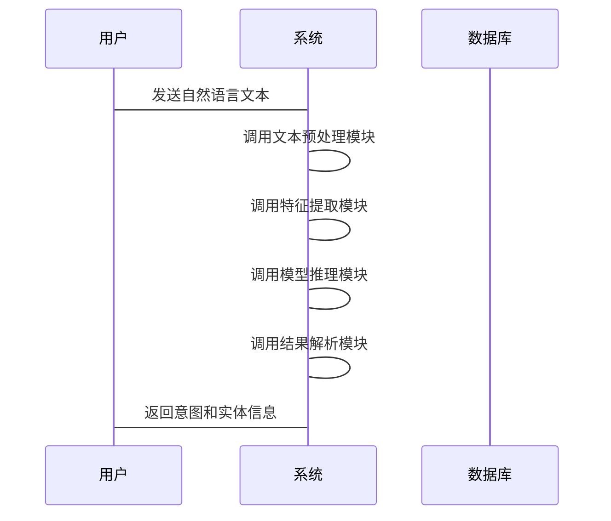

                 


# 构建企业级自然语言理解系统：深度语义分析与意图识别

---

## 关键词  
企业级自然语言理解系统, 深度语义分析, 意图识别, NLP, 机器学习, 深度学习, 人工智能

---

## 摘要  
自然语言理解（NLU）是人工智能领域的核心任务之一，旨在让计算机能够理解人类的自然语言输入并提取其中的语义信息。企业级NLU系统需要具备高准确性、高可扩展性和高实时性，以满足企业复杂场景下的需求。本文将从深度语义分析和意图识别两个核心方向入手，详细阐述企业级NLU系统的构建过程，包括技术选型、算法原理、系统架构设计以及项目实战等内容，为读者提供一套完整的解决方案。

---

## 第一部分: 企业级自然语言理解系统背景与基础

### 第1章: 自然语言理解系统概述

#### 1.1 自然语言理解的核心概念  
- **问题背景与问题描述**  
  自然语言理解（NLU）是人工智能领域的重要研究方向，旨在让计算机能够理解和解析人类的自然语言输入。  
- **问题解决的思路与方法**  
  传统的NLU系统依赖于规则和统计方法，而现代系统则更多地采用深度学习技术。  
- **边界与外延**  
  NLU的边界包括文本预处理、特征提取和模型训练，外延则涉及意图识别、实体识别和语义解析。  
- **核心要素与组成结构**  
  核心要素包括语言模型、特征提取器和分类器，组成结构包括预处理模块、特征提取模块和决策模块。

#### 1.2 企业级自然语言理解系统的定义与特点  
- **系统定义**  
  企业级NLU系统是指能够处理企业级复杂场景下的自然语言输入，并提供准确的语义理解和意图识别能力的系统。  
- **系统的核心特点**  
  - 高准确性：能够准确识别用户的意图和实体。  
  - 高可扩展性：支持多种语言和复杂场景。  
  - 高实时性：能够在较短时间内完成语义理解和意图识别。  
- **与传统NLP系统的区别**  
  传统NLP系统更多关注文本处理和信息抽取，而企业级NLU系统更注重语义理解和意图识别的准确性与实时性。

#### 1.3 企业级NLU系统的应用前景  
- **潜在应用领域**  
  包括智能客服、智能助手、智能搜索和智能推荐等。  
- **企业采用的优势**  
  提高用户体验、降低人工成本、提升业务效率。  
- **应用的挑战与机遇**  
  挑战包括数据稀疏性、模型泛化能力不足和多语言支持等问题；机遇则在于深度学习技术的快速发展和企业智能化转型的需求。

### 第2章: 深度语义分析与意图识别技术基础  

#### 2.1 深度语义分析的原理  
- **语义分析的基本概念**  
  语义分析是指从文本中提取语义信息的过程，包括词语关系、句子结构和语境理解。  
- **深度学习在语义分析中的作用**  
  深度学习模型（如BERT、GPT）能够更好地捕捉上下文信息，提高语义分析的准确性。  
- **深度语义分析与传统语义分析的对比**  
  传统方法依赖规则和统计，而深度方法依赖于神经网络和大数据训练。

#### 2.2 意图识别的核心技术  
- **意图识别的定义**  
  意图识别是指从用户输入中识别出用户的意图或目标。  
- **意图识别的主要技术**  
  包括基于规则的方法、统计方法和深度学习方法。  
- **意图识别的流程与步骤**  
  包括文本预处理、特征提取、模型训练和结果解析。

#### 2.3 语义理解与意图识别的联系与区别  
- **联系分析**  
  语义理解为意图识别提供语义信息，意图识别则是语义理解的一种应用。  
- **区别分析**  
  语义理解关注的是文本的语义信息，而意图识别关注的是用户的意图或目标。  
- **两者结合的应用场景**  
  在智能客服、智能助手和智能推荐等领域，两者结合能够提供更精准的服务。

### 第3章: 企业级NLU系统的技术特点与优势  

#### 3.1 技术特点  
- **高准确性**  
  企业级NLU系统通过深度学习模型和大规模数据训练，能够实现高准确性的意图识别和语义理解。  
- **高可扩展性**  
  系统支持多种语言和复杂场景，能够快速扩展以满足企业需求。  
- **高实时性**  
  系统能够在较短时间内完成语义理解和意图识别，满足实时应用场景的需求。

#### 3.2 企业级系统的优势  
- **适应企业复杂需求**  
  企业级NLU系统能够处理复杂的业务逻辑和多样化的用户需求。  
- **支持大规模数据处理**  
  系统能够处理海量数据，满足企业级数据处理的需求。  
- **高度定制化能力**  
  系统可以根据企业需求进行高度定制，提供个性化的服务。

#### 3.3 技术选型与架构设计  
- **技术选型的原则**  
  - 选择适合企业需求的技术方案，包括开源框架和商业解决方案。  
  - 确保技术方案的可扩展性和可维护性。  
- **架构设计的核心要素**  
  包括模块化设计、高可用性和高性能。  
- **企业级系统的性能优化**  
  通过优化算法、硬件和数据处理流程，提升系统性能。

---

## 第二部分: 核心概念与技术原理  

### 第4章: 意图识别技术原理  

#### 4.1 意图识别的基本原理  
- **基于规则的方法**  
  通过预定义规则进行意图识别，适用于简单场景。  
- **基于统计的方法**  
  通过统计特征和分类器进行意图识别，适用于中等复杂度场景。  
- **基于深度学习的方法**  
  通过神经网络模型（如RNN、CNN、Transformer）进行意图识别，适用于复杂场景。  

#### 4.2 深度学习模型在意图识别中的应用  
- **RNN模型**  
  适用于序列数据的处理，能够捕捉时序信息。  
- **CNN模型**  
  适用于局部特征的提取，常用于文本分类任务。  
- **Transformer模型**  
  适用于全局特征的捕捉，能够处理长序列数据。

#### 4.3 意图识别的特征提取  
- **词袋模型**  
  将文本表示为词袋，忽略词语顺序。  
- **词嵌入模型**  
  通过嵌入层将词语映射为低维向量（如Word2Vec、GloVe、BERT）。  
- **上下文特征**  
  包括词性、句法结构和语境信息等。

### 第5章: 深度语义分析的原理  

#### 5.1 语义分析  
- **基于规则的语义分析**  
  通过预定义规则进行语义分析，适用于简单场景。  
- **基于统计的语义分析**  
  通过统计特征和分类器进行语义分析，适用于中等复杂度场景。  
- **基于深度学习的语义分析**  
  通过神经网络模型（如BERT）进行语义分析，适用于复杂场景。  

#### 5.2 深度语义分析的关键技术  
- **上下文无关语法（CFG）**  
  用于描述语言的语法结构。  
- **上下文无关文法（CFG）的扩展**  
  通过扩展CFG来捕捉语义信息。  
- **基于统计的语义分析**  
  通过概率模型进行语义分析，适用于大数据场景。

---

## 第三部分: 算法原理  

### 第6章: 意图识别算法  

#### 6.1 基于深度学习的意图识别算法  
- **模型结构**  
  - 输入层：接收文本输入。  
  - 嵌入层：将文本转换为向量表示。  
  - RNN层：捕捉时序信息。  
  - 全连接层：输出意图类别。  
- **训练过程**  
  - 数据预处理：分词、去停用词、标注。  
  - 模型训练：使用交叉熵损失函数，优化目标函数。  
  - 模型评估：准确率、召回率、F1值。  

#### 6.2 基于深度学习的意图识别算法代码实现  
```python
import tensorflow as tf
from tensorflow.keras import layers

model = tf.keras.Sequential()
model.add(layers.Embedding(input_dim= vocabulary_size, output_dim= embedding_dim))
model.add(layers.LSTM(units= lstm_units, return_sequences=False))
model.add(layers.Dense(units= num_classes, activation='softmax'))

model.compile(optimizer='adam', loss='sparse_categorical_crossentropy', metrics=['accuracy'])
model.fit(train_data, train_labels, epochs= num_epochs, batch_size= batch_size)
```

---

## 第四部分: 系统分析与架构设计  

### 第7章: 企业级自然语言理解系统架构设计  

#### 7.1 系统功能设计  
- **领域模型（Mermaid 类图）**  
  ```mermaid
  classDiagram
    class User {
      + username: string
      + user_id: integer
    }
    class Intent {
      + intent_id: integer
      + intent_name: string
    }
    class Entity {
      + entity_id: integer
      + entity_name: string
    }
    class NLUModel {
      + model_version: string
      + model_weights: array
    }
    User --> Intent: 提出意图
    User --> Entity: 提出实体
    Intent --> NLUModel: 调用模型
    Entity --> NLUModel: 调用模型
  ```

- **系统架构设计（Mermaid 架构图）**  
  ```mermaid
  rectangle 系统边界 {
    用户输入 --> 文本预处理 --> 特征提取 --> 模型推理 --> 结果解析 --> 用户输出
    系统配置 --> 模型加载 --> 模型推理
  }
  ```

#### 7.2 系统接口设计  
- **输入接口**  
  - RESTful API：支持HTTP请求，提供POST接口。  
  - gRPC：支持Protobuf格式，适用于高并发场景。  
- **输出接口**  
  - JSON格式：返回意图和实体信息。  
  - ProtoBuf格式：适用于高性能场景。  

#### 7.3 系统交互设计（Mermaid 序列图）  


---

## 第五部分: 项目实战  

### 第8章: 企业级自然语言理解系统实战  

#### 8.1 环境安装与配置  
- **Python 版本**：3.8+  
- **深度学习框架**：TensorFlow/PyTorch  
- **自然语言处理库**：spaCy/Transformers  
- **开发工具**：Jupyter Notebook/VS Code  

#### 8.2 系统核心实现（Python 代码）  
```python
from transformers import pipeline

# 初始化意图识别模型
intent_classifier = pipeline("text-classification", model="snunlp/korean-bert-intent-classification")

# 初始化实体识别模型
ner_model = pipeline("ner", model="snunlp/korean-ner")

# 文本预处理
def preprocess(text):
    return text.strip().lower()

# 模型推理
def predict_intent(text):
    return intent_classifier(preprocess(text))[0]['label']

def predict_entities(text):
    entities = ner_model(preprocess(text))
    return {entity['entity']: entity['value'] for entity in entities}
```

#### 8.3 代码解读与分析  
- **文本预处理**  
  - 去除前后空格，转为小写。  
- **意图识别**  
  - 使用预训练的意图分类模型，返回意图标签。  
- **实体识别**  
  - 使用预训练的命名实体识别模型，返回实体信息。  

#### 8.4 案例分析与详细讲解  
- **案例场景**  
  用户输入：“我需要预订明天从北京到上海的机票。”  
- **预处理结果**  
  “i need to book a flight from beijing to shanghai tomorrow.”  
- **意图识别**  
  意图：`book_flight`  
- **实体识别**  
  实体：`北京`（地点）、`上海`（地点）、`明天`（时间）  

---

## 第六部分: 最佳实践与总结  

### 第9章: 最佳实践与注意事项  

#### 9.1 最佳实践  
- **数据预处理**  
  - 去除停用词、分词处理、实体标注。  
- **模型选择**  
  - 根据任务需求选择合适的模型（如BERT、GPT）。  
- **模型调优**  
  - 使用交叉验证、超参数优化、早停法。  
- **系统优化**  
  - 优化算法、硬件配置、数据处理流程。  

#### 9.2 小结  
企业级自然语言理解系统需要结合深度学习技术和系统架构设计，才能在复杂场景下提供高准确性和高实时性的服务。通过合理的技术选型和系统优化，能够构建出高性能的企业级NLU系统。

#### 9.3 注意事项  
- **数据隐私**  
  确保用户数据的安全性和隐私性。  
- **模型泛化能力**  
  提高模型的泛化能力，避免过拟合和欠拟合。  
- **多语言支持**  
  支持多种语言，满足全球化需求。  

---

## 第10章: 拓展阅读与未来趋势  

#### 10.1 拓展阅读  
- **《Deep Learning for NLP》**：深入理解深度学习在NLP中的应用。  
- **《Transformers: State-of-the-art NLP**：学习Transformer模型在NLP中的最新进展。  
- **《企业级AI系统构建》**：了解企业级AI系统的构建方法和最佳实践。  

#### 10.2 未来趋势  
- **多模态NLU**  
  结合视觉、听觉等多模态信息，提升语义理解能力。  
- **自适应模型**  
  模型能够自适应地调整参数，适应不同的场景和数据分布。  
- **实时推理优化**  
  优化模型推理速度，降低延迟，提升用户体验。  

---

## 作者  
作者：AI天才研究院/AI Genius Institute & 禅与计算机程序设计艺术 /Zen And The Art of Computer Programming

