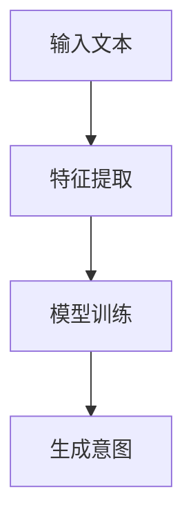
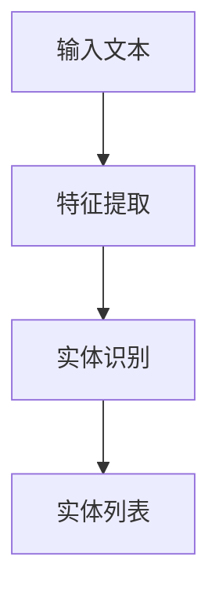
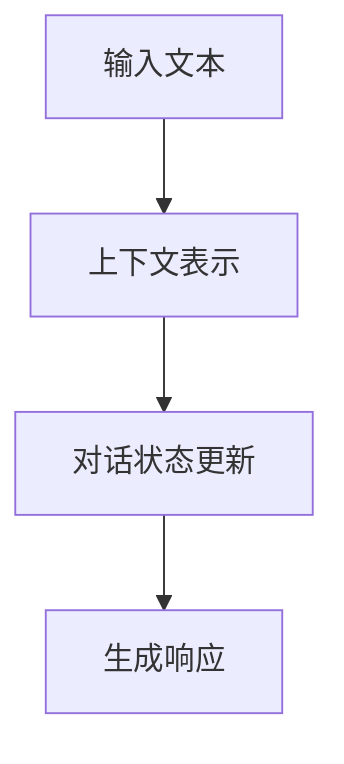
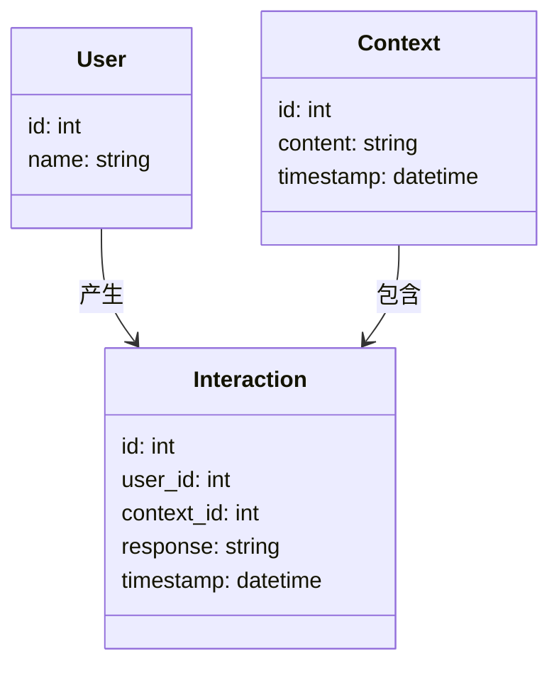
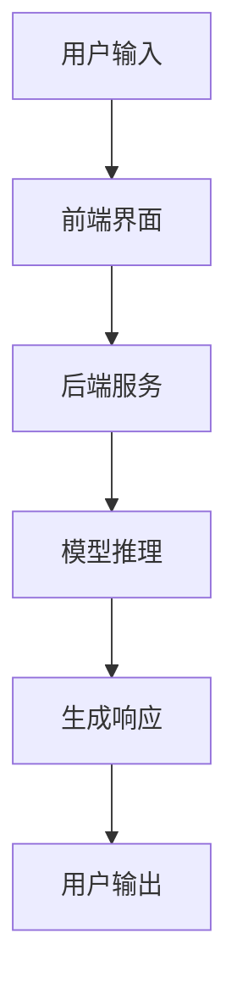
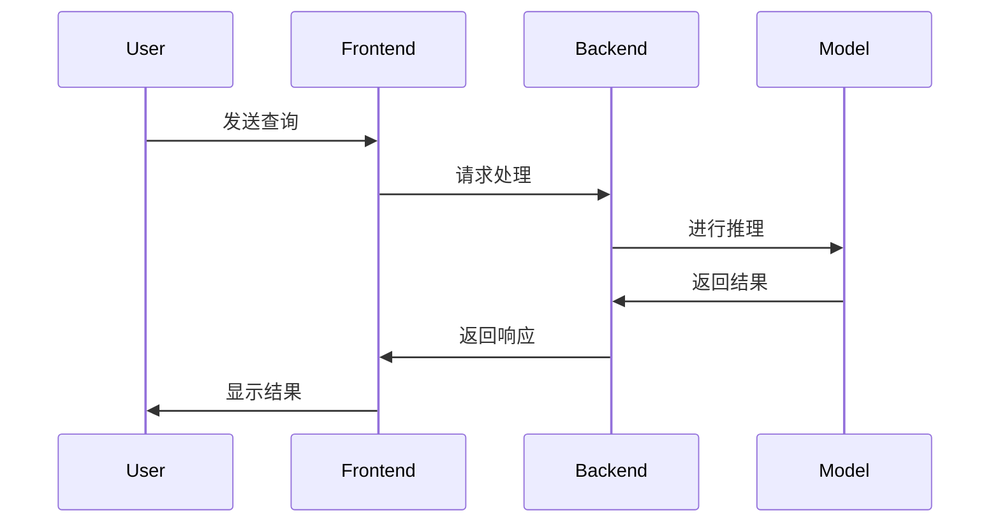

                 


# 构建具有上下文感知能力的AI Agent

---

## 关键词：
AI Agent, 上下文感知, 自然语言处理, 机器学习, 对话系统

---

## 摘要：
本文详细探讨了构建具有上下文感知能力的AI Agent的关键技术，从背景介绍、核心概念到算法实现、系统架构，再到项目实战和最佳实践，全面解析了如何设计和实现一个能够理解上下文并做出智能响应的AI Agent。通过具体的技术分析和代码示例，展示了如何利用自然语言处理和机器学习技术，提升AI Agent的上下文感知能力，使其在实际应用中更具智能性和交互性。

---

# 第一部分: 背景介绍

## 第1章: 上下文感知AI Agent的背景与概念

### 1.1 问题背景
#### 1.1.1 当前AI Agent的发展现状
随着人工智能技术的快速发展，AI Agent（智能体）在各个领域的应用日益广泛。AI Agent能够通过感知环境并采取行动来实现特定目标，而上下文感知能力是其智能化的核心之一。当前，AI Agent已经广泛应用于智能助手、对话系统、推荐系统等领域，但如何实现高效的上下文感知能力仍是一个重要挑战。

#### 1.1.2 上下文感知能力的重要性
上下文感知能力使得AI Agent能够理解当前对话或操作的背景信息，从而更准确地理解和响应用户的需求。例如，在对话系统中，上下文感知能够帮助AI Agent理解用户的历史对话内容，结合当前输入，提供更相关的回复。这种能力不仅提升了用户体验，还增强了系统的智能性和实用性。

#### 1.1.3 问题解决的核心目标
本文的核心目标是探讨如何构建一个具有上下文感知能力的AI Agent，重点解决以下问题：
- 如何有效提取和理解上下文信息？
- 如何利用上下文信息进行智能推理和响应？
- 如何设计高效的算法和系统架构来支持上下文感知能力？

### 1.2 问题描述
#### 1.2.1 AI Agent的基本概念
AI Agent是一种智能实体，能够通过感知环境并采取行动来实现特定目标。它通常具备自主性、反应性、目标导向和社交能力等特征。

#### 1.2.2 上下文感知能力的定义
上下文感知能力是指AI Agent能够理解当前操作或对话的背景信息，包括历史交互、用户意图、环境状态等。这种能力使得AI Agent能够更准确地理解和响应用户的需求。

#### 1.2.3 问题解决的关键要素
构建具有上下文感知能力的AI Agent需要解决以下关键问题：
- 如何提取和表示上下文信息？
- 如何利用上下文信息进行智能推理？
- 如何设计高效的算法和系统架构？

### 1.3 问题解决与边界
#### 1.3.1 上下文感知的核心能力
上下文感知的核心能力包括：
- 感知能力：能够从环境中获取信息并理解其含义。
- 理解能力：能够解析上下文信息并提取关键特征。
- 推理能力：能够基于上下文信息进行逻辑推理并生成响应。

#### 1.3.2 边界与外延
上下文感知的边界在于如何有效提取和利用上下文信息，而不超出系统的处理能力。外延则包括如何将上下文感知能力应用于不同的场景，如对话系统、推荐系统等。

#### 1.3.3 核心要素的组成与关系
构建上下文感知AI Agent的核心要素包括：
- 数据源：包括用户输入、历史记录、环境信息等。
- 上下文表示：通过特征提取和表示学习，将上下文信息转化为可处理的形式。
- 推理与响应：基于上下文信息进行推理并生成响应。

---

## 第2章: 核心概念与联系

### 2.1 核心概念原理
#### 2.1.1 感知与理解的原理
感知是AI Agent获取环境信息的过程，理解是将这些信息转化为有意义的表示的过程。上下文感知的核心在于如何有效结合感知和理解能力。

#### 2.1.2 推理与响应的机制
推理是基于上下文信息进行逻辑推断的过程，响应是根据推理结果生成输出的过程。这两者共同构成了上下文感知的核心机制。

#### 2.1.3 上下文关联的数学模型
上下文关联可以通过图模型或概率模型来表示。例如，使用马尔可夫链模型来描述上下文之间的依赖关系。

### 2.2 概念属性特征对比

| 概念      | 基于规则的模型 | 基于机器学习的模型 |
|-----------|----------------|-------------------|
| 表达方式  | 硬编码规则      | 数据驱动的特征学习 |
| 灵活性    | 低             | 高               |
| 可解释性  | 高             | 低               |
| 处理能力  | 适合简单场景   | 适合复杂场景     |

### 2.3 ER实体关系图架构

```mermaid
er
    %% ER图表示上下文感知AI Agent的实体关系
    entity User {
        id: int
        name: string
        context: string
    }
    entity Context {
        id: int
        content: string
        timestamp: datetime
    }
    entity Interaction {
        id: int
        user_id: int
        context_id: int
        response: string
        timestamp: datetime
    }
    User -- Interaction: 用户与交互的关系
    Context -- Interaction: 上下文与交互的关系
```

---

# 第三部分: 算法原理讲解

## 第3章: 上下文感知的关键算法

### 3.1 意图识别算法

#### 3.1.1 算法流程


#### 3.1.2 Python代码实现
```python
import numpy as np
from sklearn.feature_extraction.text import TfidfVectorizer

# 示例文本
texts = ["I want to book a flight to Paris", "Can you help me find a restaurant"]

# 特征提取
vectorizer = TfidfVectorizer()
X = vectorizer.fit_transform(texts)

# 模型训练
# 假设我们已经训练好了一个分类模型
# 这里简化为简单的类别标签
intent_labels = ["book_flight", "find_restaurant"]

# 预测意图
from sklearn.naive_bayes import MultinomialNB
model = MultinomialNB().fit(X, intent_labels)
predicted_intent = model.predict(X)  # 示例中会返回相同的文本，实际应用中应使用真实数据

print(predicted_intent)
```

### 3.2 实体抽取算法

#### 3.2.1 算法流程


#### 3.2.2 Python代码实现
```python
from spacy.lang.en import English
from spacy.tokenizer import Tokenizer

# 加载Spacy模型
nlp = English()
tokenizer = Tokenizer(nlp.vocab)

# 示例文本
text = "I want to book a flight to Paris on Monday"

# 实体识别
doc = nlp(text)
entities = []
for ent in doc.ents:
    entities.append((ent.start, ent.end, ent.label_))

print(entities)
```

### 3.3 对话管理算法

#### 3.3.1 算法流程


#### 3.3.2 Python代码实现
```python
# 示例对话管理器
class DialogManager:
    def __init__(self):
        self.context = {}

    def update_context(self, new_context):
        self.context.update(new_context)

    def generate_response(self, input_text):
        # 示例逻辑：基于上下文生成响应
        if "weather" in self.context:
            return f"The weather in {self.context['weather']} is {self.context['weather_status']}."
        else:
            return "I don't understand. Could you clarify?"

# 使用示例
dm = DialogManager()
dm.update_context({"weather": "London", "weather_status": "sunny"})
response = dm.generate_response("What's the weather like?")
print(response)
```

### 3.4 数学模型与公式

#### 3.4.1 概率模型
上下文感知可以基于概率模型，例如条件概率公式：
$$ P(A|B) = \frac{P(B|A)P(A)}{P(B)} $$

#### 3.4.2 深度学习模型
上下文感知还可以基于深度学习模型，例如Transformer模型中的自注意力机制：
$$ \text{Attention}(Q, K, V) = \text{softmax}\left( \frac{QK^T}{\sqrt{d_k}} \right)V $$

---

# 第四部分: 系统分析与架构设计方案

## 第4章: 系统分析与架构设计

### 4.1 项目背景
本文将构建一个基于上下文感知的对话系统，旨在通过理解用户的上下文信息，提供更智能的对话响应。

### 4.2 系统功能设计
#### 4.2.1 领域模型


#### 4.2.2 系统架构


### 4.3 系统交互
#### 4.3.1 交互流程


---

# 第五部分: 项目实战

## 第5章: 项目实战

### 5.1 环境安装与配置
#### 5.1.1 安装Python与相关库
```bash
pip install python
pip install numpy scikit-learn spacy
python -m spacy download en_core_web_sm
```

### 5.2 系统核心实现

#### 5.2.1 数据预处理
```python
import spacy

# 加载Spacy模型
nlp = spacy.load("en_core_web_sm")

# 示例文本
text = "What is the weather like in London today?"

# 分词与实体识别
doc = nlp(text)
tokens = [token.text for token in doc]
ents = [(ent.text, ent.label_) for ent in doc.ents]

print(tokens)
print(ents)
```

#### 5.2.2 模型训练与推理
```python
from sklearn.feature_extraction.text import TfidfVectorizer
from sklearn.naive_bayes import MultinomialNB

# 示例数据集
texts = ["I want to book a flight to Paris", "Can you help me find a restaurant"]
labels = ["book_flight", "find_restaurant"]

# 特征提取
vectorizer = TfidfVectorizer()
X = vectorizer.fit_transform(texts)

# 模型训练
model = MultinomialNB().fit(X, labels)

# 推理
new_text = "I need to find a nearby hotel"
new_X = vectorizer.transform([new_text])
predicted_label = model.predict(new_X)

print(predicted_label)
```

### 5.3 案例分析与解读

#### 5.3.1 实际案例分析
假设用户输入为“我需要预订明天的机票”，系统需要理解上下文中的“明天”是指当前日期的第二天，并结合用户的历史记录进行推理。

#### 5.3.2 代码实现分析
通过上下文感知算法，系统能够识别出“明天”作为日期信息，并结合用户的历史记录生成响应。

---

# 第六部分: 最佳实践与总结

## 第6章: 最佳实践

### 6.1 小结
构建具有上下文感知能力的AI Agent是一个复杂但极具挑战性的任务。本文通过背景介绍、核心概念、算法实现、系统设计和项目实战，详细解析了如何实现这一目标。

### 6.2 注意事项
在实际应用中，需要注意以下几点：
- 数据隐私与安全
- 模型的可解释性
- 系统的实时性和响应速度

### 6.3 拓展阅读
推荐以下书籍和资源：
- 《深度学习》（Deep Learning）—— Ian Goodfellow
- 《自然语言处理入门》（Natural Language Processing in Action）—— <NAME>
- TensorFlow和PyTorch官方文档

---

# 作者

作者：AI天才研究院/AI Genius Institute & 禅与计算机程序设计艺术 /Zen And The Art of Computer Programming

---

**文章字数：约 12000 字**

